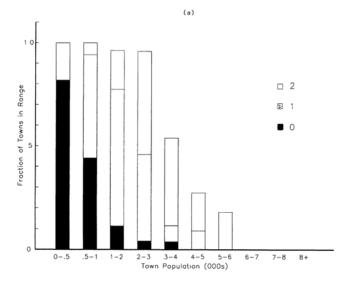
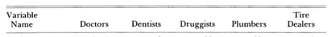
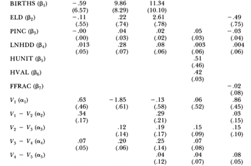
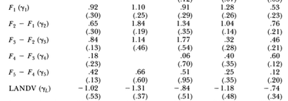
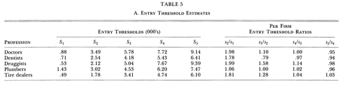
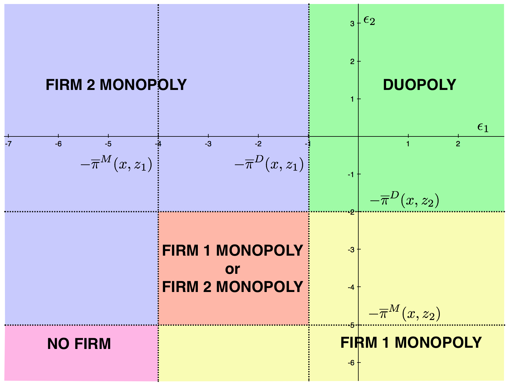
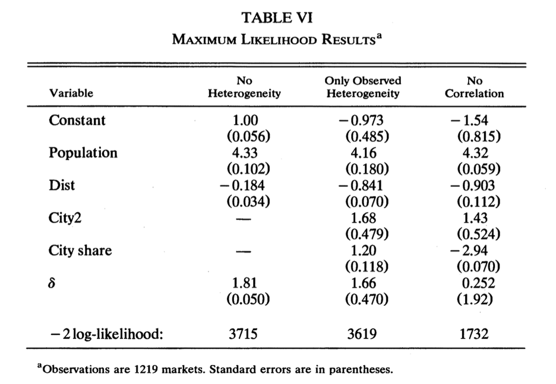
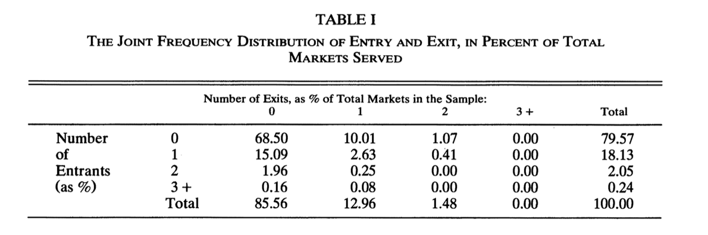
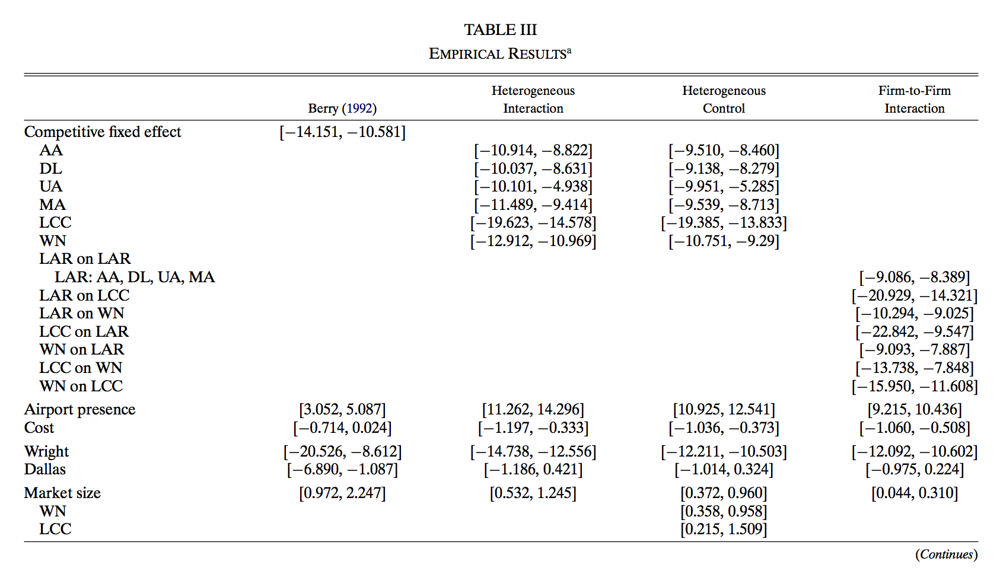
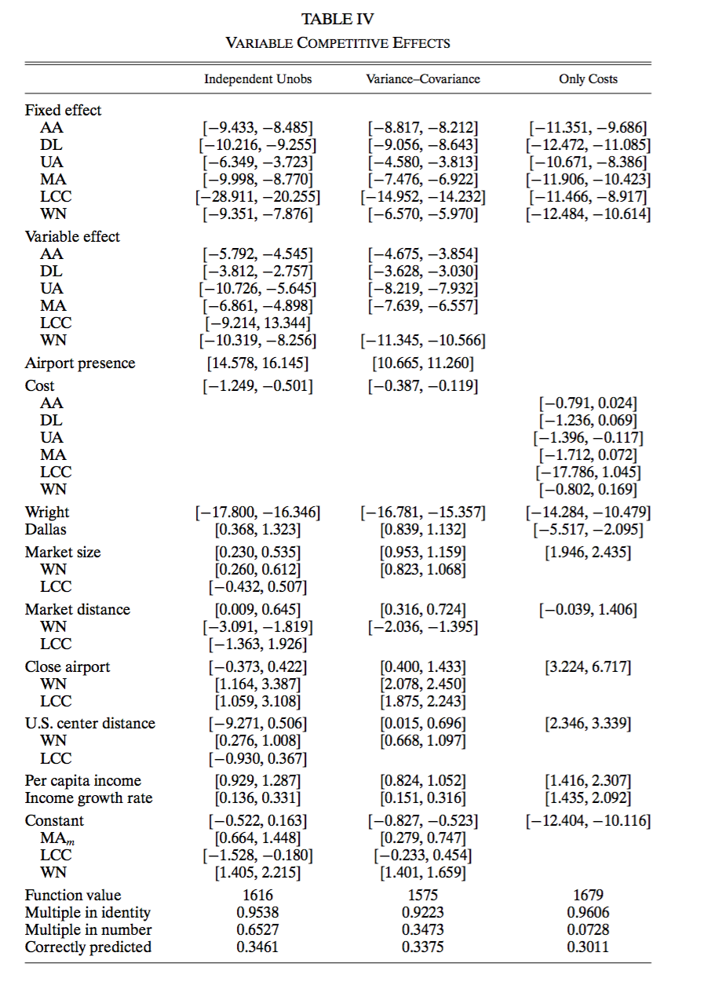

# Entry and Exit {#entryexit}


## Entry and Exit

### Entry Cost, Mode of Competition, and Market Structure

- Fixed and sunk entry costs and mode of competition are key determinants for market structure. 
```{r, echo = FALSE, fig.cap = '', out.width='80%', fig.asp = .75, fig.align = 'center'}
knitr::include_graphics("figuretable/entrycost.png")
```
- The tougher the competition, the less firms can earn enough profit to compensate the entry cost.
- Therefore, the tougher the competition, the number of firms in the market in the equilibrium \textbf{does not} grow when the market size increases.


### Exogenous and Endogenous Entry Cost

- \textbf{Exogenous fixed and sunk entry cost}: 

- It determines the cutoff profit and so the equilibrium number of firms in the market.
- The cost is the same across modes of entry.

- \textbf{Endogenous fixed and sunk entry cost}: 

- The cost differ across modes of entry.
- For example, firms decide the quality of the product upon entering the market.
- The endogenous fixed and sunk entry cost will be increasing in the quality choice.

- If endogenous fixed and sunk entry cost is relevant, the entry cost to have a positive profit in the market increases as the the number of firms in the market increase.
- Therefore, the equilibrium firm size tend to be large when endogenous fixed and sunk entry cost is relevant.


### Studying Entry Decisions

- By studying the entry decisions of firms, we can identify the profit function including the entry cost of firms.
- A profit function is the reduced-form of the underlying demand function, cost function, and conduct parameters.
- The profit function can be identified without assuming a particular conduct.
- It is enough to answer questions regarding the market structure and producer surplus.
- Last week, we studied the relationship between the equilibrium price and price elasticity to infer the conduct in the product market.
- In the entry/exit analysis, we study the relationship between the market size and the equilibrium number of firms to infer the conduct in the product market.


### Homogeneous and Heterogeneous Entrants


- Entrants may differ in observed and/or unobserved manner.
- In a heterogeneous case, there may be multiple equilibria or there may be no pure-strategy equilibrium.
- This causes severe identification problems.
- We start from a simple homogeneous firm model.


### A Simple Homogeneous Firm Model

- There are $t = 1, \cdots, T$ markets.
- Let $x_t$ be the state variables of market $t$ such as population and income level.
- Let $F_t$ be the exogenous fixed and sunk entry cost in market $t$.
- When there are $N_t$ firms in the market, from product market competition, a firm earns a variable profit:
\begin{equation}
V(N_t, x_t, \theta),
\end{equation}
where $V$ is known up to the unknown profit parameters $\theta$.
- The net profit in market $t$ is:
\begin{equation}
\pi(N_t, \theta, F_t) \equiv V(N_t, x_t, \theta) - F_t. 
\end{equation} 
- The homogeneity assumption means that $V$ and $F_t$ are the same across firms for market $t$.


### Equilibrium Condition

- The equilibrium number of firms $N_t^*$ in market $t$ is characterized by:
\begin{equation}
\begin{split}
&V(N_t^*, x_t, \theta) - F_t \ge 0, \\
&V(N_t^* + 1, x_t, \theta) - F_t < 0.
\end{split}
\end{equation}
that is,
\begin{equation}
V(N_t^*, x_t, \theta) \ge F_t > V(N_t^* + 1, x_t, \theta).
\end{equation}
- The $N_t^*$th firm can enjoy positive net profit.
- The entry of additional firm makes the net profit negative.


### Distributional Assumption on Entry Cost

- Assume that entry cost $F_t$ is drawn from a distribution $\Phi(\cdot|x_t, \omega)$ that is i.i.d. conditional on the state variable $x_t$ that is known up to entry cost parameters $\omega$.
- Then the likelihood of observing $N_t$ in market $t$ with state variable $x_t$ is:
\begin{equation}
\begin{split}
&\mathbb{P}\{V(N_t, x_t, \theta) \ge F_t > V(N_t + 1, x_t, \theta)| x_t, \omega\}\\
&=\mathbb{P}\{V(N_t, x_t, \theta) \ge F_t| x_t, \omega\} - \mathbb{P}\{V(N_t + 1, x_t, \theta) \ge F_t| x_t, \omega\}\\
&=\Phi(V(N_t, x_t, \theta)|x_t, \omega) - \Phi(V(N_t + 1, x_t, \theta)|x_t, \omega).
\end{split}
\end{equation}
 


### Log Likelihood Function

- Therefore, the log likelihood of observing $\{N_t\}_{t = 1}^T$ given $\{x_t\}_{t = 1}^T$ is:
\begin{equation}
\begin{split}
&L(\theta, \omega|\{N_t\}_{t = 1}^T,  \{x_t\}_{t = 1}^T) \\
&= \sum_{t = 1}^T \log\{\Phi(V(N_t, x_t, \theta)|x_t, \omega) - \Phi(V(N_t + 1, x_t, \theta)|x_t, \omega)\}.
\end{split}
\end{equation}
- This is a \textbf{ordered} model in $N_t$.
- If $\Phi$ is a normal distribution, it is an \textbf{ordered probit model}.


### Identification of the Variable Profit

- Suppose that there are many markets whose state variables are roughly $x$.
- Then, we can identify the distribution of number of firms across market conditional on that the state variables are roughly $x$.
- The share of such market where the number of firms is $N$, $s(N, x)$ has to be:
\begin{equation}
\Phi(V(N, x, \theta)|x, \omega) - \Phi(V(N + 1, x, \theta)|x, \omega), N = 0, 1, 2, \cdots.
\end{equation}
- Then,
\begin{equation}
\begin{split}
&V(0, x, \theta) = 0,\\
&\Phi(V(N + 1, x, \theta)|x, \omega) = \Phi(V(N, x, \theta)|x, \omega) - s(N, x), N = 1, 2, \cdots.
\end{split}
\end{equation}
- You can repeat the argument by changing $x$.


### $V$ Allow Various Product Market Models

- In theory, we can identify $V$ nonparametrically.
- It nests various product market models.


### An Example of $V$

- The variable cost function is $C(q) = cq - dq^2/2$.
- The demand in market $t$ is $Q_t = S_t (\alpha - \beta P_t)$ where $S_t$ is the market size.
- Firm compete in quantity:
\begin{equation}
\max_{q_j} \frac{1}{\beta}\Bigg(\alpha - \frac{Q_t}{S_t}\Bigg) q_j - cq_j + \frac{d}{2}q_j^2.
\end{equation}
- The first-order condition for firm $j$ is:
\begin{equation}
\frac{1}{\beta}\Bigg(\alpha - \frac{Q_t}{S_t}\Bigg) - \frac{q_j}{\beta S_t} - c + dq_j = 0.
\end{equation}
- Because of symmetry, the FOC is the same across firms.


### An Example of $V$

- Sum up the FOC across $N_t$ firms, we get:
\begin{equation}
\begin{split}
&\frac{N_t}{\beta}\Bigg(\alpha - \frac{Q_t}{S_t} \Bigg) + \Bigg(-\frac{1}{\beta S_t} + d \Bigg) Q_t - cN_t = 0\\
&\Leftrightarrow Q_t = \frac{N_t S_t \alpha - c N_t \beta S_t}{N_t + 1 - d\beta S_t}.
\end{split}
\end{equation}
- The equilibrium price is:
\begin{equation}
P_t = \frac{\alpha}{\beta} - N_t \frac{\alpha/\beta - c}{N_t + 1 - d \beta S_t}.
\end{equation}


### An Example of $V$

- In summary, the variable profit is:
\begin{equation}
\begin{split}
V(N_t, S_t, \theta) = \frac{S \theta_1^2 (2 - \theta_2 S_t)}{2(N_t + 1 - \theta_2 S_t)^2},
\end{split}
\end{equation}
where
\begin{equation}
\theta_1 = (\alpha/\beta - c)\sqrt{\beta}, \theta_2 = d\beta.
\end{equation}
- The variable profit in this case is i) decreasing in $N_t$ and ii) increasing in $S_t$.
- Therefore, $N_t$ is the equilibrium number of entrants if and only if:
\begin{equation}
\begin{split}
\frac{S \theta_1^2 (2 - \theta_2 S_t)}{2(N_t + 2 - \theta_2 S_t)^2} < F_t \le\frac{S \theta_1^2 (2 - \theta_2 S_t)}{2(N_t + 1 - \theta_2 S_t)^2}.
\end{split}
\end{equation}


### Identification of Demand and Cost Parameters

- In the previous example, the identification of $V$ is the identification of $\theta_1$ and $\theta_2$.
- $\theta_1$ and $\theta_2$ are the reduced-form parameters of demand parameters $\alpha, \beta$ and cost parameters $c, d$.
- It is clear that we cannot uniquely determine the value of four unknowns from two equations.
- Thus, demand and cost parameters are not necessarily identified even if the variable profit function is identified.


### Entry in Small Markets

- Bresnahan and Reiss (1990, 1991) study the entry of retail and professional service businesses into small isolated markets in the United States.

- How quickly the variable profit $V$ drops when the number of firms increases? (How severe is the competition?)
- How large the (exogenous) fixed and sunk entry costs of setting up a business are relative to variable profits?

### Profit Function Specification

- They considered the following variable profit function specification:
\begin{equation}
V(N_t, S_t, x_t, \theta) = S_t \Bigg(\theta_1 + \sum_{n = 2}^{\overline{N}} \theta_n D_n + x_t'\beta \Bigg),
\end{equation}
where $D_n$ takes 1 if at least $n$ firms have entered the market, and $x_t$ are exogenous state variables of the market.
- $\theta_1$ captures the monopoly variable profit, and $\theta_n$ captures how quickly the variable profit drops when additional firm enters the market.
- $x_t$ includes the per capita income, the log of heating degree days, housing units per population, value per acre of farmland and buildings, median value of owner-occupied houses. It also includes the number of births and the number of elderly residents in doctors' and dentists' cases.


### Fixed Cost Specification

- The author considers the following fixed costs:
\begin{equation}
F_t = \gamma_1 + \gamma_L W_L + \sum_{n = 2}^{\overline{N}} \gamma_n D_n + \epsilon_t, \epsilon \sim N(0, 1),
\end{equation}
where $W_L$ is the value per acre of farmland and buildings.
- It allows that the mean fixed cost varies across the number of firms.

### Entry Threshold

- To facilitate the interpretation of the estimation result, they computed the ``entry threshold'' $S_N$, the smallest market size that would accommodate $N$ firms.

### Town Population Ranges

- 202 isolated local markets in the US.
```{r, echo = FALSE, fig.cap = '', out.width='80%', fig.asp = .75, fig.align = 'center'}
knitr::include_graphics("figuretable/population.png")
```

### Number of Firms in a Market
```{r, echo = FALSE, fig.cap = '', out.width='80%', fig.asp = .75, fig.align = 'center'}
knitr::include_graphics("figuretable/number.png")
```


### Population and Number of Firms
```{r, echo = FALSE, fig.cap = '', out.width='80%', fig.asp = .75, fig.align = 'center'}

```
```{r, echo = FALSE, fig.cap = '', out.width='80%', fig.asp = .75, fig.align = 'center'}
knitr::include_graphics("figuretable/numpop2.png")
```

- As the size of population increase, the number of dentists increases.


### Variable Profit Estimation Result
```{r, echo = FALSE, fig.cap = '', out.width='80%', fig.asp = .75, fig.align = 'center'}

```
```{r, echo = FALSE, fig.cap = '', out.width='80%', fig.asp = .75, fig.align = 'center'}

```


### Fixed Cost Estimation Result
```{r, echo = FALSE, fig.cap = '', out.width='80%', fig.asp = .75, fig.align = 'center'}

```
```{r, echo = FALSE, fig.cap = '', out.width='80%', fig.asp = .75, fig.align = 'center'}

```


### Entry Threshold
```{r, echo = FALSE, fig.cap = '', out.width='80%', fig.asp = .75, fig.align = 'center'}

```


### Firm Heterogeneity

- So far we have assumed that entrants are ex-ante homogeneous.
- In reality, firms have different costs, sell different products, and occupy different locations.
- With firm heterogeneity, the model may have multiple equilibria or have no pure-strategy equilibrium.
- This causes a serious problem for the identification and estimation of the model.


### Two-player Entry Game

- Suppose that there are two potential entrants.
- They simultaneously decide whether to enter the market.
- The payoff matrix for the action pairs are:
\begin{center}
\begin{table}
\begin{tabular}{l l c c} \toprule
& & \multicolumn{2}{c}{Firm 2}\\ \cline{3-4}
& & Enter & Stay \\ \hline
Firm 1 & Enter & $(\pi_1^D, \pi_2^D)$ & $(\pi_1^M, 0)$ \\
& Stay & $(0, \pi_2^M)$ & $(0, 0)$ \\ \bottomrule
\end{tabular}
\end{table}
\end{center}
where the superscript $M$ and $D$ represent the monopoly and duopoly profits, and the subscript $1$ and $2$ represent the firm identity.
- Let $D_j, j = 1, 2$ be the indicator variables that takes 1 if firm $j$ enters and 0 otherwise.


### Information Structure

- Suppose that there is a firm-specific profit shock that is \textbf{observable} to the firms but \textbf{unobservable} to econometrician.
- So this is a \textbf{complete information game}.
- The profit function is:
\begin{equation}
\pi_j =
\begin{cases}
0 &\text{   if   } D_j = 0\\
\overline{\pi}^M(x, z_j) + \epsilon_j &\text{   if   } D_j = 1, D_{-j} = 0\\
\overline{\pi}^D(x, z_j) + \epsilon_j &\text{   if   } D_j = 1, D_{-j} = 1.
\end{cases}
\end{equation}
- The terms $\overline{\pi}^M$ and $\overline{\pi}^D$ are the mean monopoly and duopoly profit functions.
- These are the parameters of interest.
- $x$ are the state variables and $z_j$ are firm $j$ specific state variables.


### Nash Equilibrium
\begin{table}
\begin{tabular}{l c c} \toprule
Market Outcome & $N$ & Conditions \\ \hline
No firms & 0 & $\overline{\pi}^M(x, z_1) + \epsilon_1 < 0$, $\overline{\pi}^M(x, z_2) + \epsilon_2 < 0$ \\
Firm 1 monopoly & 1 & $\overline{\pi}^M(x, z_1) + \epsilon_1 > 0$, $\overline{\pi}^D(x, z_2) + \epsilon_2 < 0$ \\
Firm 2 monopoly & 1 & $\overline{\pi}^D(x, z_1) + \epsilon_1 < 0$, $\overline{\pi}^M(x, z_2) + \epsilon_2 > 0$ \\
Duopoly & 2 & $\overline{\pi}^D(x, z_1) + \epsilon_1 > 0$, $\overline{\pi}^D(x, z_2) + \epsilon_2 > 0$ \\ \bottomrule
\end{tabular}
\end{table}
$\Leftrightarrow$
\begin{table}
\begin{tabular}{l c c} \toprule
Market Outcome & $N$ & Conditions \\ \hline
No firms & 0 & $\epsilon_1 < - \overline{\pi}^M(x, z_1)$, $\epsilon_2 < - \overline{\pi}^M(x, z_2)$ \\
Firm 1 monopoly & 1 & $\epsilon_1 > - \overline{\pi}^M(x, z_1)$, $\epsilon_2 < - \overline{\pi}^D(x, z_2)$ \\
Firm 2 monopoly & 1 & $\epsilon_1 < - \overline{\pi}^D(x, z_1)$, $\epsilon_2 > -\overline{\pi}^M(x, z_2)$ \\
Duopoly & 2 & $\epsilon_1 > - \overline{\pi}^D(x, z_1)$, $\epsilon_2 > -\overline{\pi}^D(x, z_2)$ \\ \bottomrule
\end{tabular}
- For some regions of $(\epsilon_1, \epsilon_2)$, there are multiple equilibria.
\end{table}


### Nash Equilibrium
```{r, echo = FALSE, fig.cap = '', out.width='80%', fig.asp = .75, fig.align = 'center'}

```

- Equilibia at different pairs of $(\epsilon_1, \epsilon_2)$.
- For example, in the green zone, duopoly is the unique equilibriums because $\epsilon_1 > - \overline{\pi}^D(x, z_1)$ and $\epsilon_2 > - \overline{\pi}^D(x, z_2)$


### Likelihood Function DOES NOT exist

- The likelihood function maps the parameter to the likelihood of the event.
- In the current model, no firm event happens with probability:
\begin{equation}
\begin{split}
&\mathbb{P}\{D_1 = 0, D_2 = 0|x, z_1, z_2\}\\
&= \mathbb{P}\{\epsilon_1 < - \overline{\pi}^M(x, z_1), \epsilon_2 < - \overline{\pi}^M(x, z_2)|x, z_1, z_2\},
\end{split}
\end{equation}
which is the mass of the pink area.
- Duopoly event happens with probability:
\begin{equation}
\begin{split}
&\mathbb{P}\{D_1 = 1, D_2 = 1|x, z_1, z_2\}\\
&= \mathbb{P}\{\epsilon_1 > - \overline{\pi}^D(x, z_1), \epsilon_2 > -\overline{\pi}^D(x, z_2) |x, z_1, z_2\},\end{split}
\end{equation}
which is the mass of the green area.


### Likelihood Function DOES NOT exist

- But what is the likelihood of firm 1 monopoly?

- It is at least as much as the mass of the blue zone.
- It is at most as much as the mass of the blue and orange zone.

- The likelihood of firm 1 monopoly is undetermined. It is a range.
- The likelihood of firm 2 monopoly is also undetermined.


### Multiple Equilibria Problem

- The source of this problem is that there are multiple equilibria when $(\epsilon_1, \epsilon_2)$ is in the orange area.
- We do not have a probability law of selecting a equilibrium from multiple equilibria.
- Therefore, we cannot determine the likelihood.


### Resolving Multiple Equilibria Problem

- Four types of solutions have been suggested for this multiple equilibria problem.


- Model the probabilities of aggregated outcomes that are robust to the equilibrium selection.
- Place additional conditions on the model that guarantee a unique equilibrium.
- Include in the estimation additional parameter that select among multiple equilibria.
- Accept that some models with multiple equilibria are not exactly identified and yet to note that they nevertheless do generate useful restrictions on economic quantities.


### Write Likelihood on the Aggregate Outcome

- Even if the equilibrium identity of firms in the market can be indeterminate, the equilibrium number of firms can be determinate.
- Intuitively, the equilibrium number of firms gives information about the average profitability of the market, but does not tell how profitable the market is for a particular firm.
- The equilibrium identity of firms gives information about the profitability of the market for the entered firms and the other firms.
- Therefore, we cannot identify the firm-level unobserved heterogeneity in the profitability across firms when we focus on the equilibrium number of firms.


### Entry in the Airline Industry: One-shot Game

- Based on Berry (1992).
- A market = a city pair market at a single point in time.
- Consider a one-shot entry game that yields a network structure.
- At the beginning of the period, each firm takes its overall network structure as given and decides whether to operate in a given city pair \textit{independently} across markets.

- $\leftrightarrow$ entry decisions can be dependent across markets if the demand/cost shocks are dependent across markets or an entry to a market affects the profit in the other market as well. 


### Entry in the Airline Industry: Profit Function

- Let $s$ be a strategy profile.

- $s = (s_1, \cdots, s_{K_i})'$, $s_k \in \{0, 1\}$.
- $K_i$ is the number of potential entrants in market $i$.

- The profit function for firm $k$ in market $i$:
\begin{equation}
\pi_{ik}(s) = v_i(N(s)) + \phi_{ik}
\end{equation}
- $v_i$ is strictly decreasing in $N$, for every $\phi_i$.
- $N_i^*$ is determined by:
\begin{equation}
N_i^* = \max_{0 \le n \le K_i} \{n: v_i(n) + \phi_{in} \ge 0\},
\end{equation}
where
\begin{equation}
\phi_{i1} > \phi_{i2} > \cdots > \phi_{i K_i},
\end{equation}
without loss of generality.


### Entry in the Airline Industry: Profit Function

- The common term:
\begin{equation}
v_i(N) = X_i \beta + h(\delta, N) + \rho u_{io}, 
\end{equation} 
where $X_i$ is the observed market characteristics, $h(\cdot)$ is a function that is decreasing in $N$, $u_{io}$ is the market characteristics that is observed by firms but not by econometrician.
- For example, $h(\delta, N) = - \delta ln(N)$.
- The firm-specific term:
\begin{equation}
\phi_{ik} = Z_{ik} \alpha + \sigma u_{ik},
\end{equation}
where $Z_{ik}$ is the observed firm characteristics.
- A scale normalization: $\sigma = \sqrt{1 - \rho^2}$ $\Rightarrow var(\rho u_{i0} + \sigma u_{ik}) = 1$.
 


### Entry in the Airline Industry: Likelihood Function

- The observed part:
\begin{equation}
r_{ik}(N) = X_i \beta - \delta \ln (N) + Z_{ik} \alpha. 
\end{equation} 
- The unobserved part:
\begin{equation}
\epsilon_{ik} = \sqrt{1 - \rho^2} u_{ik} + \rho u_{io}.
\end{equation}
- Then,
\begin{equation}
N_i^* \le N \Leftrightarrow \#\{k: \epsilon_{ik} \le - r_{ik}(N)\} \le N.
\end{equation}

\begin{equation}
\mathbb{P}\{N_i^* = N\} = \mathbb{P}\{N_i^* \le N\} - \mathbb{P}\{N_i^* \le (N - 1)\}. 
\end{equation}
 


### Is the Equilibrium Number of Firms Unique?

- Either of the following conditions are sufficient: 


- No firm-level unobserved heterogeneity: $\rho = 1$.
- No market-level unobserved heterogeneity: $\rho = 0$.
- The order of entry is predetermined:

- The most profitable firms enter first.
- The incumbent firms enter first.


### Entry in the Airline Industry: $\rho = 1$ or $\rho = 0$

- For each firm $i$, given $W_i = (X_i, Z_i)$ and parameter $\theta$, simulate $R$ equilibrium number of firms $N_i^{(r)}, r = 1, \cdots, R$ based on the previous condition by drawing $R$ errors $u_{i}^{(r)}, r = 1, \cdots, R$:
\begin{equation}
\begin{split}
&\pi_i(N, u_i^{(r)}) = X_i \beta + Z_{ik} \alpha - \delta \ln(N) + \rho u_{io}^{(r)} + \sqrt{1 - \rho^2} u_{ik}^{(r)},\\
&n(W_i, \theta, u_i^{(r)}) = \max_{0 \le n \le K_i} \{n: \#\{k: \pi_{ik}(N, u_i^{(r)}) \ge 0 \} \ge n\}.
\end{split}
\end{equation}
- Compute the simulated average:
\begin{equation}
N(W_i, \theta, u_i^{(1)}, \cdots, u_i^{(R)}) = \frac{1}{R} \sum_{r = 1}^R n(W_i, \theta, u_i^{(r)}).
\end{equation}
- Regress the observed number of the simulated average:
\begin{equation}
\hat{\theta} = \text{argmin}_{\theta} \frac{1}{T} \sum_{i = 1}^T [N_i - N(W_i, \theta, u_i^{(1)}, \cdots, u_i^{(R)})]^2.
\end{equation}


### Entry in the Airline Industry: $\rho = 1$ or $\rho = 0$
```{r, echo = FALSE, fig.cap = '', out.width='80%', fig.asp = .75, fig.align = 'center'}

```


### Entry in the Airline Industry The most profitable firms move first

- Given parameter $\theta$ and error $u_{i}^{(r)}$, firm $k$ enters market $i$ if:
\begin{equation}
n(W_i, \theta, u_i^{(r)}) \ge q_k(W_i, \theta, u_i^{(r)}),
\end{equation}
where $q_k(W_i, \theta, u_i^{(r)})$ the ranking of firm $k$ in market $i$ in terms of $\pi_{ik}(W_i, \theta, u_i^{(r)})$.
- Let $d_{ik}(W_i, \theta, u_i^{(r)})$ be the indicator variable that takes $1$ if firm $k$ enters market $i$ given $W_i, \theta$, and $u_i^{(r)}$.
- Compute the simulated probability of entry:
\begin{equation}
P_{ik}(W_i, \theta, u_i^{(1)}, \cdots, u_i^{(R)}) = \frac{1}{R} \sum_{r = 1}^R d_{ik}(W_i, \theta, u_i^{(r)}).
\end{equation}
- Estimate the parameter by:
\begin{equation}
\hat{\theta} = \text{argmin}_\theta \frac{1}{T} \sum_{i = 1}^T \frac{1}{K_i}\sum_{k = 1}^{K_i} [I_{ik} - P_{ik}(W_i, \theta, u_i^{(1)}, \cdots, u_i^{(R)})]^2,
\end{equation}
where $I_{ik}$ takes 1 if firm $k$ enters market $i$ in the data.
 


### Entry in the Airline Industry: Data 

- \textit{Origin and Destination Survey of Air Passenger Traffic} (O\&D survey).
- Focus on 1980Q1 and Q3.
```{r, echo = FALSE, fig.cap = '', out.width='80%', fig.asp = .75, fig.align = 'center'}

```


### Entry in the Airline Industry: Simulation Estimates
```{r, echo = FALSE, fig.cap = '', out.width='80%', fig.asp = .75, fig.align = 'center'}
knitr::include_graphics("figuretable/estimation.png")
```


### Set Identification

- A model may not predict a unique outcome.
- However, it still restricts the set of possible outcomes.
- We can use these restrictions to infer the parameter.
- Such restrictions may be too weak to point identify the parameter, but allows \textbf{set identification}.


### Set Identification

- Let $\Theta$ is the set of parameters and $\mathcal{P}: \Theta \to \Delta(Y, X)$ be the set of possible data distributions under parameter $\theta$.

- The mapping $\mathcal{P}$ is multi-valued if the model does not predict a unique outcome.

- Suppose we observe a data distribution on $(X, Y)$, say $\pi \in \Delta(Y, X)$.
- Given the model $\mathcal{P}$, the set of parameters that are consistent with the observation $\pi$ is:
\begin{equation}
\{\theta \in \Theta: \pi \in \mathcal{P}(\theta)\},
\end{equation}
which is called the \textbf{identified set}.
- If the identified set is a singleton, the parameter is point-identified.


### Identified Set in the Two Player Entry Game

- No firm event happens with probability:
\begin{equation}
\mathbb{P}\{D_1 = 0, D_2 = 0|x, z_1, z_2\} = \mathbb{P}\{\epsilon_1 < - \overline{\pi}^M(x, z_1), \epsilon_2 < - \overline{\pi}^M(x, z_2)|x, z_1, z_2\}.
\end{equation}
- Duopoly event happens with probability:
\begin{equation}
\scriptsize
\mathbb{P}\{D_1 = 1, D_2 = 1|x, z_1, z_2\}= \mathbb{P}\{\epsilon_1 > - \overline{\pi}^D(x, z_1), \epsilon_2 > -\overline{\pi}^D(x, z_2) |x, z_1, z_2\}.
\end{equation}
- The bounds for firm 1 monopoly probability is:
\begin{equation}
\begin{split}
&\mathbb{P}\{-\overline{\pi}^M(x, z_1) \le \epsilon_1, \epsilon_2 \le -\overline{\pi}^D(x, z_2) |x, z_1, z_2\} - \\
&\mathbb{P}\{-\overline{\pi}^M(x, z_1) \le \epsilon_1 \le -\overline{\pi}^D(x, z_1), -\overline{\pi}^M(x, z_2) \le \epsilon_2 \le -\overline{\pi}^D(x, z_2) |x, z_1, z_2\}\\
&\le \mathbb{P}\{D_1 = 1, D_2 = 0|x, z_1, z_2\}\\
&\le \mathbb{P}\{-\overline{\pi}^M(x, z_1) \le \epsilon_1, \epsilon_2 \le -\overline{\pi}^D(x, z_2) |x, z_1, z_2\}.
\end{split}
\end{equation}
- The bounds for firm 2 monopoly probability is obtained in the same way.


### Entry in the Airline Industry: Bounds Estimation

- Let the lower bound functions be:
\begin{equation}
\begin{split}
\underline{H}(0, 0|x, z_1, z_2) &= \mathbb{P}\{\epsilon_1 < - \overline{\pi}^M(x, z_1), \epsilon_2 M -\overline{\pi}^M(x, z_2) |x, z_1, z_2\},\\
\underline{H}(1, 1|x, z_1, z_2) &= \mathbb{P}\{\epsilon_1 > - \overline{\pi}^D(x, z_1), \epsilon_2 > -\overline{\pi}^D(x, z_2) |x, z_1, z_2\},\\
\underline{H}(1, 0|x, z_1, z_2) &=\mathbb{P}\{-\overline{\pi}^M(x, z_1) \le \epsilon_1, \epsilon_2 \le -\overline{\pi}^D(x, z_2) |x, z_1, z_2\}\\
&- \mathbb{P}\{-\overline{\pi}^M(x, z_1) \le \epsilon_1 \le -\overline{\pi}^D(x, z_1),\\
& -\overline{\pi}^M(x, z_2) \le \epsilon_2 \le -\overline{\pi}^D(x, z_2) |x, z_1, z_2\},\\
\underline{H}(0, 1|x, z_1, z_2) &=\mathbb{P}\{ \epsilon_1 \le -\overline{\pi}^D(x, z_1),  -\overline{\pi}^M(x, z_2) \le \epsilon_2|x, z_1, z_2\}\\
&- \mathbb{P}\{-\overline{\pi}^M(x, z_1) \le \epsilon_1 \le -\overline{\pi}^D(x, z_1),\\
& -\overline{\pi}^M(x, z_2) \le \epsilon_2 \le -\overline{\pi}^D(x, z_2) |x, z_1, z_2\}
\end{split}
\end{equation}
- This is the lower bound of the probabilities of each equilibrium.
 


### Entry in the Airline Industry: Bounds Estimation

- Let the upper bound functions be:
\begin{equation}
\begin{split}
\overline{H}(0, 0|x, z_1, z_2) &= \mathbb{P}\{\epsilon_1 < - \overline{\pi}^M(x, z_1), \epsilon_2 < -\overline{\pi}^M(x, z_2) |x, z_1, z_2\},\\
\underline{H}(1, 1|x, z_1, z_2) &= \mathbb{P}\{\epsilon_1 > - \overline{\pi}^D(x, z_1), \epsilon_2 > -\overline{\pi}^D(x, z_2) |x, z_1, z_2\},\\
\overline{H}(1, 0|x, z_1, z_2) &=\mathbb{P}\{-\overline{\pi}^M(x, z_1) \le \epsilon_1,  \epsilon_2 \le -\overline{\pi}^D(x, z_2) |x, z_1, z_2\},\\
\overline{H}(0, 1|x, z_1, z_2) &=\mathbb{P}\{ \epsilon_1 \le -\overline{\pi}^D(x, z_1),  -\overline{\pi}^M(x, z_2) \le \epsilon_2|x, z_1, z_2\}.
\end{split}
\end{equation}
- This is the upper bound of the probabilities of each equilibrium.
 


### Entry in the Airline Industry: Simulate the Bounds

- The bounds do not necessarily have analytical expression.
- Then, we can draw $R$ errors $\epsilon_i^{(r)} = (\epsilon_{i1}^{(r)}, \epsilon_{i2}^{(r)})$ to compute the bounds.
- For example, we can compute the upper bound for $(1, 0)$ in market $i$ with  $(x_i, z_{i1}, z_{i2})$ evaluated at a parameter $\theta$ by:
\begin{equation}
\begin{split}
&\overline{H}(1, 0|x_i, z_{i1}, z_{i2}; \epsilon_{i}^{(1)}, \cdots, \epsilon_i^{(R)}) \\
&= \frac{1}{R} \sum_{r = 1}^R 1\{ -\overline{\pi}^M(x_i, z_{i1}) \le \epsilon_{i1}^{(r)},  \epsilon_{i2}^{(r)} \le -\overline{\pi}^D(x_i, z_{i2})\}.
\end{split}
\end{equation}
- You can compute the upper/lower bounds for other equilibria and at other markets as well.
 


### Entry in the Airline Industry: Moment Condition

- In estimation using moment \textbf{equalities}, we penalize a parameter when the moment is away from zero.
- Now we consider estimation using moment \textbf{inequalities} in addition to moment equalities.
- In this case, we penalize a parameter only when it is away from zero in one direction.
 


### Entry in the Airline Industry: Estimate the Reduced-form Probability

- We can estimate the probability of $(D_1, D_2)$ conditional on $(x, z_1, z_2)$ using data across markets:
\begin{equation}
 \hat{P}(d_1, d_2|x, z_1, z_2)  = \frac{1}{T} \sum_{i = 1}^T 1\{D_{i1} = d_1, D_{i2} = d_2|x, z_1, z_2\}.
\end{equation} 
- This summarizes the data distribution.
- We try to find parameters that are consistent with this data distribution.
 


### Entry in the Airline Industry: Objective Function

- Given the simulated bounds at each market, we can consider the following objective function:
\begin{equation}
\begin{split}
\hat{Q}(\theta) = \frac{1}{T} \sum_{i = 1}^T \Bigg\{ &[\hat{P}(x_i, z_{1i}, z_{2i})  - \underline{H}(x_i, z_{1i}, z_{2i}; \epsilon_{i}^{(1)}, \cdots, \epsilon_i^{(R)})]_{-} \\
&+ [\hat{P}(x_i, z_{1i}, z_{2i})  - \overline{H}(x_i, z_{1i}, z_{2i}; \epsilon_{i}^{(1)}, \cdots, \epsilon_i^{(R)})]_{+}]\Bigg\},
\end{split}
\end{equation}
where $[x]_{-} = 1\{x < 0\} |x|$ and $[x]_{+} = 1\{x > 0\} |x|$.
- Parameter $\theta$ such that $\hat{Q}(\theta) = 0$ is consistent with the data.
 


### Entry in the Airline Industry: Heterogeneous Competitive Effect

- In the previous application, we can use either of the bounds approach and the aggregation approach.
- In some cases, we cannot use the aggregation approach, that is, there is a situation where even the equilibrium number of firms is not unique.
- For example, if there is heterogeneous competitive effect, the entry game does not have a unique prediction on the number of entrants:
\begin{equation}
\pi_{ik} = X_k \beta_k + Z_{ik} \alpha_k + \underbrace{\sum_{l \neq k} \delta_l^k D_{li} + \sum_{l \neq k} Z_{li} \phi_l^k D_{li}}_{\text{heterogeneous competitive effect}} + \epsilon_{il}.
\end{equation}
- Then, the only way is to assume the order of entry or the bounds approach.
 


### Entry in the Airline Industry: Data

- Ciliberto \& Tamer (2009).
- They use the same O\&D survey.
- They focus on 2001Q2.
- They mainly study the heterogeneous competitive effects between legacy carriers and LCCs.


```{r, echo = FALSE, fig.cap = '', out.width='80%', fig.asp = .75, fig.align = 'center'}

```

```{r, echo = FALSE, fig.cap = '', out.width='80%', fig.asp = .75, fig.align = 'center'}
knitr::include_graphics("figuretable/ct2.png")
```

```{r, echo = FALSE, fig.cap = '', out.width='80%', fig.asp = .75, fig.align = 'center'}

```

