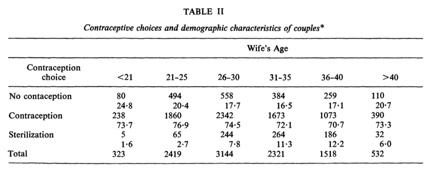
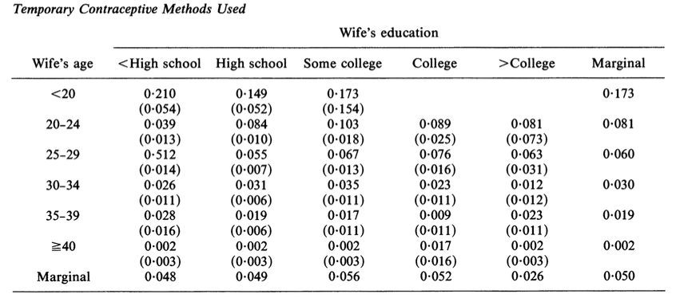

# Single-agent Dynamics {#dynamics}

## Dynamic Models

### Dynamic Models

- There is an \textbf{endogenous state variable}, a state variable that is affected by the action of players.


- Payoff linkages:

- Demand:

- Durable good: The stock of a product is the endogenous state variable. Tomorrow's demand depends on how many consumers purchase and consume today, which depends on the today's price and the future pricing plan.

- Cost:

- Learning by doing: The productivity of a firm is the endogenous state variable. Tomorrow's productivity depends on how many the firm produces today.

- Information linkages:

- Uncertainty about the quality: The belief about the quality of a product is the endogenous variable. Tomorrow's demand depends on the tomorrow's belief about the quality of the product, which depends on the consumer's consumption decision today, which depends on the today's price.

- Strategic linkages:

- Tacit collusion: The history of actions is the endogenous state variable. Tomorrow's rivals' actions depend on today's action.


- This lecture covers the payoff and information linkages.


### A Simple Framework

- We consider a simple set-up:

- Single agent.
- Infinite discrete time.
- Finitely many choices.
- Finite state space.
- Markovian framework.


### Set-up

- There is one agent.
- Time is $t = 1, 2, \cdots, \infty$.
- There are $K + 1$ actions $A = \{0, 1, \cdots, K\}$.
- There are $L$ states $S = \{1, \cdots, L\}$.


### Timing of the Model

- At period $t$:

- State $s^t$ is publicly observed, $s^t \in S$.
- Choice-specific profitability shocks are privately observed, $\epsilon^t \in \mathbb{R}^{ K + 1}$, and
$\epsilon^t \sim F(\cdot|s^t)$, i.i.d.
- Choice is made, $a^t \in A$.
- State evolves according to a transition probability:
\begin{equation}
g(a, s, s') \equiv \mathbb{P}\{s^{t + 1} = s'|s^t = s, a^t = a\},
\end{equation}

\begin{equation}
G \equiv 
\begin{pmatrix}
g(0, 1, 1) & \cdots & g(0, 1, L)\\
\vdots & & \vdots \\
g(0, L, 1) & \cdots & g(0, L, L)\\
& \vdots & \\
g(K, 1, 1) & \cdots & g(K, 1, L)\\
\vdots & & \vdots \\
g(K, L, 1) & \cdots & g(K, L, L)\\
\end{pmatrix}.
\end{equation}


### Period Payoff

- When the state is $s^t$, action is $a^t$, and the profitability shocks are $\epsilon^t$, the period payoff is:
\begin{equation}
\pi(a^t, s^t) + \sum_{k = 1}^K \epsilon^{tk} 1\{a_t = k\},
\end{equation}
where $\pi(a^t, s^t)$ is the mean period profit, and let $\Pi$ be:
\begin{equation}
\Pi =
\begin{pmatrix}
\pi(0, 1)\\
\vdots \\
\pi(0, L)\\
\vdots \\
\pi(K, 1)\\
\vdots \\
\pi(K, L)\\
\end{pmatrix}.
\end{equation}
- The profit is the discounted sum of future payoffs with discount factor $\beta < 1$.


### Markovian Framework

- The strategy is in general a mapping from the entire history to the action set.
- We restrict the set of possible strategies to Markovian strategies $a(\epsilon^t, s^t)$.
- i.e., the behavior does not depend on the past states, conditional on today's states.
- Beliefs about future behavior is denoted by $\sigma(a|s)$, and let $\sigma$ be:
\begin{equation}
\sigma = [\sigma(0|1), \cdots, \sigma(0|L), \cdots, \sigma(K|1), \cdots, \sigma(K|L)]'.
\end{equation}


### Decision Problem

- The agent chooses strategy $a(\cdot, \cdot)$ such that:
\begin{equation}
\begin{split}
\max_{a(\cdot, \cdot)} & \pi(a(\epsilon^0, s^0), s^0) + \sum_{k = 1}^K \epsilon^{0k} 1\{a(\epsilon^0, s^0) = k\}\\
&+ \mathbb{E}\Bigg\{ \sum_{t = 1}^\infty \beta^t \Bigg[\pi(a^t, s^t) + \sum_{k = 1}^K \epsilon^{tk} 1\{a^t = k\}\Bigg]\Bigg|s^0, a(\epsilon^0, s^0)\Bigg\}
\end{split}
\end{equation}
subject to the transition probability and the distribution of the profitability shocks.


### Value Function

- When the belief about the future behavior is $\sigma$, then the value function associated with the belief is:
\begin{equation}
\begin{split}
&V(\sigma, s^0, \epsilon^0)\\
&= \sum_{a \in A} \sigma(a|s^0) \Bigg\{\pi(a, s^0) + \epsilon^{0a} + \mathbb{E}\Bigg[ \sum_{t = 1}^\infty \beta^t \sum_{a \in A}\sigma(a|s^t)\Bigg(\pi(a, s^t) + \epsilon^{ta}\Bigg)\Bigg|s^0, a\Bigg] \Bigg\}\\
& = \sum_{a \in A} \sigma(a|s^0) \Bigg\{\pi(a, s^0) + \epsilon^{0a} + \beta \mathbb{E}\Bigg[V(\sigma, s^1, \epsilon^1)\Bigg|s^0, a\Bigg]\Bigg\}\\
& = \sum_{a \in A} \sigma(a|s^0) \Bigg\{\pi(a, s^0) + \epsilon^{0a} + \beta \sum_{s^1 \in S} V(\sigma, s^1, \epsilon^1)g(a, s^0, s^1)\Bigg\}.
\end{split}
\end{equation}
- The \textbf{ex-ante value function} with the belief is defined to be:
\begin{equation}
V(\sigma, s) = \mathbb{E}\{V(\sigma, s, \epsilon)|s\}.
\end{equation}


### Decision Problem

- When the current state and profitability shocks are $s$ and $\epsilon$ and the belief about the future behavior is $\sigma$, the \textbf{choice-specific value function} for an agent in a period is written as:
\begin{equation}
\begin{split}
V(a, s, \epsilon) &= \pi(a , s) + \epsilon^a + \beta \sum_{s' \in S} V(\sigma, s') g(a, s, s')\\
 &= \underbrace{\pi(a , s) + \beta \sum_{s' \in S} V(\sigma, s') g(a, s, s')}_{v(\sigma, a, s)} + \epsilon^a.
\end{split}
\end{equation}
- We call $v(\sigma, a, s)$ be the \textbf{choice-specific mean value function} with belief $\sigma$.


### Optimality Condition

- When the state and profitability shocks are $s$ and $\epsilon$, $a$ is the optimal choice if and only if:
\begin{equation}
v(\sigma, a, s) + \epsilon^{a} \ge v(\sigma, a', s) + \epsilon^{a'}, \forall a' \in A.
\end{equation}
- This condition looks similar to the optimality condition in static discrete choice models.
- The only difference from the static discrete choice model is that the mean indirect utility is the sum of the choice-specific mean profit and the discounted continuation value.


### Optimal Choice Probability

- Therefore, the \textbf{optimal choice probability} with belief $\sigma$ is:
\begin{equation}
\begin{split}
p(a|s, \sigma) &= \mathbb{P}\{v(\sigma, a, s) + \epsilon^{a} \ge v(\sigma, a', s) + \epsilon^{a'}, \forall a' \in A\}\\
&= \int \prod_{a' \neq a} 1\{v(\sigma, a, s) + \epsilon^{a} \ge v(\sigma, a', s) + \epsilon^{a'}\} dF\\
&\equiv \Psi(a, s, \sigma).
\end{split}
\end{equation}
- $\Psi(a, s, \sigma)$ maps the tuple of action, state and belief to the optimal choice probability of the action given the state and the belief.


### Optimal Choice Probability Mapping

- Let $p$ and $\Psi$ be:
\begin{equation}
p = [p(0|1), \cdots, p(0|L), \cdots, p(K|1), \cdots, p(K|L)]',
\end{equation}

\begin{equation}
\Psi(\sigma) = [\Psi(0, 1, \sigma), \cdots, \Psi(0, L, \sigma), \cdots, \Psi(K, 1, \sigma), \cdots, \Psi(K, L, \sigma)]'.
\end{equation}
- \textbf{The optimality condition} with respect to the choice probabilities given the belief is:
\begin{equation}
p = \Psi(\sigma).
\end{equation}
- The \textbf{rational expectation hypothesis} requires: 
\begin{equation}
p = \Psi(p).
\end{equation}
- The optimal choice probability under the rational expectation hypothesis is a fixed point of the mapping $\Psi$.


### Mapping from a Choice Probability to an Ex-ante Value Function

- In the previous model, you could derive the ex-ante value function given choice probabilities by:
\begin{equation}
\begin{split}
V(s) &= \mathbb{E}\{V(s, \epsilon)|s\}\\
&= \mathbb{E}\Bigg[ \sum_{t = 0}^\infty \beta^t \sum_{a \in A}p(a|s^t)\Bigg(\pi(a, s^t) + \epsilon^{ta}\Bigg)\Bigg|s^0, a\Bigg]\\
&\equiv \varphi(p, s).
\end{split}
\end{equation}


### Mapping from an Ex-ante Value Function to a Choice Probability

- On the other hand, you can derive the choice probability given ex-ante value function by:
equation
\begin{equation}
\begin{split}
p(a|s) = \mathbb{P}\Bigg\{&\pi(a , s) + \beta \sum_{s' \in S} V(s') g(a, s, s') + \epsilon^a \ge\\
&\pi(a' , s) + \beta \sum_{s' \in S} V(s') g(a', s, s') + \epsilon^{a'}, \forall a' \in A \Bigg\}\\
&\equiv \Lambda(V, s).
\end{split}
\end{equation}


### The Optimality Conditions

- In terms of the choice probabilities:
\begin{equation}
p = \Psi(p).
\end{equation}
- In terms of the ex-ante value function:
\begin{equation}
V = \Lambda(p) = \Lambda(\varphi(V)) \equiv \Phi(V).
\end{equation}


### Type-I Extreme Value

- If $\epsilon$ is drawn from i.i.d. Type-I extreme value distribution, we can derive the mapping from the ex-ante value function to the choice probability in a closed form:
\begin{equation}
\begin{split}
p(a|s) &= \mathbb{P}\{\pi(a , s) + \beta \sum_{s' \in S} V(s') g(a, s, s') + \epsilon^{a} \ge\\
 & \pi(a' , s) + \beta \sum_{s' \in S} V(s') g(a', s, s') + \epsilon^{a'}, \forall a' \in A\}\\
&=\frac{\exp[\pi(a , s) + \beta \sum_{s' \in S} V(s') g(a, s, s')]}{\sum_{a' \in A} \exp[\pi(a' , s) + \beta \sum_{s' \in S} V(s') g(a', s, s')]}.
\end{split}
\end{equation}


### Type-I Extreme Value

- If $\epsilon$ is drawn from i.i.d. Type-I extreme value distribution, we can also derive the mapping from the choice probability to the ex-ante value function:
\begin{equation}
\begin{split}
V(s) &= \mathbb{E}\{\max_{a \in A} \pi(a , s) + \beta \sum_{s' \in S} V(s') g(a, s, s') + \epsilon^{a}\} \\
&=\log \Bigg\{\sum_{a \in A} \exp[\pi(a , s) + \beta \sum_{s' \in S} V(s') g(a, s, s')] \Bigg\} + \gamma,
\end{split}
\end{equation}
where $\gamma$ is Euler's constant.


### Crucial Underlying Assumptions

- \textbf{Conditional i.i.d. Unobservable}: The profit shocks that are unobservable to econometrician are i.i.d. conditional on the observable state.
- \textbf{Additive separable shocks}: The profit shocks that are unobservable to the econometrician is additively separable in the period profit. 
- \textbf{Conditional Independence of Future Observable State}: 
\begin{equation}
\mathbb{P}\{s^{t + 1}|s^t, a^t, \epsilon^t\} = \mathbb{P}\{s^{t + 1}|s^t, a^t\}.
\end{equation}


### Crucial Underlying Assumptions

- Thanks to the first assumption we can write the optimal choice probability as the function of the observable state of the period.

- If $\epsilon_t$ is serially correlated, to integrate over $\epsilon_{t + 1}$ we have to condition on $\epsilon_t$.

- Because of the second and third assumptions, we can write the choice probability as:
\begin{equation}
p(a|s, \sigma) = \mathbb{P}\{v(\sigma, a, s) + \epsilon^{a} \ge v(\sigma, a', s) + \epsilon^{a'}, \forall a' \in A\}
\end{equation}
that looks similar to the static discrete choice models.


### Identification

- The model primitives are $(\Pi, F, \beta, G)$.
- The transition probability $G$ is directly identified from the data because $a, s, s'$ are observed by econometrician.
- It is known that the model is in general not identified (Magnac and Thesmer 2002).


### Identification

- The discount factor $\beta$ is hard to identify. 

- It determines the weight between the current and future profits.
- Suppose that a firm makes a large investment. This may be because the firm overweights the future (high $\beta$) or because the investment cost is low ($\pi$ is such that the investment cost is low).
- We cannot distinguish between these two possibilities.
- To identify it, you need some instruments that changes the future return to the investment but does not affect today's payoff.


### Identification

- We often fix $\beta$ and $F$ and consider the identification of $\Pi$.
- Note that the optimal choice probability is directly identified from the data because $s$ and $a$ are observed.
- Then the optimality condition under the rational expectation hypothesis gives the following $KL$ system of equations $p = \Psi(p)$.
- On the other hand, the dimension of parameter $\Pi$ is in general $(K + 1)L$ (the mean profit at a state and an action).
- One possible restriction is to assume that $\pi(0, s)$ are known for any $s$. For example, assume that $a = 0$ means that the firm is inactive and so $\pi(0, s) = 0$.


### Dynamic Entry/Exit Model

- Every period, a monopolist decides whether to open/close the store given the market condition.
- Action: $a^t \in \{0, 1\}$, becoming inactive or active.
- State: $s^t \in \{0, 1\}$, being inactive or active.
- State transition: $s^t = a^{t - 1}$ (deterministic).
- Payoff:
\begin{equation}
1(a^t = 1)[x + \epsilon^{t1} - e 1(s^t = 0)],
\end{equation}
where $x$ is the mean variable profit of opening the store, $e$ is the entry cost.


### Bus Engine Replacement Decisions

- Rust (1987) studies the bus engine replacement decision of Harold Zurcher, superintendent of maintenance at the Madison Metropolitan Bus Company.
- Time is month $t = 1, 2, \cdots, \infty$.
- Action $a_t \in \{0, 1\}$ represents whether to replace bus engine or not.
- State $s_t \in \{1, 2, 3\}$ represents the mileage:

- $[0, 5000)$, $[5000, 10000)$, $[10000, +\infty)$.


### Period Profit and Transition Law

- Period profit:

- $-c(s_t, \theta_1)$: the expected per period operating costs (the sum of maintenance, fuel, and insurance costs).
- $RC$: the fixed replacement cost.
- The mean period profit:
\begin{equation}
\pi(s_t, a_t, \theta_1, RC) = -c(s_t, \theta_1)(1 - a_t) + [-c(0, \theta_1) - RC]a_t
\end{equation}
- There are additive profit shocks that are drawn from an i.i.d. Type-I extreme value distribution.


### Transition Law

- Transition law:
- The mileage traveled each month by a given bus is exponentially distributed with parameter $\theta_2$, independently of mileage driven in previous period.
\begin{equation}
g(s_t, s_{t + 1}, a_t; \theta_1) = 
\begin{cases}
\theta_2 \exp[\theta_2(s_{t + 1} - s_t)] &\text{   if   }a_t = 0, s_{t + 1} \ge s_t\\
\theta_2 \exp[\theta_2(s_{t + 1} - s_t)] &\text{   if   }a_t = 1, s_{t + 1} \ge 0\\
0 &\text{   otherwise}.
\end{cases}
\end{equation}


### Bellman Equation

- The Bellman equation is:
\begin{equation}
V(s_t, \epsilon_t) = \max_{a_t}\{\pi(s_t, a_t, \theta_1, RC) + \epsilon_t(a_t) + \beta \mathbb{E}[\mathbb{E}[V(s_{t + 1}, \epsilon_{t + 1})|s_t]|s_t, a_t]\}.
\end{equation}
- The optimal policy is:
\begin{equation}
\begin{split}
&f(s_t, \epsilon_t, \theta_1, \theta_2, RC)\\
&= \text{argmax}_{a_t} \{\pi(s_t, a_t, \theta_1, RC) + \epsilon_t(a_t) + \beta \mathbb{E}[\mathbb{E}[V(s_{t + 1}, \epsilon_{t + 1})|s_t]|s_t, a_t]\}.
\end{split}
\end{equation}
- The optimal choice probability is:
\begin{equation}
\begin{split}
p(a_t|s_t, \theta_1, \theta_2, RC)=\frac{\exp\{\pi(s_t, a_t, \theta_1, RC) + \beta \mathbb{E}[V(s_{t + 1})|s_t, a_t]\}}{\sum_{a = 0}^1 \exp\{\pi(s_t, a, \theta_1, RC) + \beta \mathbb{E}[V(s_{t + 1}|s_t, a]\}}.
\end{split}
\end{equation}


### Solving for the Ex-ante Value Function

- How to find the optimal policy (choice probability) and the value function given parameters $\theta = (\theta_1, \theta_2, RC)$?
- The Bellman equation in terms of the ex-ante value function is:
\begin{equation}
\begin{split}
&\mathbb{E}[V(s_{t + 1})|s_t, a_t]\\
& = \int \log \Bigg\{\sum_{a = 0}^1 \exp\{ \pi(s_{t + 1}, a, \theta_1, RC)\\
 &+ \beta \mathbb{E}[V(s_{t + 2})|s_{t + 1}, a)]\} \Bigg\}g(s_{t + 1}|s_t, a) d s_{t + 1} + \gamma.
\end{split}
\end{equation}


### Solving for the Ex-ante Value Function

- The ex-ante value function is a fixed point of this mapping, and the mapping is a contraction mapping as long as $\beta < 1$.

- Starting from arbitrary function $W^{(0)}(s, a)$.
- Iterate:
\begin{equation}
\begin{split}
&W^{(r + 1)}(s, a)\\
& = \int \log \Bigg\{\sum_{a' = 0}^1 \exp\{ \pi(s', a', \theta_1, RC)\\
&+ \beta W^{(r)}(s', a')\} \Bigg\}g(s'|s, a; \theta_2) d s' + \gamma.
\end{split}
\end{equation}
until $d(W^{(r + 1)}, W^{(r)} )$ is below some threshold.


### Solving for the Optimal Choice Probability

- Let $W^{(*)}(s, a; \theta)$ be the solution to the previous fixed-point algorithm.
- Then, we can derive the optimal choice probability as:
\begin{equation}
\begin{split}
p^{(*)}(a|s; \theta)=\frac{\exp\{\pi(s, a, \theta_1, RC) + \beta W^{(*)}(s, a; \theta) \}}{\sum_{a' = 0}^1 \exp\{\pi(s, a', \theta_1, RC) + \beta W^{(*)}(s, a'; \theta)\}}.
\end{split}
\end{equation}
- These are the ex-ante value function and optimal choice probabilities under parameters $\theta = (\theta_1, \theta_2, RC)$.
- Fixed-point algorithm can be run through the value function or policy function instead of the ex-ante value function.


### Estimation by Nested Fixed-Point Algorithm

- The previous algorithm allows you to derive the optimal choice probability given parameters.
- Then it is straight forward to evaluate the likelihood function given observations $\{a_t, s_t\}_{t = 1}^T$:
\begin{equation}
\begin{split}
&L(\theta; \{a_t, s_t\}_{t = 1}^T) =\prod_{t = 1}^T \prod_{a_t = 0}^1 p^{(*)}(a_t|s_t; \theta)^{a_t} g(s_{t + 1}|s_t, a_t; \theta_2).
\end{split}
\end{equation}
and so the log likelihood function is:
\begin{equation}
\begin{split}
&l(\theta; \{a_t, s_t\}_{t = 1}^T)\\
&=\sum_{t = 1}^T \sum_{a_t = 0}^1 a_t \log [p^{(*)}(a_t|s_t; \theta)] + \sum_{t = 1}^T \log g(s_{t + 1}|s_t, a_t; \theta_2).
\end{split}
\end{equation}
- This estimation algorithm is called a \textbf{nested fixed-point algorithm} because a fixed-point algorithm.


### Full and Partial Likelihood

- We can find $\theta$ that maximizes the full log likelihood $l(\theta; \{a_t, s_t\}_{t = 1}^T)$ to estimate the model.
- However, the convergence takes longer as the number of parameters are larger.
- Parameters that govern the state transition is estimated by finding $\theta_2$ that maximizes the partial likelihood:
\begin{equation}
\hat{\theta}_2 = \text{argmax}_{\theta_2} \sum_{t = 1}^T \log g(s_{t + 1}|s_t, a_t; \theta_2).
\end{equation}
- Then we can estimate $\theta_1$ and $RC$ by finding $\theta_1$ and $RC$ that maximize the partial likelihood:
\begin{equation}
(\hat{\theta}_1', \hat{RC})' = \text{argmax}_{\theta_1, RC} \sum_{t = 1}^T \sum_{a_t = 0}^1 a_t \log [p^{(*)}(a_t|s_t; \theta_1, \hat{\theta}_2, RC)].
\end{equation}
- This causes some efficiency loss but speeds up the convergence.


### Review

- Let $\theta = (\theta_1, \theta_2)$ where $\theta_1$ are the parameters in the profit function $\pi$ and $\theta_2$ are the parameters in the transition probability $g$.
- The optimal conditional choice probability $p$ under the rational expectation hypothesis in single-agent dynamic models is characterized by the equation:
\begin{equation}
p = \Psi^{\theta}(p),
\end{equation}
where $\Psi$ is determined by parameters $\theta$.


### Review

- The mapping $\Psi^\theta$ is a composite mapping for two mappings:
\begin{equation}
p = \Lambda^\theta(\varphi^\theta(p)).
\end{equation}

\begin{equation}
\begin{split}
V(s) &= \varphi^\theta(p, s)\\
&= \mathbb{E}\Bigg[ \sum_{t = 0}^\infty \beta^t \sum_{a \in A}p(a|s^t)\Bigg(\pi(a, s^t) + \epsilon^{ta}\Bigg)\Bigg|s^0, a\Bigg].
\end{split}
\end{equation}

\begin{equation}
\begin{split}
p(a|s) &= \Lambda^\theta(V, a, s)\\
&\equiv \mathbb{P}\Bigg\{\pi(a , s) + \beta \sum_{s' \in S} V(s') g(a, s, s') + \epsilon^a \ge\\
&\pi(a' , s) + \beta \sum_{s' \in S} V(s') g(a', s, s') + \epsilon^{a'}, \forall a' \in A \Bigg\}.
\end{split}
\end{equation}


### Review

- In the nested fixed-point algorithm, we find $p^\theta$ such that $p^\theta = \Psi^\theta(p^\theta)$ for each $\theta$, and search $\theta$ that maximizes:
\begin{equation}
l(\theta; \{s^t, a^t\}) = \sum_{t = 1}^T a_t \log p^\theta(a^t|s^t)  + \sum_{t = 1}^T \log g^{\theta_2}(s^{t + 1}|s^t, a^t).
\end{equation}
- This algorithm takes time because we have to run fixed-point algorithm for each functional evaluation.


### CCP Approach

- Conditional Choice Probability (CCP) approach suggested by Hotz and Miller (1993) significantly reduces the computation time at the cost of some efficiency.
- The idea is:

- We can identify the optimal conditional choice probability $p^\theta$ directly from the data. This is a reduced-form parameter ($\leftrightarrow$ $\theta$ is the structural parameters) of the model.
- The optimality condition $p^\theta = \Psi^\theta(p^\theta)$ can be regarded as a moment condition. 


### CCP Approach

- In the nested fixed-point algorithm, we find $p^\theta$ that solves the optimality condition given $\theta$ to compute the likelihood.
- In CCP approach, we find $\theta$ that solves the optimality condition given $p^\theta$ that is identified directly from the data.


### First Step: Estimating CCP

- The first step of the CCP approach is to estimate the conditional choice probability and transition probability.
- If everything is discrete, it is nothing but the empirical distribution:
\begin{equation}
\begin{split}
&\hat{p}(a|s) = \frac{\sum_{i = 1}^N \sum_{t = 1}^T 1\{a_i^t = a, s_i^t = s\}}{\sum_{i = 1}^N \sum_{t = 1} 1\{s_i^t = s\}},\\
&\hat{g}(s'|s, a) = \frac{\sum_{i = 1}^N \sum_{t = 1}^T 1\{s_i^{t + 1} = s', s_i^t = s, a_i^t = a\}}{\sum_{i = 1}^N \sum_{t = 1} 1\{s_i^t = s, a_i^t = a\}}.
\end{split}
\end{equation}


### First Step: Estimating CCP

- You can use parametric models.
- For example, you may estimate the conditional choice probability with a multinomial logit models:
\begin{equation}
\begin{split}
&\hat{p}(a|s) = \frac{\exp[\hat{\beta} a + \hat{\gamma} s)]}{\sum_{a' \in A} \exp[\hat{\beta} a' + \hat{\gamma} s)]}.
\end{split}
\end{equation}
- You may estimate the transition probability with AR(1) models:
\begin{equation}
s^{t + 1} = \hat{\rho} s^t + (1 - \hat{\rho}) \hat{\gamma} a^t + \epsilon_t, \epsilon_t \sim~ N(0, \hat{\sigma}^2),
\end{equation}
and then discretize.


### First Step: Estimating CCP

- What is the estimated CCP $\hat{p}$?
- This is a conditional choice probability \underline{at a particular equilibrium}.
- If parameter changes, then the equilibrium changes. Then, the conditional choice probability also changes.
- The reduced-form parameter $\hat{p}$ embodies the information about behaviors under the actual equilibrium but does not tell anything about behaviors under hypothetical equilibria.
- Therefore, $\hat{p}$ is not sufficient to make counterfactual prediction.


### Second Step: Estimating Structural Parameters

- Among structural parameters $\theta$, parameters in the transition probability $\theta_2$ have been already identified from the data.
- How do we identify $\theta_1$, parameters in the profit function $\pi$?
- If we fix $\theta_1$, in theory, we can compute:
\begin{equation}
\begin{split}
&\varphi^{(\theta_1, \hat{\theta}_2)}(p, s)\\
&\equiv \mathbb{E}\{V(s, \epsilon)|s\}\\
&= \mathbb{E}\Bigg[ \sum_{t = 0}^\infty \beta^t \sum_{a \in A}\hat{p}(a|s^t)\Bigg(\pi^{\theta_1}(a, s^t) + \epsilon^{ta}\Bigg)\Bigg|s\Bigg],\\
\end{split}
\end{equation}
although the expectation may not have a closed form solution.


### Second Step: Estimating Structural Parameters

- In addition, if we fix $\theta_1$, in theory, we can compute:
\begin{equation}
\begin{split}
&\Lambda^{(\theta_1, \hat{\theta}_2)}(V, a, s)\\
&\equiv \mathbb{P}\Bigg\{\pi^{\theta_1}(a , s) + \beta \sum_{s' \in S} V(s') g^{\hat{\theta}_2}(a, s, s') + \epsilon^a \ge\\
&\pi^{\theta_1}(a' , s) + \beta \sum_{s' \in S} V(s') g^{\hat{\theta}_2}(a', s, s') + \epsilon^{a'}, \forall a' \in A \Bigg\}
\end{split}
\end{equation}
- Combining these two mappings, we can compute:
\begin{equation}
\Psi^{(\theta_1, \hat{\theta_2})}(\hat{p}) = \Lambda^{(\theta_1, \hat{\theta}_2)}(\varphi^{(\theta_1, \hat{\theta}_2)}(\hat{p})).
\end{equation}
- Then, we can find $\theta_1$ that minimizes the distance between $\hat{p}$ and $\Psi^{(\theta_1, \hat{\theta_2})}(\hat{p})$ to find $\theta_1$ that is consistent with the observed conditional choice probabilities.


### Second Step: Estimating Structural Parameters

- Then, we can estimate $\theta_1$ by finding $\theta_1$ that satisfy the sample analogue of the moment condition:
\begin{equation}
\begin{split}
&\sum_{s = 1}^L \sum_{a = 0}^K \Bigg[\frac{n_{as}}{NT} -  \Psi^{(\theta_1, \hat{\theta}_2)}(\hat{p}, a, s)\Bigg] = 0\\
&\Leftrightarrow \sum_{s = 1}^L \sum_{a = 0}^K \Bigg[\tilde{p}(a|s) -  \Psi^{(\theta_1, \hat{\theta}_2)}(\hat{p}, a, s)\Bigg] = 0,
\end{split}
\end{equation}
where $\tilde{p}(a|s)$ is a nonparametric estimate of the optimal choice probability.
- You can replace $\tilde{p}$ with $\hat{p}$ as long as they are consistent estimators.


### Type-I Extreme Value Distribution

- $\Lambda$ and $\varphi$ do no have closed form expressions in general.
- Exception is the case where the profitability shocks $\epsilon_i^t(a)$ is drawn from i.i.d. type-I extreme value distribution.
- First, we know that $\Lambda$ can be written as:
\begin{equation}
\begin{split}
&\Lambda^{(\theta_1, \hat{\theta}_2)}(V, a, s)\\
&\equiv \mathbb{P}\Bigg\{\pi^{\theta_1}(a , s) + \beta \sum_{s' \in S} V(s') g^{\hat{\theta}_2}(a, s, s') + \epsilon^a \ge\\
&\pi^{\theta_1}(a' , s) + \beta \sum_{s' \in S} V(s') g^{\hat{\theta}_2}(a', s, s') + \epsilon^{a'}, \forall a' \in A \Bigg\}\\
&=\frac{\exp\Big[\pi^{\theta_1}(a , s) + \beta \sum_{s' \in S} V(s') g^{\hat{\theta}_2}(a, s, s')\Big]}{\sum_{a' = 0}^K \exp\Big[\pi^{\theta_1}(a' , s) + \beta \sum_{s' \in S} V(s') g^{\hat{\theta}_2}(a', s, s') \Big]}.
\end{split}
\end{equation}


### Type-I Extreme Value Distribution

- Second, we can show that $\varphi$ has a closed form solution:
\begin{equation}
\begin{split}
&\varphi^{(\theta_1, \hat{\theta}_2)}(p, s)\\
&\equiv \mathbb{E}\{V(s, \epsilon)|s\}\\
&= \mathbb{E}\Bigg[ \sum_{t = 0}^\infty \beta^t \sum_{a \in A}\hat{p}(a|s^t)\Bigg(\pi^{\theta_1}(a, s^t) + \epsilon^{ta}\Bigg)\Bigg|s\Bigg]\\
&=\mathbb{E}\Bigg[\sum_{a \in A}\hat{p}(a|s)\Bigg(\pi^{\theta_1}(a, s) + \epsilon^{a} + \beta \sum_{s' \in S} \mathbb{E}\{V(s, \epsilon)|s'\} g^{\hat{\theta}_2}(a, s, s')  \Bigg)\Bigg|s\Bigg]\\
&=\mathbb{E}\Bigg[\sum_{a \in A}\hat{p}(a|s)\Bigg(\pi^{\theta_1}(a, s) + \epsilon^{a} + \beta \sum_{s' \in S} \varphi^{(\theta_1, \hat{\theta}_2)}(p, s') g^{\hat{\theta}_2}(a, s, s')  \Bigg)\Bigg|s\Bigg]\\
&=\sum_{a \in A}\hat{p}(a|s)\Bigg(\pi^{\theta_1}(a, s) + \mathbb{E}[\epsilon^{a}|s, a] + \beta \sum_{s' \in S} \varphi^{(\theta_1, \hat{\theta}_2)}(p, s') g^{\hat{\theta}_2}(a, s, s')  \Bigg)
\end{split}
\end{equation}
- We need closed form expression of $\mathbb{E}[\epsilon^{a}|s, a]$. 


### Type-I Extreme Value Distribution
\begin{equation}
\begin{split}
\mathbb{E}[\epsilon^{a}|s, a] &= p(a|s)^{-1} \int \epsilon^a 1\Bigg\{\pi^{\theta_1}(a , s) + \beta \sum_{s' \in S} V(s') g^{\hat{\theta}_2}(a, s, s') + \epsilon^a \ge\\
&\pi^{\theta_1}(a' , s) + \beta \sum_{s' \in S} V(s') g^{\hat{\theta}_2}(a', s, s') + \epsilon^{a'}, \forall a' \in A \Bigg\}dF(e)\\
&= \gamma - \ln p(a|s),
\end{split}
\end{equation}
where $\gamma$ is Euler's constant:
\begin{equation}
\gamma \equiv \lim_{n \to \infty} \Bigg(\sum_{k = 1}^n \frac{1}{k} - \ln(n) \Bigg) \approx 0.57721...
\end{equation}
if $\epsilon^a$ is drawn from i.i.d. type-I extreme value distribution.


### Type-I Extreme Value Distribution

- Inserting this into the previous expression, we get:
\begin{equation}
\begin{split}
&\varphi^{(\theta_1, \hat{\theta}_2)}(p, s)\\
& = \sum_{a \in A}\hat{p}(a|s)\Bigg(\pi^{\theta_1}(a, s) + \gamma - \ln p(a|s)\\
&+ \beta \sum_{s' \in S} \varphi^{(\theta_1, \hat{\theta}_2)}(p, s') g^{\hat{\theta}_2}(a, s, s')  \Bigg).
\end{split}
\end{equation}


### Type-I Extreme Value Distribution

- Write the continuation value in a matrix form:
\begin{equation}
\begin{split}
& \sum_{s' \in S} \varphi^{(\theta_1, \hat{\theta}_2)}(p, s') g^{\hat{\theta}_2}(a, s, s')\\
& = [g^{\hat{\theta}_2}(a, s, 1), \cdots, g^{\hat{\theta}_2}(a, s, L)] 
\underbrace{\begin{bmatrix}
\varphi^{(\theta_1, \hat{\theta}_2)}(p, 1)\\
\vdots\\
\varphi^{(\theta_1, \hat{\theta}_2)}(p, L).
\end{bmatrix}}_{\equiv \varphi^{(\theta_1, \hat{\theta}_2)}(p)}
\end{split}
\end{equation}


### Type-I Extreme Value Distribution

- Write the ex-ante value function in a matrix form:

\begin{equation}
\begin{split}
&\varphi^{(\theta_1, \hat{\theta}_2)}(p, s)\\
&=\underbrace{[p(0|s), \cdots, p(K|s)]}_{\equiv p(s)'} \\
&\times\begin{bmatrix}
\underbrace{\begin{bmatrix}
\pi^{\theta_1}(0, s)\\
\vdots\\
\pi^{\theta_1}(K, s)
\end{bmatrix}}_{\equiv \pi^{\theta_1}(s)}
+ \gamma
-
\underbrace{\begin{bmatrix}
\ln p(0|s)\\
\vdots\\
\ln p(K|s)
\end{bmatrix}}_{\equiv \ln p(s)}
+\beta
\underbrace{\begin{bmatrix}
g^{\hat{\theta}_2}(0, s, 1), \cdots, g^{\hat{\theta}_2}(0, s, L)\\
\vdots\\
g^{\hat{\theta}_2}(K, s, 1), \cdots, g^{\hat{\theta}_2}(K, s, L)
\end{bmatrix}}_{\equiv G^{\hat{\theta}_2}(s)}
\varphi^{(\theta_1, \hat{\theta}_2)}(p)
\end{bmatrix}\\
&=p(s)'[\pi^{\theta_1}(s) + \gamma - \ln p(s)] + \beta p(s)' G^{\hat{\theta}_2}(s)  \varphi^{(\theta_1, \hat{\theta}_2)}(p)
\end{split}
\end{equation}


### Type-I Extreme Value Distribution

- Stacking up for $s$, we get:
\begin{equation}
\begin{split}
&\varphi^{(\theta_1, \hat{\theta}_2)}(p) =
\begin{bmatrix}
p(1)'[\pi^{\theta_1}(1) + \gamma - \ln p(1)]\\
\vdots\\
p(L)'[\pi^{\theta_1}(L) + \gamma - \ln p(L)]
\end{bmatrix}
+\beta
\begin{bmatrix}
p(1)' G^{\hat{\theta}_2}(1)\\
\vdots\\
p(L)' G^{\hat{\theta}_2}(L)
\end{bmatrix}
\varphi^{(\theta_1, \hat{\theta}_2)}(p)\\
&\Leftrightarrow\\
&\varphi^{(\theta_1, \hat{\theta}_2)}(p) = 
\begin{bmatrix}
I -
\beta
\begin{bmatrix}
p(1)' G^{\hat{\theta}_2}(1)\\
\vdots\\
p(L)' G^{\hat{\theta}_2}(L)
\end{bmatrix}
\end{bmatrix}^{-1}
\begin{bmatrix}
p(1)'[\pi^{\theta_1}(1) + \gamma - \ln p(1)]\\
\vdots\\
p(L)'[\pi^{\theta_1}(L) + \gamma - \ln p(L)]
\end{bmatrix}.
\end{split}
\end{equation}
- Note that you can get this expression even if the profitability shocks are not type-I extreme value, although you need numerical integration for $\mathbb{E}\{\epsilon^a|s, a\}$ instead of the analytical solution $\gamma - \ln p(a|s)$.


### General Distribution

- If the profitability shock $\epsilon^a$ is not an i.i.d. type-I extreme value random variable, you may need to compute $\mathbb{E}\{\epsilon^a|s, a\}$ and $\Lambda^{(\theta_1, \hat{\theta}_2)}(V)$ numerically.
- This may or may not feasible.


### Contraceptive Choice and Voluntary Sterilization

- Application in Hotz and Miller (1993).
- In those years, voluntary sterilization were the most common method of family planning within the U.S.A.
- Data: white married couples surveyed in the National Fertility Survey of 1970-1975.
- It asks monthly records of contraceptive utilization.
- In any given year, approximately 18\% of couples at risk of child bearing used no form of contraception, 74\% used temporary contraceptive method, and 8\% chose to sterilize.

```{r, echo = FALSE, fig.cap = '', out.width='80%', fig.asp = .75, fig.align = 'center'}

```

```{r, echo = FALSE, fig.cap = '', out.width='80%', fig.asp = .75, fig.align = 'center'}
knitr::include_graphics("figuretable/health.png")
```


- U.S. Department of Health and Human Services, 2010, ``Use of Contraception in the United States: 1982–2008''.


### Contraceptive Choice and Voluntary Sterilization

- They estimate a model in which parents value the direct utility received from their children and from their own consumption.

- If we focus on households, we cannot use ``profit'' data to identify the period payoff, but have to use information revealed through their actions.

- Their consumption of these two goods are constrained by their income, the costs of rearing their own children, and their inability to control perfectly the extent and timing of childbearing.


### Contraceptive Choice and Voluntary Sterilization: Action Space

- A household can choose either to use no contraceptive method, temporary contraception, or voluntary sterilization.
- $d_i^t = (d_{i1}^t, d_{i2}^t, d_{i3}^t)'$, where each of $d_{i1}^t, d_{i2}^t, d_{i3}^t$ take one if the household uses no contraceptive method, temporary contraception, or voluntary sterilization and take 0 otherwise, respectively.
 


### Contraceptive Choice and Voluntary Sterilization: State Space and State Transition Law

- $s_i^t = (a_{i1}^t, a_{i2}^t, h_i^{t})'$ where:

- $a_{i1}^t$: the age of mother.
- $a_{i2}^t$: the age of father.
- $h_i^{t} = (h_{i1}^t, h_{i2}^t, h_{i3}^t)$: vector of children's age.

- If a household does not use voluntary sterilization, the household bears a child with some probability, while it never bears a child if the household uses voluntary sterilization.
- The age of mother and father increments by one every year.
 


### Contraceptive Choice and Voluntary Sterilization: Period Utility

- The period utility is:
\begin{equation}
u_i^t = \pi_i^t(h_i^t) + c_i^t - \psi_1 [\pi_i^t(h_i^t)]^2 - \psi_2 (c_i^t)^2 + \sum_{j = 1}^3[\mu_{j0} + \mu_{j1} a_{i1}^t + \mu_{j2} (a_{j2}^t)^2 + \mu_{j3} e_{i1} + \epsilon_{ij}^t]d_{ij}^t, 
\end{equation}
where $\epsilon_i^t$ is drawn from i.i.d. type-I extreme value distribution, $\pi_i^t(h_i^t)$ is a service flow from children:
\begin{equation}
\pi_i^t(h_i^t) = \sum_{s = 0}^{\overline{s}} \sum_{l = 1}^{\overline{l}}\eta_s1\{h_{il}^t = s\},
\end{equation}
where $\eta_s$ is a service flow from $s$ years old child, $c_i^t$ is the household's consumption, $e_{i1}$ is the mother's education level.
- Parameters in the period utility are $\{\eta_s\}_{s = 0}^{\overline{s}}, \psi_1, \psi_2$ and $\{\mu_{j0}, \mu_{j1}, \mu_{j2}, \mu_{j3}\}_{j = 1}^3$.


### Contraceptive Choice and Voluntary Sterilization: Budget Constraint and Total Income

- Let $y_i^t$ be the total income of the household.
- The budget constraint for the household is:
\begin{equation}
 c_i^t + \sum_{s = 0}^{\overline{s}} \sum_{l = 1}^{\overline{l}} \omega_s1\{h_{il}^t = s\} = y_i^t. 
 \end{equation} 
 - The income process is assumed to be exogenous.
 - They fit a parametric model to income process:
 \begin{equation}
 y_i^t = \gamma_0 + \gamma_1 a_{i2}^t + \gamma_2 (a_{i2}^t)^2 + \gamma_3 e_{i2} + \gamma_4 e_{i2} a_{i2}^t + \gamma_5 e_{i2} (a_{i2}^t)^2 + \xi_i^t,
 \end{equation}
 where $e_{i2}$ is father's education level.

 - In those days, they could assume that the household income is exclusively from father's income.
 - This part gets complicated these days because of diverse labor participation decisions within household.

 


### Contraceptive Choice and Voluntary Sterilization: Estimation

- Income equation is estimated outside the dynamic model using the standard OLS.
- The child bearing probability can be fitted to a nonparametric binary model in which the state variables and decision variables enter as covariates $\to \hat{\theta}_2$.

- It is okay to fit a binary logit model.

- The optimal choice probability can be fitted to a multinomial nonparametric model in which the state variables and decision variables enter as covariates $\to \hat{p}$.

- It is okay to fit a multinomial logit model.

- Given these estimate, they find $\theta_1$ such that:
\begin{equation}
\sum_{s = 1}^L \sum_{a = 0}^K \Bigg[\tilde{p}(a|s) -  \Psi^{(\theta_1, \hat{\theta}_2)}(\hat{p}, a, s)\Bigg] = 0
\end{equation}
- Current and lagged states and a vector of ones are often included in $z_i^t$.


### Contraceptive Choice and Voluntary Sterilization: Child Bearing Probability
```{r, echo = FALSE, fig.cap = '', out.width='80%', fig.asp = .75, fig.align = 'center'}
knitr::include_graphics("figuretable/bearing1.png")
```


### Contraceptive Choice and Voluntary Sterilization: Child Bearing Probability
```{r, echo = FALSE, fig.cap = '', out.width='80%', fig.asp = .75, fig.align = 'center'}

```


### Contraceptive Choice and Voluntary Sterilization: Optimal Choice Probability} 

- Holding other characteristics of a couple constant at their sample means, the estimated model indicates:

- Wives who have an additional year of education are 16.5\% less likely not to contracept 5\% less likely to sterilize, but 15\% more likely to use temporary methods.
- Wives who grow one year are 9.8\% more likely not to contracept, 1.6\% less likely to use temporary methods, and 3\% more likely to sterilize.
- For couples with only 1 child, the predicted probability of not contracepting immediate after the birth is 3\%, with 85\% using a temporary contraceptive and 12\% choosing sterilization.
- By the time the child is 5 years old, the incidence of not contracepting more than doubles to 8\% while the use of temporary methods and sterilization declines to 82\% and 10\%.


### Contraceptive Choice and Voluntary Sterilization: Structural Parameters
```{r, echo = FALSE, fig.cap = '', out.width='80%', fig.asp = .75, fig.align = 'center'}
knitr::include_graphics("figuretable/structural.png")
```


### Contraceptive Choice and Voluntary Sterilization

- With the estimates of the structural parameters, we can conduct various counterfactual simulation.
- How do contraceptive behavior and so the child bearing decisions change if the government provide $y$ yen subsidy to $n$th children bearing?
- Does it decrease the overall use of contraceptive method once the government prohibits the voluntary sterilization?
- How much of the changes in the number of child birth during the data period can be explained by the changes in the education level of the mothers?


### Relationship between CCP and MLE

- At the optimum, we have $p = \Psi^{(\theta_1, \theta_2)}(p)$.
- So the (partial) log likelihood is:
\begin{equation}
\begin{split}
&l(\theta) = \frac{1}{NT}\sum_{i = 1}^N \sum_{t = 1}^N \sum_{a = 0}^K 1\{a_{i}^t = a\} \ln \Psi^{(\theta_1, \theta_2)}(p, a, s_i^t)\\
&=\frac{1}{NT} \sum_{s = 1}^L \sum_{a = 0}^K n_{as} \ln \Psi^{(\theta_1, \theta_2)}(p, a, s)\\
&= \sum_{s = 1}^L \sum_{a = 0}^K \tilde{p}_{as} \ln \Psi^{(\theta_1, \theta_2)}(p, a, s).
\end{split}
\end{equation}
where $n_{ks} = \sum_{i = 1}^N \sum_{t = 1}^T 1\{a_i^t = k, s_i^t = s\}$.


### Relationship between CCP and MLE

- Note that $\Psi^{(\theta_1, \theta_2)}(p, 0, s) = 1 - \sum_{a = 1}^k \Psi^{(\theta_1, \theta_2)}(p, a, s)$.
- The first-order condition w.r.t. $\theta_1$ is:
\begin{equation}
\begin{split}
&\frac{\partial l(\theta)}{\partial \theta_1}\\
&= \sum_{s = 1}^L \sum_{a = 1}^K \Bigg[\frac{p_{as}}{\Psi^{(\theta_1, \theta_2)}(p, a, s)} - \frac{p_{0s}}{\Psi^{(\theta_1, \theta_2)}(p, 0, s)} \Bigg]  \frac{\partial \Psi^{(\theta_1, \theta_2)}(p, a, s)}{\partial \theta_1}\\
&= \sum_{s = 1}^L \sum_{a = 1}^K \Bigg[\frac{p_{as} - \Psi^{(\theta_1, \theta_2)}(p, a, s)}{\Psi^{(\theta_1, \theta_2)}(p, a, s)} - \frac{p_{0s} - \Psi^{(\theta_1, \theta_2)}(p, 0, s)}{\Psi^{(\theta_1, \theta_2)}(p, 0, s)} \Bigg]  \frac{\partial \Psi^{(\theta_1, \theta_2)}(p, a, s)}{\partial \theta_1}\\
&= \sum_{s = 1}^L \sum_{a = 1}^K \Bigg[\frac{p_{as} - \Psi^{(\theta_1, \theta_2)}(p, a, s)}{\Psi^{(\theta_1, \theta_2)}(p, a, s)} + \sum_{a' = 1}^K\frac{p_{a's} - \Psi^{(\theta_1, \theta_2)}(p, a', s)}{\Psi^{(\theta_1, \theta_2)}(p, 0, s)} \Bigg]  \frac{\partial \Psi^{(\theta_1, \theta_2)}(p, a, s)}{\partial \theta_1}.
\end{split}
\end{equation}


### Relationship between CCP and MLE

- In a matrix form:
\begin{equation}
\begin{split}
&\frac{\partial l(\theta)}{\partial \theta_1} \\
&= \nabla_\theta \Psi^{(\theta_1, \theta_2)\prime}(p) \Sigma^{-1}[\Psi^{(\theta_1, \theta_2)}(p)][\tilde{p} - \Psi^{(\theta_1, \theta_2)}(p)],
\end{split}
\end{equation}
where
\begin{equation}
\begin{split}
&\Sigma^{-1}[\Psi^{(\theta_1, \theta_2)}(p)]\\
& = \text{diag}\Bigg(\frac{1}{\Psi^{(\theta_1, \theta_2)}(p, 1, s)}, \cdots, \frac{1}{\Psi^{(\theta_1, \theta_2)}(p, K, s)} \Bigg) + \frac{1}{\Psi^{(\theta_1, \theta_2)}(p, 0, s)} 1_K 1_K',
\end{split}
\end{equation}
and
\begin{equation}
\Sigma^{-1}[\Psi^{(\theta_1, \theta_2)}(p)] = \text{blkdiag}\{\Sigma^{-1}[\Psi^{(\theta_1, \theta_2)}(p), 1], \cdots, \Sigma^{-1}[\Psi^{(\theta_1, \theta_2)}(p)](L) \}
\end{equation}


### Relationship between CCP and MLE

- Evaluating the expression at $p = \hat{p}$ and $\theta_2 = \hat{\theta}_1$, we have:
\begin{equation}
\begin{split}
&\frac{\partial l(\theta_1, \hat{\theta}_2)}{\partial \theta_1} \\
&= \nabla_\theta \Psi^{(\theta_1, \hat{\theta}_2)\prime}(\hat{p}) \Sigma^{-1}[\Psi^{(\theta_1, \hat{\theta}_2}(\hat{p})][\tilde{p} - \Psi^{(\theta_1, \hat{\theta}_2)}(\hat{p})],
\end{split}
\end{equation}
which is the same as the moment conditions in the CCP approach with different weight on each pair of action and state.


