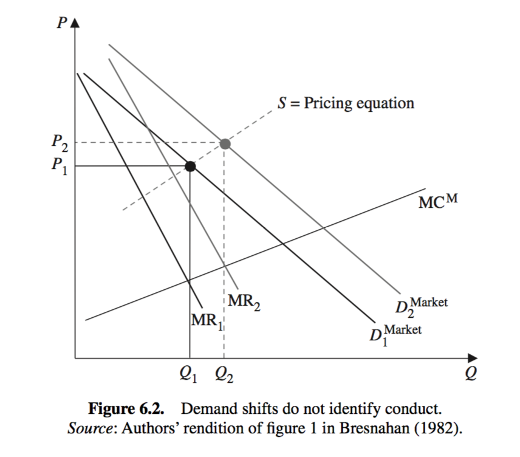

--- 
title: "ECON5630 Topics in Empirical Industrial Organization"
author: "Kohei Kawaguchi"
date: 'Last updated: `r Sys.Date()`'
output:
  pdf_document: default
  html_document:
    df_print: paged
bibliography:
- PhDIO3.bib
- packages.bib
description: Thie is a lecture note for ECON5630 at Hong Kong University of Science and Technology. 
documentclass: book
highlight: espresso
link-citations: yes
csl: plain.csl
site: bookdown::bookdown_site
---

# Syllabus

## Instructor Information

- Instructor:
    - Name: Kohei Kawaguchi (Sunada).
    - Office hour: LSK6070, by appointment.
- All questions related to the class have to be publicly asked on Discord rather than being privately asked in e-mail. The instructor usually does not reply in the evening, weekends, and holidays.

    

## General Information

### Class Time

- Date: Mon, Wed.
- Time: 9:00-10:50.
- Venue: G001, CYT Bldg.

### Description

- This is a PhD-level course for empirical industrial organization. This course covers various econometric methods used in industrial organization that is often referred to as the structural estimation approach. These methods have been gradually developed since 1980s in parallel with the modernization of industrial organization based on the game theory and now widely applied in antitrust policy, business strategy, and neighboring fields such as labor economics and international economics.

- This course presumes a good understanding of PhD-level microeconomics and microeconometrics. Participants are expected to understand at least UG-level industrial organization. This course requires participants to write programs mostly in R and sometimes in C++ to implement various econometric methods. In particular, all assignments will involve such a non-trivial programming task. Even though the understanding of these programming languages is not a prerequisite, a sharp learning curve will be required. Some experience in other programming languages will help. Audit without a credit is not admitted for students.


### Expectation and Goals

- The goal of this course is to learn and practice econometric methods for empirical industrial organization. The lecture covers the econometric methods that have been developed between 80s and 00s to estimate primitive parameters governing imperfect competition among firms,  such as production and cost function estimation, demand function estimation, merger simulation, entry and exit analysis, and dynamic decision models. The lecture also covers various new methods to recover model primitives in certain mechanisms such as auction, matching, network, and bargaining. The emphasis is put on the former group of methods, because they are the basis for other new methods. Participants will not only understand the theoretical background of the methods but also become able to implement these methods from scratches by writing their own programs. I will briefly discuss the latter class of new methods through reading recent papers. The participants will become able to understand and use these new methods.  

## Required Environment

- Participants should bring their laptop to the class. We have enough extension codes for students. The laptop should have sufficient RAM (at least $\ge$ 8GB, $\ge$ 16GB is recommended) and CPU power (at least Core i5 grade, Core i7 grade is recommended). Participants are fully responsible for their hardware issues. Operating System can be arbitrary. 
- Please install the following software by the first lecture. Technical issues related to the installment should be resolved by yourself, because it depends on your local environment. If you had an error, copy and paste the error message on a search engine, and find a solution. This solves 99.9% of the problems.
    - R: [https://www.r-project.org/](https://www.r-project.org/)
    - RStudio: [https://www.rstudio.com/](https://www.rstudio.com/)
    - LaTeX: 
        - MikTex [https://miktex.org/](https://miktex.org/)
        - TeXLive [https://www.tug.org/texlive/](https://www.tug.org/texlive/)
        - MacTeX [http://www.tug.org/mactex/](http://www.tug.org/mactex/)


## Evaluation

- Assignments (90): In total 9 homework are assigned. Each homework involves the implementation of the methods covered in the class. Each homework has 10 points. The working hour for each homework will be around 10-20 hours.
- Presentation (10): Toward the end of the semester, a paper in industrial organization is randomly assigned to each participant. Each participant makes a presentation within 20 pages and records 30 minutes presentation.
- Grading is based on the absolute scores: A+ with more than 90 points, A with more than 85 points, A- with more than 80 points, B+ with more than 70 points, B with more than 60 points, B- with more than 50 points and C otherwise. 


## Academic Integrity

Without academic integrity, there is no serious learning. Thus you are expected to hold the highest standard of academic integrity in the course. You are encouraged to study and do homework in groups. However, no cheating, plagiarism will be tolerated. Anyone caught
cheating, plagiarism will fail the course. Please make sure adhere to the HKUST Academic
Honor Code at all time (see http://www.ust.hk/vpaao/integrity/).


## Schedule

- Introduction to structural estimation, R and RStudio 
- Production function estimation I
- Production function estimation II
- Demand function estimation I
- Demand function estimation II
- Merger Analysis 
- Entry and Exit 
- Single-Agent Dynamics I 
- Single-Agent Dynamics II
- Dynamic Game I 
- Dynamic Game II 
- Auction 
- Recent topics
- Presentations 


## Course Materials

### Code

- The source file of the lecture note and assignments are available at [https://github.com/kohei-kawaguchi/EmpiricalIO](https://github.com/kohei-kawaguchi/EmpiricalIO).

### R and RStudio

- Grolemund, G., 2014, Hands-On Programming with R, O'Reilly.
    - Free online version is available: [https://rstudio-education.github.io/hopr/](https://rstudio-education.github.io/hopr/).
- Wickham, H., & Grolemund, G., 2017, R for Data Science, O'Reilly.
    - Free online version is available: [https://r4ds.had.co.nz/](https://r4ds.had.co.nz/).
- Boswell, D., & Foucher, T., 2011, The Art of Readable Code: Simple and Practical Techniques for Writing Better Code, O'Reilly.

### Handbook Chapters

- Ackerberg, D., Benkard, C., Berry, S., & Pakes, A. (2007). "Econometric tools for analyzing market outcomes". Handbook of econometrics, 6, 4171-4276.
- Athey, S., & Haile, P. A. (2007). "Nonparametric approaches to auctions". Handbook of
Econometrics, 6, 3847-3965.
- Berry, S., & Reiss, P. (2007). "Empirical models of entry and market structure". Handbook of Industrial Organization, 3, 1845-1886.
- Bresnahan, T. F. (1989). "Empirical studies of industries with market power". Handbook of
Industrial Organization, 2, 1011-1057.
- Hendricks, K., & Porter, R. H. (2007). "An empirical perspective on auctions". Handbook of
Industrial Organization, 3, 2073-2143.
- Matzkin, R. L. (2007). "Nonparametric identification". Handbook of Econometrics, 6, 5307-5368.
- Newey, W. K., & McFadden, D. (1994). "Large sample estimation and hypothesis testing". Handbook of Econometrics, 4, 2111-2245.
- Reiss, P. C., & Wolak, F. A. (2007). "Structural econometric modeling: Rationales and examples from industrial organization". Handbook of Econometrics, 6, 4277-4415.

### Books

- Train, K. E. (2009). Discrete Choice Methods with Simulation, Cambridge university press.
- Davis, P., & Garces, E. (2010). Quantitative Techniques for Competition and Antitrust Analysis, Princeton University Press.
- Tirole, J. (1988). The Theory of Industrial Organization, The MIT Press.

### Papers

- The list of important papers are occasionally given during the course.


```{r include=FALSE}
# automatically create a bib database for R packages
knitr::write_bib(c(
  .packages(), 'bookdown', 'knitr', 'rmarkdown'
), 'packages.bib')
```

<!--chapter:end:index.Rmd-->

# Introduction {#intro}

## What are structural models?

- An economic model is a mapping from exogenous variables (including shocks and parameters) to endogenous variables.
- This mapping is derived from a solution concept (optimality and equilibrium).
- The structural estimation approach starts from an economic model and derives an econometric model.
- The __structural-form__ of an economic model is the equilibrium condition for the endogenous variables given the exogenous variables.
- The __reduced-form__ of an economic model is the solution of the structural-form for the endogenous variables in terms of the exogenous variables.


## Example: Linear demand and supply model

- Consider a linear demand and supply model:
  \begin{align}
      Q_i^d = \alpha + \beta P_i + \gamma X_i + \epsilon_i \\
      Q_i^s = \delta + \theta P_i + \zeta Z_i + \nu_i
  \end{align}

- The parameters of the model are: $\alpha, \beta, \gamma, \delta, \theta, \zeta$
- The observed exogenous variables are: $X_i, Z_i$
- The unobserved exogenous variables (shocks) are: $\epsilon_i, \nu_i$ (assume standard deviations of 1 for simplicity and mutually i.i.d.)
- The endogenous variables are: $P_i, Q_i$
- The solution concept is the market clearing condition:
  \begin{align}
    &Q_i^d = Q_i^s \\
    &\Leftrightarrow \alpha + \beta P_i + \gamma X_i + \epsilon_i = \delta + \theta P_i + \zeta Z_i + \nu_i
  \end{align}
- So far this is the structural-form of the model.
- The solution is obtained by solving the endogenous variables for the exogenous variables:
  \begin{align}
    P_i = \frac{\alpha - \delta + \gamma X_i - \zeta Z_i + \epsilon_i - \nu_i}{\theta - \beta} \\
    Q_i = \frac{\alpha \theta - \beta \delta + \theta \gamma X_i - \beta \zeta Z_i + \theta \epsilon_i - \beta \nu_i}{\theta - \beta}
  \end{align}
- This is the mapping from the exogenous variables to the endogenous variables in the structural model.
- This is the reduced-form of the model.


## Ordinary-Least-Squares (OLS) estimation of the demand and supply model

- OLS is applied to the reduced-form of the model.
- The reduced-form model is represented by the following equation:
  \begin{align}
    P_i &= \pi_1 + \pi_2 X_i + \pi_3 Z_i + \sigma_1 \varepsilon_i\\
    Q_i &= \pi_4 + \pi_5 X_i + \pi_6 Z_i + \sigma_2 \upsilon_i
  \end{align}
- The parameters of the reduced-form model are: $\pi_0, \pi_1, \pi_2, \pi_3, \pi_4, \pi_5, \sigma_1, \sigma_2$ are related to the parameters of the structural-form model as follows:
  \begin{align}
    \pi_1 = \frac{\alpha - \delta}{\theta - \beta} \\
    \pi_2 = \frac{\gamma}{\theta - \beta} \\
    \pi_3 = \frac{-\zeta}{\theta - \beta} \\
    \pi_4 = \frac{\alpha \theta - \beta \delta}{\theta - \beta} \\
    \pi_5 = \frac{\theta \gamma}{\theta - \beta} \\
    \pi_6 = \frac{- \beta \zeta}{\theta - \beta} \\
    \sigma_1 = \frac{1}{\theta - \beta} \\
    \sigma_2 = \frac{\sqrt{\theta^2 + \beta^2}}{\theta - \beta}
  \end{align}
- Because the right-hand side of the reduced-form model only includes exogenous variables, the OLS estimators can consistently estimate the reduced-form parameters.
- From the known 6 reduced-form parameters $\pi_1, \pi_2, \pi_3, \pi_4, \pi_5, \pi_6$, we can recover 6 structural-form parameters $\alpha, \beta, \gamma, \delta, \theta, \zeta$.
- This is the original idea of OLS in the context of structural estimation.
- You may be concerned that the right-hand side of the reduced-form model may include some endogenous variables --- it's just because you have not fully solved the model.

## Maximum-Likelihood Estimation (MLE) of the demand and supply model


- The MLE is not very different from the above approach.
- We derive the reduced-form model.
- Then, under the distributional assumptions on the shocks, we can derive the likelihood function:
  \begin{align}
    L(\alpha, \beta, \gamma, \delta, \theta, \zeta) = \prod_{i=1}^n f(P_i, Q_i | X_i, Z_i)
  \end{align}
- The distributional assumptions on the shocks could be:
  \begin{align}
    \epsilon_i \sim N(0, 1) \\
    \nu_i \sim N(0, 1)
  \end{align}
- If the structural-form parameters could be identified by the OLS estimator, then the MLE estimator should also identify them because you have the same information with a stronger distributional assumption.

## Simulation-based (Simulated-Likelihood or Simulated-Method-of-Moments) methods 


- In the current example, the reduced-form model is analytically derived and the likelihood function is also analytically derived.
- However, in many cases, the reduced-form model is not analytically derived and the likelihood function is not analytically derived.
- Even in this case, if we can simulate the endogenous variables solving the equilibrium condition, we can use the simulation-based methods to estimate the parameters.
- For example, by simulating shocks $\epsilon_i$ and $\nu_i$ from the distributional assumptions, we can simulate the endogenous variables $P_i$ and $Q_i$.
- Then, we can approximate the likelihood function by the empirical distribution of the simulated data.
- Or, we can find parameters that minimize the distance between the observed and simulated endogenous variables.


## Two-Stage Least Squares (2SLS) estimation of the demand and supply model

- The OLS and ML estimators relied on the reduced-form model.
- The 2SLS estimator is a method to estimate the structural-form parameters of the equation of interest by representing the other equations in the reduced-form.
- Suppose that we are interested in estimating the structural-form parameters of the demand equation.
- The demand equation is:
  \begin{align}
    Q_i = \alpha + \beta P_i + \gamma X_i + \epsilon_i
  \end{align}
- The 2SLS estimator first runs the reduced-form model for the other equation:
  \begin{align}
    P_i = \pi_1 + \pi_2 X_i + \pi_3 Z_i + \sigma_1 \varepsilon_i
  \end{align}
- Then, the 2SLS estimator uses the predicted values of the endogenous variables from the reduced-form model for the supply equation to estimate the structural-form parameters of the demand equation.
- In this estimation, $Z_i$ is used as an instrument for $P_i$, which is an exogenous variable excluded from the demand equation.
- Instead, suppose that we are interested in estimating the structural-form parameters of the supply equation.
- The supply equation is:
  \begin{align}
    Q_i = \delta + \theta P_i + \zeta Z_i + \nu_i
  \end{align}
- The 2SLS estimator first runs the reduced-form model for the other equation:
  \begin{align}
    P_i = \pi_1 + \pi_2 X_i + \pi_3 Z_i + \sigma_1 \varepsilon_i
  \end{align}
- Then, the 2SLS estimator uses the predicted values of the endogenous variables from the reduced-form model for the demand equation to estimate the structural-form parameters of the supply equation.
- In this estimation, $X_i$ is used as an instrument for $P_i$, which is an exogenous variable excluded from the supply equation.

## Instrumental-Variables (IV) and Generalized Method of Moments (GMM) estimation of the demand and supply model

- The IV and GMM estimators rely on another representation of the economic model.
- It relies on the __moment condition__ of the economic model.
- In the current example, the moment condition is:
  \begin{align}
    & E[\epsilon_i | X_i, Z_i] = 0\\
    & E[\nu_i | X_i, Z_i] = 0
  \end{align}
- The IV and GMM estimators find the parameters that make the empirical-analogue of the moment condition zero.
- To compute the empirical-analogue of the moment condition, this time, we solve the equilibrium condition for the shocks (not for the endogenous variables).
- For example, for the demand equation, we solve the following equation for $\epsilon_i$:
  \begin{align}
    \epsilon_i &= Q_i - \alpha - \beta P_i - \gamma X_i\\
    \nu_i &= Q_i - \delta - \theta P_i - \zeta Z_i
  \end{align}
- Then, the right-hand side includes only observed variables and the parameters.
- Then, we can compute the implied shock from the data for candidate parameters as:
  \begin{align}
    \hat{\epsilon}_i &= Q_i - \hat{\alpha} - \hat{\beta} P_i - \hat{\gamma} X_i\\
    \hat{\nu}_i &= Q_i - \hat{\delta} - \hat{\theta} P_i - \hat{\zeta} Z_i
  \end{align}
- Then, we can compute the empirical-analogue of the moment condition:
  \begin{align}
    \frac{1}{n} \sum_{i=1}^n \hat{\epsilon}_i A(Z_i, X_i) = 0\\
    \frac{1}{n} \sum_{i=1}^n \hat{\nu}_i B(Z_i, X_i) = 0
  \end{align}
  where $A(Z_i, X_i)$ and $B(Z_i, X_i)$ are some known functions of the observed variables and the parameters.
- The IV and GMM estimators find the parameters that make the empirical-analogue of the moment condition zero.


## General Case

- In general, the structural-form model is represented by the following equation:
  \begin{align}
    f(Y_i, X_i, \epsilon_i, \theta) = 0
  \end{align}
  for endogenous variables $Y_i$, exogenous variables $X_i$, shocks $\epsilon_i$, and the parameters $\theta$.
- The reduced-form model is represented by the following equation:
  \begin{align}
    Y_i = g(X_i, \epsilon_i, \theta) = f_1^{-1}(X_i, \epsilon_i, \theta)
  \end{align}
  for exogenous variables $X_i$, shocks $\epsilon_i$, and the parameters $\theta$.
- We can apply OLS, ML, Simulated-Likelihood to this form.
- The moment condition is:
  \begin{align}
    E[h(Y_i, X_i, \theta) | X_i, \nu_i] = E[f_3^{-1}(Y_i, X_i, \theta) | X_i, \nu_i] = 0
  \end{align}
- We can apply IV and GMM to this form.
- Thus, structural estimation is a general framework to estimate the parameters of the economic model by transforming it in either form and applying the corresponding estimation method.


## Structural Estimation and Counterfactual Analysis

### Example

- @Igami2017 "Estimating the Innovator's Dilemma: Structural Analysis of Creative Destruction in the Hard Disk Drive Industry, 1981-1998"

- __Question__:
  - Does the "Innovator's Dilemma" [@Christensen1997] or the delay of innovation among incumbents exist?
  - Christensen argued that old winners tend to lag behind entrants even when introducing a new technology is not too difficult, with a case study of the HDD industry.
- Apple's smartphones vs. Nokia's feature phones
- Amazon vs. Borders
- Kodak's digital cameras
- If it exists, what is the reason for that?
- How do we empirically answer this question?

```{r, echo = FALSE, fig.cap = 'Figure 1 of Igam (2017)', out.width='80%', fig.asp = .75, fig.align = 'center'}
knitr::include_graphics("figuretable/Igam2017Fig1.png")
```


- __Hypotheses__:
- Identify potentially competing hypotheses to explain the phenomenon.
    1. Cannibalization: Because of cannibalization, the benefits of introducing a new product are smaller for incumbents than for entrants.
    1. Different costs: The incumbents may have higher costs for innovation due to organizational inertia, but at the same time they may have some cost advantage due to accumulated R&D and better financial access.
    1. Preemption: The incumbents have additional incentive for innovation to preempt potential rivals.
    1. Institutional environment: The impacts of the three components differ across different institutional contexts such as the rules governing patents and market size.
- Casual empiricists pick up their favorite factors to make up a story.
- Serious empiricists should try to separate the contributions of each factor from data.
- To do so, the author develops an economic model that explicitly incorporates the above-mentioned factors, while keeping the model parameters flexible enough to let the data tell the sign and size of the effects of each factor on innovation.

- __Economic model__:

- The time is discrete with finite horizon $t = 1, \cdots, T$.
- In each year, there is a finite number of firms indexed by $i$.
- Each firm is in one of the technological states:
\begin{equation}
s_{it} \in \{\text{old only, both, new only, potential entrant}\},
\end{equation}
where the first two states are for incumbents (stick to the old technology or start using the new technology) and the last two states are for actual and potential entrants (enter with the new technology or stay outside the market).
- In each year:
    - Pre-innovation incumbent ($s_{it} =$ old): exit or innovate by paying a sunk cost $\kappa^{inc}$ (to be $s_{i, t + 1} =$ both).
    - Post-innovation incumbent ($s_{it} =$ both): exit or stay to be both.
    - Potential entrant ($s_{it} =$ potential entrant): give up entry or enter with the new technology by paying a sunk cost $\kappa^{net}$ (to be $s_{i, t + 1} =$ new).
    - Actual entrant ($s_{it} =$ new): exit or stay to be new.
- Given the industry state $s_t = \{s_{it}\}_i$, the product market competition opens and the profit of firm $i$, $\pi_t(s_{it}, s_{-it})$, is realized for each active firm.
- As the product market competition closes:
    - Pre-innovation incumbents draw private cost shocks and make decisions: $a_t^{pre}$.
    - Observing this, post-innovation incumbents draw private cost shocks and make decisions: $a_t^{post}$.
    - Observing this, actual entrants draw private cost shocks and make decisions: $a_t^{act}$.
    - Observing this, potential entrants draw private cost shocks and make decisions: $a_t^{pot}$.
- This is a dynamic game. The equilibrium is defined by the concept of __Markov-perfect equilibrium__ [@Maskin1988].
- The representation of the competing theories in the model:
    - The existence of cannibalization is represented by the assumption that an incumbent maximizes the joint profits of old and new technology products. 
    - The size of cannibalization is captured by the shape of profit function.
    - The difference in the cost of innovation is captured by the difference in the sunk costs of innovation.
    - The preemptive incentive for incumbents is embodied in the dynamic optimization problem for each incumbent.

- __Econometric model__:

- The author then turns the economic model into an econometric model.
- This amounts to specifying which part of the economic model is observed/known and which part is unobserved/unknown.
- The author collects the data set of the HDD industry during 1977-99. 
- Based on the data, the author specifies the identities of active firms and their products and the technologies embodied in the products in each year to code their __state variables__.
- Moreover, by tracking the change in the state, the author codes their __action variables__.
- Thus, the state and action variables, $s_t$ and $a_t$. These are the __observables__.
- The author does not observe:
    - Profit function $\pi_t(\cdot)$.
    - Sunk cost of innovation for pre-innovation incumbents $\kappa^{inc}$.
    - Sunk cost of entry for potential entrants $\kappa^{net}$.
    - Private cost shocks.
- These are the __unobservables__.
- Among the unobservables, the profit function and sunk costs are the __parameters of interest__ and the private cost shocks are __nuisance parameters__ in the sense only the knowledge about the distribution of the latter is demanded. 

- __Identification__:

- Can we infer the unobservables from the observables and the restrictions on the distribution of observables by the economic theory?
- The profit function is identified from estimating the demand function for each firm's product, and estimating the cost function for each firm from using their price setting behavior.
- The sunk costs of innovation are identified from the conditional probability of innovation across various states. If the cost is low, the probability should be high.

- __Estimation__:
  
  - The identification established that in principle we can uncover the parameters of interest from observables under the restrictions of economic theory.
- Finally, we apply a statistical method to the econometric model and infer the parameters of interest.

- __Counterfactual analysis__:
  
  - If we can uncover the parameters of interest, we can conduct __comparative statics__: study the change in the endogenous variables when the exogenous variables including the model parameters are set differently. In the current framework, this exercise is often called the __counterfactual analysis__.

- What if there was no cannibalization?: 
  - An incumbent separately maximizes the profit from old technology and new technology instead of jointly maximizing the profits. Solve the model under this new assumption everything else being equal.
- Free of cannibalization concerns, 8.95 incumbents start producing new HDDs in the first 10 years, compared with 6.30 in the baseline.
- The cumulative numbers of innovators among incumbents and entrants differ only by 2.8 compared with 6.45 in the baseline.
- Thus cannibalization can explain a significant part of the incumbent-entrant innovation gap.
- What if there was no preemption?:
  - A potential entrant ignores the incumbents' innovations upon making entry decisions.
    - Without the preemptive motives, only 6.02 incumbents would innovate in the first 10 years, compared with 6.30 in the baseline.
    - The cumulative incumbent-entrant innovation gap widens to 8.91 compared with 6.45 in the baseline.
- The sunk cost of entry is smaller for incumbents than for entrants in the baseline.

- __Interpretations and policy/managerial implications__: 
- Despite the cost advantage and the preemptive motives, the speed of innovation is slower among incumbents due to the strong cannibalization effect.
- Incumbents that attempt to avoid the "innovator's dilemma" should separate the decision making between old and new sections inside the organization so that they can avoid the concern for cannibalization.

### Recap

- The structural approach in empirical industrial organization consists of the following components:
1. Research question.
1. Competing hypotheses.
1. Economic model.
1. Econometric model.
1. Identification.
1. Data collection.
1. Data cleaning.
1. Estimation.
1. Counterfactual analysis.
1. Coding.
1. Interpretations and policy/managerial implications.

- The goal of this course is to be familiar with the standard methodology to complete this process.
- The methodology covered in this class is mostly developed to analyze the standard framework of dynamic or oligopoly competition. 
- The policy implications are centered around competition policies.
- But the basic idea can be extended to different classes of situations such as auction, matching, voting, contract, marketing, and so on.
- Note that the depth of the research question and the relevance of the policy/managerial implications are the most important parts of the research.
- Focusing on the methodology in this class is to minimize the time allocated to less important issues and maximize the attention and time to the most valuable part in future research.
- Given a research question, what kind of data is necessary to answer the question? 
- Given data, what kind of research questions can you address? Which questions can be credibly answered? Which questions can be an over-stretch?
- Given a research question and data, what is the best way to answer the question? What type of problems can you avoid using the method? What is the limitation of your approach? How will you defend against possible referee comments? 
- Given a result, what kinds of interpretations can you credibly derive? What kinds of interpretations can be contested by potential opponents? What kinds of contributions can you claim?
- To address these issues is __necessary__ to publish a paper and it is __necessary__ to be familiar with the methodology to do so.

<!--chapter:end:01-intro.Rmd-->

# Production and Cost Function Estimation {#production}

## Motivations

- Estimating __production and cost functions__ of producers is the cornerstone of economic analysis.
- Estimating the functions includes to separate the contribution of observed inputs and the other factors, which is often referred to as the __productivity__.
- "What determines productivity?" [@Syverson2011]-type research questions naturally follow.
- The methods covered in this chapter are widely used across different fields.
- Some of them are variants from the standard methods.

### IO

- @Olley1996: 
    - How much did the deregulation in the U.S. telecommunication industry, in particular the divestiture of AT\&T in 1984, spurred the productivity growth of the incumbent, facilitated entries, and increased the aggregate productivity?
    - To do so, the authors estimate the plant-level production functions and productivity in the telecommunication industry.
- @Doraszelski2013a:
    - What is the role of R\&D in determining the differences in productivity across firms and the evolution of firm-level productivity over time?
    - To do so, the authors estimate the firm-level production functions and productivity of Spanish manufacturing firms during 1990s in which the transition probability of a productivity is a function of the R\&D activities.

### Development

- @Hsieh2009:
    - How large is the misallocation of inputs across manufacturing firms in China and India compared to the U.S? How will the aggregate productivity of China and India change if the degree of misallocation is reduced to the U.S. level?
    - To do so, the authors measure the revenue productivity of firms, which should be the same across firms within an industry if there were no distortion, and the measurement of the revenue productivity requires to estimate the production function.
    
- @Gennaioli2013:
    - What are the determinants of regional growth? Do geographic, institutional, cultural, and human capital factors explain the difference across regions?
    - To do so, the authors construct the data set that covers 74\% of the world's surface and 97\% of its GDP and estimate the production function in which the above mentioned factors could affect the productivity.


### Trade

- @Haskel2007:
    - Are there spillovers from FDI to domestic firms?
    - To do so, the authors estimate the plant-level production function of the U.K. manufacturing firms during 1973 and 1992 and study how the foreign presence in the U.K. affected the productivity.

- @Loecker2011:
    - Does the removal of trade barriers induces efficiency gain for producers?
    - To do so, the author estimate the production functions of Belgian textile industry during 1994-2002 in which the degree of trade protection can affect the productivity level.


### Management

- @Bloom2007:
    - How do management practices affect the firm productivity?
    - To do so, the authors first estimate the production function and productivity of manufacturing firms in developed countries, and then study how the independently measured management practices of the firms affect the estimated productivity.

- @Braguinsky2015:
    - How do changes in ownership affect the productivity and profitability of firms?
    - To do so, the authors estimate the production function for various outputs including the physical output, return on capital and labor, and the utilization rate, price level, using the cotton spinners data in Japan during 1896 and 1920.

### Education

- @Cunha2010:
    - How do childhood and schooling interventions "produce" the cognitive and non-cognitive skills of children?
    - To do so, the authors estimate the mapping from childhood and schooling interventions to children's cognitive and non-cognitive skills, the "production function" of childhood environment and education.


## Analyzing Producer Behaviors

- There are several levels of parameters that govern the behavior of firms:

- __Production function__

    - Add factor market structure.
    - Add cost minimization.

- $\rightarrow$ __Cost function__

    - Add product market structure.
    - Add profit maximization.

- $\rightarrow$ __Supply function (Pricing function)__
    
    - Combine cost and supply (pricing) functions.

- $\rightarrow$ __Profit function__


- Which parameter to identify?
- Primitive enough to be invariant to relevant policy changes.
    - e.g. If you conduct a policy experiment that changes the factor market structure, identifying cost functions is not enough.
- As reduced-form as possible among such specifications.
    - A reduced-form parameter usually can be rationalized by a class of underlying structural parameters and institutional assumptions. Thus, the analysis becomes robust to some misspecifications.
    - e.g. A non-parametric function $C(q, w)$ can represent a cost function of a producer who is not necessarily minimizing the cost. If we derive a cost function from a production function and a factor market structure, then the cost function cannot represent such a non-optimization behavior.

## Production Function Estimation

<!-- ### Output, Input, and Value-Added -->

<!-- - The __output__ is the quantity of a good produced and the __input__ is the quantity of a good consumed. -->
<!-- - If a good is defined, defining the output and input is straightforward. -->
<!-- - However, it is often the case that several goods are mixed up in the observation: -->
<!--     - 7 of 3cm iron nail and 10 of 7cm iron nail $\to$ 17 iron nails. -->
<!--     - 8 of 3cm iron nail made by Tom who has 10 years experience and 14 of 3cm iron nail made by Bob who started the job yesterday $\to$ 22 iron nails. -->
<!--     - 2 of Hair cut service by Alice who is in a mood and 3 not in a mood $\to$ 5 hair cut services. -->
<!-- - Distinguishing several goods is especially hard in the service sector. -->
<!--     - The output of a doctor. -->
<!--     - The output of a banker. -->
<!--     - The output of a supermarket. -->
<!--     - The output of google. -->
<!-- - We sometimes divide the revenue by the price and claim it as the quantity. -->
<!-- - When doing so, we implicitly assume: -->
<!--     - There is a class of goods that differs by one-dimensional quality. -->
<!--     - The quality is proportional to the price. -->
<!-- - The __value-added__ is the value added by labor and capital. -->
<!-- - For this to be well-defined, the production function satisfy some form of separability between labor and capital and other inputs. -->
<!-- - In the following, we assume that the output, input, and value-added are well-defined and well-measured.  -->


### Cobb-Douglas Specification as a Benchmark
- Most of the following argument carries over to a general model.
- For firm $j = 1, \cdots, J$ and time $t = 1, \cdots, T$, we observe output $Y_{jt}$, labor $L_{jt}$, and capital $K_{jt}$.
- We consider an asymptotic of $J \to \infty$ for a fixed $T$.
- Assume Cobb-Douglas production function:
\begin{equation}
Y_{jt} = A_{jt}  L_{jt}^{\beta_l} K_{jt}^{\beta_k},
\end{equation}
where $A_{jt}$ is firm $j$ and time $t$ specific unobserved heterogeneity in the model.
- Taking the logarithm gives:
\begin{equation}
y_{jt} = \beta_0 + \beta_l l_{jt} + \beta_k k_{jt} + \epsilon_{jt},
\end{equation}
where lowercase symbols represent natural logs of variables and $\ln(A_{jt}) = \beta_0 + \epsilon_{jt}$.
- This can be regarded as a first-order log-linear approximation of a production function.
- Linear regression model! May OLS work?


### Potential Bias I: Endogeneity

- $\epsilon_{jt}$ contains everything that cannot be explained by the observed inputs: better capital may be employed, a worker may have obtained better skills, etc.
- When the manager of a firm makes an input choice, she should have some information about the realization of $\epsilon_{jt}$.
- Thus, the input choice can be correlated with $\epsilon_{jt}$; for example under static optimization of $L_{jt}$ given $K_{jt}$:
\begin{equation}
L_{jt} = \Bigg[\frac{p_{jt}}{w_{jt}} \beta_l \exp^{\beta_0 + \epsilon_{jt}} K_{jt}^{\beta_k}\Bigg]^{\frac{1}{1 - \beta_l}}.
\end{equation}
- In this case, OLS estimator for $\beta_l$ is \textit{positively} biased, because when $\epsilon_{jt}$ is high, $l_{jt}$ is high and thus the increase in output caused by $\epsilon_{jt}$ is captured as if caused by the increase in labor input.
- The endogeneity problem was already recognized by @Marschak1944.

### Potential Bias II: Selection

- Firms freely enter and exit market. 
- Therefore, a firm that had low $\epsilon_{jt}$ is likely to exit.
- However, if firms have high capital $K_{jt}$, it can stay in the market even if the realization of $\epsilon_{jt}$ is very low.
- Therefore, conditional on being in the market, there is a \textit{negative} correlation between the capital $K_{jt}$ and $\epsilon_{jt}$.
- This problem occurs even if the choice of $K_{jt}$ itself is not a function of $\epsilon_{jt}$.

### How to Resolve Endogeneity Bias?

- Temporarily abstract away from entry and exit.
- The data is balanced.

1. Panel data.
1. First-order condition for inputs.
1. Instrumental variable.
1. Olley-Pakes approach and its followers/critics.

- @Griliches1998 is a good survey of the history up to Olley-Pakes approach.
- @Ackerberg2015 also offer a good survey and clarify problems and implicit assumptions in Olley-Pakes approach.

### Panel Data

- Assume that $\epsilon_{jt} = \mu_j + \eta_{jt}$, where $\eta_{jt}$ is uncorrelated with input choices up to period $t$:
\begin{equation}
y_{jt} = \beta_0 + \beta_l l_{jt} + \beta_k k_{jt} + \mu_j + \eta_{jt}.
\end{equation}
- Then, by differentiating period $t$ and $t - 1$ equations, we get:
\begin{equation}
y_{jt} - y_{j, t - 1}= \beta_l (l_{jt} - l_{j, t - 1}) + \beta_k (k_{jt} - k_{j, t - 1}) + (\eta_{jt} - \eta_{j, t - 1}).
\end{equation}
- Then, because $\eta_{jt} - \eta_{j, t - 1}$ is uncorrelated either with $l_{jt} - l_{j, t - 1}$ or $k_{jt} - k_{j, t - 1}$, we can identify the parameter.
- Problem:
    - Restrictive heterogeneity.
    - When there are measurement errors, fixed-effect estimator can generate higher biases than OLS estimator, because measurement errors more likely to survive first-difference and within-transformation.

### First-Order Condition for Inputs

- Use the first-order condition for inputs as the moment condition [@McElroy1987].
- Closely related to the cost function estimation literature.
- Need to specify the factor market structure and the nature of the optimization problem for a firm.
- Recently being center of attention again as one of the solutions to the "collinearity problem" discussed below.

### Instrumental Variable {#productioniv}

- Borrow the idea from the first-order condition approach that the input choices are affected by some exogenous variables.
- If we have instrumental variables that affect inputs but are uncorrelated with errors $\epsilon_{jt}$, then we can identify the parameter by an instrumental variable method.

- One candidate for the instrumental variables: __input prices__.
- Input price affect input decision.
- Input price is not correlated with $\epsilon_{jt}$ if the factor product market is competitive and $\epsilon_{jt}$ is an idiosyncratic shock to a firm.
- Problems:
    - Input prices often lack cross-sectional variation.
    - Cross-sectional variation is often due to unobserved input quality.

- Another candidate for the instrumental variables: __lagged inputs__.
- If $\epsilon_{jt}$ does not have auto-correlation, lagged inputs are not correlated with the current shock.
- If there are adjustment costs for inputs, then lagged inputs are correlated with the current inputs.
- Problem:
    - If $\epsilon_{jt}$ has auto-correlation, all lagged inputs are correlated with the errors: For example, if $\epsilon_{jt}$ is AR(1), $\epsilon_{jt} = \alpha \epsilon_{j, t - 1} + \nu_{j, t - 1} = \cdots \alpha^l \epsilon_{j, t - l} + \nu_{j, t - 1} + \cdots, \alpha^{l - 1} \nu_{j, t - l}$ for any $l$.


### Olley-Pakes Approach

- Exploit restrictions from the economic theory [@Olley1996].
- Write $\epsilon_{jt} = \omega_{jt} + \eta_{jt}$, where $\omega_{jt}$ is an anticipated shock and $\eta_{jt}$ is an ex-post shock.
- Inputs are correlated with $\omega_{jt}$ but not with $\eta_{jt}$
- The model is written as:
\begin{equation}
y_{jt} = \beta_0 + \beta_l l_{jt} + \beta_k k_{jt} + \omega_{jt} + \eta_{jt}.
\end{equation}
- OP use economic theory to derive a valid proxy for the anticipated shock $\omega_{jt}$.

### Assumption I: Information Set

- The firm's information set at $t$, $I_{jt}$, includes current and past productivity shocks $\{\omega_{j\tau}\}_{\tau = 0}^t$ but does not include future productivity shocks $\{\omega_{j\tau}\}_{\tau = t + 1}^{\infty}$.
- The transitory shocks $\eta_{jt}$ satisfy $\mathbb{E}\{\eta_{jt}|I_{jt}\} = 0$.


### Assumption II: First Order Markov

- Productivity shocks evolve according to the distribution:
\begin{equation}
p(\omega_{j, t + 1}|I_{jt}) = p(\omega_{j, t + 1}|\omega_{jt}), 
\end{equation}
and the distribution is known to firms and stochastically increasing in $\omega_{jt}$.
- Then:
\begin{equation}
\omega_{jt} = \mathbb{E}\{\omega_{jt}|\omega_{j, t - 1}\} + \nu_{jt},
\end{equation}
and:
\begin{equation}
\mathbb{E}\{\nu_{jt}|I_{j, t - 1}\} = 0,
\end{equation}
by construction.

### Assumption III: Timing of Input Choices

- Firms accumulate capital according to:
\begin{equation}
k_{jt} = \kappa(k_{j, t - 1}, i_{j, t - 1}),
\end{equation}
where investment $i_{j, t - 1}$ is chosen in period $t - 1$.
- Labor input $l_{jt}$ is non-dynamic and chosen at $t$.
- This assumption characterizes and distinguishes labor and capital.
- Intuitively, it takes a full period for new capital to be ordered, delivered, and installed.

### Assumption IV: Scalar Unobservable

- Firms' investment decisions are given by:
\begin{equation}
i_{jt} = f_t(k_{jt}, \omega_{jt}).
\end{equation}
- This assumption places strong implicit restrictions on additional firm-specific unobservables.
    - No __across firm__ unobserved heterogeneity in adjustment cost of capital, in demand and labor market conditions, or in other parts of the production function.
    - Okay with __across time__ unobserved heterogeneity.

### Assumption IV: Strict Monotonicity

- The investment policy function $f_t(k_{jt}, \omega_{jt})$ is strictly increasing in $\omega_{jt}$.
- This holds if the realization of higher $\omega_{jt}$ implies higher expectation for future productivity (Assumption III) and if the marginal product of capital is increasing in the expectation for future productivity.
- To verify the latter condition in a given game is often not easy.
 

### Two-step Approach: The First Step

- In the following, I suppress the index of $t$ from unknown functions for notational simplicity.
- Insert $\omega_{jt} = h(k_{jt}, i_{jt})$ to the original equation to get:
\begin{equation}
\begin{split}
y_{jt} &= \beta_l l_{jt} + \underbrace{\beta_0 + \beta_k k_{jt} + h(k_{jt}, i_{jt})}_{\text{unknown function of $k_{jt}$ and $i_{jt}$}} + \eta_{jt}\\
& \equiv \beta_l l_{jt} + \phi(k_{jt}, i_{jt}) + \eta_{jt}.
\end{split}
\end{equation}
- This is a __partially linear model__: see @Ichimura2007 for reference.
- Because $l_{jt}, k_{jt}$ and $i_{jt}$ are uncorrelated with $\eta_{jt}$, we can identify $\beta_l$ and $\phi(\cdot)$ by exploiting the moment condition:
\begin{equation}
\begin{split}
& \mathbb{E}\{\eta_{jt}|l_{jt}, k_{jt}, i_{jt}\} = 0\\
& \Leftrightarrow \mathbb{E}\{y_{jt} - \beta_l l_{jt} - \phi(k_{jt}, i_{jt}) |l_{jt}, k_{jt}, i_{jt}\} = 0.
\end{split}
\end{equation}
__if there is enough variation__ in $l_{jt}, k_{jt}$ and $i_{jt}$.
- This "if there is enough variation" part is actually problematic. Discuss later.
- Let $\beta_l^0$ and $\phi^0$ be the identified true parameters.
 


### Two-step Approach: The Second Step

- Note that:
\begin{equation}
\omega_{jt} \equiv \phi(k_{jt}, i_{jt}) - \beta_0 - \beta_k k_{jt}.
\end{equation}
- Therefore, we have:
\begin{equation}
\begin{split}
&y_{jt} - \beta_l^0 l_{jt} \\
&= \beta_0 + \beta_k k_{jt} + \omega_{jt} + \eta_{jt}\\
&= \beta_0 + \beta_k k_{jt} + g(\omega_{j, t - 1}) + \nu_{jt} + \eta_{jt}\\
&= \beta_0 + \beta_k k_{jt} + g[\phi^0(k_{j, t - 1}, i_{j, t - 1}) - (\beta_0 + \beta_k k_{j, t - 1})] + \nu_{jt} + \eta_{jt}.
\end{split}
\end{equation}
- $\nu_{jt}$ and $\eta_{jt}$ are independent of the covariates.
- This is a __multiple-index model__ with indices $\beta_0 + \beta_1 k_{jt}$ and $\beta_0 + \beta_1 k_{j, t - 1}$ where parameters of two indices are restricted to be the same: see @Ichimura2007 for reference.
- We can identify $\beta_0, \beta_k$ and $g$ by exploiting the moment condition:
\begin{equation}
\begin{split}
& \mathbb{E}\{\nu_{jt} + \eta_{jt}|k_{jt}, k_{j, t - 1}, i_{j, t - 1}\} = 0\\
& \Leftrightarrow \mathbb{E}\{y_{jt} - \beta_l^0 l_{jt} -  \beta_0 - \beta_k k_{jt} - g[\phi^0(k_{j, t - 1}, i_{j, t - 1}) - (\beta_0 + \beta_k k_{j, t - 1})] |k_{jt}, k_{j, t - 1}, i_{j, t - 1}\} = 0.
\end{split}
\end{equation}

### Identification of the Anticipated Shocks

- If $\phi, \beta_0, \beta_k$ are identified, then $\omega_{jt}$ is also identified by:
\begin{equation}
\omega_{jt} \equiv \phi(k_{jt}, i_{jt}) - \beta_0 - \beta_k k_{jt}.
\end{equation}

### Two-Step Estimation of @Olley1996.

- __First step__: Estimate $\beta_L$ and $\phi$ in :
\begin{equation}
\begin{split}
y_{jt} = \beta_l l_{jt} + \phi(k_{jt}, i_{jt}) + \eta_{jt}.
\end{split}
\end{equation}
by approximating $\phi$ with some basis functions, say, polynomials or splines:
\begin{equation}
\begin{split}
y_{jt} &= \beta_l l_{jt} +  \sum_{p = 1}^P \gamma_p \phi_p(k_{jt}, i_{jt}) +  \left[\phi(k_{jt}, i_{jt}) - \sum_{p = 1}^P \gamma_n \phi_n(k_{jt}, i_{jt})\right] + \eta_{jt}\\
& = \beta_l l_{jt} +  \sum_{p = 1}^P \gamma_p \phi_p(k_{jt}, i_{jt}) + \tilde{\eta}_{jt}
\end{split}
\end{equation}
where $P \to \infty$ when the sample size goes to infinity.
- e.g. second-order polynomial approximation:
\begin{equation}
\begin{split}
& \phi_1(k_{jt}, i_{jt}) = k_{jt}, \phi_2(k_{jt}, i_{jt}) = i_{jt}\\
& \phi_3(k_{jt}, i_{jt}) = k_{jt}^2, \phi_4(k_{jt}, i_{jt}) = i_{jt}^2\\
& \phi_5(k_{jt}, i_{jt}) = k_{jt} i_{jt}.
\end{split}
\end{equation}
- Once the basis functions are fixed, estimation is the same as the linear model.
- But the inference (the computation of the standard deviation) is difference, because of the approximation error.
- See @Chen2007 for reference.
- Let $\hat{\beta}_l$ and $\hat{\phi}$ be the estimates from the first step.
- __Second step__: Estimate $\beta_0$, $\beta_k$, and $g$ in:
\begin{equation}
\begin{split}
y_{jt} - \hat{\beta}_l l_{jt}& = \beta_0 + \beta_k k_{jt} + g[\hat{\phi}(k_{j, t - 1}, i_{j, t - 1}) - (\beta_0 + \beta_k k_{j, t - 1})] + \nu_{jt} + \eta_{jt}\\
&+ [\beta_l - \hat{\beta}_l] l_{jt}\\
&+ \left\{g[\phi(k_{j, t - 1}, i_{j, t - 1}) - (\beta_0 + \beta_k k_{j, t - 1})] - g[\hat{\phi}(k_{j, t - 1}, i_{j, t - 1}) - (\beta_0 + \beta_k k_{j, t - 1})]\right\}\\
& = \beta_0 + \beta_k k_{jt} + g[\hat{\phi}(k_{j, t - 1}, i_{j, t - 1}) - (\beta_0 + \beta_k k_{j, t - 1})] + \nu_{jt} + \tilde{\eta}_{jt}
\end{split}
\end{equation}
by approximating $g$ by some basis functions, say, polynomials or splines.

### From An Economic Models to An Econometric Model

- Starting from economic model with some unobserved heterogeneity, we reach some reduced-form model. 
- If the resulting model belongs to a class of econometric models whose identification and estimation are established, we can simply apply the existing methods.
 

### How to Resolve Selection Bias

- Use propensity score to correct selection bias: @Ahn1993.
- At the beginning of period $t$, after observing $\omega_{jt}$, firm $j$ decides whether to continue the business ($\chi_{jt} = 1$) or exit ($\chi_{jt} = 0)$.
- Assume that the difference between continuation and exit values is strictly increasing in $\omega_{jt}$.
- Then, there is a threshold $\underline{\omega}(k_{jt})$ such that:
\begin{equation}
\chi_{jt} = 
\begin{cases}
1 &\text{   if   } \omega_{jt} \ge \underline{\omega}(k_{jt})\\
0 &\text{   otherwise.}
\end{cases}
\end{equation}
- We can only observe firms that satisfy $\chi_{jt} = 1$.

### Correction in the First Step

- In the first step, we need no correction because:
\begin{equation}
\begin{split}
&\mathbb{E}\{y_{jt}|l_{jt}, k_{jt}, i_{jt}, \chi_{jt} = 1 \}\\
&=\beta_l l_{jt} + \phi(k_{jt}, i_{jt}) + \mathbb{E}\{\eta_{jt}|\chi_{jt} = 1\}\\
&= \beta_l l_{jt} + \phi(k_{jt}, i_{jt}).
\end{split}
\end{equation}
- Ex-post shock $\eta_{jt}$ is independent of continuation/exit decision.
Therefore, we can identify $\beta_l$ and $\phi(\cdot)$ as in the previous case.


### Correction in the Second Step I: The Source of Bias

- One the other hand, we need correction in the second step, because:
\begin{equation}
\begin{split}
&\mathbb{E}\{y_{jt} - \beta_l^0 l_{jt}|k_{jt},  k_{j, t - 1}, i_{j, t - 1}, \chi_{jt} = 1\} \\
&= \beta_0 + \beta_k k_{jt} + g[\phi^0(k_{j, t - 1}, i_{j, t - 1}) - (\beta_0 + \beta_k k_{j, t - 1})]\\
& + \mathbb{E}\{\nu_{jt} + \eta_{jt}| k_{jt}, i_{jt}, k_{j, t - 1}, l_{j, t - 1}, \chi_{jt} = 1\}\\
&= \beta_0 + \beta_k k_{jt} + g[\phi^0(k_{j, t - 1}, i_{j, t - 1}) - (\beta_0 + \beta_k k_{j, t - 1})]\\
& + \mathbb{E}\{\nu_{jt}| k_{jt}, k_{j, t - 1}, i_{j, t - 1} , \chi_{jt} = 1\}.
\end{split}
\end{equation}
and
\begin{equation}
\mathbb{E}\{\nu_{jt}| k_{jt}, k_{j, t - 1}, i_{j, t - 1}, \chi_{jt} = 1 \} \neq 0,
\end{equation}
since anticipated shock matters continuation/exit decision in period $t$.
 


### Correction in the Second Step II: Conditional Exit Probability

- Let's see that the conditional expectation:
\begin{equation}
\begin{split}
&\mathbb{E}\{\omega_{jt}| k_{jt},  k_{j, t - 1}, i_{j, t - 1}, \chi_{jt} = 1 \}\\
&=\mathbb{E}\{\omega_{jt}| k_{jt}, k_{j, t - 1}, i_{j, t - 1}, \omega_{jt} \ge \underline{\omega}(k_{jt}) \}\\
&=\int_{\underline{\omega}(k_{jt})} \omega_{jt} \frac{p(\omega_{jt}|\omega_{j, t - 1})}{\int_{\underline{\omega}(k_{jt})} p(\omega|\omega_{j, t - 1}) d\omega } d \omega_{jt}\\
&\equiv \tilde{g}(\omega_{j, t - 1}, \underline{\omega}(k_{jt})),
\end{split}
\end{equation}
is a function of $\omega_{j, t - 1}$ and $\underline{\omega}(k_{jt})$.
 


### Correction in the Second Step III: Invertibility in Threshold

- The propensity of continuation conditional on observed information up to period $t - 1$:
\begin{equation}
\begin{split}
P_{jt} &\equiv \mathbb{P}\{\chi_{jt} = 1|\mathcal{I}_{j, t - 1}\}\\
&= \mathbb{P}\{\omega_{jt} \ge \underline{\omega}(k_{jt}) |\mathcal{I}_{j, t - 1}\}\\
&= \mathbb{P}\{g(\omega_{j, t - 1}) + \nu_{jt} \ge \underline{\omega}[\kappa(k_{j, t - 1}, i_{j, t - 1})]|\mathcal{I}_{j, t - 1} \}\\
&= \mathbb{P}\{ \chi_{jt} = 1| i_{j, t - 1}, k_{j, t - 1}\}.
\end{split}
\end{equation}
- $\rightarrow$ It suffices to condition on $i_{j, t - 1}, k_{j, t - 1}$.
- We also have:
\begin{equation}
P_{jt} = \mathbb{P}\{\chi_{jt} = 1| \omega_{j, t - 1}, \underline{\omega}(k_{jt})\},
\end{equation}
and it is invertible in $\underline{\omega}(k_{jt})$, that is,
\begin{equation}
\underline{\omega}(k_{jt}) \equiv \psi(P_{jt}, \omega_{j, t - 1}).
\end{equation}
 


### Correction in the Second Step IV: Controlling the Threshold

- Now, he have:
\begin{equation}
\begin{split}
&\mathbb{E}\{y_{jt} - \beta_l^0 l_{jt}|k_{jt}, k_{j, t - 1}, i_{j, t - 1}, \chi_{jt} = 1\} \\
&= \beta_0 + \beta_k k_{jt} + \mathbb{E}\{\omega_{jt}| k_{jt}, k_{j, t - 1}, i_{j, t - 1} , \chi_{jt} = 1\}\\
&= \beta_0 + \beta_k k_{jt} + \tilde{g}(\omega_{j, t - 1}, \underline{\omega}(k_{jt}))\\
&= \beta_0 + \beta_k k_{jt} + \tilde{g}(\omega_{j, t - 1}, \psi(P_{jt}, \omega_{j, t - 1}))\\
&\equiv \beta_0 + \beta_k k_{jt} + \tilde{\tilde{g}}(\omega_{j, t - 1}, P_{jt})\\
&= \beta_0 + \beta_k k_{jt} + \tilde{\tilde{g}}[\phi^0(k_{j, t - 1}, i_{j, t - 1}) - (\beta_0 + \beta_k k_{j, t - 1}), P_{jt}].
\end{split}
\end{equation}
- At the end, the only difference is to include $P_{jt}$ as a covariate.
- $P_{jt}$ is a __known__ function of $i_{j, t - 1}$ and $k_{j, t - 1}$. 
- Even if we condition on $P_{jt} = p$, there are still many combinations of $i_{j, t - 1}$ and $k_{j, t - 1}$ that gives $P_{jt} = p$.
- With this remaining variation, we can identify $\beta_0$, $\beta_k$, and $\tilde{\tilde{g}}$ by the same argument as the case without selection, for each $P_{jt} = p$.

### Three Step Estimation of @Olley1996

- __Zero step__: Estimate the propensity score:
\begin{equation}
P_{jt} = 1\{\chi_{jt} = 1| i_{j, t - 1}, k_{j, t - 1}\},
\end{equation}
by a kernel estimator.
- Insert the resulting estimates $\widehat{P}_{jt}$ into the first and second steps.

### Zero Investment Problem

- One of the key assumptions in OP method was invertibility between anticipated shock and investment:
\begin{equation}
\omega_{jt} = i^{-1}(k_{jt}, i_{jt}) \equiv h(k_{jt}, i_{jt}).
\end{equation}
- However, in micro data, zero investment is a rule rather than exceptions.
- Then, the invertibility does not hold globally: there are some region of the anticipated shock in which the investment takes value zero. 
 

### Tackle Zero Investment Problem I: Discard Some Data

- Discard a data $(j, t)$ such that $i_{j, t - 1} = 0$.
- Use a data $(j, t)$ such that $i_{j, t - 1} > 0$.
- Then, invertibility recovers on this selected sample.
- This does not cause bias in the estimator because $\nu_{jt}$ in :
\begin{equation}
\beta_0 + \beta_l k_{jt} + g[\phi^0(k_{j, t - 1}, i_{j, t - 1}) - (\beta_0 + \beta_k k_{j, t - 1})] + \nu_{jt} + \eta_{jt},
\end{equation}
is independent of the event up to $t - 1$, including $i_{j, t - 1}$. 
- However, this causes information loss. The loss is high if the proportion of the sample such that $i_{j, t - 1} = 0$ is high.
 


### Tackle Zero Investment Problem II: Use Another Proxy

- Investment is just a possible proxy for the anticipated shock.
- Intermediate inputs can be used as proxies as well [@Levinsohn2003].
- The problem is that these intermediate inputs are included in the gross production function, whereas investment is excluded.
- Let $m_{jt}$ be the log material input, and assume that the production function takes the form of:
\begin{equation}
y_{jt} = \beta_0 + \beta_l l_{jt} + \beta_k k_{jt} + \beta_m m_{jt} + \omega_{jt} + \eta_{jt}.
\end{equation}
- In addition, assume that the __optimal policy function__ for $m_{jt}$ is strictly monotonic in the ex-ante shock, and hence is invertible:
\begin{equation}
m_{jt} = m(k_{jt}, \omega_{jt}) \Leftrightarrow \omega_{jt} = m^{-1}(m_{jt}, k_{jt}) \equiv h(m_{jt}, k_{jt}). (\#eq:material)
\end{equation}

- __First step__:
\begin{equation}
\begin{split}
y_{jt} &= \beta_0 + \beta_l l_{jt} + \beta_k k_{jt} + \beta_m m_{jt} + h(m_{jt}, k_{jt}) + \eta_{jt}\\
&= \beta_l l_{jt} + \phi(m_{jt}, k_{jt}) + \eta_{jt}.
\end{split}
\end{equation}
- We can identify $\beta_l$ and $\phi$ by exploiting the moment condition (you can include $i_{jt}$ if it is available):
\begin{equation}
\begin{split}
& \mathbb{E}\{\eta_{jt}|l_{jt}, m_{jt}, k_{jt}, i_{jt}\} = 0\\
& \Leftrightarrow \mathbb{E}\{y_{jt}  - \beta_l l_{jt} - \phi(m_{jt}, k_{jt}) |l_{jt}, m_{jt}, k_{jt}, i_{jt}\} = 0,
\end{split}
\end{equation}
if __there is enough variation__ in $l_{jt}, m_{jt}, k_{jt}$.
- __Second step__:
\begin{equation}
\begin{split}
&y_{jt} - \beta_l^0 l_{jt}\\
& = \beta_0 + \beta_k k_{jt} + \beta_m m_{jt} + g[\phi^0(m_{j, t - 1}, k_{j, t - 1}) - \beta_0 - \beta_k k_{j, t - 1} - \beta_m m_{j, t - 1}]\\
& + \nu_{jt} + \eta_{jt}.
\end{split}
\end{equation}
- We can identify $\beta_k$, $\beta_m$, and $g$ by exploiting the moment condition:
\begin{equation}
\begin{split}
\mathbb{E}\{\nu_{jt} + \eta_{jt} | k_{jt}, m_{j, t - 1}, k_{j,t - 1}\} = 0.
\end{split}
\end{equation}
- Because $m_{jt}$ is correlated with $\nu_{jt}$, the moment should not condition on $m_{jt}$.
- The identification of $\beta_{m}$ comes from $\beta_m m_{j, t - 1}$.
    
### One-step Estimation of @Olley1996 and @Levinsohn2003

- @Levinsohn2003 can be estimated in the similar two-step method.
- We can jointly estimate the parameters in first and second steps to improve the efficiency [@Wooldridge2009].
- We estimate under the assumptions of @Olley1996:
\begin{equation}
y_{jt} = \beta_0 + \beta_1 l_{jt} + \beta_k k_{jt} + \omega_{jt} + \eta_{jt}.
\end{equation}
- The first step exploits the following moment:
\begin{equation}
\mathbb{E}\{\eta_{jt}|l_{jt}, k_{jt}, i_{jt}\} = 0,
\end{equation}
that is:
\begin{equation}
\mathbb{E}\{y_{jt} - \beta_1 l_{jt} - \beta_0 - \beta_k k_{jt} - \omega(k_{jt}, i_{jt})|l_{jt}, k_{jt}, i_{jt}\} = 0. (\#eq:opfirst)
\end{equation}

- We can reinforce the moment condition as:
\begin{equation}
\mathbb{E}\{\eta_{jt}|l_{jt}, k_{jt}, i_{jt}, \cdots, l_{j1}, k_{j1}, i_{j1}\} = 0
\end{equation}
if we assume that lagged inputs are correlated with the current inputs and $\eta_{jt}$ is independent.
- The second step exploits the following moment:
\begin{equation}
\mathbb{E}\{\nu_{jt}|k_{jt}, i_{j, t - 1}, l_{j, t - 1}\} = 0,
\end{equation}
that is:
\begin{equation}
\mathbb{E}\{y_{jt} - \beta_0 - \beta_1 l_{jt} - \beta_k k_{jt} - g[\omega(k_{j,t - 1}, i_{j, t - 1})]|k_{jt}, i_{j, t - 1}, l_{j, t - 1}\} = 0. (\#eq:opsecond)
\end{equation}
- We can reinforce the moment condition as:
\begin{equation}
\mathbb{E}\{\nu_{jt}|k_{jt}, i_{j, t - 1}, l_{j, t - 1}, \cdots, k_{j1}, i_{j1}, l_{j1}\} = 0,
\end{equation}
if we assume that lagged input are correlated with the current inputs and $\nu_{jt} + \eta_{jt}$ are independent.
- We can construct a GMM estimator based on equations \@ref(eq:opfirst) and \@ref(eq:opsecond).
- The one-step estimator can be more efficient but can be computationally heavier than the two-step estimator.

### Scalar Unobservable Problem: Finite-order Markov Process 

- Borrow the idea of using the first-order condition to resolve the collinearity problem [@Gandhi2017a].
- We have assumed that anticipated shocks follow a first-order Markov process:
\begin{equation}
\omega_{jt} = g(\omega_{j, t - 1}) + \nu_{jt}.
\end{equation}
- However, it may be true that it has more than one lags, for example:
\begin{equation}
\omega_{jt} = g(\omega_{j, t - 1}, \omega_{j, t - 2}) + \nu_{jt}.
\end{equation}

- Then, we need proxies as many as the number of unobservables:
\begin{equation}
\begin{pmatrix}
i_{jt} \\ m_{jt} 
\end{pmatrix}
= \Gamma(k_{jt}, \omega_{jt}, \omega_{j, t - 1}),
\end{equation}
such that the policy function for the proxies is a bijection in $(\omega_{jt}, \omega_{j, t - 1})$.
- Then, we can have:
\begin{equation}
\omega_{jt} = \Gamma_1^{-1}(k_{jt}, i_{jt}, m_{jt}).
\end{equation}
- The reminder goes as in the standard OP method.


### Scalar Unobservable Problem: Demand and Productivity Shocks 

- There may be a demand shock $\mu_{jt}$ that also follows first-order Markov process.
- Then, the policy function depend both on $\mu_{jt}$ and $\omega_{jt}$.
- We again need proxies as many as the number of unobservable.
- Suppose that we can observe the price of the firm $p_{jt}$.
- Inverting the policy function:
\begin{equation}
\begin{pmatrix}
i_{jt}\\ p_{jt}
\end{pmatrix}
= \Gamma(k_{jt}, \omega_{jt}, \mu_{jt}).
\end{equation}
yields:
\begin{equation}
\omega_{jt} = \Gamma_1^{- 1}(k_{jt}, i_{jt}, p_{jt}).
\end{equation}
- If $\omega_{jt}$ only depends on $\omega_{j, t - 1}$ but not on $\mu_{j, t - 1}$, then the second step of the modified OP method is to estimate:
\begin{equation}
\begin{split}
y_{jt} - \hat{\beta}_l l_{jt} 
&= \beta_0 + \beta_k k_{jt}\\
& + g(\omega_{j, t - 1}) + \nu_{jt} + \eta_{jt}\\
&= \beta_0 + \beta_k k_{jt}\\
& + g(\hat{\phi}_{j, t - 1} - \beta_0 - \beta_k k_{j, t - 1}) + \nu_{jt} + \eta_{jt}.
\end{split}
\end{equation}
- It goes as in the standard OP method.
- If $\omega_{jt}$ depends both on $\omega_{j, t - 1}$ and $\mu_{j, t - 1}$, the second step regression equation will be:
\begin{equation}
\begin{split}
y_{jt} - \hat{\beta}_l l_{jt} 
&= \beta_0 + \beta_k k_{jt}\\
& + g(\omega_{j, t - 1}, \mu_{j, t - 1}) + \nu_{jt} + \eta_{jt}\\
&= \beta_0 + \beta_k k_{jt}\\
& + g(\hat{\phi}_{j, t - 1} - \beta_0 - \beta_k k_{j, t - 1}, \mu_{j, t - 1}) + \nu_{jt} + \eta_{jt}.
\end{split}
\end{equation}
- We still have to control $\mu_{j, t - 1}$ in the second step.
- Invert the policy function for $\mu_{j, t - 1}$ to get:
\begin{equation}
\mu_{j, t - 1} = \Gamma_2^{- 1}(k_{j, t - 1}, i_{j, t - 1}, p_{j, t - 1}),
\end{equation}
and plug it into the second step regression equation to get:
\begin{equation}
\begin{split}
&y_{jt} - \hat{\beta}_l l_{jt}\\
&= \beta_0 + \beta_k k_{jt}\\
&+g(\hat{\phi}_{j, t - 1} - \beta_0 - \beta_k k_{j, t - 1}, \Gamma_2^{- 1}(k_{j, t - 1}, i_{j, t - 1}, p_{j, t - 1})) + \nu_{jt} + \eta_{jt}.
\end{split}
\end{equation}
- The parameters $\beta_0$ and $\beta_k$ __cannot__ be identified only with this observation, because $\Gamma_2^{-1}$ is __unknown non-parametric__ function: it can mean any function of $(k_{j, t - 1}, i_{j, t - 1}, p_{j, t - 1})$.
- To estimate such a model, we jointly estimate the demand function along with the production function.
- At this point, we do not investigate it further because we have not yet learned how to estimate the demand function.
- For now just keep in mind that:
    - There has to be as many proxies as the dimension of the unobservable state variables.
    - It is okay that the unobservable state variable includes a demand shock.
    - It can be problematic when the unobservable demand shock affect the evolution of the anticipated productivity shock. 


### Collinearity Problem

- The collinearity problem is formally pointed out by @Ackerberg2015.
- This paper is finally published in 2015, but has been circulated since 2005.
- We assumed that $k_{jt}$ and $\omega_{jt}$ are state variables.
- Then the policy function for labor input should take the form of:
\begin{equation}
l_{jt} = l(k_{jt}, \omega_{jt}).
\end{equation}
- However, because $\omega_{jt} = h(i_{jt}, k_{jt})$, we have:
\begin{equation}
l_{jt} = l[k_{jt}, h(i_{jt}, k_{jt})] = \tilde{l}(i_{jt}, k_{jt}).
\end{equation}
- Therefore, in the first stage, we encounter a multicollinearity problem:
\begin{equation}
\begin{split}
y_{jt} &= \beta_0 + \beta_l \tilde{l}(i_{jt}, k_{jt}) + \phi(i_{jt}, k_{jt}) + \eta_{jt}\\
&\equiv \tilde{\phi}(i_{jt}, k_{jt}).
\end{split}
\end{equation}
- Thus, $\beta_l$ cannot be identified in the first step.
- The second step becomes:
\begin{equation}
y_{jt} = \beta_0 + \beta_l l_{jt} + \beta_k k_{jt} + g[\tilde{\phi}(i_{j, t - 1}, k_{j, t - 1}) - \beta_0 - \beta_l l_{j, t - 1} - \beta_k k_{jt}] + \nu_{jt} + \eta_{jt}
\end{equation}
- Because $l_{jt}$ is correlated with $\nu_{jt}$, moment can only condition on $l_{j, t - 1}$.
- However, conditioning on $k_{j, t - 1}$ and $i_{j, t - 1}$, again there is no remaining variation in $l_{j, t - 1}$.
- Therefore, $\beta_l$ cannot be identified either in the second step.
- __$\beta_l$ cannot be identified!__

### Tackle Collinearity Problem: Peculiar Assumptions

- To make Olley-Pakes/Levinsohn-Petrin approach workable, we need peculiar data generating process for $l_{jt}$.
- Consider Levinsohn-Petrin framework.
1. There is an optimization error in $l_{jt}$.
    - If it is not i.i.d over time, it becomes a state variable and enters to the policy for $m_{jt}$, violating the scalar unobserved heterogeneity assumption of $m_{jt}$.
    - If there is an optimization error for $m_{jt}$, this again violates the scalar unobserved heterogeneity assumption.
1. $k_{jt}$ is realized, $\omega_{jt}$ is observed,  $m_{jt}$ and $i_{jt}$ are determined, a new i.i.d. unexpected shock is observed, $l_{jt}$ is determined, and $\eta_{jt}$ is observed.
    - If it is not i.i.d over time, it becomes a state variable and enters to the policy for $m_{jt}$, violating the scalar unobserved heterogeneity assumption.
1. $k_{jt}$ is realized, an unexpected shock is observed,  $l_{jt}$ is determined, $\omega_{jt}$ is observed, $m_{jt}$ and $i_{jt}$ are determined, and $\eta_{jt}$ is observed (@Ackerberg2016 recommends this assumption).
    - In this case, the unexpected shock can be serially correlated, because it suffices to know $k_{jt}$, $i_{jt}$, $l_{jt}$ to decide $m_{jt}$. It does not have to predict the future unexpected shock based on the realization of the current shock because $m_{jt}$ is a static decision.
    - This changes the optimal policy function of $m_{jt}$ \@ref(eq:material) to:
    \begin{equation}
    m_{jt} = m(k_{jt}, \omega_{jt}, l_{jt}).
    \end{equation}
    - The first step:
    \begin{equation}
    \begin{split}
    y_{jt} &= \beta_0 + \beta_l l_{jt} + \beta_k k_{jt} + h(k_{jt}, m_{jt}, l_{jt}) + \eta_{jt}\\
    &= \psi(k_{jt}, m_{jt}, l_{jt}) + \eta_{jt}.\\
    \Rightarrow & \mathbb{E}\{y_{jt} - \psi(k_{jt}, m_{jt}, l_{jt})|k_{jt}, m_{jt}, l_{jt}\} = 0.
    \end{split}
    \end{equation}
    - The second step:
    \begin{equation}
    \begin{split}
    y_{jt} &= \beta_0 + \beta_l l_{jt} + \beta_k k_{jt} + g[\psi(k_{j, t - 1}, m_{j, t - 1}, l_{j, t - 1}) - \beta_0 - \beta_l l_{j, t - 1} - \beta_k k_{j, t - 1}] + \nu_{jt} + \eta_{jt}\\
    \Rightarrow & \mathbb{E}\{y_{jt} - \beta_0 - \beta_l l_{jt} - \beta_k k_{jt} - g[\psi(k_{j, t - 1}, m_{j, t - 1}, l_{j, t - 1}) - \beta_0 - \beta_l l_{j, t - 1} - \beta_k k_{j, t - 1}]|k_{j, t - 1}, i_{j, t - 1}, l_{j, t - 1}, m_{j, t - 1}\}
    \end{split}
    \end{equation}
    - $m_{jt}$ has to be excluded from the production function, i.e., it has to be a value-added production function. Otherwise, $\beta_m m_{jt}$ and $\beta_m m_{j, t - 1}$ appear in the second step. Because $m_{jt}$ is correlated with $\nu_{jt}$, the only hope is to vary $m_{j, t - 1}$. But there is no additional variation in $m_{j, t - 1}$ conditional on $k_{j, t - 1}$, $i_{j, t - 1}$, and $l_{j, t - 1}$.
    

### Tackle Collinearity Problem: Share Regression

- How to avoid the peculiar assumptions on shocks and timing of decisions?
- How to identify gross production function avoiding the third assumption by @Ackerberg2015?
- Return to the old literature using the first-order condition.
- Let $w_t$ be wage and $p_t$ be the product price.
- Assume that the factor market is competitive.
- Then, the first-order condition for profit maximization with respect to $L_{jt}$ is:
\begin{equation}
\begin{split}
&P_t F_L(L_{jt}, K_{jt})e^{\omega_{jt}} \mathbb{E} e^{\eta_{jt}} = w_t\\
&\Leftrightarrow \frac{P_t F_L(L_{jt}, K_{jt})e^{\omega_{jt}} \mathbb{E} e^{\eta_{jt}}}{F(L_{jt}, K_{jt}) } = \frac{w_t}{F(L_{jt}, K_{jt}) }\\
&\Leftrightarrow \frac{F_L(L_{jt}, K_{jt}) L_{jt}\mathbb{E} e^{\eta_{jt}}}{F(L_{jt}, K_{jt})  e^{\eta_{jt}}} = \frac{w_t L_{jt}}{P_t \underbrace{F(L_{jt}, K_{jt}) e^{\omega_{jt}} e^{\eta_{jt}}}_{Y_{jt}} },
\end{split}
\end{equation}
where the right hand side is expenditure share to the labor, which is observed.
- Furthermore, on the left hand side, we only have $\eta_{jt}$, which is independent of inputs.

- Let $s_{jt}$ be the log of expenditure share to the labor, and take a log of the previous equation gives:
\begin{equation}
\begin{split}
s_{jt} &= \log [F_L(L_{jt}, K_{jt}) L_{jt} \mathbb{E} e^{\eta_{jt}} / F(L_{jt}, K_{jt})] - \eta_{jt}\\
& = \log(\beta_l) + \ln \mathbb{E} e^{\eta_{jt}} - \eta_{jt}.
\end{split}
\end{equation}
- Remember that the coefficient in the Cobb-Douglas function is equal to the expenditure share.
- In general, share regression provides additional variation to identify the elasticity of anticipated production with respect to the labor.
Then we can follow the standard OP method to recover other parameters.

## Cost Function Estimation

### Cost Function: Duality 

- Given a function $y = F(x)$ such that:
    -  Add factor market structure.
    -  Add cost minimization.
- $\rightarrow$ There exists a unique __cost function__ $c = C(y, p)$:
    - __Positivity__: positive for positive input prices and a positive.
    - __Homogeneity__: homogeneous of degree one in the input prices.
    - __Monotonicity__: increasing in the input prices and in the level of output.
    - __Concavity__: concave in the input prices.

- Given a function $c = C(y, p)$ such that:
    - __Positivity__: positive for positive input prices and a positive.
    - __Homogeneity__: homogeneous of degree one in the input prices.
    - __Monotonicity__: increasing in the input prices and in the level of output.
    - __Concavity__: concave in the input prices.
- $\rightarrow$ There exists a unique production function $F(x)$ that yields $C(y, p)$ as a solution to the cost minimization problem:
\begin{equation}
C(y, p) = \min_{x} p'x \text{   s.t.   } F(x) \ge y.
\end{equation}
- If the latter condition holds, the function $C$ is said to be __integrable__.

- It is rare that you can find a closed-form cost function of a production function.
- It makes sense to start from cost function.
- The duality ensures that there is a one-to-one mapping between a class of cost function and a class of production function.
- If you accept competitive factor markets and cost minimization, identifying a cost function is equivalent to identifying a production function. 
- We used this idea in the last slides to identify the parameters regarding static decision variables.
- See @Jorgenson1986 for the literature in this topic up to the mid 80s.

### Translog Cost Function

- One of the popular specifications:
\begin{equation}
\begin{split}
\ln c &= \alpha_0 + \alpha_p' \ln p + \alpha_y \ln y + \frac{1}{2} \ln p' B_{pp} \ln p\\
& + \ln p' \beta_{py} \ln y + \frac{1}{2}\beta_{yy}(\ln y)^2.
\end{split}
\end{equation}
- It assumes that the first and second order elasticities are constant.
- A second-order (log) Taylor approximation of a general cost function.
 

### Translog Cost Function: Integrability

- Translog cost function is known to be integrable if the following conditions hold:
- __Homogeneity__: the cost shares and the cost flexibility are homogeneity of degree zero: $B_{pp}1 = 0$, $\beta_{py}'1 = 0$.
- __Cost exhaustion__: the sum of cost shares is equal to unity: $\alpha_p'1 = 1$, $B_{pp}'1 = 0$, $\beta_{py}'1 = 0$.
- __Symmetry__: the matrix of share elasticities, biases of scale, and the cost flexibility elasticity is symmetric:
\begin{equation}
\begin{pmatrix}
B_{pp} & \beta_{py}\\
\beta_{py}' & \beta_{yy}
\end{pmatrix}
=
\begin{pmatrix}
B_{pp} & \beta_{py}\\
\beta_{py}' & \beta_{yy}
\end{pmatrix}'.
\end{equation}
- __Monotonicity__: The matrix of share elasticities $B_{pp} + vv' - diag(v)$ is positive semi-definite.

### Two Approaches

1. Cost data approach.
    - Use accounting cost data.
    - It does not depend on behavioral assumption.
    - One can impose restrictions of assuming cost minimization.
    - The accounting cost data may not represent economic cost.

1. Revealed preference approach.
    - Assume decision problem for firms.
    - Assume profit maximization.
    - Reveal the costs from firm's equilibrium strategy.
    - It depends on structural assumptions.
    - It reveals the cost as perceived by firms.
 
### Cost Data Approach

- Estimating a cost function using cost data from accounting data.
- @McElroy1987 is one of the most flexible and robust frameworks.
- The approach is somewhat getting less popular in IO researchers.
- Recently, the approach is not popular among IO researchers.
- I \textit{conjecture} one of the reasons for this is that IO researchers believe cost data taken from accounting information does not capture all the costs firms face.
- However, it is good to know the classical literature because it sometimes gives a new insight.
- cf. @Byrne2015 : Propose a novel method to combine accounting cost data to estimate demand and cost function jointly without using instrumental variable approach.


### Revealed Preference Approach

- Another approach is to __reveal__ the marginal cost from firm's price/quantity setting behavior assuming it is maximizing profit.
    - Originates at @rosseEstimatingCostFunction1970.
    - A parameter affects economic agent's action.
    - Therefore, economic agent's action __reveals__ the information about the parameter.
    - See @Bresnahan1981 and @Bresnahan1989 for reference.
- We have shown that the assumption on the factor market and cost function minimization gives restriction on the cost parameters.
- We may further assume the product market structure and profit maximization to identify cost parameters.
- Example: In a competitive market, the equilibrium price is equal to the marginal cost. Therefore, the marginal cost is identified from prices.
- What if the competition is imperfect?


### Single-product Monopolist

- This approach requires researcher to specify the decision problem of a firm.
- Assume that the firm is a single-product monopolist.
- Let $D(p)$ be the demand function.
- Let $C(q)$ be the cost function.
- Temporarily, assume that we __know__ the demand function.
- We learn how to estimate demand functions in coming weeks.
- The only unknown parameter is the cost function.

- The monopolist solves:
\begin{equation}
\max_{p} D(p)p - C(D(p)).
\end{equation}
- The first-order condition w.r.t. $p$ for profit maximization is:
\begin{equation}
\begin{split}
&D(p) + pD'(p) - C'(D(p)) D'(p) = 0.\\
&\Leftrightarrow C'(D(p)) = \underbrace{\frac{D(p) + pD'(p)}{D'(p)}}_{\text{$p$ is observed and $D(p)$ is known.}}
\end{split}
\end{equation}
- This identifies the marginal cost \textit{at the equilibrium quantity}.
 

- To trace out the entire marginal cost function, you need a demand shifter $Z$ that changes the equilibrium: $D(p, Z)$.
\begin{equation}
C'(D(p, z)) = \frac{D(p, z) + pD'(p, z)}{D'(p, z)}
\end{equation}
- This identifies the marginal cost function \textit{at the equilibrium quantity when $Z = z$}.
- If the equilibrium quantities cover the domain of the marginal cost function when the demand shifter $Z$ moves around, then it identifies the entire marginal cost function.


### Unobserved Heterogeneity in the Cost Function

- Previously we did not consider any unobserved heterogeneity in the cost function.
- Now suppose that the cost function is given by:
\begin{equation}
C(q) = \tilde{C}(q) + q \epsilon + \mu,
\end{equation}
and $\epsilon$ and $\mu$ are not observed.
- Moreover, because it includes anticipated shocks, it is likely to be correlated with input decisions and hence the output.
 
- The first-order condition w.r.t. $p$ for profit maximization is:
\begin{equation}
\begin{split}
&D(p, z) + pD'(p, z) - [\tilde{C}'(D(p, z)) + \epsilon]D'(p, z) = 0.\\
&\Leftrightarrow \tilde{C}'(D(p, z))  = \frac{D(p, z) + pD'(p, z)}{D'(p,z)} - \epsilon.
\end{split}
\end{equation}
- Take the expectation conditional on $Z = z$: 
\begin{equation}
\tilde{C}'(D(p, z)) = \frac{D(p, z) + pD'(p, z)}{D'(p, z)} - \mathbb{E}\{\epsilon|Z = z\}.
\end{equation}
- If $Z$ and $\epsilon$ is independent, then the last term becomes zero and we can follow the same argument as before to trace out the marginal cost function.


### Multi-product Monopolist Case

- Demand for good $j$ is $D_j(p)$ given a price vector $p$.
- Cost for producing a vector of good $q$ is $C(q)$.
- Demand function is \textbf{known} but cost function is not known. 

- The monopolist solves:
\begin{equation}
\max_{p} \sum_{j = 1}^J p_j D_j(p) - C(D_1(p), \cdots, D_J(p)).
\end{equation}
- The first-order condition w.r.t. $p_i$ for profit maximization is:
\begin{equation}
\begin{split}
&D_i(p) +  \sum_{j = 1}^J p_j \frac{\partial D_j(p)}{\partial p_i} = \sum_{j = 1}^J \frac{\partial C(D_1(p), \cdots, D_J(p))}{\partial q_j} \frac{\partial D_j(p)}{\partial p_i}.\\
&= 
\begin{pmatrix}
\frac{\partial D_1(p)}{\partial p_i} & \cdots & \frac{\partial D_J(p)}{\partial p_i}
\end{pmatrix}
\begin{pmatrix}
\frac{\partial C(D_1(p), \cdots, D_J(p))}{\partial q_1}\\
\vdots\\
\frac{\partial C(D_1(p), \cdots, D_J(p))}{\partial q_J}
\end{pmatrix}
\end{split}
\end{equation}
 
- Summing up, the first-order condition w.r.t. $p$ is summarized as:
\begin{equation}
\begin{split}
&\begin{pmatrix}
 D_1(p) + \sum_{j = 1}^J p_j \frac{\partial D_j(p)}{\partial p_1}\\
 \vdots\\
 D_J(p) + \sum_{j = 1}^J p_j \frac{\partial D_j(p)}{\partial p_J}
\end{pmatrix} 
=
\begin{pmatrix}
\frac{\partial D_1(p)}{\partial p_1} & \cdots & \frac{\partial D_J(p)}{\partial p_1}\\
\vdots\\
\frac{\partial D_1(p)}{\partial p_J} & \cdots & \frac{\partial D_J(p)}{\partial p_J}
\end{pmatrix}
\begin{pmatrix}
\frac{\partial C(D_1(p), \cdots, D_J(p))}{\partial q_1}\\
\vdots\\
\frac{\partial C(D_1(p), \cdots, D_J(p))}{\partial q_J}
\end{pmatrix}\\
&\Leftrightarrow
\begin{pmatrix}
\frac{\partial C(D_1(p), \cdots, D_J(p))}{\partial q_1}\\
\vdots\\
\frac{\partial C(D_1(p), \cdots, D_J(p))}{\partial q_J}
\end{pmatrix} = 
\underbrace{\begin{pmatrix}
\frac{\partial D_1(p)}{\partial p_1} & \cdots & \frac{\partial D_J(p)}{\partial p_1}\\
\vdots\\
\frac{\partial D_1(p)}{\partial p_J} & \cdots & \frac{\partial D_J(p)}{\partial p_J}
\end{pmatrix}^{-1}  
\begin{pmatrix}
 D_1(p) + \sum_{j = 1}^J p_j \frac{\partial D_j(p)}{\partial p_1}\\
 \vdots\\
 D_J(p) + \sum_{j = 1}^J p_j \frac{\partial D_j(p)}{\partial p_J}
\end{pmatrix}.}_{\text{$p$ is observed and $D(p)$s are known.}}
\end{split}
\end{equation} 
- Hence, the cost function is identified.
- Including unobserved heterogeneity in the cost function causes the same problem as in the previous case.
 
### Oligopoly

- There are firm $j = 1, \cdots, J$ and they sell product $j = 1, \cdots, J$, that is, firm = product (for simplicity). 
- Consider a price setting game. When the price vector is $p$, demand for product $j$ is given by $D_j(p)$.
- The cost function for firm $j$ is $C_j(q_j)$.

- Given other firms' price $p_{-j}$, firm $j$ solves:
\begin{equation}
\max_{p_j} D_j(p) p_j - C_j(D_j(p)).
\end{equation}
- The first-order condition w.r.t. $p_j$ for profit maximization is:
\begin{equation}
\begin{split}
&D_j(p) + \frac{\partial D_j(p)}{\partial p_j} p_j = \frac{\partial C_j(D_j(p))}{\partial q_j} \frac{\partial D_j(p)}{\partial p_j}.\\
&\frac{\partial C_j(D_j(p))}{\partial q_j} = \underbrace{\frac{\partial D_j(p)}{\partial p_j}^{-1}[D_j(p) + \frac{\partial D_j(p)}{\partial p_j} p_j ]}_{\text{$p$ is observed and $D_j(p)$ is known}}.
\end{split}
\end{equation}
- In Nash equilibrium, these equations jointly hold for all firms $j = 1, \cdots, J$.]
- Including unobserved heterogeneity in the cost function causes the same problem as in the previous case.
 
 

<!--chapter:end:02-production.Rmd-->

# Demand Function Estimation {#demand}

## Motivations

- From demand function and utility maximization assumption, we can reveal the preference of the decision maker.
- Thus, estimating demand function is necessary for __evaluating the consumer welfare__.
- In IO, estimating the __price elasticity of demand__ is specifically important, because it determines the __market power__ of a monopolist and the size of the dead-weight loss.
- In macroeconomics, estimating demand is in important to determine the __price level__, because the price level is the minimum expenditure for a consumer to achieve the certain level of utility.
- In marketing, estimating demand is necessary to design the optimal pricing, advertising, and all the other marketing interventions.
- In principle, the theory can be applied to whatever decisions other than the consumer choice.


- @Nevo2000c:
    - How do the hypothetical mergers in the ready-to-eat cereal industry affect the market price, markup, and consumer surplus?
    - To do so, the authors estimate the demand for ready-to-eat cereals and the cost functions for each product. Then, the authors conduct counterfactual simulations of mergers to quantify the effects.
- @Chung2002:
    - To what extent do firms go abroad to access technology available in other locations?
    - To study this issue, the authors estimate the firms' locational choice when going abroad.
- @Rysman2004:
    - In Yellow pages, how do consumers evaluate the advertisement on it, and how do advertisers value consumer usage?
    - To study this, the author simultaneously estimate the consumer demand for usage of a directory, advertiser demand for advertising, and a publisher's first-order condition.
- @Gentzkow2004:
    - Are online and print newspapers substitutes or complements?
    - To study this, the author estimate a demand function in which online and print newspapers can be either substitutes or complements.
- @Bayer2007:
    - How is the preference of people for schools and neighborhoods? How is this capitalized into housing prices?
    - To do so, the authors estimate the discrete choice of residents over locations. To deal with the endogeneity between the neighborhood and the unobserved attributes of the location, the authors use the discontinuity at the school attendance zone.
- @Archak2011:
    - How does the information embedded in product reviews the consumer choice?
    - To study this, the authors estimate the discrete choice model of consumers in which the text information from the product reviews are included as the product attributes.
- @Holmes2011:
    - Wal-Mart maintain high store density. How large is the economy of density and the sales cannibalization?
    - To study this, the author first estimate the demand function across neighborhood Wal-Mart to capture the sales cannibalization, and then estimate the cost structure from their entry and exit behaviors.
- @Handbury2014:
    - Urban and rural areas differ in available products. How does the price difference change if the heterogeneity in the product availability is incorporated?
    - To do so, the authors estimate the demand function at each location, and the construct the spatial price index based on the available products at each location.

## Analyzing Consumer Behaviors

- __Alternative set__.
- __Utility function__.
    - Add system of __choice sets__.
    - Aad utility maximization.
- $\rightarrow$ __Demand function__.

- In case of producer behavior, there was a chance to directly observe the output of the most primitive function, the production function.
- In case of consumer behavior, we never directly observe the output of the most primitive function, the utility function.
- We can at most identify demand functions.
- __Revealed preference theory__: 
    - @Samuelson1938, @Houthakker1950, @Richter1966, @Afriat1967, @Varian1982.
    - If the demand function is derived from a preference by maximizing the preference, the demand function should satisfy some restrictions.
    - If the assumption is true, we can recover part of the preference from the demand function.

## Continuous Choice

- The alternative set $\mathcal{X}$ is a subset of $\mathbb{R}^J$.
- The utility function $u$ is rational, monotone, and continuous on $\mathcal{X}$.
- The choice sets are given by a system of __linear budget set__:
$$
\mathcal{B}(p, w) = \{q \in \mathcal{X}: p \cdot q \le w\}.
$$
- If choice sets are non-linear, the following duality approach needs to be modified.

### Duality between Utility and Expenditure Functions

- It is rather a special case that we can derive a closed form solution to a utility maximization problem.
- We can use the first-order conditions as moment conditions for identification.
\begin{equation}
\frac{\partial u(q)}{\partial q_i} = \lambda p_i, i = 1, \cdots, J.
\end{equation}
- The derivation of a demand function from the identified utility function in general require a numerical simulation, which can be bothering.
- As well as the duality between production and cost functions, we have the same duality theorem for utility and expenditure functions.
- There is a one-to-one mapping between a class of utility functions and a class of expenditure functions.
- Therefore, it is okay to start from an expenditure function.
- It is rare that we can recover the utility function associated with an expenditure function in a closed form. But it is not often required for analysis.
- Moreover, we can easily derive other important functions from the expenditure functions.
- Let $p$ be the price vector and $u$ be the target utility level.
- Let $u(q)$ be a utility function.
- An expenditure function associated with the utility function is defined by:
\begin{equation}
e(u, p) = \min_{q} p \cdot q, u(q) \ge u.
\end{equation}
- Let $x$ be the total expenditure such that:
\begin{equation}
x = e(u, p).
\end{equation}
- We can start the analysis by specifying this function instead of the utility function.

### Deriving Other Functions

- It is easy to derive other functions from an expenditure function.
- __Indirect utility function__: invert the expenditure function to get:
\begin{equation}
u = e^{-1}(p, x) \equiv v(p, x).
\end{equation}
- __Hicksian demand function__: apply Shepard's lemma: 
\begin{equation}
q_i = \frac{\partial e(u, p)}{\partial p_i} \equiv h_i(u, p).
\end{equation}
- __Marshallian demand function__: insert Hicksian demand function to the expenditure function:
\begin{equation}
q_i = h_i(v(p, x), p) \equiv d_i(p, x).
\end{equation}


### Starting from an Indirect Utility Function

- It is almost equivalent to start from an indirect utility function.
- An indirect utility function with the utility function is defined by:
\begin{equation}
v(p, x) \equiv \max_{q} u(q), p'q \le x.
\end{equation}
- We can derive Marshallian demand function by Roy's identity:
\begin{equation}
q_i = \frac{- \partial v(p, x)/\partial p_i}{\partial v(p, x)/\partial x} \equiv d_i(p, x).
\end{equation}

### Expenditure Share Equation

- Let's start from an expenditure function $e(p, x)$. 
- By Shepard's lemma, we have:
\begin{equation}
\frac{\partial \ln e(u, p)}{\partial \ln p_i} = \frac{\partial e(u, p)}{\partial p_i} \frac{p_i}{e(u, p)} = \frac{p_i q_i}{x} \equiv w_i.
\end{equation}
- We call this an expenditure share equation.
- The estimation is based on the share equations.


### Almost Ideal Demand System (AIDS)

- Based on @Deaton1980. 
- See @AngusDeaton1980 for further reference.
- Consider an expenditure function that satisfies the following useful conditions:
    - It allows aggregation (this motivation is less important in recent days).
    - It gives an arbitrary first-order approximation to any demand system.
    - It can satisfy the restrictions of utility maximization.
    - It can be used to test the restrictions of utility maximization.

### PIGLOG Class

- PIGLOG (price-independent generalized logarithmic) class [@Muellbauer1976].
\begin{equation}
\ln e(u, p) = (1 - u) \ln a(p) + u\ln b(p),
\end{equation}
where $a(p)$ and $b(p)$ are arbitrary linear homogeneous concave functions. 
- Consider households that differ in total income.
- PIGLOC form ensures that the aggregate demand can be written in the same form where the total income is replaced with the sum of household total income.
- The derivatives should be given free parameters for the model to be an arbitrary first-order approximation to any demand system.
- In AIDS, we specify $a(p)$ and $b(p)$ as:
\begin{equation}
\begin{split}
\ln a(p) &\equiv a_0 + \sum_{k} \alpha_k \ln p_k + \frac{1}{2}\sum_{k} \sum_{j} \gamma_{kj}^* \ln p_k \ln p_j\\
\ln b(p) &\equiv \ln a(p) + \beta_0  \prod_{k} p_k^{\beta_k}.
\end{split}
\end{equation}


### Derive the Share Equation I

- By Roy's identify, we can derive the associated share equation:
\begin{equation}
w_i \equiv \frac{\partial \ln e(u, p)}{\partial \ln p_i} = \alpha_i + \sum_{j} \gamma_{ij} \log p_j + \beta_i u \beta_0 \prod_{k} p_k^{\beta_k},
\end{equation}
where
\begin{equation}
\gamma_{ij} = \frac{1}{2}(\gamma_{ij}^* + \gamma_{ji}^*).
\end{equation}

### Derive the Share Equation II

- Insert indirect utility function $u = v(p, x)$ to this to get:
\begin{equation}
w_i = \alpha_i + \sum_{j} \gamma_{ij} \ln p_j + \beta_i \ln \frac{x}{P},
\end{equation} 
where
\begin{equation}
\ln P \equiv  \alpha_0 + \sum_{k} \alpha_k \ln p_k + \frac{1}{2} \sum_{j} \sum_{k} \gamma_{kj} \ln p_k \ln p_j.
\end{equation}
- $P$ is a price index associated with the given preference.
- With the specification of @RichardStone1954, it becomes $\ln P = \sum_{j} x_j \ln p_j$. 
- It can be used as an approximation.


### Specify the Detail II

- It can satisfy the restrictions of utility maximization.
- It can be used to test the restrictions of utility maximization.
    - $\sum_{j} x_j = 1$:
\begin{equation}
\sum_{j} \alpha_j = 1, \sum_{j} \gamma_{jk} = 0, \sum_{j} \beta_j = 0.
\end{equation}
    - $e(u, p)$ is linear homogeneous in $p$:
\begin{equation}
\sum_{j} \gamma_{ij} = 0.
\end{equation}
    - Symmetry:
\begin{equation}
\gamma_{ij} = \gamma_{ji}.
\end{equation}


### Estimation

- We can estimate parameters based on the share equations.
- If we use aggregate data, the aggregate error term is correlated with the price vector.
- Therefore, we need at least as many instrumental variables as the dimension of the price vector.
- With valid instrumental variables, we can estimate the model with GMM.
- If we use household-level data, the household-specific errors controlling for aggregate errors will not be correlated with the price vector if the price is determined in a competitive market.


### From Product Space Approach to Characteristics Space Approach

- The framework up to here is called __product space approach__ because the utility has been defined over a product space.
- When there are $J$ goods, there are $J^2$ parameters for prices.
- One way to resolve this issue is to introduce a priori knowledge about the preference.
- For example, we can introduce a priori segmentation with separability.
- It is hard to evaluate the effect of introducing new product.
- Again, we have to a priori decide which segment/product is similar to the new product.
- This leads us to the __characteristics space approach__ [@Lancaster1966; @Muth1966]:
    - Consumption is an activity in which goods are inputs and in which the output is  a collection of characteristics.
    - Utility ranks collections of characteristics and only to rank collections of goods indirectly through the characteristics that they possesses.
    - There are $k = 1, \cdots, K$ activities.
    - The activity $y$ requires to consume $x = A y$ products.
    - The activity $y$ generates $z = B y$ characteristics.
    - The budget constraint is $p \cdot x \le 1$.
    - The utility is defined over the characteristics $u(z)$.
    - The consumer's problem is:
    $$
    \max_y u(z)
    $$
    s.t. 
    $$
    p \cdot x \le 1, x = Ay, z = By, x, y, z \ge 0.
    $$
- Then, only the dimension of characteristics matters and the value of new products can be evaluated by the contribution to the production of characteristics.
- The early application includes @Rosen1974, @Muellbauer1974, @Gorman1980.
- The nonparametric analysis based on the reveals preference is @Blow2008.

### From Continuous Choice Approach to Discrete Choice Approach

- The aggregate demand is a collection of choice across consumers and within consumers over time.
- It makes sense to model individual choices and then aggregate rather than directly modeling the aggregate demand.
- The resulting aggregate demand will satisfy restrictions that are consistent with the underlying consumer choice model.
- If there is an interaction across choices, the aggregation is not trivial. 
- This is especially true when aggregating choices within consumers. 
- For now, assume that each choice is independent.

## Discrete Choice

### Discrete Choice Approach

- Let $u(q, z_i)$ be the utility of a consumer over $J + 1$ dimensional consumption bundle $q$ characterized by consumer characteristics $z_i$.
- The consumer solves:
\begin{equation}
V(p, y_i, z_i) = \max_{q}u(q, z_i), \text{   s.t.   } p'q \le y_i.
\end{equation}
- Alternative $0$ is an __outside good__.
- Normalize $p_0 = 1$.
- We call alternatives $j = 1, \cdots, J$ __inside goods__.
- The choice space is restricted on:
\begin{equation}
\begin{split}
Q = \{q:& q_0 \in [0, M], q_j \in \{0, 1\}, j = 1, \cdots, J,\\
& q_j q_k = 0, \forall j \neq k, j, k > 0, M < \infty\}.
\end{split}
\end{equation}


### Discrete Choice Approach

- The budget constraint reduces to:
\begin{equation}
\begin{cases}
q_0 + p_j q_j = y &\text{   if   } q_j = 1, j > 0\\
q_0 = y &\text{   otherwise}.
\end{cases}
\end{equation}
- Hence, 
\begin{equation}
q_0 = y - \sum_{j = 1}^J p_j q_j.
\end{equation}


### Discrete Choice Approach

- The utility maximization problem can be written as:
\begin{equation}
V(p, y_i, z_i) = \max_{j = 0, 1, \cdots, j}  v_j(p_j, y_i, z_i),
\end{equation}
where
\begin{equation}
\begin{split}
&v_j(p_j, y_i, z_i)\\
& =
\begin{cases}
u(y_i - p_j, 0, \cdots, \underbrace{1}_{q_j}, \cdots, 0, z_i) &\text{   if  }j > 0,\\
u(y_i, 0, \cdots, 0, z_i) &\text{   if   }j = 0,
\end{cases}
\end{split}
\end{equation}
is called the __choice-specific indirect utility__.


### Characteristics Space Approach

- Preference is defined over the characteristics of alternatives, $x_j$:

- Car: vehicle, engine power, model-year, car maker, etc.
- PC: CPU power, number of cores, memory, HDD volume, etc.

- The choice-specific indirect utility is a function of the characteristics of the alternative:
\begin{equation}
\begin{split}
v_j(p_j, y_i, z_i) &=u(y_i - p_j, 0, \cdots, \underbrace{1}_{q_j}, \cdots, 0, z_i)\\
&= u^*(y_i - p_j, x_j, z_i)\\
&\equiv v(p_j, x_j, y_i, z_i).
\end{split}
\end{equation}


### Weak Separability and Income Effect

- We usually focus on a particular product category such as cars, PCs, cereals, detergents, and so on.
- Assume that the preference is separable between the category in question (__inside goods__) and other categories (__outside goods__).
- $u(q) = u[q_I, v(q_O)]$:
    - $q_I$: the consumption vector of inside goods.
    - $q_O$: the consumption vector of outside goods.
    - Increasing in $v_O = v(q_O)$.
- $p = (p_I, p_O)$.
    - $p_I$: the price vector of inside goods.
    - $p_O$: the price vector of outside goods.
- When $y_O$ is left for the outside goods, the conditional demand for the outside goods $q_O(y_O, p_O)$ exists.
- Inserting this into the utility function gives:
\begin{equation}
u\{q_I, v[q_O(y_O, p_O)]\} \equiv \tilde{u}(q_I, y_O; p_O).
\end{equation}


### Weak Separability and Income Effect 

- Thus, how the preference for the outside good is modeled determines how the individual income affects the choice.
\begin{equation}
\begin{split}
&u(y_i - p_j, x_j, z_i) = \tilde{u}(x_j, z_i) + \alpha(y_i - p_j).\\
&u(y_i - p_j, x_j, z_i) = \tilde{u}(x_j, z_i) + \alpha \ln (y_i - p_j).
\end{split}
\end{equation}
- In the first example, the income level does not affect the choice because the term $\alpha y_i$ is common and constant across choices (there is no income effect).
- We often do not observe income of a consumer, $y_i$. 
- Remember that the price of a product enters because we here consider __indirect__ utility function.


### Utility Function Normalization

 - The __location__ of utility function is often normalized by setting:
\begin{equation}
u(y^*, 0, \cdots, 0, z^*) = 0,
\end{equation}
for certain choice of $(y^*, z^*)$.
 


### Aggregation of the Individual Demand

- Let $q(p, x, y_i, z_i) = \{q_j(p, x, y_i, z_i)\}_{j = 0, \cdots, J}$ be the demand function of consumer $i$, that is:
\begin{equation}
q_j(p, x, y_i, z_i) = 1 \Leftrightarrow j = \text{argmax}_{j = 0, 1, \cdots, j}  v(p_j, x_j, y_i, z_i).
\end{equation}
- Let $f(y, z)$ be the joint distribution of the income and other consumer characteristics.
- The aggregate demand for good $j$ is:
\begin{equation}
\sigma_j(p, x) \equiv N \int  q_j(p, x, y, z) f(y, z) dy dz,
\end{equation}
where $N$ is the population.

### Horizontal Product Differentiation

- __horizontal product differentiation__: consumers do not agree on the ranking of the choices.
- There are two convenience stores $j = 1, 2$ on a street $[0, 1]$.
- Let $z_i$ be the location of consumer $i$ and $x_j$ be the location of the choice on a street $[0, 1]$ with $x_1 < x_2$.
- A consumer has a preference such that:
\begin{equation}
v_{ij} \equiv v(p_j, x_j, y_i, z_i) \equiv s - t |z_i - x_j| - p_j.
\end{equation}


### Horizontal Product Differentiation

- Suppose that the prices are low enough that entire consumers on the street are willing to buy either from the stores.
- Consumer $i$ buys from store $1$ if and only if:
\begin{equation}
\begin{split}
&v(p_1, x_1, y_i, z_i) \ge v(p_2, x_2, y_i, z_i)\\
&\Leftrightarrow s - t |z_i - x_1| - p_1 \ge s - t |z_i - x_2|- p_2\\
&\Leftrightarrow z_i \le \frac{p_2 - p_1}{2 t} + \frac{x_1 + x_2}{2} \equiv \overline{z}_1(p_1, p_2).
\end{split}
\end{equation}
- Let $f(z_i)$ be $U[0, 1]$. Then, the aggregate demand for store 1 is:
\begin{equation}
\begin{split}
\sigma_1(p, x) = N \int_{0}^{\overline{z}_1(p_1, p_2)} d z_i = N\overline{z}_1(p_1, p_2).
\end{split}
\end{equation}


### Vertical Product Differentiation

- __Vertical product differentiation__: Consumers agree on the ranking of the choices. Consumers can have different willingness to pay.
- @Bresnahan1987 analyzed automobile demand with this framework.
- There are $J$ goods and consumer $i$ has a utility such as:
\begin{equation}
v_{ij} \equiv v(p_j, x_j, y_i, z_i) = z_i x_j - p_j,
\end{equation}
where $x_j$ is a quality of product $j$ and $z_i$ is the consumer's willingness to pay for the quality with $x_j < x_{j + 1}$.
- Consumers' problem is:
\begin{equation}
\max\{0, z_i x_1 - p_1, \cdots, z_i x_J - p_J \}.
\end{equation}


### Vertical Product Differentiation

- Consumer $i$ prefers good $j + 1$ to good $j$ if and only if:
\begin{equation}
\begin{split}
&v(p_{j + 1}, x_{j + 1}, y_i, z_i) \ge v(p_j, x_j, y_i, z_i)\\
&\Leftrightarrow z_i x_{j + 1} - p_{j + 1} \ge z_i x_j - p_j\\
&\Leftrightarrow z_i \ge \frac{p_{j + 1} - p_j}{x_{j + 1} - x_j} \equiv \Delta_j.
\end{split}
\end{equation}
- So consumer $i$ purchases good $j$ if and only if $z_i \in [\Delta_{j - 1}, \Delta_j)$ and buys nothing if:
\begin{equation}
z_i \le \Delta_0 \equiv \min\{p_1/x_1, \cdots p_J/x_j\}.
\end{equation}
- Letting $F(z)$ be the distribution function of $z$, the aggregate demand for good $j$ is:
\begin{equation}
\sigma_j(p, x, z) = N[F(\Delta_{j}) - F(\Delta_{j - 1})].
\end{equation}


### Econometric Models

- So far there was no econometrics.
- Next we define what are observable and unobservable, and what are known and unknown.
- Then consider how to identify and estimate the model.

### Multinomial Logit Model: Preference Shock

- This originates at @Mcfadden1974.
- See @Train2009 for reference.
- Suppose that there is some unobservable component in consumer characteristics. 
- In reality, consumers choice change somewhat randomly.
- Let's capture such a __preference shock__ by consider the following model:
\begin{equation}
v(p_j, x_j, y_i, z_i) + \epsilon_{ij},
\end{equation}
with some random vector:
\begin{equation}
\epsilon_i \equiv (\epsilon_{i0}, \cdots, \epsilon_{iJ})' \sim G.
\end{equation}
- At this point, $G$ can be any distribution and the shocks can be dependent across $j$ within $i$.
- $p, x, y_i, z_i$ are __observed__ but $\epsilon_{ij}$ are __unobserved__.
- When the realization of the preference shock is given, the consumer choice is:
$$
q_j(p, x, y_i, z_i, \epsilon_{i}) \equiv 1\{j = \text{argmax}_{k = 0, \cdots, J} v(p_k, x_k, y_i, z_i) + \epsilon_{ik}\}
$$
for $k = 0, \cdots, J$.
- The __choice probability__ as observed by econometrician is:
$$
\sigma_j(p, x, y_i, z_i) \equiv \int q_j(p, x, y_i, z_i, \epsilon_{i}) dG(\epsilon_i).
$$


### Multinomial Logit Model: Distributional Assumption 

- Now assume the followings:

- $\epsilon_{ij}$ are independent across $j$: $G(\epsilon_i) = \prod_{j = 0, \cdots, J} G_j(\epsilon_{ij})$.
- $\epsilon_{ij}$ are identical across $j$: $G_j(\epsilon_{ij}) = \overline{G}(\epsilon_{ij})$.
- $\overline{G}$ is a type-I extreme value.
- $\rightarrow$ The density $g(\epsilon_{ij}) = \exp[-\exp(-\epsilon_{ij}) - \epsilon_{ij}]$.
- This is called the (homoskedastic) __multinomial logit model__.
- Setting the variance of $\epsilon_{ij}$ at 1 for some $j$ is a __scale__ normalization. 
- By dropping some of the assumptions, we can have heteroskedastic multinomial logit model, generalized extreme value model, and so on.
- Another popular distribution assumption is to assume a multivariate normal distribution of $\epsilon_i$. This case is called the __multinomial probit model__.


### Multinomial Logit Model: Choice Probability

- The __choice probability__ of consumer $i$ of good $j$ is:
\begin{equation}
\begin{split}
\sigma_j(p, x, y_i, z_i) & \equiv \mathbb{P}\{j = \text{argmax}_{k = 0, 1, \cdots, J} v(p_k, x_k, y_i, z_i) + \epsilon_{ik}  \}\\
&=\mathbb{P}\{v(p_j, x_j, y_i, z_i) -  v(p_k, x_k, y_i, z_i) \ge \epsilon_{ik} - \epsilon_{ij}, \forall k \neq j\}\\
& = \text{...after some algebra: leave as an exercise...}\\
&= \frac{\exp[v(p_j, x_j, y_i, z_i) ]}{\sum_{k = 0}^J \exp[v(p_k, x_k, y_i, z_i)] }.
\end{split}
\end{equation}
- For example, if:
\begin{equation}
v(p_k, x_k, y_i, z_i) = \beta_i'x_k + \alpha_i (y_i - p_k),
\end{equation}

\begin{equation}
\begin{pmatrix}
\beta_i \\
\alpha_i
\end{pmatrix}
= 
\begin{pmatrix}
\beta_0 \\
\alpha_0
\end{pmatrix}
+
\begin{pmatrix}
\Gamma\\
\pi'
\end{pmatrix}
 z_i.
\end{equation}
- Then, we have:
\begin{equation}
\begin{split}
\sigma_{j}(p, x, y_i, z_i) &= \frac{\exp[\beta_i'x_j + \alpha_i (y_i - p_j) ]}{\sum_{k = 0}^J \exp[\beta_i'x_k + \alpha_i (y_i - p_k) ]}\\
&= \frac{\exp[\beta_i'x_j - \alpha_i p_j]}{\sum_{k = 0}^J \exp[\beta_i'x_k - \alpha_i p_k]}
\end{split}
\end{equation}
- If we normalize the characteristics vector so that $w_0 = 0$ holds for the outside option, it becomes:
$$
\sigma_{j}(p, x, y_i, z_i) = \frac{\exp[\beta_i'x_j - \alpha_i p_j]}{1 + \sum_{k = 1}^J \exp[\beta_i'x_k - \alpha_i p_k]}
$$


### Multinomial Logit Model: Inclusive Value

- The expected utility for consumer $i$ before the preference shocks are drawn under multinomial logit model is given by:
\begin{equation}
\begin{split}
&\mathbb{E}\{\max_{j = 0, \cdots, J} v(p_j, x_j, y_i, z_i) + \epsilon_{ij}\} \\
&= \text{   ...after some algebra: leave as an exercise...}\\
&= \ln \Bigg\{\sum_{j = 0}^J \exp[v(p_j, x_j, y_i, z_i)] \Bigg\} + constant.
\end{split} 
\end{equation} 
- This is sometimes called the __inclusive value__ of the choice set.


### Maximum Likelihood Estimation of Multinomial Logit Model

- Suppose we observe a sequence of income $y_i$, consumer characteristics $z_i$, choice $q_{i}$, product characteristics $x_j$ and price $p_j$.
- $q_i = (q_{i0}, \cdots, q_{iJ})'$ and $q_{ij} = 1$ if $j$ is chosen and $0$ otherwise.
- The parameter of interest is the mean indirect utility function $v$.
- Then the log likelihood of $\{q_i\}_{i = 1}^N$ conditional on $\{y_i, z_i\}_{i = 1}^N$ and $\{x_j,p_j\}_{j = 1}^J$ is:
\begin{equation}
\begin{split}
l(v; q, y, z, w) &= \sum_{i = 1}^N \ln \mathbb{P}\{q_i = q(p, x, y_i, z_i)|p, x, y_i, z_i\}\\
& = \sum_{i = 1}^N \log \Bigg\{ \prod_{j = 0}^{J} \sigma_{j}(p, x, y_i, z_i)^{q_{ij}} \Bigg\}\\
&= \sum_{i = 1}^N \sum_{j = 0}^J \log \sigma_{j}(p, x, y_i, z_i)^{q_{ij}}.
\end{split}
\end{equation}
- We can estimate the parameters by finding parameters that maximize the log likelihood.


### Nonlinear Least Square Estimation of Multinomial Logit Model

- The multinomial logit model can be estimated by nonlinear least square method as well.
- Suppose that the share of product $j$ among consumers with characteristics $z$ and income $y$ was:
\begin{equation}
\sigma_j(p, x, y, z).
\end{equation}
- Note that:
\begin{equation}
\begin{split}
\ln \sigma_{j}(p, x, y, z)  &= \ln \Bigg\{ \frac{\exp[v(p_j, x_j, y, z) ]}{\sum_{k = 0}^J \exp[v(p_k, x_k, y, z)] }  \Bigg\}\\
&= v(p_j, x_j, y, z) - \ln\Bigg\{ \sum_{k = 0}^J \exp[v(p_k, x_k, y, z)]  \Bigg\}.
\end{split}
\end{equation}

- Moreover, because of the location normalization of the utility function,
\begin{equation}
\sigma_{0}(p, x, y, z) = \frac{1}{\sum_{k = 0}^J \exp[v(p_j, x_k, y, z)] }.
\end{equation}
- Hence,
\begin{equation}
\ln \sigma_{j}(p, x, y, z) - \ln \sigma_{0}(p, x, y, z) = v(p, x_j, y, z).
\end{equation}

- The left-hand variables are observed in the data.
- Let $s_j(y, z)$ be the share of product $j$ among consumers with characteristics $z$ and income $y$ __in the data__.
- This can be calculated from the consumer-level data.
- More importantly, if there is the total sales data for each demographic, we can use this approach.
- Then, we can estimate the parameter by NLLS such that:
\begin{equation}
\min \sum_{(y, z)} \sum_{j = 1}^J \{\ln[s_{j}(y, z)/s_{0}(y, z)] - v(p_j, x_j, y, z)\}^2.
\end{equation} 
- If $v$ is linear in parameter, it is the ordinal least squares:
\begin{equation}
v(p_j, x_j, y_m) = \beta_i' x_j - \alpha_i p_j.
\end{equation}

\begin{equation}
\ln[s_{j}(y, z)/s_{0}(y, z)] = \beta_i' x_j - \alpha_i p_j.
\end{equation}

### IIA Problem

- Multinomial logit problem is intuitive and easy to implement.
- However, there are several problems in the model.
- The most important problem is the __independence of irrelevant alternatives (IIA)__ problem. 
- Notice that:
\begin{equation}
\frac{\sigma_j(p, x, y, z)}{\sigma_{k}(p, x, y, z)} = \frac{\exp[v(p_j, x_j, y, z)]}{\exp[v(p_k, x_k, y, z)]}.
\end{equation}
- The ratio of choice probabilities between two alternatives depend only on the mean indirect utility of these two alternatives and __independent of irrelevant alternatives (IIA)__.
- Why is this a problem?

### Blue Bus and Red Bus Problem

- Suppose that you can go to a town by bus or by train.
- Half of commuters use a bus and the other half use a train. 
- The existing bus was blue. Now, the county introduced a red bus, which is identical to the existing blue bus.
- No one take care of the color of bus. So the mean indirect utility of blue bus and red bus are equal.
- What is the new share across blue bus, red bus, and train?
- IIA $\to$ share of blue bus = share of train.
- Buses are identical $\to$ share of blue bus = share of red bus.
- Therefore, shares have to be 1/3, respectively.
- But shouldn't it be that train keeps half share and bus have half share in total?


### Restrictive Price Elasticity

- IIA property restrict price elasticities in an unfavorable manner.
- This is a serious problem because the main purpose for us to estimate demand functions is to identify the price elasticity.
- Let $v(p_j, x_j, y, z) = \beta_z'x_j - \alpha_z p_j$. Then, we have:
\begin{equation}
e_{jk} =
\begin{cases}
-\alpha p_{j} (1 - \sigma_j(p, x, y, z)) &\text{   if   } k = j\\
\alpha p_{k} \sigma_k(p_k, x_k, y, z) &\text{   if   } k \neq j.
\end{cases}
\end{equation}
- The price elasticity is completely determined by the existing choice probabilities of the relevant alternatives.
- Suppose that there are coca cola, Pepsi cola, and a coffee.
- The shares were 1/2, 1/6, 1/3, respectively.
- Suppose that the price of coca cola increased.
- We expect that they instead purchase Pepsi cola because Pepsi cola is more similar to coca cola than coffee.
- However, according to the previous result, twice more consumers substitute to coffee rather than to Pepsi cola.


### Monotonic Inclusive Value

- Suppose that there is a good whose mean indirect utility is $v$.
- The inclusive value for this choice set is $\ln[1 + \exp(v)]$.
- Suppose that we put $J$ same goods on the shelf and consumer can choose any of them.
- The inclusive value is $\ln[1 + J \exp(v)]$.
- We just added the same goods. But the expected utility of consumer increases monotonically in the number of alternatives.
 

### The Source of the Problem

- __The source of the problem is that there is no correlation in the preference shock across products__.
- When the preference shock to coca cola is high, the preference shock to Pepsi cola should be high, while the preference shock to coffee should be relatively independent.
- Because the expected value of the maximum of the preference shocks increases according to the number of alternatives, the inclusive value becomes increasing in the number of alternatives. 
- However, the preference shocks should be the same for the same good. Then, the the expected value of the maximum of the preference shock should not increase even if we add the same products on the shelf.


### Correlation in Preference Shocks

- Therefore, the preference shock should be such that: preference shocks between two alternative should be more correlated when they are closer in the characteristics space.
- So we have to allow the covariance matrix of the preference shock to be free parameters.
- If we allow flexible covariance matrix, the curse of dimensionality in the number of alternatives comes back: The dimensionality of the covariance matrix is $J^2$.
- Another way is to remove $\epsilon_{ij}$: it is called a __pure characteristics model__ [@Berry2007].
- But the pure characteristics model is computationally not straightforward.
- We explore the way of introducing mild correlation across similar products in the preference shocks.


### Observed and Unobserved Consumer Heterogeneity 

- Consider beverage demand and let $x_j = \text{carbonated}_j$ and $z_i = \text{teenager}_i$.
- Suppose that the mean indirect utility is:
\begin{equation}
v(p_j, x_j, y_i, z_i) = \beta_i (\text{carbonated})_j - \alpha_i p_j,
\end{equation}

\begin{equation}
\beta_i = 0.1 + 0.2 \cdot (\text{teenager})_i.
\end{equation}

- The mean utility of a carbonated drink for a teenager is 0.3 but only 0.1 for others.
- When coca cola was not available, teenager will substitute more to Pepsi cola than non-teenagers.
- IIA holds at the market-segment level but not at the market level.

- How to avoid IIA at the market-segment level?: Introduce unobserved consumer heterogeneity.
- Suppose that the mean indirect utility is:
\begin{equation}
\beta_i = 0.1 + 0.2 \cdot (\text{teenager})_i + \nu_i.
\end{equation}

- Consumers with high $\nu_i$ values carbonated drinks more than those with low $\nu_i$ values.
- When coca cola was not available, consumers with high $\nu_i$ will substitute more to Pepsi cola than those with low $\nu_i$ values.
- IIA holds at the market-segment-$\nu$ level but not at the market-segment level.

- In the above example, "$0.2 \cdot (\text{carbonated})_i$" captures the consumer heterogeneity by observed characteristics and "$\nu_i$" by unobserved characteristics.


### Mixed Logit Model 

- Suppose that the mean indirect utility is:
\begin{equation}
v(p_j, x_j, y_i, z_i, \beta_i, \alpha_i) = \beta_i' x_j - \alpha_i p_j,
\end{equation}
with
\begin{equation}
(\beta_i, \alpha_i) \sim f(\beta_i, \alpha_i|y_i, z_i).
\end{equation}
- If $\epsilon_{ij}$ is drawn i.i.d. from type-I extreme value distribution, the choice probability of good $j$ by consumer $i$ conditional on $p, x, y_i, z_i$ is:
\begin{equation}
\sigma_{j}(p, x, y_i, z_i) = \int_{\beta_i, \alpha_i} \frac{\exp[v(p_j, x_j, y_i, z_i, \beta_i, \alpha_i)]}{\sum_{k = 0}^J \exp[v(p_j, x_j, y_i, z_i, \beta_i, \alpha_i)]} f(\beta_i, \alpha_i|y_i, z_i) d\beta_i d\alpha_i.
\end{equation}
- This is called the __mixed-logit model__.
- If the distribution of $\epsilon_{ij}$ is different, it is no longer mixed logit.
- Conditional on $(\beta_i, \alpha_i)$ the choice probability is written in the same way with the multinomial logit model.
- $\beta_i, \alpha_i$ are marginal out, because econometrician does not observe them.

### Mixed Logit Model : Parametric Assumptions

- It is often assumed that:
\begin{equation}
v(p_j, x_j, y_i, z_i, \beta_i, \alpha_i) = \beta_i' x_j - \alpha_i p_j.
\end{equation}
- @Mcfadden2000 showed that any discrete choice models that are consistent with the random utility maximization can be arbitrarily closely approximated by this class of mixed-logit model.
- The distribution of $\beta_i$ and $\alpha_i$ is often assumed to be:
\begin{equation}
\begin{split}
&\beta_i = \beta_0 + \Gamma z_i + \Sigma \nu_i,\\
&\alpha_i = \alpha_0 + \pi' z_i + \omega \upsilon_i,
\end{split}
\end{equation}
where $\nu_i$ and $\upsilon_i$ are i.i.d. standard normal random vectors.


### Mixed Logit Model: IIA 

- There is no IIA at the market-segment level:
\begin{equation}
\frac{\sigma_{j}(p, x, y, z)}{\sigma_{l}(p, x, y_i, z_i)} = \frac{\int_{\beta_i, \alpha_i} \frac{\exp[v(p_j, x_j, y_i, z_i, \beta_i, \alpha_i)]}{\sum_{k = 0}^J \exp[v(p_k, x_k, y_i, z_i, \beta_i, \alpha_i)]} f(\beta_i, \alpha_i|y_i) d\beta_i d\alpha_i}{\int_{\beta_i, \alpha_i} \frac{\exp[v(p_l, x_l, y_i, z_i, \beta_i, \alpha_i)]}{\sum_{k = 0}^J \exp[v(p_k, x_k, y_i, z_i, \beta_i, \alpha_i)]} f(\beta_i, \alpha_i|y_i) d\beta_i d\alpha_i}.
\end{equation}
- The share ratio depends on the price and characteristics of all the other products.


### Mixed Logit Moel: Price Elasticities

- Let:
\begin{equation}
v(p_j, x_j, y_i, z_i, \beta_i, \alpha_i) = \beta_i' x_j - \alpha_i p_j.
\end{equation}
- The price elasticities of the choice probabilities conditional on $p, x, y_i, z_i$ is:
\begin{equation}
e_{jk} = 
\begin{cases}
-\frac{p_j}{\sigma_j} \int \alpha_i \sigma_{ij}(1 - \sigma_{ij})f(\beta_i, \alpha_i|y_i, z_i) d\beta_i d\alpha_i &\text{   if   } j = k\\
\frac{p_k}{\sigma_j} \int \alpha_i \sigma_{ij} \sigma_{ik} f(\beta_i, \alpha_i|y_i, z_i) d\beta_i d\alpha_i &\text{   otherwise},
\end{cases} 
\end{equation} 
where
\begin{equation}
\sigma_{ij} = \frac{\exp(\beta_i'x_j - \alpha_i p_j)}{\sum_{k = 0}^J \exp(\beta_i'x_k - \alpha_i p_k)}.
\end{equation}
- The price elasticity depends on the density of unobserved consumer types.


### Simulated Maximum Likelihood Estimation of the Mixed Logit Model  

- The choice probability of the mixed logit model is an integration of the multinomial logit choice probability.
- This is not derived analytically in general.
- We can use simulation to evaluate the choice probability:
- Draw $R$ values of $\beta$ and $\alpha$, $\{\beta^r, \alpha^r \}_{r = 1}^R$.
- Compute the multinomial choice probabilities associated with $(\beta^r, \alpha^r)$ for each $r = 1, \cdots, R$.
- Approximate the choice probability with the mean of the simulated multinomial choice share:
\begin{equation}
\sigma_{j}(p, x, y_i, z_i) \approx \hat{\sigma}_{j}(p, x, y_i, z_i) \equiv \frac{1}{R} \sum_{r = 1}^R  \frac{\exp[v(p_j, x_j, y_i, z_i, \beta^r, \alpha^r)]}{\sum_{k = 0}^J \exp[v(p_k, x_k, y_i, z_i, \beta^r, \alpha^r)]}.
\end{equation}
- This is one of the numerical integration: __Monte Carlo integration__.
- Another approach is to use __quadrature__. See @Judd1998 for reference.


### Simulated Maximum Likelihood Estimation of the Mixed Logit Model 

- There are $t = 1, \cdots, T$ markets and there $i = 1, \cdots, N$ consumers in each market.
- Let $\mathcal{J}_t$ be the set of products that are available in market $t$.
- Suppose that we observe income $y_{it}$, characteristics $z_{it}$, and choice $q_{it}$ for each consumer in a market.
- Suppose that we observe product characteristics $x_{jt}$ and price $p_{jt}$ of each product in each market.
- The simulated conditional log likelihood is:
\begin{equation}
\begin{split}
&\sum_{i = 1}^N \sum_{t = 1}^T \ln \mathbb{P}\{q_{it} = q(p_t, x_t, y_{it}, z_{it})|p_t, x_t, y_{it}, z_{it}\} \\
&\approx \sum_{i = 1}^N \ln \Bigg\{ \prod_{j \in \mathcal{J}_t \cup \{0\}} \hat{\sigma}_{j}(p_t, x_t, y_{it}, z_{it})^{q_{itj}} \Bigg\}.
\end{split}
\end{equation}

- We find parameters that maximize the simulated conditional log likelihood.


### Simulated Non-linear Least Square Estimation of the Mixed Logit Model 

- Suppose that we only know the sales or share at the market-segment level.
- That is, we only observe the share of product $j$ in market $t$ among consumers of characteristics $z$ and income $y$, $s_{jt}(y, z)$.
- Then we can estimate the parameter by:
\begin{equation}
\min \sum_{t = 1}^T \sum_{j \in \mathcal{J}_t \cup \{0\}} \sum_{(y, z) \in \mathcal{Y} \times \mathcal{Z}} \{s_{jt}(y, z) - \hat{\sigma}_{j}(p_t, x_t, y, z)\}^2.
\end{equation}


### Nested Logit Model: A Special Case of Mixed Logit Model

- Let $w_{j1}, \cdots, w_{jG}$ be the indicator of product category, i.e., $w_{jg}$ takes value 1 if good $j$ belong to category $g$ and 0 otherwise.
- e.g., car category = \{Sports, Luxury, Large, Midsize, Small\}.
- We have:
\begin{equation}
v(p, x_j, y_i, z_i) = \beta'x_j - \alpha_i p_j + \sum_{g = 1}^G \zeta_{ig} w_{jg} + \epsilon_{ij}.
\end{equation}
- If $\zeta_{ig}$ takes high value, the consumer attaches higher value to the category.
- When a product in category $g$ was not available, consumers with high $\zeta_{ig}$ will substitute more to the other products in the same category than consumers with low $\zeta_{ig}$.


### Nested Logit Model: Distributional Assumption

- Let 
\begin{equation}
\varepsilon_{ij} \equiv \sum_{g = 1}^G \zeta_{ig} w_{jg} + \epsilon_{ij}.
\end{equation}
- Under certain distributional assumption on $\zeta_{ig}$ and $\epsilon_{ij}$, the term $\varepsilon_{ij}$ have a cumulative distribution [@Cardell1997]:
\begin{equation}
F(\varepsilon_i) = \exp\Bigg\{- \sum_{g = 1}^G \Bigg(\sum_{j \in \text{   category   } g} \exp[-\varepsilon_{ij}/\lambda_g] \Bigg)^{\lambda_g}  \Bigg\}.
\end{equation}


### Nested Logit Model: Choice Probability

- Under this distributional assumption, the choice probability is:
\begin{equation}
\sigma_{j}(p, x, y_i, z_i) = \frac{\exp[v(p, x_j, y_i, z_i)/\lambda_g] \Bigg(\sum_{k \in \text{   category   } g} \exp[v(p, x_k, y_i, z_i)/\lambda_g]\Bigg)^{\lambda_g - 1}}{\sum_{g = 1}^G \Bigg(\sum_{k \in \text{   category   } g} \exp[v(p, x_k, y_i, z_i)/\lambda_g]\Bigg)^{\lambda_g}},
\end{equation}
if good $j$ belongs to category $g$.
- The higher $\lambda_g \in [0, 1]$ implies lower correlation within category $g$.
- $\lambda_g = 1$ for all $g$ coincides with the multinomial logit model.

### Nested Logit Model: Decomposition of the Choice Probability

- The choice probability can be decomposed into two parts:
\begin{equation}
\sigma_{j}(p, x, y_i, z_i) = \frac{\exp[v(p, x_j, y_i, z_i)/\lambda_g]}{\sum_{k \in \text{   category   } g} \exp[v(p, x_k, y_i, z_i)/\lambda_g]} \frac{\sum_{k \in \text{   category   } g} \exp[v(p, x_k, y_i, z_i)/\lambda_g]^{\lambda_g}}{\sum_{g = 1}^G \Bigg(\sum_{k \in \text{   category   } g} \exp[v(p, x_k, y_i, z_i)/\lambda_g]\Bigg)^{\lambda_g}}.
\end{equation}
- Letting:
$$
I_{g}(p, x, y_i, z_i) \equiv \log \sum_{k \in \text{   category   } g} \exp[v(p, x_k, y_i, z_i)/\lambda_g],
$$
we have:
\begin{equation}
\sigma_{j}(p, x, y_i, z_i) = \frac{\exp[v(p, x_j, y_i, z_i)/\lambda_g]}{\sum_{k \in \text{   category   } g} \exp[v(p, x_k, y_i, z_i)/\lambda_g]} \frac{\exp[\lambda_g I_{g}(p, x, y_i, z_i)]}{\sum_{g = 1}^G \exp[\lambda_g I_{g}(p, x, y_i, z_i)]}.
\end{equation}
- The second first term can be interpreted as the probability of choosing product $j$ conditional on choosing category $g$ and the second term as the probability of choosing category $g$.


### Discrete Choice Model with Unobserved Fixed Effects

- We have assumed that good $j$ is characterized by a vector of observed characteristics $x_j$.
- Can econometrician observe all the relevant characteristics of the products in the choice set? Maybe no. For example, econometrician may not observe brand values that are created by advertisement and recognized by consumers.
- Such unobserved product characteristics is likely to be correlated with the price.
- This can cause __endogeneity problems__.
- In the following, we consider the situation where only market-segment level share data is available.
- Because we can construct the market-share level data from individual choice level data, all the arguments should go through with the individual choice level data.


### Unobserved Fixed Effects in Multinomial Logit Model

- To fix the idea, let's revisit the multinomial logit model.
- For now, we do not consider either observed or unobserved consumer heterogeneity.
- Including observed heterogeneity is straightforward.
- We discuss how to include unobserved heterogeneity in the subsequent sections.
- Suppose that the indirect utility function of good $j$ for consumer $i$ in market $t$ is:
\begin{equation}
\beta' x_{jt}  - \alpha p_{jt} + \xi_{jt} + \epsilon_{ijt},
\end{equation}
- $\epsilon_{ijt}$ is i.i.d. Type-I extreme value.
- $\xi_{jt}$ is the _unobserved product-market-specific fixed effect_ of product $j$ in market $t$, which can be correlated with $p_{jt}$.
- We hold the assumption that $x_{jt}$ is uncorrelated with $\xi_{jt}$. 
- The choice probability of good $j$ for this consumer and hence the choice share in this market is:

\begin{equation}
\sigma_j(p_t, x_t, \xi_t) = \frac{\exp(\beta' x_j - \alpha p_{jt} + \xi_{jt})}{1 + \sum_{k = 1}^J\exp(\beta' x_k - \alpha p_{kt} +  \xi_{kt} ) }.
\end{equation}
- How to deal with the endogeneity between $p_{jt}$ and $\xi_{jt}$?

### Instrumental Variables and Inversion

- Suppose that we have a vector of instrumental variables $w_{jt}$ such that:
\begin{equation}
\mathbb{E}\{\xi_{jt}|w_{jt}\} = 0.
\end{equation}
- In a liner model, we __invert__ the model for the unobserved fixed effects:
\begin{equation}
\xi_{jt} = y_{jt} - \beta'x_{jt},
\end{equation}
- Notice that the unobserved fixed effect is written as a function of parameters and data.
- Then we exploit the moment condition by:
\begin{equation}
\begin{split}
&\mathbb{E}\{\xi_{jt}|w_{jt}\} = 0,\\
&\Rightarrow \mathbb{E}\{ \xi_{jt} w_{jt}\} = 0,\\
&\Leftrightarrow \mathbb{E}\{(y_{jt} - \beta'x_{jt}) w_{jt} \} = 0
\end{split}
\end{equation}
- We can estimate $\beta$ by finding the value that makes the sample analogue of the above expectation zero.

### Inversion in Multinomial Logit Model

- Can we invert the multinomial model for $\xi_{jt}$?
- We have:
\begin{equation}
\begin{split}
&\ln [\sigma_{jt}(p_t, x_t, \xi_t) / \sigma_{0t}(p_t, x_t, \xi_t)] = \beta' x_j - \alpha p_{jt} + \xi_{jt}\\
&\Leftrightarrow \xi_{jt} = \ln [\sigma_j(p_t, x_t, \xi_t) / \sigma_0(p_t, x_t, \xi_t)] - [\beta' x_j - \alpha p_{jt}].
\end{split}
\end{equation}
- Therefore, the moment condition can be written as:
\begin{equation}
\begin{split}
&\mathbb{E}\{\xi_{jt}|w_{jt}\} = 0,\\
&\Rightarrow \mathbb{E}\{\xi_{jt} w_{jt}\} = 0,\\
&\Leftrightarrow \mathbb{E}\{(\ln [\sigma_{jt}(p_t, x_t, \xi_t) / \sigma_{0t}(p_t, x_t, \xi_t)] - [\beta' x_j - \alpha p_{jt}]) w_{jt}  \} = 0.
\end{split}
\end{equation}
- We can evaluate the sample analogue of the expectation by replacing the theoretical choice probability $\sigma$ 
with the observed share $s$.
- At the end, it is no different from the linear model where the dependent variable is $\ln s_{jt}/s_{0t}$.


### Market-invariant Product-specific Fixed Effects

- Furthermore, if you can assume $\xi_{jt} = \xi_j$, then
\begin{equation}
\ln [\sigma_j(p_t, x_t, \xi_t) / \sigma_0(p_t, x_t, \xi_t)] = \beta' x_{jt} - \alpha p_{jt} + \xi_{j}.
\end{equation} 
- This is nothing but a linear regression on $x_j$ and $p_{jt}$ with product-specific unobserved fixed effect.
- This can be estimated by a within-estimator.
- This specification is a good starting point: we better start with the simplest specification and use the estimate as the initial guess for the following specifications.


### Unobserved Consumer Heterogeneity and Unobserved Fixed Effects in Mixed-logit Model

- So far we abstracted away from the unobserved consumer heterogeneity.
- Next, suppose that the indirect utility function of good $j$ for consumer $i$ in market $t$ is:
\begin{equation}
\beta_i' x_{jt}  - \alpha_i p_{jt} + \xi_{jt} + \epsilon_{ijt},
\end{equation}
where $\epsilon_{ik}$ is i.i.d. Type-I extreme value.
- The coefficient are drawn according to:
\begin{equation}
\begin{split}
&\beta_{it} = \beta_0 + \Sigma \nu_{it},\\
&\alpha_{it} = \alpha_0 + \Omega \upsilon_{it},
\end{split}
\end{equation}
- $\nu_i$ are i.i.d. standard normal random variables.
- Then the indirect utility of good $j$ for consumer $i$ in market $t$ is written as:
\begin{equation}
\underbrace{\beta_0' x_{jt} - \alpha_0 p_{jt} + \xi_{jt}}_{\text{(conditional) mean}} + \underbrace{\nu_{it}' \Sigma x_{jt} - \upsilon_{it}' \Omega p_{jt}}_{\text{deviation from the mean}} 
\end{equation}
- We refer to $\beta_0, \alpha_0$ as __linear parameters__ and $\Sigma, \Omega$ as __non-linear parameters__, because of the reason I explain in the subsequent section. 
- Let $\theta_1$ be the linear parameters and $\theta_2$ the non-linear parameters and let $\theta = (\theta_1', \theta_2')'$.


### Unobserved Fixed Effects in Mixed-logit Model

- The choice share of good $j$ in market $t$ is:
\begin{equation}
\begin{split}
&\sigma_{j}(p_t, x_t, \xi_t; \theta)\\
&= \int \frac{\exp[\beta_0' x_{jt} - \alpha_0 p_{jt} + \xi_{jt} + \nu_{it}' \Sigma x_{jt} - \upsilon_{it}' \Omega p_{jt}]}{1 + \sum_{k \in \mathcal{J}_t} \exp[\exp[\beta_0' x_{kt} - \alpha_0 p_{kt} + \xi_{kt} + \nu_{it}' \Sigma x_{kt} - \upsilon_{it}' \Omega p_{kt}]]} f(\nu, \upsilon) d \nu d \upsilon.
\end{split}
\end{equation}
- How can we represent $\xi_{jt}$ as a function of parameters of interest to exploit the moment condition?


### Representing $\xi_{jt}$ as a Function of Parameters of Interest

- Let $s_{jt}$ be the share of product $j$ in market $t$.
- The following system of equations implicitly determines $\xi_{jt}$ as a function of parameters of interest:
\begin{equation}
s_{jt} = \sigma_j(p_t, x_t, \xi_t; \theta).
\end{equation}
- Let $\xi_{jt}(\theta)$ is the solution to the system of equations above given parameter $\theta$.
- If it exists, it is the unobserved heterogeneity as a function of parameters and data.
- Does this solution exist?
- Is it unique?
- Is there efficient method to find the solution?


### Summarizing the Conditional Mean Term

- Now, let $\delta_{jt}$ be the conditional mean term in the indirect utility:
\begin{equation}
\delta_{jt} \equiv \beta_0' x_{jt} - \alpha_0 p_{jt} + \xi_{jt}.
\end{equation}
- I call it the average utility of the product in the market.
- Then, the choice share of product $j$ in market $t$ is written as:
\begin{equation}
\begin{split}
&\sigma_{jt}(\delta_t, \theta_2) \\
&\equiv \int \frac{\exp\Bigg(\delta_{jt} + \nu' \Sigma x_{jt} - \upsilon' \Omega p_{jt}\Bigg)}{1 + \sum_{k \in \mathcal{J}_t} \exp\Bigg(\delta_{kt} + \nu' \Sigma x_{kt} - \upsilon' \Omega p_{kt}\Bigg)} f(\nu, \upsilon) d\nu d\upsilon,
\end{split}
\end{equation}
for $j = 1, \cdots, J, t = 1, \cdots, T$.


### Contraction Mapping for $\delta_t$.

- Now, fix $\theta_2$ and define an operator $T$ such that:
\begin{equation}
T_t(\delta_t) = \delta_t + \ln \underbrace{s_{t}}_{\text{data}} - \ln \underbrace{\sigma_{t}(\delta_t, \theta_2)}_{\text{model}},
\end{equation} 
where $\delta_t = (\delta_{1t}, \cdots, \delta_{Jt})'$,  $s_t = (s_{1t}, \cdots, s_{Jt})'$ and $\sigma_t = (\sigma_{1t}, \cdots, \sigma_{Jt})'$.
- Let $\delta_t^{(0)} = (\delta_{1t}^{(0)}, \cdots, \delta_{Jt}^{(0)})'$ be an arbitrary starting vector of average utility of products in a market.
- Using the operator above, we update $\delta_{t}^{(r)}$ by:
\begin{equation}
\delta_{t}^{(r + 1)} = T_t(\delta_{t}^{(r)}) = \delta_t^{(r)} + \ln s_{t} - \ln \sigma_{t}(\delta_t^{(r)}, \theta_2),
\end{equation}
for $r = 0, 1, \cdots$.
- @berryAutomobilePricesMarket1995 proved that $T_t$ as specified above is a __contraction mapping with modulus less than one__.
- This means that:
    1. $T_t$ has a unique fixed point;
    1. For arbitrary $\delta_t^{(r)}$, $\lim_{r \to \infty} T_t^r(\delta_t^{(0)})$ is the unique fixed point.
- The fixed point of $T_t$ is $\delta_t^*$ such that $\delta_t^* = T_t(\delta_t^*)$, i.e.,
\begin{equation}
\begin{split}
&\delta_t^* = \delta_t^* + \ln s_{t} - \ln \sigma_{t}(\delta_t^*, \theta_2),\\
&\Leftrightarrow s_{t} = \sigma_{t}(\delta_t^*, \theta_2).
\end{split}
\end{equation}
- So, the fixed point $\delta_t^*$ is the conditional mean indirect utility that solves the equality given non-linear parameter $\theta_2$.
- Moreover, the solution is unique.
- Moreover, it can be found by iterating the operator.
- Let $\delta_t(\theta_2)$ be the solution to this equation, i.e., the limit of this operation.
- The above result is useful because it ensures the inversion and provides the algorithm to find the solution.
- The invertibility itself holds under more general settings [@Berry2013].


### Solving for $\xi_{jt}(\theta)$

- We defined the average utility as:
\begin{equation}
\delta_{jt} =  \beta_0' x_{jt} - \alpha_0 p_{jt} + \xi_{jt}.
\end{equation}
- Hence, if we set:
\begin{equation}
\xi_{jt}(\theta) \equiv \delta_{jt}(\theta_2) - \Bigg[\beta_0' x_{jt} - \alpha_0 p_{jt} \Bigg],
\end{equation}
the $\xi_{jt}(\theta)$ solves the equality:
\begin{equation}
s_{jt} = \sigma_{j}(p_t, x, \xi_t; \theta).
\end{equation}


### Solving for $\xi_{jt}(\theta)$: Summary

- In summary, $\xi_{jt}$ that solves the equality exists and unique, and can be computed by:
- Fix $\theta = \{\theta_1, \theta_2\}$.
- Fix arbitrary starting value $\delta_t^{(0)}$ for $t = 1, \cdots, T$.
- Let $\delta_t(\theta_2)$ be the limit of $T_t^r(\delta_t^{(0)})$ for $r = 0, 1, \cdots$ for each $t = 1, \cdots, T$.
- Stop the iteration if $|\delta_t(\theta_2)^{(r + 1)} - \delta_t(\theta_2)^{(r)}|$ is below a threshold.
- Let $\xi_{jt}(\theta)$ be such that:
\begin{equation}
\xi_{jt}(\theta) = \delta_{jt}(\theta_2) - \beta_0' x_{jt} - \alpha_0 p_{jt}.
\end{equation}
- Then we can evaluate the moment at $\theta$ by:
\begin{equation}
\mathbb{E}\{\xi_{jt}(\theta)|w_{jt}\} = 0.
\end{equation}
- We run this algorithm every time we evaluate the moment condition at a parameter value.


### GMM Objective Function

- Find $\theta$ that solves:
\begin{equation}
\min_{\theta} \xi(\theta)' W \Phi^{-1} W' \xi(\theta),
\end{equation}
where $\Phi$ is a weight matrix,
\begin{equation}
\xi(\theta) = 
\begin{pmatrix}
\xi_{11}(\theta)\\
\vdots\\
\xi_{J_1 1}(\theta)\\
\vdots\\
\xi_{1T} \\
\vdots\\
\xi_{J_T T}
\end{pmatrix},
W = 
\begin{pmatrix}
w_{11}' \\
\vdots \\
w_{J_11}' \\
\vdots \\
w_{1T}' \\
\vdots \\
w_{J_TT}' \\
\end{pmatrix}.
\end{equation}
- There are $J \to \infty$ and $T \to \infty$ asymptotics. Either is fine to consistently estimate the parameters.
- $w_{jt} = (x_{jt}', w_{jt}^*)'$ where $w_{jt}^*$ is an excluded instrument that is relevant to $p_{jt}$.


### Estimating Linear Parameters

- The first-order condition for $\theta_1$ is:
\begin{equation}
\theta_1 = (X_1'W \Phi^{-1} W'X_1)^{-1} X_1' W \Phi^{-1} W' \delta(\theta_2),
\end{equation} 
where
\begin{equation}
X_1 = 
\begin{pmatrix}
x_{11}' & - p_{11}\\
\vdots & \vdots \\
x_{J_1 1}' & - p_{J_1 1}\\
\vdots & \vdots \\
x_{1T}' & - p_{1T}\\
\vdots & \vdots \\
x_{J_T T} & - p_{J_T T}
\end{pmatrix},
\delta(\theta_2) =
\begin{pmatrix}
\delta_1(\theta_2)\\
\vdots\\
\delta_T(\theta_2)
\end{pmatrix}
\end{equation}.
- If $\theta_2$ is given, the optimal $\theta_1$ is computed by the above formula.
- $\rightarrow$ We only have to search over $\theta_2$.
- This is the reason why we called $\theta_1$ linear parameters and $\theta_2$ non-linear parameters.

### BLP Algorithm

- Find $\theta_2$ that maximizes the GMM objective function.
- To do so:
1. Pick up $\theta_2$.
1. Compute $\delta(\theta_2)$ by the fixed-point algorithm.
1. Compute associated $\theta_1$ by the formula:
\begin{equation}
\theta_1 = (X_1'W \Phi^{-1} W'X_1)^{-1} X_1' W \Phi^{-1} W' \delta(\theta_2),
\end{equation} 
1. Compute $\xi(\theta)$ from the above $\delta(\theta_2)$ and $\theta_1$.
1. Evaluate the GMM objective function with the $\xi(\theta)$.

### Mathematical Program with Equilibrium Constraints (MPEC)

- In the BLP algorithm, for each parameter $\theta$, find $\xi(\theta)$ that solve:
\begin{equation}
s = \sigma(p, x, \xi; \theta)
\end{equation}
by the fixed-point algorithm and then evaluate the GMM objective function.
- This inner loop takes time if the stopping criterion is tight.
- If the stopping criterion is loose, the loop may stop earlier but the error may be unacceptably large.
- @Dube2012 suggest to minimize the GMM objective function with the above equation as the constraints.
\begin{equation}
\min_{\theta} \xi(\theta)' W \Phi^{-1} W' \xi(\theta) \text{   s.t.   } s = \sigma(p, x, \xi; \theta).
\end{equation}
- To enjoy the benefit of this approach, we have to analytically derive the gradient and hessian of the objective function and the constraints, which are anyway needed if we estimate the standard error with the plug-in method.
- If the problem is of small scale, BLP algorithm will be fast enough and easier to implement.
- If the problem is of large scale, you may better use the MPEC approach.


### Control Function Approach

- The BLP method requires a share data. It does not work when each consumer face different choice set.
- How to deal with the endogeneity between the price and unobserved fixed effect in such a case?
- The equilibrium price vector in a market is determined by product characteristics, and productivity and demand conditions.
- It will depends on the unobserved product characteristics $\xi_{jt}$.
- Suppose that the equilibrium price vector in a market is determined by:
\begin{equation}
p_{t} = P(x_t, w_t, \xi_t),
\end{equation}
where $w_t$ is a vector of variables that affect the price but are excluded from the indirect utility function.
- If we can estimate it and it is invertible in $\xi_t$, then, we can have a proxy for $\xi_t$ such as:
\begin{equation}
\hat{\xi}_t = \hat{P}^{-1}(x_t, z_t).
\end{equation}
- If we insert this into the previous models, $\xi_{jt}$ is no longer __unobserved__ product characteristics.

### Control Function Approach

- For example, suppose that $\xi_{jt}$ is decomposed into anticipated shock $\nu_{jt}$ and ex-post shock $\eta_{jt}$ as
\begin{equation}
\xi_{jt} = \rho \nu_{jt} + \eta_{jt}.
\end{equation}
- Then, the equilibrium price should only depend on the anticpated shock as
\begin{equation}
p_{jt} = \beta x_{jt} + \gamma w_{jt} + \nu_{jt}.
\end{equation}
- $p_{jt}$ and $\xi_{jt}$ are correlated due to ex-ante shock $\nu_{jt}$. 
- In the first stage, regress $p_{jt}$ on $x_{jt}$ and $w_{jt}$ to obtain $\hat{\beta}$ and $\hat{\gamma}$. 
- Then, construct $\hat{\nu}_{jt} = p_{jt} - \hat{\beta} x_{jt} - \hat{\gamma} w_{jt}$.
- Then, we have $\xi_{jt} = \rho \hat{\nu}_{jt} + \eta_{jt}$.
- In the second stage, insert this into the choice probability.
- $\eta_{jt}$ is an unobserved __random__ shock.
- We integrate $\eta_{jt}$ to calculate the likelihood.
- The instrument $w_{jt}$ is necessary, because, otherwise, $\nu_{jt}$ has no variation conditional on $p_{jt}$ and $x_{jt}$ and $\rho$ cannot be identified.

### Instrumental Variables

- The remaining problem is how to choose the excluded instrumental variable $w_{jt}^*$ for each product/market.
- __Cost shifters__:
     - Traditional instruments.
- __Hausman-type IV__ [@Hausman1994]: 
    - Assume that demand shocks are independent across markets, whereas the cost shocks are correlated.
    - The latter will be true if the product is produced by the same manufacturer.
    - Then, the price of the same product in the other markets $p_{j, -t}$ will be valid instruments for the price of the product in a given market, $p_{jt}$. 
    
- __BLP-type IV__ [@berryAutomobilePricesMarket1995]:
    - In oligopoly, the price of a good in a market depends on the market structure, i.e., what kind of products are available in the market.
    - For example, if there are similar products in the market, the price will tend to be lower.
    - Then, the product characteristics of other products in the market , will be valid instrument for the price of goods in a given market, $p_{jt}$.
    - If there are multi-product firms, whether the other good is owned by the same company will also affect the price.
    - Specifically, @berryAutomobilePricesMarket1995 use:

\begin{equation}
\sum_{k \neq j \in \mathcal{J}_t \cap \mathcal{F}_{f}} x_{kt},
\end{equation}

\begin{equation}
\sum_{k \neq j \in \mathcal{J}_t \setminus \mathcal{F}_{f}} x_{kt}.
\end{equation}
    - $f$ is the firm that owns product $j$ and $\mathcal{F}_{f}$ is the set of products firm $f$ owns. 
    
- __Differentiation IV__ [@Gandhi2015a]:
    - Let $d_{jkt} = d(x_{jt}, x_{kt})$ be some distance between product characteristics.
    - They showed that under certain conditions the optimal BLP-type IV is a function $d_{-jt}\{d_{jkt}\}_{k \neq j \in \mathcal{J}_t}$.
    - The suggest to use the moments of $d_{-jt}$ as the excluded instrument variables.
- Weak instruments problem of BLP-type IV:
    - @Armstrong2016b argued that estimates based on BLP-type IV may be inconsistent when $J \times \infty$ asymptotics is considered, because then the market approaches the competitive market and the correlation between the markup and the product characteristics of the rivals disappear.
    - Specifically, the estimator is inconsistent if all of the following conditions are met:
    1. $J \to \infty$ but $T$ is fixed;
    1. The demand/cost functions are such that the correlation between markups and characteristics of other products decreases quickly enough as $J \to \infty$.
    1. There is no cost instruments or other sources of identification.
    
### PyBLP

- @conlonBestPracticesDifferentiated2020 summarized the best practice for the BLP and implemented them in a Python packages [`PyBLP`](https://www.google.com/url?sa=t&rct=j&q=&esrc=s&source=web&cd=&ved=2ahUKEwjF0JvLlsv6AhXWP3AKHZEuCOkQFnoECBkQAQ&url=https%3A%2F%2Fpyblp.readthedocs.io%2F&usg=AOvVaw2N7G6WXZyh5rKPfD653rgI).
- From R, we can use [`reticulate`](https://rstudio.github.io/reticulate/) to call Python functions.


<!--chapter:end:03-demand.Rmd-->

# Merger Analysis {#merger}

## Motivations

- Measuring the market power of firms and predicting the possible consequence of horizontal merger cases is one of the primary goal of empirical industrial organization.
- This is important for antitrust authority to review merger cases.
- To do so, we integrate the product/cost function estimation and demand function estimation techniques.
- We introduce the last piece of parameters that characterize the market competition, __conduct parameter__, and discuss its identification.
- Then, we conduct the first kind of __counterfactual analysis__, the __merger simularion__.
- In this exercise, we predict the market response when the ownership structure of product is changed due to a hypothetical merger.
- Every market institution needs its own model for merger simulation:
- @Gowrisankaran2015:
    - In the U.S. hospitals and managed care organizations (MGO) negotiate the hospital prices and the coinsurance rates.
    - What if hospitals are merged? How much do the hospital prices and the coinsurance rates increase?
- @Smith2004:
    - Sometimes the same service is sold through multiple stores such as in the supermarket industry. 
    - How does this multi-store nature affect the merger effects?
- @Ivaldi2005 reviews the cases in the European Commission.


## Identification of Conduct

### Identification of Conduct

- So far we have been concerned with the two types of parameters:
    - Production and/or cost function.
    - Demand function.
- To identify the marginal cost by the revealed preference approach, we have assumed that firms are engaging in a price competition.
- The mode of competition is another parameter of interest.
- Can we infer the mode of competition instead of assuming it?


### Marginal Revenue Function

- To be specific, consider firms producing homogeneous product.
- Under what conditions can we distinguish across Bertrand competition, Cournot competition, and collusion? [@Bresnahan1982a].
- Consider the following marginal revenue function:
\begin{equation}
MR(Q) \equiv \lambda Q P'(Q) + P(Q),
\end{equation}
where $Q$ is the aggregate quantity, $P(Q)$ is the inverse demand function.
- This formula nests Bertrand, Cournot, and collusion:
- Bertrand: 
    - In Bertrand, a firm cannot change the market price.
    - If a firm increases the production by one unit, whose revenue increases by $P(Q)$.
    - Therefore, $\lambda = 0$.
- Cournot: 
    - In Cournot, the marginal revenue of firm $f$ is:
    $$
    q_f P'(Q) + P(Q).
    $$
    - Therefore, $\lambda = s_f$, the quantity share of the firm $f$.
- Collusion: 
    - Under collusion, firms behave like a single monopoly.
    - Then, the marginal revenue is:
    $$
    QP'(Q) + P(Q).
    $$
    - Therefore, $\lambda = 1$.
- The identification of the mode of competition in this context is equivalent to the identification of $\lambda$, the __conduct parameter__.

### First-Order Condition

- Let $MC(q_f)$ be the marginal cost of firm $f$.
- Given the previous general marginal revenue function, the first-order condition for profit maximization for firm $f$ is written as:
\begin{equation}
\lambda Q P'(Q) + P(Q) = MC(q_f).
\end{equation}
- The system of equations for $f = 1, \cdots, F$ determine the market equilibrium.


### Linear Model

- To be simple, consider a linear inverse demand function:
\begin{equation}
P^D(Q) = \frac{\alpha_0}{\alpha_1} + \frac{1}{\alpha_1}Q + \frac{\alpha_2}{\alpha_1} X + \frac{1}{\alpha_1}u^D,
\end{equation}
where $X_t$ is a vector of observed demand sifters.
- Consider a linear marginal cost function:
\begin{equation}
MC(q_{f}) = \beta_0 + \beta_1 q_{f} + \beta_2 W + u^S,
\end{equation}
where $W$ is a vector of observed cost sifters.


### Pricing Equation

- Inserting the inverse demand function and marginal cost function to the optimality condition:
\begin{equation}
\frac{\lambda}{\alpha_1} Q + P^S(Q) = \beta_0 + \beta_1 q_f + \beta_2 W + u^S
\end{equation}
- Summing them up and dividing by the number of firms $N$:
\begin{equation}
\frac{\lambda}{\alpha_1} Q + P^S(Q) = \beta_0 + \frac{\beta_1}{N} Q + \beta_2 W_t + u^S,
\end{equation}
- This determines the aggregate pricing equation:
\begin{equation}
\begin{split}
P^S(Q) &= \beta_0 + (\frac{\beta_1}{N} - \frac{\lambda}{\alpha_1})Q + \beta_2 W + u^S\\
&= \beta_0 + \gamma Q + \beta_2 W + u^S.
\end{split}
\end{equation}
- The key parameter is:
\begin{equation}
\gamma \equiv \frac{\beta_1}{N} - \frac{\lambda}{\alpha_1}.
\end{equation}


### Identification of Inverse Demand Function and Pricing Equation

- We have two systems of __reduced-form__ equations:
\begin{equation}
\begin{split}
&P^D(Q) = \frac{\alpha_0}{\alpha_1} + \frac{1}{\alpha_1}Q + \frac{\alpha_2}{\alpha_1} X + \frac{1}{\alpha_1}u^D,\\
&P^S(Q) = \beta_0 + \gamma Q + \beta_2 W + u^S.
\end{split}
\end{equation}
- If we observe a __demand shifter__ $X$, then it can be used as an instrument for $Q$ in the pricing equation to identify the parameters in the pricing equation.
- If we observe a __cost shifter__ $W_t$, then it can be used as an instrument for $Q$ in the inverse demand function to identify the parameters in the pricing equation.
- Thus, we can identify the __reduced-form parameters__ $(\alpha_0, \alpha_1, \alpha_2)$ and $(\beta_0, \gamma, \beta_2)$ if we observe a demand shifter $X$ and a cost shifter $W$.
- However, this is not enough to separately identify the __structural-form parameters__ $\beta_1$ and $\lambda$ in $\gamma$.

### The Conduct Parameter is Unidentified
- Even if the demand function and pricing equation (supply function) are identified, we still cannot identify the conduct parameter $\lambda$.
- The price at a quantity may be high either because of the high marginal cost or because of the high markup.
- Remember that the identification of $\gamma$ and $\alpha_1$ do not determine the value of $\lambda$ and $\beta_1$ in:
\begin{equation}
\gamma = \frac{\beta_1}{N} - \frac{\lambda}{\alpha_1}.
\end{equation}
- $\beta_1$ is the derivative of the marginal cost.

```{r, echo = FALSE, fig.cap = 'Figure 6.2 of Davis (2006)', out.width='80%', fig.asp = .75, fig.align = 'center'}

```

### Identification of the Conduct Parameter: When Cost Data is Available

- If there is reliable cost data, we can directly identify the marginal cost function:
\begin{equation}
MC(q_f) = \beta_0 + \beta_1 q_f + \beta_2 W + u^S,
\end{equation}
and so $\beta_1$.
- Then, in a combination with the identification of inverse demand function and pricing equation, $\lambda$ is identified as:
\begin{equation}
\lambda = \alpha_1 \left(\frac{\beta_1}{N} - \gamma\right).
\end{equation}


### Identification of the Conduct Parameter: When Cost Data is Not Available

- Remember the first-order condition:
\begin{equation}
\lambda Q P^{D\prime}(Q) + P^S(Q) = MC(q_f),
\end{equation}
where we can identify $P^D(Q)$ and $P^S(Q)$ if we have demand and cost shifters.
- It is clear from this expression that we need a variation in $P^{D\prime}(Q)$ with a fixed $Q$ to identify $\lambda$, i.e., something that rotates the inverse demand function.
- Intuition: If demand becomes more elastic, prices will decrease and quantity will increase in a market with a high degree of market power.


### Identification of the Conduct Parameter: Demand Rotater is Available

- Let's formalize the idea.
- To identify the conduct parameter, we needed a demand rotater:
\begin{equation}
P^D(Q) = \frac{\alpha_0}{\alpha_1} + \frac{1}{\alpha_1}Q + \frac{\alpha_2}{\alpha_1} X + \frac{\alpha_3}{\alpha_1} Q \underbrace{Z}_{\text{demand rotater}} +  \frac{1}{\alpha_1}u^D.
\end{equation}
- Inserting this into the first-order condition yields:
\begin{equation}
\frac{\lambda}{\alpha} Q_t (1 + \alpha Z_t)+ P^S(Q) = \beta_0 + \frac{\beta_1}{N} Q + \beta_2 W + u^s,
\end{equation}
- This determines the pricing equation:
\begin{equation}
\begin{split}
P^S(Q) &= \beta_0 - \frac{\lambda}{\alpha_1} Q(1 + \alpha_3 Z_t) + \frac{\beta_1}{N} Q_t + \beta_2 W + u^S\\
&\equiv \beta_0 + \gamma_1 Q + \gamma_2 Z Q + \beta_2 W + u^S,
\end{split}
\end{equation}
where:
\begin{equation}
\gamma_1 \equiv \frac{\beta_1}{N} - \frac{\lambda}{\alpha_1}, \gamma_2 \equiv - \frac{\lambda \alpha_3}{\alpha_1}.
\end{equation}
### Identification of the Conduct Parameters: Demand Rotater is Available

- If we have cost shifters $W$, it can be used as instruments for $Q$ in the inverse demand function to identify the demand parameters $(\alpha_0, \alpha_1, \alpha_2, \alpha_3)$.
- If we have demand shifters $X$, it can be used as instruments for $Q$ in the pricing equation to identify the supply parameters $(\beta_0, \gamma_1, \gamma_2, \beta_2)$.
- Now we can identify the __reduced-form__ parameters $\alpha_1, \alpha_3$ and $\gamma_2$.
- Then, we can not identify the conduct parameter:
\begin{equation}
\lambda = - \frac{\gamma_2 \alpha_1}{\alpha_3}.
\end{equation}

### Identification of Conduct in Differentiated Product Market

- Consider the identification of conduct when there are two differentiated substitutable products and companies compete in price [@Nevo1998].
- Are the prices determined independently or jointly?
- The general first-order condition is:
\begin{equation}
\begin{split}
&(p_1 - c_1) \frac{\partial Q_1(p)}{\partial p_1} + Q_1^S(p) + \Delta_{12}(p_2 - c_2) \frac{\partial Q_2 (p)}{\partial p_1} = 0\\
&\Delta_{21}(p_1 - c_1)\frac{\partial Q_1(p)}{\partial p_2} + Q_2^S(p) + (p_2 - c_2) \frac{\partial Q_2 (p)}{\partial p_2} = 0,
\end{split}
\end{equation}
where

- $\Delta_{12} = \Delta_{21} = 0$ if prices are determined independently.
- $\Delta_{12} = \Delta_{21} = 1$ if price are determined jointly. 

- Under what conditions can we identify $\Delta_{12}$ and $\Delta_{21}$?
- We will have to rotate $\frac{\partial Q_1(p)}{\partial p_2}$ and $\frac{\partial Q_2 (p)}{\partial p_1}$ while keeping the other variables at the same values.
- @Miller2017 infers $\Delta$ after the MillerCoors, a joint venture of SABMiller PLC and Molson Coors Brewing, is formed.
    - The unobserved year-specific and region-specific cost shocks are identified from the outsiders and the unobserved product-specific cost shocks are assumed to be the same before and after the merger.

## Merger Simulation

### Unilateral and Coordinated Effects of a Horizontal Merger

- There are two effects associated with a merge episode:
1. __Unilateral effect__: 
    - The new merged firm usually have a unilateral incentive to raise prices above their pre-merger level.
    - This unilateral effect may lead to the other firms to have an unilateral incentive to raise price, and the reaction continues to reach the new equilibrium.
    - The latter chain reaction is sometimes called the __multi-lateral effect__.
    - In economic theory, it is the price change when the same mode of competition (say, the Bertrand-Nash equilibrium) is played.
    - $\Delta$ is either 0 or 1: firms internalize the profits from owned product but do not internalize the other products.
1. __Coordinated effect__:
    - After the merger, the mode of competition may change. 
    - For example, the tacit collusion becomes easier and it can happen.
    - This effect, caused by the change in the mode of competition, is called the coordinated effect of a merger.
    - In this case, the conduct parameters $\Delta$ may take positive values for products owned by the rival firms.

### Merger Simulation

- In merger simulation, we compute the equilibrium under different ownership structure.
- This amounts to run a counterfactual simulation hypothetically changing the conduct parameter $\Delta$.
- The idea stems back to @Farrell1990, @Werden1994, @Hausman1994.
- Before running the simulation, you have to be very careful about the model assumptions:
    - In music industry, firms compete not in price but in advertisement.
    - If technological diffusion is important, firms may set dynamic pricing.
- This is the first __counterfactual analysis__ we study in this lecture.
- The results are valid only if the modeling assumptions are correct.

### Quantifying the Unilateral Effect

- See @Nevo2000c and @Nevo2001.
- There are $J$ products, $\mathcal{J} = \{1, \cdots, J\}$.
- We can have multiple markets but we suppress the market index.
- Firm $f$ produces a set of products which we denote $\mathcal{J}_f \subset \mathcal{J}$.
- Let $mc_j$ be the constant marginal cost of producing good $j$.
- Thus assuming a separable cost function.
    - We can relax this assumption for the estimation.
    - However, once you admit that the costs can be non-separable, you will start to wonder what happens to the cost function if two firms merged and started to produce the two products that were previously produced by separate firms. 
- Let $D_j(p)$ be the demand for product $j$ when the price vector is $p$.
- The problem for firm $f$ given the price of other firms $p_{-f}$ is:
\begin{equation}
\max_{p_f} \sum_{j \in \mathcal{J}_f} \Pi_j(p_f, p_{-f}) = \sum_{j \in \mathcal{J}_f} (p_j - mc_j) D_j(p_f, p_{-f}),
\end{equation}
where $p_f = \{p_j\}_{j \in \mathcal{J}_f}$, $p_{-f} = \{p_j\}_{j \in \mathcal{J} \setminus \mathcal{J}_f}$.

### Pre-Merger Equilibrium

- The first-order condition for firm $f$ is:
\begin{equation}
D_k(p) + \sum_{j \in \mathcal{J}_f} (p_j - mc_j) \frac{\partial D_j(p)}{\partial p_k} = 0, \forall k \in \mathcal{J}_f.
\end{equation}
- Let $\Delta_{jk}^{pre}$ takes 1 if same firm produces $j$ and $k$ and 0 otherwise before the merger.
- The first-order condition can be written as:
\begin{equation}
D_k(p) + \sum_{j \in \mathcal{J}} \Delta_{jk}^{pre}(p_j - mc_j) \frac{\partial D_j(p)}{\partial p_k} = 0, \forall k \in \mathcal{J}_f.
\end{equation}
- In terms of the product share:
\begin{equation}
s_k(p) + \sum_{j \in \mathcal{J}} \Delta_{jk}^{pre}(p_j - mc_j) \frac{\partial s_j(p)}{\partial p_k} = 0, \forall k \in \mathcal{J}_f.
\end{equation}
- Let $\Delta^{pre}$ be a $J \times J$ matrix whose $(j, k)$-element is $\Delta_{jk}$.
- At the end of the day, performing a merger simulation is to recompute the equilibrium with different ownership structure encoded in $\Delta$. 

### Post-Merger Equilibrium

- Let $\Omega^{pre}(p)$ is a matrix whose $(j, k)$-element is:

\begin{equation}
- \frac{\partial s_{j}(p)}{\partial p_k} \Delta_{jk}^{pre}.
\end{equation}

- Then, by the first-order condition, the marginal cost should be:
\begin{equation}
mc = p - \Omega^{pre}(p)^{-1} s(p).
\end{equation}

- If the ownership structure $\Delta^{pre}$ is changed to $\Delta^{post}$, and $\Omega^{pre}$ changed to $\Omega^{post}$, the post-merger price is determined by solving the non-linear equation:
\begin{equation}
p^{post} = mc + \Omega^{post}(p^{post})^{-1}s(p^{post}).
\end{equation}
- The post-merger share is given by:
\begin{equation}
s^{post} = s(p^{post}).
\end{equation}

### Consumer Surplus

- Suppose that the demand function is based on the mixed-logit model such that the indirect utility is:
\begin{equation}
u_{ijt} = x_{jt} \beta_i + \alpha_i p_{jt} + \xi_{j} + \xi_t + \Delta \xi_{jt} + \epsilon_{ijt},
\end{equation}
with $\epsilon_{ijt}$ is drawn from i.i.d. Type-I extreme value distribution and the consumer-level heterogeneity:

\begin{equation}
\begin{pmatrix}
\alpha_i \\
\beta_i
\end{pmatrix}
= 
\begin{pmatrix}
\alpha\\
\beta
\end{pmatrix}
+ \Pi z_i + \Sigma \nu_i, \nu_i \sim N(0, I_{K + 1}).
\end{equation}

- Then, the compensated variation due to the price change for consumer $i$ is:
\begin{equation}
CV_{it} = \frac{\ln (\sum_{j = 0}^J \exp(V_{ijt}^{post}) ) - \ln (\sum_{j = 0}^J \exp(V_{ijt}^{pre})) }{\alpha_i},
\end{equation}
where $V_{ijt}^{post}$ and $V_{ijt}^{pre}$ are indirect utility for consumer $i$ to purchase good $j$ at the prices after and before the merger.
- This formula holds only if the price enters linearly in the indirect utility (no income effect).
- For general case, see @Small1981 and @Mcfadden1995.


### Quantifying the Coordinated Effect

- The repeated-game theory suggests that a collusion is sustainable if and only if it it incentive compatible: the collusion profit is no less than the deviation profit for each member of the collusion.
- The theory provides a check list that affects the incentive compatibility such as the market share, cost asymmetry, and demand dynamics.
- But it is often hard to judge the coordinated effects from these qualitative information, because mergers simultaneously change many factors and the factors may encourage or hinder collusion.
- @Miller2017 __retrospectively__ studies the coordinated effect of a merger.
- Is __prospective__ analysis of coordinated effects possible as well as the analysis of unilateral effects?
- If we can identify the demand and cost functions, we can calculate the collusion profits and deviation profits.
- If we specify the collusion strategy, we can write down the incentive compatibility.
- We can check how the incentive compatibility change when a hypothetical merger happens.
- The problem is the identification of conduct: to identify the cost function, we need to know the conduct.
- Thus, the stated strategy will work only if we have a data during which we are sure that there was no collusion, or there was a particular type of collusion.
- @Igami2018 use the detailed information of vitamin C cartel case and apply this approach.


<!--chapter:end:04-merger.Rmd-->

# Entry and Exit {#entryexit}

## Motivations

- By studying the entry decisions of firms, we can identify the profit function including the entry cost of firms.
- A profit function is the reduced-form parameter of the underlying demand function, cost function, and conduct parameters.
- The profit function can be identified without assuming a particular conduct.
- The parameter is informative enough to answer questions regarding the market structure and producer surplus.
- In the last chapter, we discussed the identification of conduct, in which we learned that the exogenous change in the number of firms in a market gives some information about the conduct.
- In the entry/exit analysis, we study the relationship between the market size, which exogenously changes the equilibrium number of firms, and the change in the market structure to infer the conduct.
- Entry and exit is not all about firms.
- The decision of launching a product is a sort of entry decision and the decision of abolishing a product is a sort of exit decision.
- The framework in this chapter can be applied to a wider class of problems. 
- This chapter is mostly based on @berryIdentificationModelsOligopoly2006.

### Entry Cost, Mode of Competition, and Market Structure

- Fixed and sunk entry costs and mode of competition are key determinants for market structure [@suttonChapter35Market2007]. 

```{r, echo = FALSE, fig.cap = 'Figure 1 of Sutton (2007)', out.width='80%', fig.asp = .75, fig.align = 'center'}
knitr::include_graphics("figuretable/entrycost.png")
```


- The tougher the mode of competition, the less firms can earn enough profit to compensate the entry cost.
- Therefore, the tougher the mode of competition, the number of firms in the market in the equilibrium cannot grow when the market size increases.

### Exogenous and Endogenous Entry Cost

- __Exogenous fixed and sunk entry cost__: 
- The cost of entry is the same across modes of entry.
- __Endogenous fixed and sunk entry cost__: 
- The cost differs across modes of entry.
- For example, firms decide the quality of the product upon entering the market and the the cost of entry is increasing in the quality choice.
- If endogenous fixed and sunk entry cost is relevant, the entry cost to compete with the incumbent and have a positive profit will increase as the the number of incumbent firms increases.
- Therefore, the equilibrium firm number will be small and firm size will be large when endogenous fixed and sunk entry cost is relevant.

## Monopoly Entry

### Variable Profits and Fixed Costs

- Consider a cross-section of markets, with one potential entrant in each market.
- Profits in market $i$ are given by:
$$
\pi(x_i, F_i) \equiv v(x_i) - F_i.
$$
- $v(x)$ is deterministic and $F$ is random.
- Typically, $v(x)$ is interpreted as the variable profits and $F$ as the fixed costs.
- The potential entrant will enter market $i$ if and only if:
$$
F_i \le v(x_i).
$$

- The parameters of interest are $v$ and the distribution of $F$, $\Phi$.
- In general, $F$ in a market can be correlated with $x$. 

### Non-Identification

- Assume that $F$ is independent of $x$.
- Notice that a monotonic transformation of both sides of:
$$
F_i \le v(x_i).
$$
will not change the entry probability.
- Therefore, without further restrictions, $v$ and $\Psi$ are at best identified only up to a monotonic transformation.

### Restrictions for Identification.

- Keep assuming that $F$ is independent of $x$.
- Let $p(x)$ is the observed entry probability at $x$.
1. $v$ is known: Because $v$ is the variable profit function, we can identify it directly from the demand function and cost function. 
    - Let $z = v(x)$. Then $\Psi$ is identified at $z$ by:
    $$
    \Psi(z)  = \mathbb{P}\{F \le z\} = \mathbb{P}\{F \le v[v^{-1}(z)]\} = p[v^{- 1}(z)].
    $$
2. $\Psi$ is known: Normalize the distribution of $F$.
    - Then, $v$ is identified at $x$ by:
    $$
    v(x) = \Psi^{-1}[p(x)].
    $$
3. Impose shape restrictions on $v$ [@matzkinNonparametricDistributionFreeEstimation1992]:
    - $v(x)$ is homogeneous of degree 1 and there exists $x_0$ such that $v(x_0) = 1$. Then the functions $v$ and $\Psi$ are identified.
    - Homogeneous of degree 1: $v(z \cdot x) = z v(x)$.
    - Let $p(z, x_0)$ be the probability of entry at $z$ and $x_0$.
    - Then, $\Psi$ is identified at $z$ by:
    $$
    \Psi(z) = \mathbb{P}\{F \le z\} = \mathbb{P}\{F \le z v(x_0)\} = p(z, x_0).
    $$
    - Then, $v$ is identified by the second argument.
    
### Homogeneous of Degree 1 Variable Profits

- Sufficient condition for the variable profit function to satisfy the stated condition:
    - Demand is proportional to the population.
    - Marginal cost is constant.
    - Then, the variable profit is the market size $z$ times the per-capita profit.
    - We can normalize $v$ at a market of size $z = 1$ by choosing arbitrary $x_0$.

## Complete-Information Homogeneous Oligopoly Entry 

### Variable and Fixed Costs

- @bresnahanEntryCompetitionConcentrated1991 pioneered the analysis of oligopoly entry models.
- We observe a cross-section of markets in which we observe the number of homogeneous firms and other market-specific characteristics.
- Let $y_m$ be the number of firms in market $m$.
- Let $v_{y_m}(x_m)$ is the variable profit per firm in a market with number of firms $y_m$ and the market characteristics $x_m$.
- Let $F_m$ be the market-specific fixed costs that are i.i.d. across markets with unknown distribution $\Psi$.
- If there are $y_m$ firms in market $m$, the profit per firm in the market is:
$$
\pi(y_m, x_m, F_m) \equiv v_{y_m}(x_m) - F_m.
$$

### Equilibrium Condition

- The unique Nash equilibrium in the number of firms in market $m$ is determined by the following equilibrium condition:
$$
v_{y_m}(x_m) \ge F_m.
$$
$$
v_{y_m + 1}(x_m) < F_m.
$$

- Under this equilibrium, the probability of observing $y$ firms in a market of type $x$ is:
$$
\mathbb{P}\{y = 0|x\} = 1 - \Psi[v_1(x)].
$$
$$
\mathbb{P}\{y = 1|x\} = \Psi[v_1(x)] - \Psi[v_2(x)].
$$
$$
\mathbb{P}\{y = 2|x\} = \Psi[v_2(x)] - \Psi[v_3(x)].
$$
$$
\cdots
$$

- In other words, the probability of observing at least $y$ firms in a market of type $x$ is:
$$
\mathbb{P}\{y \ge 1|x\} = \Psi[v_1(x)].
$$
$$
\mathbb{P}\{y \ge 2|x\} = \Psi[v_2(x)].
$$
$$
\mathbb{P}\{y \ge 3|x\} = \Psi[v_3(x)].
$$
$$
\cdots
$$

### Identification under a Shape Restriction

- The identification argument for each $y$ is the same as the monopoly entry case.
- For example, assume $v_y(x) = z v_y(\tilde{x})$ and $v_1(\tilde{x}_0) = 1$.
- Let $P_y(z, \tilde{x})$ be the observed probability that the number of firms is no less than $y$ in market of type $z,  \tilde{x}$.
- Then $\Psi$ is identified at $z$ by:
$$
\Psi(z) = \mathbb{P}\{F \le z\} = \mathbb{P}\{F \le z v_1(\tilde{x}_0)\} = P_1(z, \tilde{x}_0).
$$
- Then, the identification of $v_y$ follows from:
$$
v_y(\tilde{x}) = \frac{\Psi^{-1}[P_y(z, \tilde{x})]}{z}.
$$

### Log Likelihood Function

- The log likelihood of observing $\{y_m\}_{m = 1}^M$ given $\{x_m\}_{m = 1}^M$ is:
$$
l(v, \Psi|\{y_m\}_{m = 1}^M,  \{x_m\}_{m = 1}^M) = \sum_{m = 1}^M \log\{\Psi[v_{y_m}(x_m)] - \Psi[v_{y_m + 1}(x_m)]\}.
$$
- This is a __ordered__ model in $y_m$.
- If $\Psi$ is a normal distribution, it is called an __ordered probit model__.

## Complete-Information Heterogeneous Oligopoly Entry

### Bivartiate Game with Heterogeneous Profits

- We observe a cross-section of markets in which there are two potential entrants.
- Let the profit of firm $i$ in market $m$ be:
$$
\begin{split}
\pi_{im}(x_{im}, y_{jm}, f_{im}) & \equiv v(y_{jm}, x_{im}) - f_{im}\\
&=v_{0i}(x_{im}) + y_{jm} v_{1i}(x_{im}) - f_{im}.
\end{split}
$$
- $y_{im}$ and $y_{jm}$ are the indicators of entry of firm $i$ and $j$ in market $m$.
- $x_{im}$ and $x_{jm}$ are firm $i$ and $j$'s characteristics in market $m$.
- $f_{im}$ and $f_{jm}$ are the fixed costs of firm $i$ and $j$ in market $m$.
- The second equation is without loss of generality because $y_{jm}$ is a binary variable.
- The competitive effect of firm $j$ on $i$ and the effect o firm $i$ on $j$ are asymmetric.
- The parameters of interest are $v_{0i}, v_{0j}, v_{1i}, v_{1j}$ and the joint distribution of $f_{im}, f_{jm}$ conditional on $x_{im}$ and $x_{jm}$.
- Firms __observe__ both $f_{im}, f_{jm}$ when they make decisions, but econometrician does not.

### Sampling Assumption and Observations

- We have a random sample of observations on markets where every observation is an observable realization of an equilibrium game played between firm $i$ and $j$.
- Thus, we can observe:
    - $\mathbb{P}\{0, 0|x\}$: the probability that a market of type $x$ has no firm.
    - $\mathbb{P}\{1, 0|x\}$: the probability that a market of type $x$ has firm $i$ but not firm $j$.
    - $\mathbb{P}\{0, 1|x\}$: the probability that a market of type $x$ has firm $j$ but not firm $i$.
    - $\mathbb{P}\{1, 1|x\}$: the probability that a market of type $x$ has both firms.
    
### Identification Assuming Pure-Strategy Equilibrium

- @tamerIncompleteSimultaneousDiscrete2003 considers the identification when there are only two potential entrants and the pure-strategy Nash equilibrium is assumed.
- Assume that the data is from a pure-strategy equilibrium.
- Then, the probabilities $\mathbb{P}\{0, 0|x\}$ and $\mathbb{P}\{1, 1|x\}$ are written as:
$$
\mathbb{P}\{0, 0|x\} = \mathbb{P}\{f_{im} \ge v_{0i}(x_{im}), f_{jm} \ge v_{0j}(x_{jm})|x_{im}, x_{jm}\}.
$$
$$
\mathbb{P}\{1, 1|x\} = \mathbb{P}\{f_{im} \le v_{0i}(x_{im}) + v_{1i}(x_{im}), f_{jm} \le v_{0j}(x_{jm}) + v_{1j}(x_{jm})|x_{im}, x_{jm}\}.
$$

- Assume that $(f_{im}, f_{jm})$ are distributed independently of $(x_{im}, x_{jm})$ with a joint distribution $F$.
- Assume that $v_{0i}(x_{im}) = z_{im} v_0(\tilde{x}_{im})$ and $v_{0j}(x_{jm}) = z_{jm} v_0(\tilde{x}_{jm})$.
- Assume that $v_{0i}(\tilde{x}_0) = v_{0j}(\tilde{x}_0) = 1$.
- Assume that $v_{1i}$ and $v_{1j}$ are non-positive.
- Assume that $z_{im}| z_{jm}, \tilde{x}_{im}, \tilde{x}_{jm}$ has a distribution with support on $\mathbb{R}$ and similar for $z_{jm}$.
- Then, $F$ is identified  by:
$$
\begin{split}
\mathbb{P}\{f_{im} \ge z_{im}, f_{jm} \ge z_{jm}\} &= \mathbb{P}\{ f_{im} \ge z_{im} v_0(\tilde{x}_{0}), f_{jm} \ge z_{jm} v_0(\tilde{x}_{0})\}\\
&= \mathbb{P}\{0, 0|z_{im}, \tilde{x}_0, z_{jm}, \tilde{x}_0\}.
\end{split}
$$
- Then, push $z_{jm} \to - \infty$ to get:
$$
\begin{split}
\mathbb{P}\{f_{im} \ge z_{im} v_0(\tilde{x}_{im})\} &= \lim_{z_{jm} \to - \infty} \mathbb{P}\{f_{im} \ge z_{im} v_0(x_{im}), f_{jm} \ge z_{jm} v_0(x_{jm})\}\\
&= \lim_{z_{jm} \to - \infty} \mathbb{P}\{0, 0|z_{im}, \tilde{x}_{im}, z_{jm}, \tilde{x}_{jm}\}
\end{split}
$$
- Hence, $v_{0}$ is identified by:
$$
v_0(\tilde{x}_{im}) = \frac{F^{-1}[\lim_{z_{jm} \to - \infty} \mathbb{P}\{0, 0|z_{im}, \tilde{x}_{im}, z_{jm}, \tilde{x}_{jm}\}]}{z_{im}}.
$$
- The identification of $v_{1i}$ and $v_{1j}$ are similar.

### Heterogeneous Independent Fixed Costs

- @berryEstimationModelEntry1992 considers several extensions to the homogeneous oligopoly models.
- Assume that the fixed costs are heterogeneous and independent across firms.
    - c.f. In homogeneous oligopoly model, the fixed costs were perfectly correlated across firms in a market.
- Assume that the characteristics can be firm-specific (that can include market-specific characteristics).
- Assume that the variable profit function is homogeneous:
$$
\pi_{y}(x_m, F_{im}) = v_y(x_{im}) - F_{im}.
$$
- Assume that $F$ is independent of $x$.
- Suppose that we observe the __number of potential entrants__ in each market.
- For example, in the airline industry, market is a city pair.
- The potential entrants into an airline city pair were those with some service out of at least one of the endpoints of the city pair.
- The variation in the number of potential entrants can be used to identify the model.
- Define:
$$
\mu(x) = \mathbb{P}\{F_{im} < v_1(x)\}.
$$
$$
\delta(x) = \mathbb{P}\{F_{im} < v_2(x)\}.
$$
- Suppose that we __know__ that there only two potential entrants into a market.
- Among such markets, we have:
$$
\mathbb{P}\{0, 0|x_1, x_2\} = [1 - \mu(x_1)] [1 - \mu(x_2)].
$$
$$
\mathbb{P}\{1, 1|x_1, x_2\} = \delta(x_1) \delta(x_2).
$$
- If we set $x_1 = x_2 = x$, then we have:
$$
\mathbb{P}\{0, 0|x, x\} = [1 - \mu(x)]^2.
$$
$$
\mathbb{P}\{1, 1|x, x\} = \delta(x)^2.
$$
- They identify $\mu$ and $\delta$ at $x$.
- Under shape restrictions, we can identify $v$ and $\Psi$ as well.

### Heterogenous and Market-Level Correlated Fixed Costs

- Let $\epsilon_m$ be the market-specific shock that affects the entry into market $m$.
- Conditional on $\epsilon_m$, $F_{im}$ are still independent across firms in a market.
- Let $\mu$ be:
$$
\mu(x, \epsilon_m) = \mathbb{P}\{F_{im} < v_1(x, \epsilon_m)\}.
$$
- When there is a market in which we __know__ that there are only two potential entrants, the probability of observing $(0, 0)$ becomes:
$$
\mathbb{P}\{0, 0|x_1, x_2\} = \int [1 - \mu(x_1, \epsilon_m)] [1 - \mu(x_2, \epsilon_m)] d \Gamma(\epsilon_m).
$$
- Specifically, assume that:
$$
\epsilon_m 
= 
\begin{cases}
0 & \text{   with probability   } \lambda \\
1 & \text{   with probability   } 1 - \lambda.
\end{cases}
$$

- Then, we in a market in which we __know__ that there are only two potential entrants, the probability of observing $(0, 0)$ becomes:
$$
\mathbb{P}\{0, 0|x_1, x_2\} = \lambda [1 - \mu(x_1, 0)] [1 - \mu(x_2, 0)] + (1 - \lambda) [1 - \mu(x_1, 1)] [1 - \mu(x_2, 1)].
$$
- In general, in a market in which we __know__ that there are only $K$ potential entrants such that $x_1 = \cdots x_K = x$, the probability of observing $(0, 0)$ becomes: 
$$
\mathbb{P}\{0, 0|x, \cdots x\} = \lambda [1 - \mu(x, 0)]^K + (1 - \lambda) [1 - \mu(x, 1)]^K.
$$
- If there markets with $K = 1, \cdots, \overline{K}$, we can construct $\overline{K}$ equations with three unknowns $\lambda$, $\mu(x, 0)$, and $\mu(x, 1)$.
- Thus, the knowledge and the variation in the number of potential entrants help the identification.


### Inference Based On a Unique Prediction 

- @berryEstimationModelEntry1992 develops a more general model built on the ideas above.
- The key for his analysis is that he ensures that __there is a unique number of equilibrium entrants__.
- This enables him to calculate the likelihood of observing a sequence of number of entrants, but at the cost of the generality of the underlying model.


### Entry in the Airline Industry: One-shot Game

- Based on @berryEstimationModelEntry1992.
- A market = a city pair market at a single point in time.
- Consider a one-shot entry game that yields a network structure.
- At the beginning of the period, each firm takes its overall network structure as given and decides whether to operate in a given city pair __independently__ across markets.


### Entry in the Airline Industry: Profit Function

- There are $K_m$ potential entrants in market $m$.
- Let $y_m$ be a strategy profile.
- $y_m = (y_{1m}, \cdots, y_{K_m m})'$, $y_{im} \in \{0, 1\}$.
- The profit function for firm $i$ in market $m$:
\begin{equation}
\pi_{im}(y_m, f_{im}) = v_m\left(N_{m}\right) - f_{im}.
\end{equation}
- $N_{m} = \sum_{i = 1}^{K_m} y_{im}$.
- $v_m$ is strictly decreasing in $N_m$.

### Entry in the Airline Industry: Profit Function

- The common term is assumed to be:
$$
v_m(N) = x_m' \beta + h(\delta, N_m) + \rho u_{m}, 
$$
- $x_m$ is the observed market characteristics, $h(\cdot)$ is a function that is decreasing in $N_m$, say, $- \delta \ln (N_m)$.
- $u_m$ is the market characteristics that is observed by firms but not by econometrician.
- The firm-specific term:
$$
f_{im} = z_{im}' \alpha + \sigma u_{im},
$$
- $z_{im}$ is the observed firm characteristics.
- A scale normalization: $\sigma = \sqrt{1 - \rho^2}$ $\Rightarrow var(\rho u_m + \sigma u_{im}) = 1$.

### Entry in the Airline Industry: Likelihood Function

- The observed part:
$$
r_{im}(N) = x_m' \beta - \delta \ln (N_m) + z_{im}' \alpha. 
$$
- The unobserved part:
$$
\epsilon_{im} = \sqrt{1 - \rho^2} u_{im} + \rho u_{m}.
$$
 

### Is the Equilibrium Number of Firms Unique?

- Either of the following conditions are sufficient: 
- No firm-level unobserved heterogeneity: $\rho = 1$.
- No market-level unobserved heterogeneity: $\rho = 0$.
- The order of entry is predetermined, for example, the most profitable firms enter first.
- The incumbent firms enter first.
- Under either of the above assumptions, simulate the equilibrium number of firms in each market and match with the data.


## Multiple Prediction

- If we further generalize the model, we will suffer from the problem of __multiple prediction__.
- First, even in @berryEstimationModelEntry1992's framework, the identity of entrants were not uniquely predicted.
- Second, if we allows for the asymmetric competitive effects, we will not have the unique number of equilibrium entrants.
- Third, the uniqueness of the equilibria may not hold once we allow for the mixed-strategy Nash equilibria.
- If we do not have the unique prediction on the endogenous variables, we cannot write down the likelihood function.

### Multiple Equilibria in Bivariate Game with Heterogenous Profits

- Return to @tamerIncompleteSimultaneousDiscrete2003's bivariate game with heterogeneous profits.
- Consider the pure-strategy Nash equilibrium when $f_{im}, f_{jm}$ are realized.
- $(0, 0)$ is a pure-strategy Nash equilibrium if:
$$
f_{im} \ge v_{0i}(x_{im});
$$
$$
f_{jm} \ge v_{0j}(x_{jm}).
$$
- $(1, 1)$ is a pure-strategy Nash equilibrium if:
$$
f_{im} \le v_{0i}(x_{im}) + v_{1i}(x_{im});
$$
$$
f_{jm} \le v_{0j}(x_{jm}) + v_{1j}(x_{jm}).
$$
- $(0, 1)$ is a pure-strategy Nash equilibrium if:
$$
f_{im} \ge v_{0i}(x_{im}) + v_{1i}(x_{im});
$$
$$
f_{jm} \le v_{0j}(x_{jm}).
$$
- $(1, 0)$ is a pure-strategy Nash equilibrium if:
$$
f_{im} \le v_{0i}(x_{im});
$$
$$
f_{jm} \ge v_{0j}(x_{jm}) + v_{1j}(x_{jm}).
$$
- In a certain region of $f_{im}, f_{jm}$, there are multiple equilibria.

### Multiple Prediction in Bivariate Game with Heterogenous Profits

- In the orange region, we have multiple pure-strategy equilibria.
- If we allow for mixed-strategy equilibria, the region of $f_{im}, f_{jm}$ on which there are multiple equilibria will increase.
```{r, echo = FALSE, fig.cap = '', out.width='80%', fig.asp = .75}
knitr::include_graphics("figuretable/bivariateentry.png")
```
- In this example, we can write the likelihood of the number of equilibrium entrants:
    - $2$: green area.
    - $1$: yellow, orange, and red areas.
    - $0$: blue area.
- However, we cannot write the likelihood of the strategy profile.
    - $(1, 1)$: green area.
    - $(0, 1)$: $\ge$ red area, $\le$ orange and red area.
    - $(1, 0)$: $\ge$ yellow area, $\le$ orange and yellow area.
    - $(0, 0)$: blue area.
    
### Inference Based on Moment Inequalities

- According to the theory, we have:
$$
\mathbb{P}\{0, 0|x\} = \mathbb{P}\{f_{i} \ge v_{0i}(x_{i}), f_{j} \ge v_{0j}(x_{j})\} \equiv H(0, 0|x).
$$

$$
\mathbb{P}\{1, 1|x\} = \mathbb{P}\{f_{i} \le v_{0i}(x_{i}) + v_{1i}(x_{i}), f_{j} \le v_{0j}(x_{j}) + v_{1j}(x_{j}) \} \equiv H(1, 1|x).
$$

$$
\mathbb{P}\{0, 1|x\} \ge \mathbb{P}\{f_{i} \ge v_{0i}, v_{0j} \ge f_{j} \ge v_{0j} + v_{1j}\} + \mathbb{P}\{f_{i} \ge v_{0i} + v_{1i}, f_{j} \le v_{0j} + v_{1j}\} \equiv \underline{H}(0, 1|x).
$$

$$
\mathbb{P}\{0, 1|x\} \le \underline{H}(0, 1|x) + \mathbb{P}\{v_{0i} + v_{1i} \le f_{i} \le v_{0i}, v_{0j} + v_{1j} \le f_{j} \le v_{0j}\} \equiv \overline{H}(0, 1|x).
$$


$$
\mathbb{P}\{1, 0|x\} \ge \mathbb{P}\{f_{j} \ge v_{0j}, f_{i} \le v_{0i}\} + \mathbb{P}\{ v_{0j} + v_{1j} \le f_{j} \le v_{0j}, f_{i} \le v_{0i} + v_{1i}\} \equiv \underline{H}(1, 0|x).
$$

$$
\mathbb{P}\{1, 0|x\} \le \underline{H}(0, 1|x) + \mathbb{P}\{v_{0i} + v_{1i} \le f_{i} \le v_{0i}, v_{0j} + v_{1j} \le f_{j} \le v_{0j}\} \equiv \overline{H}(1, 0|x).
$$

- The parameters should satisfy the moment conditions:
$$
\mathbb{P}\{0, 0|x\} - H(0, 0|x) = 0;
$$
$$
\mathbb{P}\{1, 1|x\} - H(1, 1|x) = 0;
$$
$$
\min\left\{\mathbb{P}\{0, 1|x\} - \underline{H}(0, 1|x), 0\right\} = 0;
$$
$$
\max\left\{\mathbb{P}\{0, 1|x\} - \overline{H}(0, 1|x), 0\right\} = 0;
$$
$$
\min\left\{\mathbb{P}\{1, 0|x\} - \underline{H}(1, 0|x), 0\right\} = 0;
$$
$$
\max\left\{\mathbb{P}\{1, 0|x\} - \overline{H}(1, 0|x), 0\right\} = 0;
$$
- We can estimate the parameters with the GMM method using the above modified moment conditions.
- Inference based on the moment inequalities are found in @andrewsInferenceParametersDefined2010.
- @cilibertoMarketStructureMultiple2009 study the entry exit of airlines when there are heterogeneous competitive effects using the above approach.

## Incompelete-Information Heterogenous Oligopoly Entry

### Bivariate Case

- There are two potential entrants.
- Let the profit of firm $i$ in market $m$ be:
$$
\begin{split}
\pi_{im}(x_{im}, y_{jm}, f_{im}) & \equiv v(y_{jm}, x_{im}) - f_{im}\\
&=v_{0i}(x_{im}) + y_{jm} v_{1i}(x_{im}) - f_{im}.
\end{split}
$$
- $y_{im}$ and $y_{jm}$ are the indicators of entry of firm $i$ and $j$ in market $m$.
- $x_{im}$ and $x_{jm}$ are firm $i$ and $j$'s characteristics in market $m$.
- $f_{im}$ and $f_{jm}$ are the fixed costs of firm $i$ and $j$ in market $m$.
- The second equation is without loss of generality because $y_{jm}$ is a binary variable.
- The competitive effect of firm $j$ on $i$ and the effect of firm $i$ on $j$ are asymmetric.
- The parameters of interest are $v_{0i}, v_{0j}, v_{1i}, v_{1j}$ and the joint distribution of $f_{im}, f_{jm}$ conditional on $x_{im}$ and $x_{jm}$.
- Firm $i$ __observe__ both $f_{im}$ but __not__ $f_{jm}$ when it makes decision.
- Firm $j$ __observe__ both $f_{jm}$ but __not__ $f_{im}$ when it makes decision.
- Econometrican does not observe either of them.
- The joint distribution of $f_{im}, f_{jm}$ is $F$ (independent of $x$).

### The Equilibrium Strategy and Belief

- The equilibrium strategy becomes a step function that decreases in a threshold:
$$
y_{im} = 1\{f_{im} \le t_{im}\}.
$$
$$
y_{jm} = 1\{f_{jm} \le t_{jm}\}.
$$
- Suppose that firm $i$ believes that $f_{jm}$ has a distribution of $G_{jm}^{im}$ and firm $j$ believes that $f_{im}$ has a distribution of $G_{im}^{jm}$.
- Usually, we assume a common and objective prior: $G_{jm}^{im}(\epsilon_{jm}) = F(\epsilon_{jm}|\epsilon_{im})$ and $G_{im}^{jm}(\epsilon_{im}) = F(\epsilon_{im}|\epsilon_{jm})$.
- When firm $j$ follows strategy $t_{jm}$, the expected payoff for firm $i$ to enter is:
$$
[v_{0i}(x_{im}) - f_{im}][1 - G_{jm}^{im}(t_{jm})] + [v_{0i}(x_{im}) + v_{1i}(x_{im}) - f_{im})] G_{jm}^{im}(t_{jm}).
$$
- Thus, the threshold $t_{im}$ is determined by:
$$
[v_{0i}(x_{im}) - t_{im}][1 - G_{jm}^{im}(t_{jm})] + [v_{0i}(x_{im}) + v_{1i}(x_{im}) - t_{im})] G_{jm}^{im}(t_{jm}) = 0.
$$
- In the same way, the threshold $t_{jm}$ is determined by:
$$
[v_{0j}(x_{jm}) - t_{jm}][1 - G_{im}^{jm}(t_{im})] + [v_{0j}(x_{jm}) + v_{1j}(x_{jm}) - t_{jm})] G_{im}^{jm}(t_{im}) = 0.
$$
- This system of equations can have multiple solution.

### Equilibrium Selection and Likelihood

- If we specify the equilibrium selection rule $\mathbb{P}(t_{im}, t_{jm}|x_{im}, x_{jm}, f_{im}, f_{jm})$, then we can specify the likelihood of observing $(0, 0)$, $(0, 1)$, $(1, 0)$, and $(1, 1)$.
- If we do not, we will only have bounds on the likelihood of observing $(0, 0)$, $(0, 1)$, $(1, 0)$, and $(1, 1)$.
- Another way is to assume that __the same equilibrium $t_{im}^*(x_{im}, x_{jm}), t_{jm}^*(x_{im}, x_{jm})$ holds across markets__.
- Then, the across market relative frequency of entries conditional on $x_{im}, x_{jm}$ gives the estimates of the entry probabilities:
$$
\widehat{G}_{im}(x_{im}, x_{jm}) \approx G_{im}^{jm}[t^*_{im}(x_{im}, x_{jm})],
$$
$$
\widehat{G}_{jm}(x_{im}, x_{jm}) \approx G_{jm}^{im}[t_{jm}^*(x_{im}, x_{jm})],
$$
for each $x_{im}, x_{jm}$.
- The estimated distribution has to solve:
$$
\widehat{G}_{im}(x_{im}, x_{jm}) = \mathbb{P}\{[v_{0i}(x_{im}) - f_{im}][1 - \widehat{G}_{jm}(x_{im}, x_{jm})] + [v_{0i}(x_{im}) + v_{1i}(x_{im}) - f_{im}] \widehat{G}_{jm}(x_{im}, x_{jm}) > 0\}.
$$
$$
\widehat{G}_{jm}(x_{im}, x_{jm}) = \mathbb{P}\{[v_{0j}(x_{jm}) - f_{jm}][1 - \widehat{G}_{im}(x_{im}, x_{jm})] + [v_{0j}(x_{jm}) + v_{1j}(x_{jm}) - f_{jm}] \widehat{G}_{im}(x_{im}, x_{jm}) > 0\}.
$$
- We find parameters $v_{0i}, v_{0j}, v_{1i}, v_{1j}, F$ that solve this system of equations.
- The "same equilibrium" assumption is hardly justified, but is often used in the empirical studies.

<!--chapter:end:05-entryexit.Rmd-->

# Dynamic Decision Model {#dynamics}

## Motivations

- The model is __dynamic__ if there is an __endogenous state variable__, a state variable that is affected by an action of a player in the past.
- There are many cases where the decision makers have to take into account the dynamic effects of their actions.
- __Payoff linkages__:
    - Storable good: Next week's demand for a detergent depends on how many bottles consumers purchase and consume this week. The latter depends on this week's price and the price schedule of the detergent. The stock of the detergent consumers hold is an endogenous state variable.
    - Learning by doing: The productivity of a firm next year can be higher if the firm produced more this year because the firm can learn from the experience. The cumulative production level is an endogenous state variable.
- __Information linkages__:
    - Uncertainty about the quality: If a consumer is uncertain about the quality of a product but can learn from experiencing the product, next season's demand for the product depends on how many consumers purchase and experience the product this season. The latter depends on this season's price and the price schedule of the product.
- __Strategic linkages__:
    - Tacit collusion: If a firm deviates from the collusive price, the price war will start. Then, the history of the prices is the endogenous state variable.

## Single-Agent Model

### Setting

- This model originates at @rustOptimalReplacementGMC1987, while the setting and the notation follows @pesendorferAsymptoticLeastSquares2008.
- We start from a simple set-up:
- Single agent.
- Infinite-horizon discrete time.
    - Time is $t = 1, 2, \cdots, \infty$.
- Finitely many choices.
    - There are $K + 1$ actions $A = \{0, 1, \cdots, K\}$.
- Finite state space.
    - There are $L$ states $S = \{1, \cdots, L\}$.
- Markovian state transition.


### Timing of the Model

- At period $t$:
- State $s_t \in S$ is publicly observed.
- Choice-specific profitability shocks $\epsilon_t \in \mathbb{R}^{K + 1}$ are realized according to $F(\cdot|s_t)$ and privately observed.
- Choice $a_t \in A$ is made.
- State evolves according to a transition probability:
\begin{equation}
g(a, s, s') := \mathbb{P}\{s_{t + 1} = s'|s_t = s, a_t = a\},
\end{equation}
- Thus, the transition law only depends on today's state and action, but not on the past history.

\begin{equation}
G := 
\begin{pmatrix}
g(0, 1, 1) & \cdots & g(0, 1, L)\\
\vdots & & \vdots \\
g(K, 1, 1) & \cdots & g(K, 1, L)\\
& \vdots & \\
g(0, L, 1) & \cdots & g(0, L, L)\\
\vdots & & \vdots \\
g(K, L, 1) & \cdots & g(K, L, L)\\
\end{pmatrix}.
\end{equation}


### Period Payoff

- When the state is $s_t$, action is $a_t$, and the profitability shocks are $\epsilon_t$, the period payoff is:
\begin{equation}
\pi(a_t, s_t) + \sum_{k = 1}^K \epsilon_{tk} 1\{a_t = k\},
\end{equation}
- $\pi(a_t, s_t)$ is the mean __choice-specific period payoff__.
- $\epsilon_t$ is assumed to be i.i.d. across times and is drawn from $F$.
- Let:
$$
\epsilon_{t a_t} := \sum_{k = 1}^K \epsilon_{tk} 1\{a_t = k\},
$$
be the choice-specific profitability shock.
- Let $\Pi$ summarize the choice-specific period payoffs at each state:
\begin{equation}
\Pi =
\begin{pmatrix}
\pi(0, 1)\\
\vdots \\
\pi(K, 1)\\
\vdots \\
\pi(0, L)\\
\vdots \\
\pi(K, L)\\
\end{pmatrix}.
\end{equation}
- The __payoff__ is the discounted sum of future payoffs with discount factor $\beta < 1$.
- $\Pi$ is one of the parameters of interest.

### Markovian Framework

- The strategy is in general a mapping from the __entire__ history to the action set.
- We restrict the set of possible strategies to __Markovian strategies__ $a(\epsilon_t, s_t)$ that only depends on the latest realization of states $\epsilon_t, s_t$, i.e., the behavior does not depend on the past states, conditional on today's states.
- The Markovian strategy is introduced by @maskinTheoryDynamicOligopoly1988. But their model is slightly different from the current mode. They considered an oligopoly model in which only one firm can move at one time and his/her action depends only on the rival's latest move. The current single-agent model can be regarded as a version of @maskinTheoryDynamicOligopoly1988's model such that the rival is replaced with the nature.

### Belief

- When a player makes a decision, s/he should have some belief about the future $\epsilon_t, s_t$, and $a_t$.
- We usually assume the __rational expectation__: the play knows the equilibrium distribution of these future variables and use it as his/her belief.
- The distribution of $\epsilon_t$ and $s_t$ is believed to follow $F$ and $G$.
- Let $\sigma(a|s)$ be the player's belief about the possibility of taking $a$ when the realized state is $s$, which may or may not coincide with the equilibrium probability.
- Let $\sigma$ stack them up as:
\begin{equation}
\sigma = 
\begin{pmatrix}
\sigma(0|1)\\
\vdots\\
\sigma(K|1)\\
\vdots\\ 
\sigma(0|L)\\
\vdots\\ 
\sigma(K|L)
\end{pmatrix}.
\end{equation}

### Decision Problem

- The agent chooses strategy $a(\cdot, \cdot)$ such that:
\begin{equation}
\begin{split}
\max_{a(\cdot, \cdot)} & \pi[a(\epsilon_0, s_0), s_0] + \epsilon_{0 a(\epsilon_0, s_0)}\\
&+ \mathbb{E}\Bigg\{ \sum_{t = 1}^\infty \beta^t \Bigg[\pi(a(\epsilon_t, s_t), s_t) + \epsilon_{t a(\epsilon_t, s_t)}\Bigg]\Bigg|s_0, a(\epsilon_0, s_0)\Bigg\}
\end{split}
\end{equation}
- The expectation is taken with respect to his/her belief.


### Value Function and Ex-ante Value Function

- When the belief about the future behavior is $\sigma$, then the value function associated with the belief is defined as:
\begin{equation}
\begin{split}
&V(\sigma, s_0, \epsilon_0)\\
&= \sum_{a \in A} \sigma(a|s_0) \Bigg\{\pi(a, s_0) + \epsilon_{0a} + \mathbb{E}\Bigg[ \sum_{t = 1}^\infty \beta^t \sum_{a \in A}\sigma(a|s_t)\Bigg(\pi(a, s_t) + \epsilon_{ta}\Bigg)\Bigg|s_0, a\Bigg] \Bigg\}.
\end{split}
\end{equation}
- It has the recursive structure as:
\begin{equation}
\begin{split}
&V(\sigma, s_0, \epsilon_0)\\
& = \sum_{a \in A} \sigma(a|s_0) \Bigg\{\pi(a, s_0) + \epsilon_{0a} + \beta \mathbb{E}\Bigg[V(\sigma, s_1, \epsilon_1)\Bigg|s_0, a\Bigg]\Bigg\}\\
& = \sum_{a \in A} \sigma(a|s_0) \Bigg\{\pi(a, s_0) + \epsilon_{0a} + \beta \sum_{s_1 \in S} V(\sigma, s_1, \epsilon_1)g(a, s_0, s_1)\Bigg\}.
\end{split}
\end{equation}
- $V(\sigma, s, \epsilon)$ is the value function after the profitablity shock $\epsilon$ is realized.
- On the other hand, we define the __ex-ante value function__ under belief $\sigma$ as:
\begin{equation}
V(\sigma, s) = \mathbb{E}\{V(\sigma, s, \epsilon)|s\}.
\end{equation}

### Choice-specific Value Function

- When the current state and profitability shocks are $s$ and $\epsilon$ and the belief about the future behavior is $\sigma$, we define the __choice-specific__ value function for an agent in a period as follows:
\begin{equation}
\begin{split}
V(\sigma, a, s, \epsilon) &= \pi(a , s) + \epsilon_a + \beta \sum_{s' \in S} V(\sigma, s') g(a, s, s')\\
 &= \underbrace{\pi(a , s) + \beta \sum_{s' \in S} V(\sigma, s') g(a, s, s')}_{v(\sigma, a, s)} + \epsilon_a.
\end{split}
\end{equation}
- We call $v(\sigma, a, s)$ be the __choice-specific__ mean value function with belief $\sigma$.
- $V(\sigma, s, \epsilon)$, $V(\sigma, s)$, $V(\sigma, a, s, \epsilon)$, and $v(\sigma, a, s)$ are all different, abusing the notation.


### Optimality Condition

- When the state and profitability shocks are $s$ and $\epsilon$, $a$ is the optimal choice if and only if:
\begin{equation}
v(\sigma, a, s) + \epsilon_{a} \ge v(\sigma, a', s) + \epsilon_{a'}, \forall a' \in A.
\end{equation}
- This condition looks similar to the optimality condition in the static discrete choice model.
- The only difference from the static discrete choice model is that the mean indirect utility is the sum of the choice-specific mean profit and the discounted continuation value.
- Thus, as long as the mean choice-specific value function for given parameters can be computed, the following simulation and estimation procedure will be similar to the static discrete choice model.


### Optimal Conditional Choice Probability

- From the previous optimality condition, we can define the __optimal conditional choice probability__ with belief $\sigma$ as:
\begin{equation}
\begin{split}
p(a|s) &:= \mathbb{P}\{v(\sigma, a, s) + \epsilon_{a} \ge v(\sigma, a', s) + \epsilon_{a'}, \forall a' \in A\}\\
&= \int \prod_{a' \neq a} 1\{v(\sigma, a, s) + \epsilon_{a} \ge v(\sigma, a', s) + \epsilon_{a'}\} dF\\
&:= \Psi(\sigma, a, s).
\end{split}
\end{equation}
- $\Psi(\sigma, a, s)$ maps the tuple of action, state and belief to the optimal conditional choice probability of the action given the state and the belief.


### Optimality Condition

- Let $p$ and $\Psi$ be:
\begin{equation}
p = 
\begin{pmatrix}
p(0|1)\\
\vdots\\
p(K|1)\\
\vdots\\
p(0|L)\\
\vdots\\
p(K|L)
\end{pmatrix},
\end{equation}

\begin{equation}
\Psi(\sigma) = 
\begin{pmatrix}
\Psi(\sigma, 0, 1)\\
\vdots\\
\Psi(\sigma, K, 1)\\
\vdots\\
\Psi(\sigma, 0, L)\\
\vdots\\
\Psi(\sigma, K, L)
\end{pmatrix}.
\end{equation}
- The optimality condition with respect to the conditional choice probabilities given the belief is written as:
\begin{equation}
p = \Psi(\sigma).
\end{equation}
- The rational expectation hypothesis requires that the belief about the future behavior coincides with the optimal conditional choice probability, i.e.: 
\begin{equation}
p = \Psi(p).
\end{equation}
- The optimal conditional choice probability under the rational expectation hypothesis is characterized as a fixed point of mapping $\Psi$.


### Mapping from a Conditional Choice Probability to an Ex-ante Value Function

- Inserting $\sigma = p$, we obtain a mapping from an optimal conditional choice probability to an ex-ante value function such as:
\begin{equation}
\begin{split}
V(s) &= \mathbb{E}\{V(s, \epsilon)|s\}\\
&= \mathbb{E}\left[ \sum_{t = 0}^\infty \beta^t \sum_{a \in A}p(a|s_t)\left[\pi(a, s_t) + \epsilon_{ta}\right]\Bigg|s_0, a\right]\\
&:= \varphi(p, s).
\end{split}
\end{equation}

### Mapping from an Ex-ante Value Function to an Optimal Conditional Choice Probability

- On the other hand, we can derive a mapping from an ex-ante value function to an optimal conditional choice probability such as:
\begin{equation}
\begin{split}
p(a|s) = \mathbb{P}\Bigg\{&\pi(a , s) + \beta \sum_{s' \in S} V(s') g(a, s, s') + \epsilon_a \ge\\
&\pi(a' , s) + \beta \sum_{s' \in S} V(s') g(a', s, s') + \epsilon_{a'}, \forall a' \in A \Bigg\}\\
&:= \Lambda(V, a, s).
\end{split}
\end{equation}


### The Optimality Conditions

- Composing these two mappings, we can write down the optimality condition as the fixed-point for ex-ante value functions:
\begin{equation}
V = \varphi(p) = \varphi[\Lambda(V)] := \Phi(V).
\end{equation}
- Or as the fixed-point for the optimal conditional choice probabilities:
$$
p = \Lambda(V) = \Lambda[\varphi(p)] := \Psi(p).
$$


### Fixed-point Algorithm

- If $\epsilon$ is drawn from an i.i.d. type-I extreme value distribution, we can derive the mapping from the ex-ante value function to the conditional choice probability in the closed form:
\begin{equation}
\begin{split}
\Lambda(V, a, s) &= \mathbb{P}\{\pi(a , s) + \beta \sum_{s' \in S} V(s') g(a, s, s') + \epsilon_{a} \ge\\
 & \pi(a' , s) + \beta \sum_{s' \in S} V(s') g(a', s, s') + \epsilon_{a'}, \forall a' \in A\}\\
&=\frac{\exp[\pi(a , s) + \beta \sum_{s' \in S} V(s') g(a, s, s')]}{\sum_{a' \in A} \exp[\pi(a' , s) + \beta \sum_{s' \in S} V(s') g(a', s, s')]}.
\end{split}
\end{equation}
- Moreover, we can also derive the mapping from the ex-ante value function to the ex-ante value function as follows:
\begin{equation}
\begin{split}
\Phi(V) &= \mathbb{E}\{\max_{a \in A} \pi(a , s) + \beta \sum_{s' \in S} V(s') g(a, s, s') + \epsilon_{a}\} \\
&=\log \Bigg\{\sum_{a \in A} \exp[\pi(a , s) + \beta \sum_{s' \in S} V(s') g(a, s, s')] \Bigg\} + \gamma,
\end{split}
\end{equation}
where $\gamma$ is Euler's constant.
- $\Phi$ is shown to be a contraction mapping as long as $\beta < 1$.
- Thus, we can solve the model by starting from an arbitrary ex-ante value function $V$ and by iterating the mapping $\Phi$ until the change in the ex-ante value functions is below a certain threshold.
- @rustOptimalReplacementGMC1987 gives the result for more general distributional assumption for $\epsilon$.


## Identification

### Unidentification Result

- The identification of the single-agent dynamic decision model is studied in @magnacIdentifyingDynamicDiscrete2002.
- The model primitives are $(\Pi, F, \beta, G)$.
- The transition probability $G$ is directly identified from the data because $a, s, s'$ are observed by econometrician.
- In the same manner, we can directly identify the optimal conditional choice probability $p$ because $a$ and $s$ are observed by econometrician.
- It is known that the model is in general not identified.
- The discount factor $\beta$ is hard to identify. 
  - It determines the weights between the current and future profits.
  - Suppose that a firm makes a large investment. 
  - This may be because the firm overweights the future (high $\beta$) or because the investment cost is low ($\pi$ is such that the investment cost is low).
  - We cannot distinguish between these two possibilities.
  - To identify it, you need some instruments that changes the future return to the investment but does not affect today's payoff.
  
### Identification when $\beta$ and $F$ is Known  
  
- We often fix $\beta$ and assume the distribution $F$ and only consider the identification of $\Pi$.
- Note that the optimal conditional choice probability is directly identified from the data because $s$ and $a$ are observed.
- Then the optimality condition under the rational expectation hypothesis gives the following $KL$ system of equations:
$$
p = \Psi(p).
$$
- On the other hand, the dimension of parameter $\Pi$ is in general $(K + 1)L$ (the mean profit at a state and an action).
- One possible restriction is to assume that $\pi(0, s)$ are known for any $s$. For example, assume that $a = 0$ means that the firm is inactive and so $\pi(0, s) = 0$.

### Crucial Assumptions for the Argument

- The following assumptions are crucial for the above argument.
1. __Conditional i.i.d. Unobservable__: The profit shocks that are unobservable to econometrician are i.i.d. conditional on the observable state.
1. __Conditional Independence of Future Observable State__:
\begin{equation}
\mathbb{P}\{s_{t + 1}|s_t, a_t, \epsilon_t\} = \mathbb{P}\{s_{t + 1}|s_t, a_t\}.
\end{equation}
- If the first assumption is violated, the choice probability cannot be written as a function only of the observable state of the period. If $\epsilon_t$ is serially correlated, to integrate over $\epsilon_{t + 1}$ we have to condition on $\epsilon_t$. Then, we may not be able to identify the optimal conditional choice probability from the data.
- If the second assumption is violated, for the same reason, we may not be able to identify the state transition law.
- @kasaharaNonparametricIdentificationFinite2009 proves the identification when the first assumption is violated: there is a player-specific fixed effect that has a finite-mixture structure.


## Estimation by Nested Fixed-point Algorithm

### Nested Fixed-Point Algorithm

- A straightforward way of estimating the single-agent dynamic model is to solve the optimal conditional choice probability by a fixed-point algorithm for each parameter and evaluate the likelihood function using the optimal conditional choice probability.
- Because a fixed-point algorithm is nested in the parameter search, @rustOptimalReplacementGMC1987 named it the __nested fixed-point algorithm__.

### Solving for the Ex-ante Value Function

- Let $\theta_1$ be the parameters that determine $\Pi$, $\theta_2$ be the parameters that determine $G$, and $\theta = (\theta_1', \theta_2')'$.
- The ex-ante value function is a fixed point of a contraction mapping $\Phi^\theta$ such that:
\begin{equation}
\begin{split}
\Phi^\theta(p) &=\log \Bigg\{\sum_{a \in A} \exp[\pi^{\theta_1}(a , s) + \beta \sum_{s' \in S} V(s') g^{\theta_2}(a, s, s')] \Bigg\} + \gamma,
\end{split}
\end{equation}
- Let $V^{\theta (0)}$ be an arbitrary initial function and define $V^{\theta (r + 1)}$ by:
$$
V^{\theta (r + 1)} = \Phi^{\theta}(V^{\theta (r)}).
$$
- We iterate this until $|V^{\theta (r + 1)} - V^{\theta (r)}|$ is below a certain threshold.
- Let $V^{^\theta (\ast)}$ be the solution to the fixed-point algorithm.
- Then, we can derive the optimal choice probability by:
\begin{equation}
\begin{split}
p^{\theta (\ast)} = \Lambda\left[V^{\theta (\ast)}\right].
\end{split}
\end{equation}
- These are the ex-ante value function and optimal conditional choice probabilities under parameters $\theta$.

### Estimation by Nested Fixed-Point Algorithm

- The previous algorithm allows us to derive the optimal choice probability given parameters.
- Then it is straight forward to evaluate the likelihood function given observations $\{a_t, s_t\}_{t = 1}^T$ by:
\begin{equation}
\begin{split}
&L(\theta; \{a_t, s_t\}_{t = 1}^T) =\prod_{t = 1}^T \prod_{a_t = 0}^1 p^{\theta (\ast)}(a_t|s_t)^{a_t} g^{\theta_2} (s_{t + 1}|s_t, a_t).
\end{split}
\end{equation}
and so the log likelihood function is:
\begin{equation}
\begin{split}
&l(\theta; \{a_t, s_t\}_{t = 1}^T)\\
&=\sum_{t = 1}^T \sum_{a_t = 0}^1 a_t \log [p^{\theta (\ast)}(a_t|s_t)] + \sum_{t = 1}^T \log [g^{\theta_2} (s_{t + 1}|s_t, a_t)].
\end{split}
\end{equation}

### Full and Partial Likelihood

- We can find $\theta$ that maximizes the full log likelihood $l(\theta; \{a_t, s_t\}_{t = 1}^T)$ to estimate the model.
- However, the convergence takes longer as the number of parameters are larger.
- Parameters that govern the state transition is estimated by finding $\theta_2$ that maximizes the partial likelihood:
\begin{equation}
\hat{\theta}_2 = \text{argmax}_{\theta_2} \sum_{t = 1}^T \log g^{\theta_2}(s_{t + 1}|s_t, a_t).
\end{equation}
- Then we can estimate $\theta_1$ by finding $\theta_1$ that maximizes the partial likelihood:
\begin{equation}
\hat{\theta}_1 = \text{argmax}_{\theta_1} \sum_{t = 1}^T \sum_{a_t = 0}^1 a_t \log [p^{(\theta_1, \hat{\theta}_2) (\ast)}(a_t|s_t)].
\end{equation}
- This causes some efficiency loss but speeds up the computation, because we can estimate $\theta_2$ without solving the fixed-point.


## Estimation by Conditional Choice Probability (CCP) Approach


### CCP Approach

- __Conditional Choice Probability (CCP)__ approach suggested by @hotzConditionalChoiceProbabilities1993 significantly reduces the computation time at the cost of some efficiency.
- This approach can be applied to many other settings.
- The idea is:
    - We can identify the optimal conditional choice probability $p^\theta$ directly from the data. This is a reduced-form parameter (cf. $\theta$ is the structural parameters) of the model.
    - The optimality condition $p^\theta = \Psi^\theta(p^\theta)$ can be regarded as a moment condition. 
- In the nested fixed-point algorithm, we find $p^\theta$ that solves the optimality condition given $\theta$ to compute the likelihood.
- In CCP approach, we find $\theta$ that solves the optimality condition given $p^\theta$ that is identified directly from the data.


### First Step: Estimating CCP

- The first step of the CCP approach is to estimate the conditional choice probability and transition probability.
- If everything is discrete, it is nothing but the empirical distribution:
\begin{equation}
\begin{split}
&\hat{p}(a|s) = \frac{\sum_{i = 1}^N \sum_{t = 1}^T 1\{a_{it} = a, s_{it} = s\}}{\sum_{i = 1}^N \sum_{t = 1} 1\{s_{it} = s\}},\\
&\hat{g}(s'|s, a) = \frac{\sum_{i = 1}^N \sum_{t = 1}^T 1\{s_{i, t + 1} = s', s_{it} = s, a_{it} = a\}}{\sum_{i = 1}^N \sum_{t = 1} 1\{s_{it} = s, a_{it} = a\}}.
\end{split}
\end{equation}
- We can of course use a parametric model.
- For example, we may estimate the conditional choice probability with a multinomial logit models:
\begin{equation}
\begin{split}
&\hat{p}(a|s) = \frac{\exp[\hat{\beta} a + \hat{\gamma} s)]}{\sum_{a' \in A} \exp[\hat{\beta} a' + \hat{\gamma} s)]}.
\end{split}
\end{equation}

### First Step: Estimating CCP

- What is the estimated CCP $\hat{p}$?
- This is the optimal conditional choice probability __at a particular equilibrium__ under a true parameter.
- If parameter changes, then the equilibrium changes. Then, the conditional choice probability also changes.
- The reduced-form parameter $\hat{p}$ embodies the information about behaviors under the actual equilibrium but does not tell anything about behaviors under hypothetical equilibria.
- Therefore, $\hat{p}$ is not sufficient to make counterfactual prediction.


### Second Step: Estimating Structural Parameters

- Among structural parameters $\theta$, parameters in the transition probability $\theta_2$ is already identified from the data in the first step.
- How do we identify $\theta_1$, parameters in the profit function $\pi$?
- If we fix $\theta_1$, in theory, we can compute:
\begin{equation}
\begin{split}
\hat{V}^{(\theta_1, \hat{\theta}_2)}(s) = \varphi^{(\theta_1, \hat{\theta}_2)}(\hat{p}, s) = \mathbb{E}\Bigg[ \sum_{t = 0}^\infty \beta^t \sum_{a \in A}\hat{p}(a|s_t)\Bigg(\pi^{\theta_1}(a, s_t) + \epsilon_{ta}\Bigg)\Bigg|s\Bigg],\\
\end{split}
\end{equation}
although the expectation may not have a closed form solution.


### Second Step: Estimating Structural Parameters

- In addition, if we fix $\theta_1$, in theory, we can compute:
\begin{equation}
\begin{split}
&\Lambda^{(\theta_1, \hat{\theta}_2)}(\hat{V}^{(\theta_1, \hat{\theta}_2)}, a, s)\\
&:= \mathbb{P}\Bigg\{\pi^{\theta_1}(a , s) + \beta \sum_{s' \in S} \hat{V}^{(\theta_1, \hat{\theta}_2)}(s') g^{\hat{\theta}_2}(a, s, s') + \epsilon_a\\
&\ge \pi^{\theta_1}(a' , s) + \beta \sum_{s' \in S} \hat{V}^{(\theta_1, \hat{\theta}_2)}(s') g^{\hat{\theta}_2}(a', s, s') + \epsilon_{a'}, \forall a' \in A \Bigg\}
\end{split}
\end{equation}
- Combining these two mappings, we can compute:
\begin{equation}
\Psi^{(\theta_1, \hat{\theta_2})}(\hat{p}) = \Lambda^{(\theta_1, \hat{\theta}_2)}[\varphi^{(\theta_1, \hat{\theta}_2)}(\hat{p})].
\end{equation}
- Then, we can find $\theta_1$ that minimizes the distance between $\hat{p}$ and $\Psi^{(\theta_1, \hat{\theta_2})}(\hat{p})$ to find $\theta_1$ that is consistent with the observed conditional choice probabilities.

### Type-I Extreme Value Distribution

- $\Lambda$ and $\varphi$ do no have closed form expressions in general.
- Exception is the case where the profitability shocks $\epsilon_{ta}$ is drawn from i.i.d. type-I extreme value distribution.
- First, we know that $\Lambda$ can be written as:
\begin{equation}
\begin{split}
&\Lambda^{(\theta_1, \hat{\theta}_2)}(\hat{V}^{(\theta_1, \hat{\theta}_2)}, a, s)\\
&:= \mathbb{P}\Bigg\{\pi^{\theta_1}(a , s) + \beta \sum_{s' \in S} \hat{V}^{(\theta_1, \hat{\theta}_2)}(s') g^{\hat{\theta}_2}(a, s, s') + \epsilon_a \ge\\
&\pi^{\theta_1}(a' , s) + \beta \sum_{s' \in S} \hat{V}^{(\theta_1, \hat{\theta}_2)}(s') g^{\hat{\theta}_2}(a', s, s') + \epsilon_{a'}, \forall a' \in A \Bigg\}\\
&=\frac{\exp\Big[\pi^{\theta_1}(a , s) + \beta \sum_{s' \in S}\hat{V}^{(\theta_1, \hat{\theta}_2)}(s') g^{\hat{\theta}_2}(a, s, s')\Big]}{\sum_{a' = 0}^K \exp\Big[\pi^{\theta_1}(a' , s) + \beta \sum_{s' \in S} \hat{V}^{(\theta_1, \hat{\theta}_2)}(s') g^{\hat{\theta}_2}(a', s, s') \Big]}.
\end{split}
\end{equation}
- Second, we can show that $\varphi$ has a closed form solution:
\begin{equation}
\begin{split}
&\varphi^{(\theta_1, \hat{\theta}_2)}(p, s)\\
&:= \mathbb{E}\{V(s, \epsilon)|s\}\\
&= \mathbb{E}\Bigg[ \sum_{t = 0}^\infty \beta^t \sum_{a \in A}\hat{p}(a|s_t)\Bigg(\pi^{\theta_1}(a, s_t) + \epsilon_{ta}\Bigg)\Bigg|s\Bigg]\\
&=\mathbb{E}\Bigg[\sum_{a \in A}\hat{p}(a|s)\Bigg(\pi^{\theta_1}(a, s) + \epsilon_{a} + \beta \sum_{s' \in S} \mathbb{E}\{\hat{V}^{(\theta_1, \hat{\theta}_2)}(s, \epsilon)|s'\} g^{\hat{\theta}_2}(a, s, s')  \Bigg)\Bigg|s\Bigg]\\
&=\mathbb{E}\Bigg[\sum_{a \in A}\hat{p}(a|s)\Bigg(\pi^{\theta_1}(a, s) + \epsilon_{a} + \beta \sum_{s' \in S} \varphi^{(\theta_1, \hat{\theta}_2)}(\hat{p}, s') g^{\hat{\theta}_2}(a, s, s')  \Bigg)\Bigg|s\Bigg]\\
&=\sum_{a \in A}\hat{p}(a|s)\Bigg(\pi^{\theta_1}(a, s) + \mathbb{E}[\epsilon_{a}|s, a] + \beta \sum_{s' \in S} \varphi^{(\theta_1, \hat{\theta}_2)}(\hat{p}, s') g^{\hat{\theta}_2}(a, s, s')  \Bigg)
\end{split}
\end{equation}
- We need closed form expression of $\mathbb{E}[\epsilon_{a}|s, a]$: the expected value of choice$-a$ specific profitability shock __conditional on that state is $s$ and $a$ is optimal__ ($\neq$ unconditional mean of $\epsilon_a$).


### Type-I Extreme Value Distribution
- If $\epsilon_a$ is drawn from i.i.d. type-I extreme value distribution, it can be shown that:
\begin{equation}
\begin{split}
\mathbb{E}[\epsilon_{a}|s, a] &= \hat{p}(a|s)^{-1} \int \epsilon_a 1\Bigg\{\pi^{\theta_1}(a , s) + \beta \sum_{s' \in S} \hat{V}^{(\theta_1, \hat{\theta}_2)}(s') g^{\hat{\theta}_2}(a, s, s') + \epsilon_a \ge\\
&\pi^{\theta_1}(a' , s) + \beta \sum_{s' \in S} \hat{V}^{(\theta_1, \hat{\theta}_2)}(s') g^{\hat{\theta}_2}(a', s, s') + \epsilon_{a'}, \forall a' \in A \Bigg\}dF(e)\\
&= \gamma - \ln \hat{p}(a|s),
\end{split}
\end{equation}
where $\gamma$ is Euler's constant:
\begin{equation}
\gamma := \lim_{n \to \infty} \Bigg(\sum_{k = 1}^n \frac{1}{k} - \ln(n) \Bigg) \approx 0.57721...
\end{equation}


### Type-I Extreme Value Distribution

- Inserting this into the previous expression, we get:
\begin{equation}
\begin{split}
\varphi^{(\theta_1, \hat{\theta}_2)}(\hat{p}, s) = \sum_{a \in A}\hat{p}(a|s)\Bigg(\pi^{\theta_1}(a, s) + \gamma - \ln \hat{p}(a|s) + \beta \sum_{s' \in S} \varphi^{(\theta_1, \hat{\theta}_2)}(\hat{p}, s') g^{\hat{\theta}_2}(a, s, s')  \Bigg).
\end{split}
\end{equation}


### Type-I Extreme Value Distribution

- Write the continuation value in a matrix form:
\begin{equation}
\begin{split}
& \sum_{s' \in S} \varphi^{(\theta_1, \hat{\theta}_2)}(p, s') g^{\hat{\theta}_2}(a, s, s')\\
& = [g^{\hat{\theta}_2}(a, s, 1), \cdots, g^{\hat{\theta}_2}(a, s, L)] 
\underbrace{\begin{bmatrix}
\varphi^{(\theta_1, \hat{\theta}_2)}(p, 1)\\
\vdots\\
\varphi^{(\theta_1, \hat{\theta}_2)}(p, L).
\end{bmatrix}}_{:= \varphi^{(\theta_1, \hat{\theta}_2)}(p)}
\end{split}
\end{equation}


### Type-I Extreme Value Distribution

- Write the ex-ante value function in a matrix form:

\begin{equation}
\begin{split}
&\varphi^{(\theta_1, \hat{\theta}_2)}(p, s)\\
&=\underbrace{[p(0|s), \cdots, p(K|s)]}_{:= p(s)'} \\
&\times\begin{bmatrix}
\underbrace{\begin{bmatrix}
\pi^{\theta_1}(0, s)\\
\vdots\\
\pi^{\theta_1}(K, s)
\end{bmatrix}}_{:= \pi^{\theta_1}(s)}
+ \gamma
-
\underbrace{\begin{bmatrix}
\ln p(0|s)\\
\vdots\\
\ln p(K|s)
\end{bmatrix}}_{:= \ln p(s)}
+\beta
\underbrace{\begin{bmatrix}
g^{\hat{\theta}_2}(0, s, 1), \cdots, g^{\hat{\theta}_2}(0, s, L)\\
\vdots\\
g^{\hat{\theta}_2}(K, s, 1), \cdots, g^{\hat{\theta}_2}(K, s, L)
\end{bmatrix}}_{:= G^{\hat{\theta}_2}(s)}
\varphi^{(\theta_1, \hat{\theta}_2)}(p)
\end{bmatrix}\\
&=p(s)'[\pi^{\theta_1}(s) + \gamma - \ln p(s)] + \beta p(s)' G^{\hat{\theta}_2}(s)  \varphi^{(\theta_1, \hat{\theta}_2)}(p)
\end{split}
\end{equation}

- Stacking up for $s$, we get:
\begin{equation}
\begin{split}
&\varphi^{(\theta_1, \hat{\theta}_2)}(p) =
\begin{bmatrix}
p(1)'[\pi^{\theta_1}(1) + \gamma - \ln p(1)]\\
\vdots\\
p(L)'[\pi^{\theta_1}(L) + \gamma - \ln p(L)]
\end{bmatrix}
+\beta
\begin{bmatrix}
p(1)' G^{\hat{\theta}_2}(1)\\
\vdots\\
p(L)' G^{\hat{\theta}_2}(L)
\end{bmatrix}
\varphi^{(\theta_1, \hat{\theta}_2)}(p)\\
&\Leftrightarrow\\
&\varphi^{(\theta_1, \hat{\theta}_2)}(p) = 
\begin{bmatrix}
I -
\beta
\begin{bmatrix}
p(1)' G^{\hat{\theta}_2}(1)\\
\vdots\\
p(L)' G^{\hat{\theta}_2}(L)
\end{bmatrix}
\end{bmatrix}^{-1}
\begin{bmatrix}
p(1)'[\pi^{\theta_1}(1) + \gamma - \ln p(1)]\\
\vdots\\
p(L)'[\pi^{\theta_1}(L) + \gamma - \ln p(L)]
\end{bmatrix}.
\end{split}
\end{equation}
- Note that you can get this expression even if the profitability shocks are not type-I extreme value, although you need numerical integration for $\mathbb{E}\{\epsilon_a|s, a\}$ instead of the analytical solution $\gamma - \ln p(a|s)$.

- Let:
$$
\Sigma(p) =
\begin{pmatrix}
p(1)' & & \\
 & \ddots & \\
 & & p(L)'
\end{pmatrix}
$$
and:
$$
E(p) = 
\gamma - \ln p,
$$
we can have a matrix representation:
$$
\varphi^{(\theta_1, \hat{\theta}_2)}(p) = [I - \beta \Sigma(p) G]^{-1}\Sigma(p)[\Pi + E(p)].
$$

### General Distribution

- If the profitability shock $\epsilon_a$ is not an i.i.d. type-I extreme value random variable, you may need to compute $\mathbb{E}\{\epsilon_a|s, a\}$ and $\Lambda^{(\theta_1, \hat{\theta}_2)}(V)$ numerically.
- This may or may not feasible.

## Unobserved Heterogeneity

### Dynamic Decision Model with a Finite Mixture

- Decision makers such as a firm, a worker, and a consumer can be different in an unobserved manner.
- Finite mixture models is restrictive yet flexible enough modeling framework of unobserved heterogeneity.
- @kasaharaNonparametricIdentificationFinite2009 consider a dynamic decision model with a finite mixture and provide a sufficient condition for identification.

### Setting

- Each period, each player makes a choice $a_t$ from a discrete and finite set $A$ conditioning on $(x_t, x_{t - 1}, a_{t - 1}) \in X \times X \times A$ (being allowed to depend on $x_{t - 1}$ and $a_{t - 1}$).
- $x_t$ is observable individual characteristics that can change over time.
- Each player belongs to one of $M$ types.
- For example, parameters are different across types.
- The probability of belonging to type $m$ is denoted by $\pi^m$ such that $\sum_{m = 1}^M \pi^m = 1$.
- Type $m$'s conditional choice probability: $P_t^m(a_t|x_t, x_{t - 1}, a_{t - 1})$.
- Type $m$'s initial probability of $(x_1, a_1)$: $p^{*m}(x_1, a_a)$.
- Type $m$'s transition probability of $x_t$: $f_t^m(x_t|\{x_{\tau}, a_{\tau}\}_{\tau = 1}^{t - 1})$ (being allowed to depend on the entire history).

### Observation

- We have a panel data set with time-deimension equal to $T$.
- Each player's observation $w_i = \{a_{it}, x_{it}\}_{t = 1}^T$ is drawn randomly from an $M$-term mixture distribution such as:
$$
\begin{split}
P(\{a_t, x_t\}_{t = 1}^T) &= \sum_{m = 1}^M \pi^m p^{*m}(x_1, a_1) \prod_{t = 2}^T f_t^m(x_t|\{x_\tau, a_\tau\}_{\tau = 1}^{t - 1}) P_t^m(a_t| x_t, \{x_\tau, a_\tau\}_{\tau = 1}^{t - 1})\\
&= \sum_{m = 1}^M \pi^m p^{*m}(x_1, a_1) \prod_{t = 2}^T f_t^m(x_t|\{x_\tau, a_\tau\}_{\tau = 1}^{t - 1}) P_t^m(a_t| x_t, x_{t - 1}, a_{t - 1}),
\end{split}
$$
where the second equality uses the Markovian assumption on the conditional choice probability.

### Further Assumptions {#assumptions-finite-mixture}

- We start from a model with the following simplifying assumptions, which are often imposed in an applied work.
1. The choice probability of $a_t$ does not depend on time: $P_t^m(a_t|x_t, x_{t - 1}, a_{t - 1}) = P^m(a_t|x_t, x_{t - 1}, a_{t - 1})$. for all $t$.
1. The choicd probability of $a_t$ does not depend on $x_{t - 1}, a_{t - 1}$: $P^m(a_t|x_t, x_{t - 1}, a_{t - 1}) = P^m(a_t|x_t)$.
1. $f_t^{m}(x_t|\{x_\tau, a_\tau\}_{\tau = 1}^{t - 1}) > 0$ for all $(x_t, \{x_\tau, a_\tau\}_{\tau = 1}^{t - 1})$ and all $m$.
1. The transition function is common across types: $f_t^m(x_t|\{x_\tau, a_\tau\}_{\tau = 1}^{t - 1}) = f_t(x_t|\{x_\tau, a_\tau\}_{\tau = 1}^{t - 1})$ for all $m$.
1. The transition function does not depend on time: $f_t(x_t|\{x_\tau, a_\tau\}_{\tau = 1}^{t - 1}) = f(x_t|x_{t - 1}, a_{t - 1})$ for all $t$.
- Then the probability of an observation becomes:
$$
P(\{a_t, x_t\}_{t = 1}^T) = \sum_{m = 1}^M \pi^m p^{*m}(x_1, a_1) \prod_{t = 2}^T f(x_t|x_{t - 1}, a_{t - 1}) P^m(a_t| x_t).
$$

### Lower-dimensional Submodels

- Because $f(x_t|x_{t - 1}, a_{t - 1})$ is non-parametrically identified from data, we are only concerned with identification of type probabilities and conditional choice probabilities.
- Transform the previous equation as:
$$
\begin{split}
\widetilde{P}(\{a_t, x_t\}_{t = 1}^T) &:= \frac{P(\{a_t, x_t\}_{t = 1}^T)}{\prod_{t = 2}^T f(x_t|x_{t - 1}, a_{t - 1})}\\
&= \sum_{m = 1}^M \pi^m p^{*m}(x_1, a_1) \prod_{t = 2}^T P^m(a_t| x_t).
\end{split}
$$
- Let $\mathcal{I} := \{i_1, \cdots, i_l\} \subset \{1, \cdots, T\}$ be a subset of time indices.
- We define a __lower-dimensional submodels__ given $\mathcal{I}$ as:
$$
\widetilde{P}(\{a_{i_s}, x_{i_s}\}_{i_s \in \mathcal{I}}) = \sum_{m = 1}^M \pi^m p^{*m}(x_1, a_1) \prod_{s = 2}^l P^m(a_t| x_t),
$$
if $1 \in \mathcal{I}$ and:
$$
\widetilde{P}(\{a_{i_s}, x_{i_s}\}_{i_s \in \mathcal{I}}) = \sum_{m = 1}^M\pi^m \prod_{s = 2}^l P^m(a_t| x_t),
$$
if $1 \not\in \mathcal{I}$.
- Under each different value of $(x_1, \cdots, x_T)$, above equations imply different restrictions on the type probabilities and conditional choice probabilities.
- There are the order of $|X|^T$ variations in $(x_1, \cdots, x_T)$, whereas the number of parameters $\{\pi^m, p^{*m}(a, x), P^m(a|X)\}_{m = 1}^M$ is of a order of $|X|$.

### Notations

- For notational simplicity, consider a case with $A = \{0, 1\}$.
- Define, for $\xi \in X$:
$$
\lambda_\xi^{*m} := p^{*m}[(a_1, x_1) = (1, \xi)],
$$
$$
\lambda_\xi^m := P^m(a = 1|x = \xi).
$$

### Notations for Parameters to be Identified

- Let $\xi_j, j = 1, \cdots, M - 1$ be elements of $X$ and $k$ be an element of $X$.
- Define a matrix of type-specific distribution functions and type probabilities as:
$$
L := 
\begin{pmatrix}
1 & \lambda_{\xi_1}^1 & \cdots & \lambda_{\xi_{M - 1}^1}\\
\vdots & \vdots & \ddots & \vdots \\
1 & \lambda_{\xi_1}^M & \cdots & \lambda_{\xi_{M - 1}^M}\\
\end{pmatrix},
$$
$$
D_k^* :=
\begin{pmatrix}
\lambda_k^{*1} & & \\
& \ddots & \\
& & \lambda_k^{*M}
\end{pmatrix},
$$
and
$$
V :=
\begin{pmatrix}
\pi^1 & & \\
& \ddots & \\
& & \pi^M
\end{pmatrix}.
$$

### Notations for Observables

- Define for every $(x_1, x_2, x_3)$:
$$
F_{x_1, x_2, x_3}^* := \widetilde{P}(\{1, x_t\}_{t = 1}^3) = \sum_{m = 1}^M \pi^m \lambda_{x_1}^{*m} \lambda_{x_2}^m \lambda_{x_3}^m.
$$
- Define for every $(x_2, x_3)$:
$$
F_{x_2, x_3} := \widetilde{P}(\{1, x_t\}_{t = 2}^3) = \sum_{m = 1}^M \pi^m \lambda_{x_2}^m \lambda_{x_3}^m.
$$
- In the same way, define $F_{x_1, x_2}^*$ and $f_{x_1, x_3}^*$.
- Define for every $x_1$:
$$
F_{x_1}^* := \widetilde{P}(\{1, x_1\}) = \sum_{m = 1}^M \pi^m \lambda_{x_1}^{*m}.
$$
- In the same way, define $F_{x_2}$ and $F_{x_3}$.
- In the notations above, $F^*$ involves $(a_1, x_1)$ and $F$ does not.
- Summing up probabilities that do not involve $x_1$ as:
$$
P :=
\begin{pmatrix}
1 & F_{\xi_1} & \cdots & F_{\xi_{M - 1}}\\
F_{\xi_1} & F_{\xi_1, \xi_1} & \cdots & F_{\xi_1, \xi_{M - 1}}\\
\vdots & \vdots & \ddots & \vdots\\
F_{\xi_{M - 1}} & F_{\xi_{M - 1}, \xi_1} & \cdots & F_{\xi_{M - 1}, \xi_{M - 1}}
\end{pmatrix}
$$
- Summing up probabilities that involve $x_1$ as:
$$
P^* :=
\begin{pmatrix}
k & F^*_{k, \xi_1} & \cdots & F^*_{k, \xi_{M - 1}}\\
F^*_{k, \xi_1} & F^*_{k, \xi_1, \xi_1} & \cdots & F^*_{k, \xi_1, \xi_{M - 1}}\\
\vdots & \vdots & \ddots & \vdots\\
F^*_{k, \xi_{M - 1}} & F^*_{k, \xi_{M - 1}, \xi_1} & \cdots & F^*_{k, \xi_{M - 1}, \xi_{M - 1}}
\end{pmatrix}.
$$


### Sufficient Condition for Identification

- __Identification theorem__:
- Suppose that assumptions in \@ref(assumptions-finite-mixture) hold.
- $T \ge 3$.
- There exist some $\{\xi_1, \cdots, \xi_{M - 1}\} \in X^{M - 1}$ such that $L$ is non-singular.
- There exists $k \in X$ such that $\lambda_k^{*m} > 0$ for all $m = 1, \cdots, M$ and $\lambda_k^{*m} \neq \lambda_k^{*n}$ for any $m \neq n$.
- Then, $\{\pi^m, \{\lambda_\xi^{*m}, \lambda_\xi^m\}_{\xi \in X}\}_{m = 1}^M$ is uniquely identified from $\{\widetilde{P}(\{a_t, x_t\}_{t = 1}^3)\}$.
- Because the assumptions of the above theorem refer to model parameters, the authors also derive sufficient conditions based on observables.
- __Corollary__:
- Suppose that assumptions in \@ref(assumptions-finite-mixture) hold.
- $T \ge 3$.
- There exist some $\{\xi_1, \cdots, \xi_{M - 1}\} \in X^{M - 1}$ and $k \in X$ such that $P$ is of full rank and that all the eigenvalues of $P^{-1}P_k^*$ take distinct values.
- Then, $\{\pi^m, \{\lambda_\xi^{*m}, \lambda_\xi^m\}_{\xi \in X}\}_{m = 1}^M$ is uniquely identified from $\{\widetilde{P}(\{a_t, x_t\}_{t = 1}^3)\}$.

### Remarks on the Theorem

- The condition says that $L$ is non-singular. 
    - This implies that all columns in $L$ must be linearly independent.
    - In other words, the changes in covariate $x$ must induce sufficient heterogeneous variations in the conditional choice probabilities across types.
- The conditions says $\lambda_k^{*m} > 0$ for all $m$.
    - If there is some $m$ that is $\lambda_k^m = 0$ for any $k$, such type never shows up in the data.
- The condition says $\lambda_k^{*m} \neq \lambda_k^{*n}$ for any $m \neq n$.
    - This condition is satisfied if initial distribution is different across types.
    - If this condition fails, the identification becomes severe.
    - Actually, $T = 3$ is not enough and $T \ge 4$ becomes necessary.
- The identification only requires one set of $M - 1$ points $\xi_1, \cdots, \xi_{M - 1}$ that satisfy the condition.
    - Information from other points provide overidentifying restrictions.


### Factorization Equations

- Parameters $L, V, D_k^*$ and data $P, P_k^*$ are related through the following __factorization equations__ (check manually):
$$
P = L' V L,
$$
$$
P_k^* = L'D_k^*VL.
$$
- Note that $(1, 1)$-th element of $P = L'VL$ is $\sum_{m = 1}^M \pi^m = 1$ and give no information.

### Sketch of the Proof

- Suppose that $P$ is invertible or equivalently $L$ is invertible.
- Then, we have:
$$
P^{-1} = L^{-1}V^{-1} L^{'-1}.
$$
- Therefore, we have:
$$
\begin{split}
P^{-1} P_k^* &= L^{-1}V^{-1} L^{'-1} L'D_k^*VL\\
&= L^{-1} V^{-1} D_k^* V L\\
&= L^{-1} D_k^* L,
\end{split}
$$
where the third equality is because $V$ and $D_k^*$ are diagonal matrices.
- This equation means that $D_k^*$ is identified as the matrix of eigenvalues of $P^{-1} P_k^*$.
- Moreover, the columns of $L^{-1}$ are identified as the eigen vectors of $P^{-1} P_k^*$.
- Finally, $V = L^{'-1} P L^{-1}$ is identified because the right-hand side is now known.

### Constructive Estimation

- According to the above identification argument, we can consider a following constructive estimation procedure.
1. Estimate $P$ and $P_k^*$ non-parametrically.
1. By applying an eigenvalue decomposition algorithm to $P^{-1} P_k^*$, identify $D_k^*$ and $L$.
1. Then identify $V$.
1. Once conditional choice probability is identified, we can use the standard estimation method based on the CCP approach to each type.

### Estimation by an EM Algorithm

- @arcidiaconoConditionalChoiceProbability2011 suggest to use an EM algorithm to estimate a dynamic decision model with unobserved heterogeneity.
- Return to our original notation, and suppose that state $s_t$ is partitioned into $s_t := (x_t, w_t)$, where $x_t$ is observed but $w_t$ is unobserved to an econometrician.
- Suppose that the transition probability is such that:
$$
\begin{split}
\mathbb{P}\{s_{t + 1}|s_t, a_t\} &= \mathbb{P}\{x_{t + 1}|x_t, w_t, a_t\} \mathbb{P}\{w_{t + 1}|w_t\} \\
&:= g(x_{t + 1}|x_t, w_t, a_t) h(w_{t + 1}|w_t).
\end{split}
$$
- The initial distribution of $w_1$ is $h(w_1|x_1)$.
- We __assume__ that the model is identified and only consider estimation.
- For example, in the previous finite-mixture model, we considered a case with $h(w_{t + 1} = w'|w_{t} = w) = 1\{w' = w\}$ and provided a sufficient condition for identification.
- Let $\theta_1$ be the parameters in $\pi$ and $\theta_2$ be the parameters in $g$.
- Let $\theta = (\theta_1, \theta_2)$.

### Idea

- Let $q_{it}(w)$ be the probability that firm $i$ is in unobserved state $w$ in time $t$.
- The idea of the EM algorithm is:
1. __Expectation step__: Given a parameter $\theta^{(r)}$, a conditional choice probability $p^{(r)}(a|x, w)$, an initial distribution of the unobserved state variable $h^{(r)}(w_1|x_1)$, and a transition probability of the unobserved state variable $h^{(r)}(w'|w)$, update the probability that firm $i$ is in unobserved state $w$ in time $t$ to $q_{it}^{(r + 1)}(w)$, update the initial distribution of the unobserved state variable to $h^{(r + 1)}(w|x_1)$, update the transition probability of the unobserved state variable to $h^{(r + 1)}(w'|w)$, and update the conditional choice probability to $p^{(r + 1)}(a|x, w)$.
1. __Maximization step__: Given the probability that firm $i$ is in unobserved state $w$ in time $t$ to $q_{it}^{(r + 1)}(w)$, the initial distribution of the unobserved state variable to $h^{(r + 1)}(w|x_1)$, the transition probability of the unobserved state variable to $h^{(r + 1)}(w'|w)$, and the conditional choice probability to $p^{(r + 1)}(a|x, w)$, update the parameters to $\theta^{(r + 1)}$.
- And continue this until a convergence.
- By doing so, we avoid integrating out the unobserved state variables to evaluate the likelihood function.

### Optimal Conditional Choice Probability

- We can still define the optimal conditional choice probability given a choice probability in the future as $\varphi^{\theta, h}(p)$ because we just assumed that some of the state is not observed to an econometrician.
- We just divided parameters in $G$ into $\theta_2$ and $h$.

### Likelihood Functions


- The following likelihood functions can be calculated if we know $\theta, h$, and $p$.
- The likelihood of observing $\{a_{it}, x_{i, t + 1}\}$ conditional on $x_{it}$ and $w_{it}$ is:
$$
L(a_{it}, x_{i, t + 1}|x_{it}, w_{it}; \theta, h, p) := \varphi^{\theta, h}(p)(a_{it}|x_{it}, w_{it}) g^{\theta_2}(x_{i, t + 1}|x_{it}, w_{it}, a_{it}).
$$

- The likelihood of observing $\{a_{it}, x_{it}\}_{t = 1}^T$ conditional on $x_{i1}$ is:
$$
\begin{split}
L(\{a_{it}, x_{it}\}_{t = 1}^T|x_{i1}, \theta, h, p) &:= \sum_{w_{i1} = 1}^W \cdots \sum_{w_{iT} = 1}^W h(w_{i1}|x_{i1}) L(a_{i1}, x_{i, 2}|x_{i1}, w_{i1}; \theta, h, p)\\
&\times \prod_{t = 2}^T h(w_{i, t + 1}| w_{it}) L(a_{it}, x_{i, t + 1}|x_{it}, w_{it}; \theta, h, p).
\end{split}
$$
- The likelihood of having $w_{it}$ in period $t$ and having $\{a_{it}, x_{it}\}_{t = 1}^T$ conditional on $x_{i1}$ is:
$$
\begin{split}
L(w_{it}, \{a_{it}, x_{it}\}_{t = 1}^T|x_{1t}, \theta, h, p) &:= \sum_{w_{i1} = 1}^W \cdots \sum_{w_{i, t - 1} = 1}^W \sum_{w_{i, t + 1} = 1}^W \cdots \sum_{w_{iT} = 1}^W h(w_{i1}|x_{i1}) L(a_{i1}, x_{i, 2}|x_{i1}, w_{i1}; \theta, h, p)\\
&\times \prod_{t = 2}^T h(w_{i, t + 1}| w_{it}) L(a_{it}, x_{i, t + 1}|x_{it}, w_{it}; \theta, h, p).
\end{split}
$$
- The likelihood of having $w_{it}$ in period $t$ conditional on $\{a_{it}, x_{it}\}_{t = 1}^T$ is:
$$
L(w_{it}|\{a_{it}, x_{it}\}_{t = 1}^T, \theta, h, p) := \frac{L(w_{it}, \{a_{it}, x_{it}\}_{t = 1}^T|x_{1t}, \theta, h, p)}{L(\{a_{it}, x_{it}\}_{t = 1}^T|x_{1t}, \theta, h, p)}.
$$


### Expectation Step

- We have a parameter $\theta^{(r)}$, a conditional choice probability $p^{(r)}(a|x, w)$, an initial distribution of the unobserved state variable $h^{(r)}(s_1|x_1)$, and a transition probability of the unobserved state variable $h^{(r)}(w'|w)$.
1. Update the probability that firm $i$ is in unobserved state $w$ in time $t$ to $q_{it}^{(r + 1)}(w)$:
$$
q_{it}^{(r + 1)}(w) := L(w|\{a_{it}, x_{it}\}_{t = 1}^T, \theta^{(r)}, h^{(r)}, p^{(r)}).
$$
1. Update the initial distribution of the unobserved state variable to $h^{(r + 1)}(w|x_1)$:
$$
h^{(r + 1)}(w|x_1) := \frac{\sum_{i = 1}^N 1\{x_{i1} = x_1\} q_{i1}^{(r + 1)}(w)}{\sum_{i = 1}^N 1\{x_{i1} = x_1\}}.
$$
1. Update the transition probability of the unobserved state variable to $h^{(r + 1)}(w'|w)$:
$$
h^{(r + 1)}(w'|w) := \frac{\sum_{i = 1}^N \sum_{t = 2}^T q_{i, t - 1}^{(r + 1)}(w) q_{it}^{(r + 1)}(w')}{\sum_{i = 1}^N \sum_{t = 2}^T q_{i, t - 1}^{(r + 1)}(w)}.
$$
1. Update the conditional choice probability to $p^{(r + 1)}(a|x, w)$:
$$
p^{(r + 1)}(a|x, w) := \frac{\sum_{i = 1}^N \sum_{t = 1}^T q_{it}^{(r + 1)}(w) 1\{x_{it} = x\}1\{a_{it} = a\}}{\sum_{i = 1}^N \sum_{t = 1}^T q_{it}^{(r + 1)}(w) 1\{x_{it} = x\}}.
$$

### Maximization Step

- We have the probability that firm $i$ is in unobserved state $w$ in time $t$ to $q_{it}^{(r + 1)}(w)$, the initial distribution of the unobserved state variable to $h^{(r + 1)}(w|x_1)$, the transition probability of the unobserved state variable to $h^{(r + 1)}(w'|w)$, and the conditional choice probability to $p^{(r + 1)}(a|x, w)$.
- Update parameters to $\theta^{(r + 1)}$:
$$
\theta^{(r + 1)} := \text{argmax}_{\theta} \sum_{i = 1}^N \sum_{t = 1}^T \sum_{w = 1}^W q_{it}^{(r + 1)}(w) \ln L(a_{it}, x_{i, t + 1}|x_{it}, w_{it}; \theta, h^{(r + 1)}, p^{(r + 1)}).
$$
- The maximization step can be either of a nested-fixed point algorithm or CCP approach.


<!--chapter:end:06-dynamics.Rmd-->

---
editor_options: 
  markdown: 
    wrap: 72
---

# Dynamic Game {#dynamicgame}

## Multiple-Agent Model

-   There are multiple players in an industry.
-   There is a strategic interaction across players.

### Setting

-   There is $i = 1, \cdots, N$ players.
-   Time is discrete $t = 1, \cdots, \infty$.
-   There are $K + 1$ actions for each player
    $A_i = \{0, 1, \cdots, K\}$.
-   $A = \prod_{i = 1}^N A_i$. $m_a = (K + 1)^N$.
-   There are $L$ states for each player $S_i = \{1, \cdots, L\}$.
-   $S = \prod_{i = 1}^N S_i$. $m_s = L^N$.

### Timing of the Model

-   At period $t$:
-   State $s_t = (s_{t1}, \cdots, s_{tN})' \in S$ is publicly observed.
-   Choice-specific profitability shocks
    $\epsilon_{ti} \in \mathbb{R}^{K + 1}$ are drawn from
    $F(\cdot|s_{ti}, _{t,-i})$ i.i.d. and privately observed by player
    $i$ for each $i = 1, \cdots, N$.
-   $\epsilon_{ti}$ is independent across $i$.
-   Actions $a_{ti} \in A_i, i = 1, \cdots, N$ are chosen
    simultaneously.
-   The state evolves according to a transition probability:
    \begin{equation}
    g(a, s, s') := \mathbb{P}\{s_{t + 1} = s'|s_t = s, a_t = a\},
    \end{equation}

```{=tex}
\begin{equation}
G := 
\begin{pmatrix}
g(1, 1, 1) & \cdots & g(1, 1, m_s)\\
\vdots & & \vdots \\
g(m_a, 1, 1) & \cdots & g(m_a, 1, m_s)\\
&\vdots& \\
g(1, m_s, 1) & \cdots & g(1, m_s, m_s)\\
\vdots & & \vdots \\
g(m_a, m_s, 1) & \cdots & g(m_a, m_s, m_s)\\
\end{pmatrix}.
\end{equation}
```
### Period Profit

-   When the state is $s_t$, action profile is $a_t$, and the
    profitability shocks are $\epsilon_t$, the period payoff of player
    $i$ is: \begin{equation}
    \pi_i(a_t, s_t) + \sum_{k = 0}^K \epsilon_{tik}1\{a_{ti} = k\}, i = 1, \cdots, N,
    \end{equation} where $\pi_i(a_t, s_t)$ is the mean period profit of
    player $i$.

-   Let: $$
    \epsilon_{ti a_{ti}} = \sum_{k = 0}^K \epsilon_{tik}1\{a_{ti} = k\}
    $$ be the choice-specific profitability shock.

-   Let $\Pi_i$ summarize the choice-specific mean period payoffs at
    each state: \begin{equation}
    \Pi_i :=
    \begin{pmatrix}
    \pi_i(1, 1)\\
    \vdots\\
    \pi_i(m_a, 1)\\
    \vdots\\
    \pi_i(1, m_s)\\
    \vdots\\
    \pi_i(m_a, m_s)
    \end{pmatrix}.
    \end{equation}

-   The profit of player $i$ is the discounted sum of future payoffs
    with discount factor $\beta < 1$.

### Belief

-   Let $\sigma_i(a|s)$ be the player $i$'s belief about the possibility
    of having action profile $a$ when the realized state is $s$, which
    may or may not coincide with the equilibrium probability.
-   Let $\sigma_i$ stack them up as: $$
    \sigma_i(s) =
    \begin{pmatrix}
    \sigma_i(1|s)\\
    \vdots\\
    \sigma_i(m_a|s),
    \end{pmatrix}
    $$ $$
    \sigma_i =
    \begin{pmatrix}
    \sigma_i(1)\\
    \vdots \\
    \sigma_i(m_s)\\
    \end{pmatrix},
    $$ and let $\sigma$ be: $$
    \sigma = 
    \begin{pmatrix}
    \sigma_1 \\
    \vdots\\
    \sigma_N
    \end{pmatrix}.
    $$

### Markov Perfect Equilibrium

-   A collection
    $(a, \sigma) = (a_1, \cdots, a_N, \sigma_1, \cdots, \sigma_N)$ is a
    pure-strategy **Markov perfect equilibrium** if:
    -   All players use Markovian strategies;
    -   For all $i$, $a_i$ is a best response to $a_{-i}$ given the
        belief $\sigma_i$ at all state $s \in S$;
    -   For all $i$, the belief $\sigma_i$ is consistent with the
        strategy $a$.

### Ex-ante Value Function

-   When the belief of player $i$ about the future behavior is
    $\sigma_i$, then the ex-ante value function associated with this
    belief is:

```{=tex}
\begin{equation}
\begin{split}
V_i(\sigma_i, s) &= \sum_{a \in A} \sigma_i(a|s)[\pi_i(a, s) + \beta \sum_{s' \in S} g(a, s, s') V_i(\sigma_i, s')]\\
& + \sum_{k = 0}^K \mathbb{E}\{\epsilon_i^k|a_i = k, s\}\sigma_i(a_i = k|s).
\end{split}
\end{equation}
```
-   By stacking up over the state, we obtain a matrix representation:
    \begin{equation}
    V_i(\sigma_i) = \Sigma_i(\sigma_i) \Pi_i + \Sigma_i(\sigma_i) E_i(\sigma_i) + \beta \Sigma_i(\sigma_i) G V_i(\sigma_i).
    \end{equation} where \begin{equation}
    \Sigma_i(\sigma_i) = 
    \begin{pmatrix}
    \sigma_i(1)' & & \\
    & \ddots & \\
    & & \sigma_i(m_s)'
    \end{pmatrix},
    \end{equation} and \begin{equation}
    D_i(\sigma_i) =
    \begin{pmatrix}
    \sum_{k = 0}^K \mathbb{E}\{\epsilon_i^k|a_i = k, 1\}\sigma_i(a_i = k|1)\\
    \vdots\\
    \sum_{k = 0}^K \mathbb{E}\{\epsilon_i^k|a_i = k, m_s\}\sigma_i(a_i = k|m_s)
    \end{pmatrix}.
    \end{equation}
-   If $I - \beta \Sigma_i(\sigma_i)G$ is invertible, we have: $$
    V_i(\sigma_i) = [I - \beta \Sigma_i(\sigma_i)G]^{-1}[\Sigma_i(\sigma_i)\Pi_i + D_i(\sigma_i)].
    $$

### Choice-specific Value Function

-   When the state is $s$ and the belief of player $i$ is $\sigma_i$,
    then the mean value of choosing action $a_i$ is:

\begin{equation}
\begin{split}
v_i(\sigma_i, a_i, s) &= \sum_{a_{-i} \in A_{-i}} \sigma_i(a_{-i}|s)[ \pi_i(a_i, a_{-i}, s) \\
&+ \beta \sum_{s' \in S} g(a_i, a_{-i}, s, s') V_i(\sigma_i, s')].
\end{split}
\end{equation} - This is the choice-specific mean value function given
belief $\sigma_i$.

### Optimality Condition

-   When the state is $s$ and profitability shock is $\epsilon_i$, $a_i$
    is optimal for player $i$ under belief $\sigma_i$ if and only if:
    \begin{equation}
    v_i(\sigma_i, a_i, s) + \epsilon_{i, a_i} \ge  v_i(\sigma_i, a_i', s) + \epsilon_{i, a_i'}, \forall a_i' \in A_i.
    \end{equation}
-   This condition is similar to the optimality condition in
    single-agent dynamic models.
-   Only difference is that the belief is now about the others' actions
    in addition to about own future behaviors.

### Optimal Conditional Choice Probability

-   Therefore, the optimal conditional choice probability of player $i$
    with belief $\sigma_i$ is:

```{=tex}
\begin{equation}
\begin{split}
p(a_i|s) &= \mathbb{P}\{v_i(\sigma_i, a_i, s) + \epsilon_{i, a_i} \ge  v_i(\sigma_i, a_i', s) + \epsilon_{i, a_i'}, \forall a_i' \in A_i\}\\
&=\int \prod_{a_i' \neq a_i}1\{v_i(\sigma_i, a_i, s) + \epsilon_{i, a_i} \ge  v_i(\sigma_i, a_i', s) + \epsilon_{i, a_i'}\} d F\\
&:= \Psi(\sigma_i, a_i, s).
\end{split}
\end{equation}
```
### Equilibrium Condition

-   Let: $$
    p(a|s) = \prod_{i = 1}^N p(a_i|s).
    $$ and $$
    \Psi(\sigma, a, s) = \prod_{i = 1}^N \Psi(\sigma_i, a_i, s).
    $$
-   Stacking them up as: $$
    p(s) = 
    \begin{pmatrix}
    p(1|s) \\
    \vdots \\
    p(m_a|s)
    \end{pmatrix},
    $$ $$
    p = 
    \begin{pmatrix}
    p(1)\\
    \vdots\\
    p(m_s)
    \end{pmatrix},
    $$

$$
\Psi(\sigma, s) = 
\begin{pmatrix}
\Psi(\sigma, 1, s) \\
\vdots \\
\Psi(\sigma, m_a, s) \\
\end{pmatrix},
$$ $$
\Psi(\sigma) = 
\begin{pmatrix}
\Psi(\sigma, 1)
\vdots\\
\Psi(\sigma, m_s)
\end{pmatrix}.
$$

-   @pesendorferAsymptoticLeastSquares2008 prove the following
    statement: \begin{equation}
    p = \Psi(p).
    \end{equation}
-   In any Markov perfect equilibrium, the optimal conditional choice
    probability vector $p$ satisfies the above equality.
-   Conversely, any $p$ that satisfies the equilibrium condition above
    can be derived as the optimal conditional choice probability of a
    Markov perfect equilibrium strategy profile.

### Equilibrium Condition

-   @pesendorferAsymptoticLeastSquares2008 also show the following
    statements.
-   By Brouwer's fixed-point theorem, a Markov perfect equilibrium
    exists.
-   But Markov perfect equillibria need not be unique.
-   Therefore, we may not be able to derive the likelihood.
-   If the payoff function and transition probability is symmetric
    across players, then **symmetric** Markov perfect equilibrium
    exists.
-   This significantly reduces the dimensionality of the problem.

### Single Path of Play

-   The estimation of dynamic games is mostly based on time series data
    of an industry.
-   We often assume that the data is generated from a single path of
    play.
-   Under Markov perfect equilibrium assumption, this means that players
    make same choices over time at the same state $(s, \epsilon_i)$.
-   This assumption rules out equilibrium switches over time.
-   If we use cross-sectional data, we have to keep this point in our
    mind, because then we observe data generated from multiple paths
    across markets.
-   The assumption that the same equilibrium is played across markets
    may need further justification.

### Identification

-   The parameters of the model is
    $(\Pi_1, \cdots, \Pi_N, F, \beta, G)$.
-   $G$ is directly identified from data
-   $\beta$ and $F$ are fixed.
-   $(\Pi_1, \cdots, \Pi_N)$ contains $m_a \times m_s \times N$ unknown
    parameters.
-   On the other hand, the equilibrium condition only has
    $K \times m_s \times N$ restrictions.
-   This time, the normalization $\pi_i(0, a_{-i}|s) = 0$ is not
    sufficient.
-   It is often assumed that the payoff of a player $i$ is not directly
    influence by the state of other players: \begin{equation}
    \pi_i(a, s_i, s_{-i}) = \pi_i(a, s_i, s_{-i}'), \forall a \in A, s_i \in S_i, s_{-i}, s_{-i}' \in S_{-i}.
    \end{equation}
-   Under these restrictions, the number of unknown parameters is
    $K (K + 1)^{N - 1} \times L \times N$.
-   So, if $L \ge K + 1$, i.e., the number of states is larger than the
    number of actions, at least the order condition is satisfied.

### Estimation: CCP Approach

-   Because dynamic games often have multiple equillibria, nested-fixed
    point algorithm fails to pin down the likelihood of data.
-   Instead we use CCP approach exploiting the equilibrium condition:
    \begin{equation}
    p = \Psi^\theta(p) = \Psi^{(\theta_1, \theta_2)}(p),
    \end{equation} where $\theta_1$ is the parameters in the mean profit
    function, and $\theta_2$ is the parameters in the transition law.
-   In the first step, we estimate $\theta_2$ and $p$ directly from the
    data. Let $\hat{\theta}_2$ and $\hat{p}$ be the estimates.
-   Then, we can estimate $\theta_1$ by solving: \begin{equation}
    \min_{\theta_1} [\hat{p} - \Psi^{(\theta_1, \hat{\theta}_2)}(\hat{p})]' W [\hat{p} - \Psi^{(\theta_1, \hat{\theta}_2)}(\hat{p})],
    \end{equation} where $W$ is some weighting matrix.

### Computing $\Psi$

-   Mapping from conditional choice probabilities to ex-ante value
    function: $$
    V_i(\hat{p}) = [I - \beta \Sigma_i(\hat{p})G]^{-1} [\Sigma_i(\hat{p})\Pi_i + D_i(\hat{p})].
    $$

-   Mapping from ex-ante value function
    \textit{and conditional choice probabilities} to conditional choice
    probability: \begin{equation}
    p_i(a_i|s) =  \mathbb{P}\{v_i(\tilde{p}, a_i, s) + \epsilon_{ia_i} \ge  v_i(\tilde{p}, a_i', s) + \epsilon_{ia_i'}, \forall a_i' \in A_i\},
    \end{equation} where \begin{equation}
    v_i(\tilde{p}, a_i, s) = \sum_{a_{-i} \in A_{-i}} \tilde{p}(a_{-i}|s) [\pi_i(a_i, a_{-i}, s) + \beta \sum_{s' \in S} g(a_i, a_{-i}, s, s') V_i(\hat{p}, s')].
    \end{equation}

-   If $\epsilon_{ia}$ follows an i.i.d. type-I extreme value
    distribution, both $D_i(\hat{p})$ and the second equation have
    closed-forms.

## With Continuous Dynamic Choice

### Continuous Control

-   So far we have assumed that players' actions are discrete.
-   However, continuous controls such as investment prevails in the real
    world.
-   One way to address this issues is to discretize the data and model
    everything in a discrete way.
-   How to model continuous controls without discretization?
-   This argument applies to the single-agent models as well.
-   Let $a_{ti} = (a_{tid}, a_{tic}) \in A_i = A_{id} \times A_{ic}$ be
    a generic action of player $i$ in period $t$, where
    $A_{id} = \{0, 1, \cdots, K\}$ and $A_{ic} \subset \mathbb{R}$.
-   Let $s_{ti} \in S_i$ be a generic state of player $i$ in period $t$,
    where $S_i \subset \mathbb{R}^L$.
-   Let $\epsilon_{ti} \in \mathbb{R}^M$ be profitability shocks for
    player $i$ in period $t$, which are independent across players.

### Period Payoff

-   Let $\pi_i(a, s, \epsilon_{ti})$ be the period payoff of player $i$
    in period $t$ including the profitability shocks when the action
    profile is $a$, the state is $s$, and the profitability shocks are
    $\epsilon_{ti}$.
-   In the discrete choice framework, we assumed additive separability:
    \begin{equation}
    \pi_i(a, s, \epsilon_{ti}) = \pi_i(a, s) + \sum_{k = 0}^K \epsilon_{tik}1\{a_{ti} = k\}.
    \end{equation}
-   For continuous control, we may want to impose a restriction that
    ensures the monotonicity of the policy function in the profitability
    shocks, for example: \begin{equation}
    \pi_i(a, s, \epsilon_{ti}) = \pi_i(a, s) + \sum_{k = 0}^K \epsilon_{tik} 1\{a_{tid} = k\} + \epsilon_{tic} a_{tic}.
    \end{equation}

### Policy Function Estimation with Continuous Control

-   Let $a_{ic}(s, \epsilon_{i}) = a_{ic}(s, \epsilon_{ic})$ be the
    policy function of firm $i$ and suppose that it is increasing in
    $\epsilon_{ic}$.
-   Moreover, assume that we know the distribution of $\epsilon_{ic}$,
    say, $F_{\epsilon_c}(\cdot|s)$.
-   We can identify the distribution of continuous control $a_{ic}$
    conditional on $s$ directly from the data. Let
    $F_{a_{ic}}(a_{ic}|s)$ be the identified distribution function of
    $a_{ic}$ conditional on $s$.
-   Then, we can identify the policy function for the continuous
    control: \begin{equation}
    \begin{split}
    F_{a_{ic}}(a|s) &= \mathbb{P}\{a_{ic} \le a|s\}\\
    &= \mathbb{P}\{a_{ic}(s, \epsilon_{ic}) \le a\}\\
    &=\mathbb{P}\{\epsilon_{ic} \le a_{ic}^{-1}(s, a)\}\\
    &=F_c[a_{ic}^{-1}(s, a)|s]\\
    &\Leftrightarrow a = F_{a_{ic}}^{-1}\{F_c[a_{ic}^{-1}(s, a)|s]|s\},
    \end{split}
    \end{equation}
-   Inserting $a = a_{ic}(s, \epsilon_{ic})$ to obtain: \begin{equation}
    \begin{split}
    a_{ic}(s, \epsilon_{ic}) &= F_{a_{ic}}^{-1}\{F_c[\underbrace{a_{ic}^{-1}(s, a_{ic}(s, \epsilon_{ic}))}_{\epsilon_{ic}}|s]|s\}\\
    & = F_{a_{ic}}^{-1}[F_c^{-1}(\epsilon_{ic}|s)|s].
    \end{split}
    \end{equation}

### Converting to the Standard Discrete Choice Model

-   Inserting the identified policy for the continuous controls, we
    have:

```{=tex}
\begin{equation}
\begin{split}
&\pi_i[a_{id}, a_{ic}(s, \epsilon_{ic}), a_{-i}, s, \epsilon_{d}] \\
&= \pi_i[a_{id}, a_{ic}(s, \epsilon_{ic}), a_{-i}, s] +\sum_{k = 0}^K \epsilon_{ik}1\{a_{id} = k\} + \epsilon_{ic} a_{ic}(s, \epsilon_{ic})
\end{split}
\end{equation}
```
-   Then, we can consider a choice-specific mean value function w.r.t.
    the discrete control $a_{id}$ by integrating out $\epsilon_{ic}^t$
    and others strategies and future behaviors.
-   Therefore, we can identify the optimal conditional choice
    probability in a reduced-form and from which we can identify the
    policy function for the discrete choice as well.
-   Then, we can apply the CCP approach to estimate the structural
    parameters.

### Value Function Based CCP Approach

-   @bajariEstimatingDynamicModels2007 proposes an alternative
    estimation method.
-   The key is to characterize the equilibrium as follows.
-   Let $V_i^{(a_i, a_{-i})}(s)$ be the ex-ante value function
    associated with strategy profile $(a_i, a_{-i})$.
-   The observed $(a_i^*, a_{-i}^*)$ is an equilibrium if:
    \begin{equation}
    V_i^{(a_i^*, a_{-i}^*)}(s) \ge V_i^{(a_i', a_{-i}^*)}(s), \forall a_i' \in A_i,
    \end{equation} for all $s \in S, i = 1, \cdots, N$.
-   Then, we can consider an objective function such that:
    \begin{equation}
    Q(\theta) = \sum_{s = 1}^{m_s} \sum_{i = 1}^N \sum_{a_i'} \min\{V_i^{(a_i^*, a_{-i}^*)}(s) - V_i^{(a_i', a_{-i}^*)}(s), 0\}^2,
    \end{equation} which penalizes the parameter violating the
    inequality condition of the equilibrium.
-   There is a discretion about the choice of alternative strategies to
    construct the objective function.
-   Thus, the summation over continuous control does not cover the
    entire range.

### Approximating the Ex-ante Value Function

-   Once we obtain the equilibrium policy functions, then in principle,
    we can compute the associated ex-ante value function,
    $V_i^{(a_i, a_{-i})}$, in the equilibrium.
-   We often use a numerical method to compute the ex-ante value
    function when continuous controls are relevant.
-   Draw forward profitability shocks $\epsilon_{ti}^{(r)}$ for
    $t = \cdots, \tau$ for $r = 1, \cdots, R$.
-   At each period, sample $a_{tid}^{(r)}$ from the estimated
    conditional choice probability.
-   Also, compute
    $a_{tic}^{(r)} = a_{tic}(s_t^{(r)}, \epsilon_{tic}^{(r)})$ using the
    estimated policy function for the continuous control and let
    $a_{ti}^{(r)} = (a_{tid}^{(r)}, a_{tic}^{(r)})$.
-   Draw next period states $s_{t + 1}^{(r)}$ from
    $g(a_{t}^{(r)}, s_t^{(r)}, s')$.
-   Continue this until $t = \tau$.
-   Compute: \begin{equation}
    V_i^{(a_i^*, a_{-i}^*), R\tau}(s) = \frac{1}{R}\sum_{r = 1}^R \sum_{t = 1}^\tau \beta^t \pi_i[a^{(r)}, s^{(r)}, \epsilon_i^{(r)}]
    \end{equation} to approximate $V_i^{(a_i^*, a_{-i}^*)}(s)$.
-   It is a $\tau$-period forward simulation of the ex-ante value
    functions.
-   For arbitrary $a_i^{\prime}$, we can approximate
    $V_i^{(a_i^{\prime}, a_{-i}^*)}(s)$ by following the same steps
    using the perturbed policy $a_i^{\prime}$.

## Dynamic Oligopoly Model

-   In the application of the dynamic game estimation to the dynamic
    oligopoly model, we often jointly consider entry and exit decisions
    and investment decisions of firms.
-   The entry and exit decisions are the discrete decisions and the
    investment decision is the continuous controls.
-   The formal models and their characterization are found in
    @ericsonMarkovPerfectIndustryDynamics1995 and
    @doraszelskiComputableMarkovperfectIndustry2010.
-   @Igami2018', the paper referred to in the introduction, falls into
    this category.

### @ryanCostEnvironmentRegulation2012

-   @ryanCostEnvironmentRegulation2012 is one of the earliest
    applications.
-   In 1990, the U.S. congress passed Amendments to the Clean Air act,
    adding new categories of regulated $SO_2$ and $NO_x$ emissions and
    requiring plants to undergo an environmental certification process.
-   How costly is this regulation to the economy?
-   The cost analysis is typically an engineering estimates of the
    expenditures on control and monitoring equipment necessary to bring
    a plant into compliance with the new regulation.
-   However, the regulation changes both the sunk cost of entry as well
    as the investment cost. If the sunk cost is higher, the less firm
    will be active in the market, which reinforces the market power of
    active firms.
-   This affects the equilibrium market structure.
-   The engineering based cost analysis misses this important welfare
    loss from the changes in the market structure.
-   This paper quantifies the welfare cost based on an empirical dynamic
    oligopoly model.

### Setting

-   There are several regional cement markets in the U.S.
-   Each market is described by $\overline{N} \times 1$ state vector
    $s_t$, where $s_{it}$ is the capacity of the $i$th firm at time $t$,
    and $\overline{N}$ is an exogenously imposed maximal number of
    active firms.
-   $s_{it} = 0$ means the firm is inactive.

### Timing of the Game

-   Incumbent firms ($s_{it} > 0$) receives a private draw from the
    distribution of scrap values.
-   Incumbent firms decide whether to exit.
-   Potential entrants receive a private draw of both investment and
    entry costs, while incumbent firms receive a private draw of both
    investment and disinvestment costs.
-   All firms simultaneously make entry and investment decisions.
-   Incumbent firms compete in the product market.
-   Firms entry, exit, and investment are realized.
-   The economy moves to the next period.

### Demand Function

-   In each market $m$, firms face a constant elasticity of demand
    curves: \begin{equation}
    \ln Q_m(\alpha) = \alpha_{0m} + \alpha_1 \ln P_m,
    \end{equation} where $Q_m$ is the aggregate market quantity, $P_m$
    is price, $\alpha_{0m}$ is market-specific intercept, and $\alpha_1$
    is the elasticity of demand.

### Production Cost Function

-   The cost of output, $q_i$, is given by: \begin{equation}
    C_i(q_i; \delta) = \delta_0 + \delta_1 q_1 + \delta_2 1\{q_i > \epsilon s_i\}(q_i - \epsilon s_i)^2,
    \end{equation} where $q_i$ is the output of firm $i$, $\delta_0$ is
    the fixed cost of production, $\delta_1$ is the linear variable
    cost, and the last term is a quadratic cost that matters only when
    the output is sufficiently close to the capacity.

### Investment Cost

-   The cost of investment and disinvestment is:

\begin{equation}
\begin{split}
\Gamma(x_i; \gamma) &= 1\{x_i > 0\}(\gamma_{i1} + \gamma_2 x_i + \gamma_3 x_i^2)\\
& + 1\{x_i < 0\}(\gamma_{i4} + \gamma_{5} x_i + \gamma_6 x_i^2),
\end{split}
\end{equation} where $x_i$ is the investment of firm $i$, and fixed
investment and disinvestment costs $\gamma_{i1}$ and $\gamma_{i4}$ are
drawn from distributions $F_{\gamma}$ and $G_{\gamma}$. 
- Let
$\mu_\gamma^+$ and $\sigma_\gamma^+$ be the mean and standard deviation
of $F_\gamma$ and $\mu_\gamma^-$ and $\sigma_\gamma^-$ be the mean and
standard deviation of $G_\gamma$.

### Entry and Exit Costs

-   If the firm is a new entrant, it draws entry cost $-\kappa_i$ from
    $F_\kappa$.
-   IF the firm is an incumbent, it draws scrap values $\phi_i$ from
    $F_\phi$.
-   Then entry and exit cost is:

```{=tex}
\begin{equation}
\Phi_i(a_i, \kappa_i, \phi_i) =
\begin{cases}
- \kappa_i &\text{   if the firm enters}\\
\phi_i &\text{   if the firm exits}.
\end{cases}
\end{equation}
```
### Period Profit Function

-   As a consequence, the period profit function of firm $i$ is:
    \begin{equation}
    \pi_i(s, a; \alpha, \delta, \gamma_i, \kappa_i, \phi_i) = \tilde{\pi}_i(s; \alpha, \delta) - \Gamma(x_i; \gamma_i) + \Phi_i(a_i; \kappa_i, \phi_i).
    \end{equation}
-   Let $\theta$ summarize the parameter regarding the period profit.

### Transition

-   The transition is deterministic.
-   The investment changes the capacity $s_i$.
-   As a firm exits, the capacity moves to 0.
-   As a firm enters, the capacity moves to the chosen investment level.
    level.

### Equilibrium

-   Let $\epsilon_i$ represent the firm's private information about the
    cost of entry, exit, investment, and disinvestment.
-   Each firm's Markovian strategy $\sigma_i(s, \epsilon_i)$ is a
    mapping from states and shocks to actions.

### Value Function for Incumbents

-   The value function for a firm with $s_i > 0$ at the time of the exit
    decision under strategy profile $\sigma$ is:

\begin{equation}
\begin{split}
&V_i(s; \sigma(s), \theta, \epsilon_i)\\
&=\tilde{\pi}_i(s; \theta) + \max\Bigg\{\phi_i,\\
& \mathbb{E}_{\epsilon_i} \max_{x_i^* \ge 0}  \Bigg[ - \gamma_{i1} - \gamma_{2} x_i^* - \gamma_3 x_i^{*2} + \beta \int \mathbb{E}_{\epsilon_i'} V_i(s'; \sigma(s'), \theta, \epsilon_i') dP(s_i + x^*, s'_{-i}; s, \sigma(s))\Bigg],\\
&\mathbb{E}_{\epsilon_i} \max_{x_i^* < 0} \Bigg[- \gamma_{i4} - \gamma_5 x_i^* - \gamma_6 x_i^{*2} + \beta \int \mathbb{E}_{\epsilon_i'} V_i(s'; \sigma(s'), \theta, \epsilon_i') dP(s_i + x^*, s'_{-i}; s, \sigma(s))  \Bigg]\Bigg\},
\end{split}
\end{equation} where each term in the blanket represents the value of
exit, staying and making investment, and staying and making
disinvestment. 
- At this timing the incumbent only observes $\phi_i$,
although it is a bit confusing because the value function is written as
a function of $\epsilon_i$.

### Value Function for Entrants

-   The value function for a firm with $s_i = 0$ at the time of entry
    decision under strategy profile $\sigma$ at the time of entry and
    investment decisions are:


\begin{equation}
\begin{split}
&V_i(s; \sigma(s), \theta, \epsilon_i)\\
&=\max\Bigg\{0, \\
&\mathbb{E}_{\epsilon_i} \max_{x_i^* > 0} \Bigg[ - \gamma_{1i} - \gamma_2 x_i^* - \gamma_3 x_i^2 + \beta \int \mathbb{E}_{\epsilon_i'} V_i(s'; \sigma(s'), \theta, \epsilon_i') dP(s_i + x_i^*, s'_{-i}; s, \sigma(s))\Bigg] - \kappa_i\Bigg\}.
\end{split}
\end{equation}


### Markov Perfect Equilibrium

-   The strategy profile $\sigma^*$ is a Markov perfect equilibrium if:
    \begin{equation}
    V_i(s; \sigma_i^*(s), \sigma_{-i}^*(s), \theta, \epsilon_i) \ge V_i(s; \sigma_i'(s), \sigma_{-i}^*(s), \theta, \epsilon_i), \forall \sigma_i',
    \end{equation} for all $s, \epsilon_i$, and $i$.
-   To apply the CCP approach, we first have to assume that the same
    equilibrium is played across markets.
-   This assumption is not innocuous as we saw in the previous section.
-   It is also important to notice that we have to fix the expectation
    about the regulation regime by firms.
-   We assume that firms assume that the regulatory environment is
    permanent.

### Demand and Production Cost Estimation

-   To estimate the demand function, Ryan uses supply-side cost shifters
    as the instrumental variables: coal prices, gas prices, electricity
    rates, and wage rates.
-   Given the demand function, Ryan estimate the cost function from the
    FOC for the quantity competition.
-   You should already know how to do this.

### Investment Policy Function Estimation

-   With fixed costs of investment and disinvestment, investment policy
    function follows a so-called $(s, S)$ rule, in which firms
    investment only when the current capacity is below a certain lower
    bound and makes disinvestment only when the current capacity is
    above a certain upper bound.
-   The lower and upper bounds, and the adjustment level are chosen
    optimal as a function of the state.

### Investment Policy Function Estimation

-   Let $s_{it}^*$ be the target level of capacity, which is
    parameterize as: \begin{equation}
    \ln s_{it}^* = \lambda_1' bs(s_{it}) + \lambda_2' bs \Bigg(\sum_{j \neq i} s_{jt}\Bigg) + u_{it}^*,
    \end{equation} where $bs(\cdot)$ is finite-dimensional piece-wise
    cubic b-splines.
-   The upper and lower bounds are parameterized as:

\begin{equation}
\begin{split}
&\overline{s}_{it} = s_{it}^* + \exp\Bigg(\lambda_3' bs_1(s_{it}) + \lambda_4' bs_2\Bigg(\sum_{j \neq i} s_{jt} \Bigg) + \overline{u}_{it}^b \Bigg),\\
&\underline{s}_{it} = s_{it}^* - \exp\Bigg(\lambda_3' bs_1(s_{it}) + \lambda_4' bs_2\Bigg(\sum_{j \neq i} s_{jt} \Bigg) + \underline{u}_{it}^b \Bigg).
\end{split}
\end{equation}


### Entry and Exit Policy Functions

-   The probability of entry is parameterized as: \begin{equation}
    \mathbb{P}\{\chi_i = 1; s_i = 0, s\} = \Phi\Bigg(\psi_1 + \psi_2\Bigg(\sum_{j \neq i} s_{jt}\Bigg) + \psi_3 1(t > 1990) \Bigg),
    \end{equation} and the probability of exit is parameterized as:
    \begin{equation}
    \mathbb{P}\{\chi_i = 0; s_i > 0, s\} = \Phi\Bigg(\psi_4 + \psi_5 s_{it} + \psi_6 \Bigg(\sum_{j \neq i} s_{jt}\Bigg) + \psi_7 1(t > 1990) \Bigg),
    \end{equation} where $\Psi$ is the cumulative distribution function
    of the standard normal random variable.

### BBL Estimation

-   Now by comparing the value function under the identified policies
    with value functions under alternative policies, one can estimate
    the structural parameters.
-   Alternative policies can be obtained by perturbing the upper and
    lower bounds and the target level of investment and the thresholds
    for entry and exit around the equilibrium policies.
-   How much to perturb is a practical issue.
-   Then, Ryan finds structural parameters that minimizes the BBL
    objective function.

### Structural Parameters Estimation Results

```{r, echo = FALSE, fig.cap = '', out.width='80%', fig.asp = .75, fig.align = 'center'}
knitr::include_graphics("figuretable/dynamic.png")
```

### Counterfactual Simulation

-   To asses the welfare cost of the amendment, Ryan solves the model
    under two sets of parameters: the actual parameters and the
    parameters before the regulation.
-   In the simulation, we can set whatever initial state.
-   Ryan consider two types of initial state:
    -   No incumbent firms and 4 potential entrants.
    -   Two incumbent firms and two potential entrants.

### Counterfactual Simulation Results

```{r, echo = FALSE, fig.cap = '', out.width='80%', fig.asp = .75, fig.align = 'center'}
knitr::include_graphics("figuretable/denovo.png")
```

### Counterfactual Simulation Estimation Results

```{r, echo = FALSE, fig.cap = '', out.width='80%', fig.asp = .75, fig.align = 'center'}
knitr::include_graphics("figuretable/mature.png")
```

## Dynamic Oligopoly with Many Firms

-   Solving a dynamic game becomes quickly intractable when the number
    of firms increases and hence the dimension of the state profile
    increases.
-   @weintraubMarkovPerfectIndustry2008 propose a new equilibrium
    concept called **oblivious equilibrium** that approximates a Markov
    perfect equilibrium when there are many firms and do not suffer from
    the aforementioned computational problem.

### Setting

-   The setting is effectively the same as
    @ericsonMarkovPerfectIndustryDynamics1995 and
    @doraszelskiComputableMarkovperfectIndustry2010.
-   The time is discrete and infinite $t \in \mathbb{N}$.
-   The information set at time $t$ is $\mathcal{F}_t$.
-   Each firm that enters the industry is assigned a positive integer
    value index $x_{it} \in \mathbb{N}$.
-   It can be regarded as a quality index, but can be whatever.
-   Let $S_t$ be the set of indices of incumbent firms at time $t$.
-   Let $n_t$ be the number of incumbent firms at time $t$.
-   The **industry state** $s_t$ is a vector of counts over possible
    values of $x_{it}$ among $i \in S_t$.
-   The state space is
    $\overline{\mathcal{S}} := \{s \in N^{\infty}: \sum_{x = 0}^\infty s(x) < \infty\}$.
-   For expositional reason, consider an extended state space too
    $\mathcal{S} := \{s \in \mathbb{R}_+^{\infty}: \sum_{x = 0}^\infty s(x) < \infty\}$
-   For each $i \in S_{t}$, define the state of the **competitors** by
    $s_{-i, t}(x) := s_t(x) - 1\{x_{it} = x\}$.
-   The expected period profit of firm $i$ is $\pi(x_{it}, s_{-i, t})$.
-   In each period, each incumbent draws a positive real-valued sell-off
    value $\phi_{it}$, and exits from the market if the sell-off value
    exceeds the continuation value.
-   If an incumbent firm stays in the market, the firm chooses an
    investment $\iota_{it} \in \mathbb{R}_+$.
-   Then, the state of the firm is updated according to a rule: $$
    x_{i, t + 1} = \max\{0, x_{it} + w(\iota_{it}, \zeta_{i, t + 1})\},
    $$
-   where $w$ captures the impact of investment and $\zeta_{i, t + 1}$
    is a shock to the investment process.
-   The unit cost of investment is $d$.
-   In each period, new firms can enter the industry by paying a setup
    cost $\kappa$.
-   Entrants do not earn profits in the period that they enter.
-   They appear in the following period at state $x^e \in \mathbb{N}$.

### Timing of the Game

1.  Each incumbent firm observes its sell-off value, and then makes exit
    and investment decisions.
2.  The number of entering firms is determined and each entrant pays an
    entry cost $\kappa$.
3.  Incumbent firms compete in the spot market and receive profits.
4.  Exiting firms exit and receive their sell-off values.
5.  Investment outcomes are determined, new entrants enter, and the
    industry takes on a new state $s_{t + 1}$.

### Assumptions

-   An industry state $s \in \mathcal{S}$ is said to dominate
    $s' \in \mathcal{S}$ if for all $x \in \mathbb{N}$
    $\sum_{z \ge x} s(z) \ge \sum_{z \ge x} s'(z)$, and the relation is
    denoted by $s \succeq s'$.
-   **Assumptions on** $\pi$:

1.  For all $s \in \mathcal{S}$, $\pi(x, s)$ is increasing in $x$.
2.  For all $x \in \mathbb{N}$ and $s, s' \in \mathcal{S}$, if
    $s \succeq s'$, then $\pi(x, s) \le \pi(x, s')$.
3.  For all $x \in \mathbb{N}$ and $s \in \mathcal{S}$, $\pi(x, s) > 0$
    and $\sup_{x, z} \pi(x, s) < \infty$.
4.  For all $x \in \mathbb{N}$, the function
    $\ln \pi(x, \cdot): \mathcal{S} \to \mathbb{R}_+$ is "smooth" enough
    (for the rigorous assumption, refer to the paper).

-   **Assumptions on** $w$ and shocks:

1.  The random variables $\{\phi_{it}| t \ge 0, i \ge 1\}$ are i.i.d.
    and have finite expectations and well-defined density functions with
    support $\mathbb{R}_+$.
2.  The random variables $\{\zeta_{it}| t \ge 0, i \ge 1\}$ are i.i.d.
    and independent of $\{\phi_{it}| t \ge 0, i \ge 1\}$.
3.  For all $\zeta$, $w(\iota, \zeta)$ is non-decreasing in $\iota$.
4.  For all $\iota > 0$,
    $\mathbb{P}\{w(\iota, \zeta_{i, t + 1} > 0\} > 0$.
5.  There exists a positive constant $\overline{w} \in \mathbb{N}$ such
    that $|w(\iota, \zeta)| \le \overline{w}$ for all $(\iota, \zeta)$.
6.  There exist a positive constant $\overline{\iota}$ such that
    $\iota_{it} < \overline{\iota}$, $\forall i, t$.
7.  For all $k \in \{- \overline{w}, \cdots, \overline{w}\}$,
    $\mathbb{P}\{w(\iota, \zeta_{i, t + 1} = k\}$ is continuous in
    $\iota$.
8.  The transitions generated by $w(\iota, \zeta)$ are **unique
    investment choice admissible**.

-   The notion of unique investment choice admissibility is introduced
    by \@@doraszelskiComputableMarkovperfectIndustry2010 and means that
    under the investment function firms' investment decision problem has
    a unique solution.
-   Without this assumption, the existence of pure-strategy equilibrium
    is not guaranteed and the computation can become complicated.
-   **Assumptions on potential entrants**:
-   When there are a large number of potential entrants who play a
    symmetric mixed entry strategy, the equilibrium number of entrants
    is well-approximated by a Poisson distribution.
-   We assume this for simplicity.

1.  The number of firms entering during period $t$ is a Poisson random
    variable that is independent of $\{\phi_{it}| t \ge 0, i \ge 1\}$
    conditional on $s_t$.
2.  $\kappa > \beta \overline{\phi}$, where $\overline{\phi}$ is the
    expected net present value of entering the market, investing zero
    and earning zero profits each period, and then exiting at an optimal
    stopping time.

-   Let $\lambda(s_t)$ be the expected number of firms entering at
    industry state, which is endogenously determined.

### Strategy Profile

-   Investment strategy
    $\iota: \mathbb{N} \times \mathcal{S} \to \mathbb{R}_+$ :
    $\iota_{it} = \iota(x_{it}, s_{-it})$.
-   Exit strategy $\rho: \mathbb{N} \times \mathcal{S} \to \mathbb{R}_+$
    : an incumbent exits if and only if
    $\phi_{it} > \rho(x_{it}, s_{-it})$.
-   Bundle them as $\mu = (\iota, \rho) \in \mathcal{M}$.
-   Entry rate $\lambda: \mathcal{S} \to \mathbb{R}_+$,
    $\lambda \in \Lambda$.

### Value Function

-   The expected net present value for a firm at state $x$ when its
    competitors state is $s$, given that its competitors each follows a
    common strategy $\mu \in \mathcal{M}$, the entry rate function is
    $\lambda \in \Lambda$, and the firm itself follows strategy
    $\mu' \in \mathcal{M}$ is: $$
    V(x, s|\mu', \mu, \lambda) := \mathbb{E}_{\mu', \mu, \lambda}\left\{\sum_{k = t}^{\tau_i} \beta^{k - t}[\pi(x_{ik}, s_{-ik}) - d \iota_{ik}] + \beta^{\tau_i - t} \phi_{i, \tau_i}|x_{it} = x, s_{-it} = s\right\},
    $$ where $\tau_i$ is a random variable that represents the time at
    which firm $i$ exits under the exit strategy.
-   We also write as $V(x, s|\mu, \lambda) := V(x, s|\mu, \mu, \lambda)$
    when all firms follow the same strategy.

### Markov-perfect Equilibrium

-   A strategy profile $\mu \in \mathcal{M}$ and an entry rate
    $\lambda \in \Lambda$ is a Markov-perfect equilibrium if:

1.  The strategy profile satisfies: $$
    \sup_{\mu' \in \mathcal{M}} V(x, s|\mu', \mu, \lambda) = V(x, s|\mu, \lambda), \forall x \in \mathbb{N}, \forall s \in \overline{\mathcal{S}}.
    $$
2.  The entry rate satisfies: $$
    \sum_{s \in \overline{S}} \lambda(s) \{\beta \mathbb{E}_{\mu, \lambda}[V(x^e, s_{-i, t + 1}|\mu, \lambda)|s_t = s] - \kappa\}
     = 0,
     $$ $$
     \beta \mathbb{E}_{\mu, \lambda}[V(x^e, s_{-i, t + 1}|\mu, \lambda)|s_t = s] - \kappa \le 0, \forall s \in \mathcal{\overline{S}},
     $$ $$
     \lambda(s) \ge 0,s \in \mathcal{\overline{S}}.
     $$

-   That is, at each industry state, either the expected entry profit is
    zero or the entry rate is zero.
-   The authors prove that there exists a symmetric equilibrium.

### Oblivious Strategy

-   The Markov-perfect equilibrium becomes quickly computationally
    intractable when the number of firms increases, because firms'
    strategies depends on other firms' states.
-   We consider a firm who is **oblivious** of other firms' exact states
    but only cares the **long-run average industry state** on top of its
    own state.
-   Let $\widetilde{\mathcal{M}} \subset \mathcal{M}$ and
    $\widetilde{\Lambda} \subset \Lambda$ be the set of **oblivious
    strategies** and the set of **oblivious entry rate functions** in
    the sense that both $\mu \in \widetilde{\mathcal{M}}$ and
    $\lambda \in \widetilde{\Lambda}$ do not depend on $s$.

### Long-run Average Industry State

-   Then, if all firms use a common strategy
    $\mu \in \widetilde{\mathcal{M}} \subset \mathcal{M}$, each firm's
    state evolves as an independent transient Markov chain.
-   Let the $k$-period transition probability of this Markov chain be
    denoted by $P_{\mu}^k(x, y)$.
-   The expected time that a firm spends at state $x$ is
    $\sum_{k = 0}^\infty P_\mu^k(x^e, x)$.
-   The expected lifespan of a firm is
    $\sum_{k = 0}^\infty \sum_{x \in \mathbb{N}} P_\mu^k(x^e, x)$.
-   Let $\tilde{s}_t(x) := \mathbb{E}[s_t(x)]$ be the expected number of
    firms at state $x$.
-   Under the stated assumptions, if firms make decisions according to
    an oblivious strategy $\mu \in \widetilde{M}$ and enter according to
    an oblivious entry rate function $\lambda \in \widetilde{\Lambda}$,
    and the expected time that firm spends in the industry is finite,
    then: $$
     \lim_{t \to \infty} \tilde{s}_t(x) = \lambda \sum_{k = 0}^\infty P_{\mu}^k(x^e, x),
     $$ for all $x \in \mathbb{N}$.
-   We write the long-run average industry state as
    $\tilde{s}_{\mu, \lambda}(x) := \lim_{t \to \infty} \tilde{s}_t(x)$.

### Oblivious Value Function

-   For an oblivious strategy $\mu', \mu \in \widetilde{\mathcal{M}}$
    and an oblivious entry rate function
    $\lambda \in \widetilde{\Lambda}$, we define an **oblivious value
    function**: $$
    \widetilde{V}(x|\mu', \mu, \lambda) := \mathbb{E}_{\mu'} \left\{\sum_{k = t}^{\tau_i} \beta^{k - t}[\pi(x_{ik}, \tilde{s}_{\mu, \lambda}) - d \iota_{ik}] + \beta^{\tau_i - t} \phi_{i, \tau_i}| x_{it} = x \right\}.
    $$

-   The firm approximates the value function by evaluating at the
    long-run average industry state.

-   Note that it still depends on other firms' strategy $\mu$ because it
    determines the long-run average industry state.

-   We also write as
    $\widetilde{V}(x|\mu, \lambda) := \widetilde{V}(x|\mu, \mu, \lambda)$.

### Oblivious Equilibrium

-   An oblivious strategy $\mu', \mu \in \widetilde{\mathcal{M}}$ and an
    oblivious entry rate function $\lambda \in \widetilde{\Lambda}$ is
    an **oblivious equilibrium** if:

1.  The oblivious strategy satisfies: $$
    \sup_{\mu'  \in \widetilde{\mathcal{M}}} \widetilde{V}(x|\mu', \mu, \lambda) = \widetilde{V}(x|\mu, \lambda), \forall x \in \mathbb{N}.
    $$
2.  The oblivious entry rate function satisfies: $$
    \lambda [\beta \widetilde{V}(x^e|\mu, \lambda) - \kappa] = 0,
    $$ $$
    \beta \widetilde{V}(x^e|\mu, \lambda) - \kappa \le 0,
    $$ $$
    \lambda \ge 0.
    $$

-   Computing the equilibrium is surprisingly easy because the dynamic
    programming involves only one-dimensional state variable $x_{it}$.
-   Given a strategy profile, first compute $\tilde{s}_{\mu, \lambda}$.
-   Given $\tilde{s}_{\mu, \lambda}$, the dynamic programming is only of
    $x_{it}$.

### Asymptotic Results and Extensions

-   The authors show that under a certain condition when the market size
    goes to infinity, an oblivious equilibrium approximates an
    Markov-perfect equilibrium in the sense that a deviation from the
    oblivious equilibrium to a (possibly non-oblivious) best response
    does not improve the value for a firm.
-   @Benkard2015 consider an extension of the current model to the
    **partially oblivious equlibrium** in which a subset of firms follow
    a non-oblivious strategy and the other firms follow an oblivious
    strategy.
-   @Ifrach2017 further extends the current model to the **moment-based
    Markov equilibrium** in which a firm's strategy depends on some sets
    of moments regarding the industry state.

<!--chapter:end:07-dynamicgame.Rmd-->

# Auction {#auction}

## General symmetric information model

### Setting

- The argument of this section is based on @hendricksChapter32Empirical2007.
- General symmetric information model [@milgromTheoryAuctionsCompetitive1982].
- The seller has a single item.
- There are $n$ potential risk neutral buyers/bidders.
- Each bidder $i$ observes a real-valued private signal $X_i$.
- There is a random variable or vector $V$ that influences the value of the object to the bidders.
- The joint distribution of $(V, X_1, \cdots, X_n)$ is $F$.
- Bidder $i$'s payoff is $U_i = u_i(V, X_i, X_{-i})$ when the bidder $i$ obtains the object being sold.
- The seller announces a reserve price $r$.
- The primitives of the model, the number of bidders $n$, the distribution $F$, and the utility functions $\{u_i\}_{i = 1}^n$, are common knowledge among buyers.
- Assumption: $u_i$ is non-negative, continuous, increasing in each argument and symmetric in the components of $X_{-i}$.
- Assumption: $(V, X_1, \cdots, X_n)$ are affiliated.
    - The $n$ random variables $X = (X_1, \cdots, X_n)$ with joint density $f(x)$ are affiliated if for all $x$ and $y$, $f(x \wedge y) f(x \vee y) \ge f(x) f(y)$.
    - $x \wedge y \equiv (\min\{x_1, y_1\}, \cdots, \min\{x_n, y_n\})$ and $x \vee y \equiv (\max\{x_1, y_1\}, \cdots, \max\{x_n, y_n\})$. 
    - If affiliated, they are non-negatively correlated.
- $\to$ $U_1, \cdots, U_n$ are affiliated.
- Let $Y_1, \cdots, Y_{n - 1}$ is the ordering of the largest through the smallest signals from $X_2, \cdots, X_n$.
- Then, $(V, X_1, Y_1, \cdots, Y_{n - 1})$ are also affiliated.

### Discussion About the Asssumptions

- The private information is assumed to be single-dimensional.
    - If the private information is multi-dimensional, the identification of type requires at least as many messages.
    - Inversion from the message to the private information is then not straightforward.
    - There are few empirical studies of auctions of multi-dimensional private information such as @bajariBiddingIncompleteContracts2014 and @takahashiStrategicDesignUncertain2018.
- The distribution of the signals is assumed to be symmetric across bidders.
    - We can introduce asymmetric signals.
    - A bidder may have more precise signals.
- The utility is independent of the winner's identify when a bidder is not awarded the item.
    - If the item is the valuable asset in the oligopoly industry, the implication to the profit can be different when the close competitor is awarded the asset.
- The number of potential bidders is assumed to be common knowledge.
    - The participation to the auction may be endogenously determined.
    
### Bidding Strategy

- A __bidding strategy__ for bidder $i$ is a correspondence $\beta_i: X_i \to \mathbb{R}_+$.
- A mapping from the private signal into a non-negative real value.
- Under the stated assumptions, there exists a Bayesian Nash equilibrium with non-decreasing bid functions [@krishnaAuctionTheory2009].
- The following argument crucially depends on this property of the equilibrium bidding rule.


### Special Cases

- Two special cases about the payoff functions:
- __Private value (PV)__: $u_i(v, x_i, x_{-i}) = x_i$: Bidder $i$ knows his own valuation and is only uncertain about how much others value the item.
    - The assumption holds in more general settings than we may think.
    - If $\mathbb{E}\{u(v, x_i, x_{-i})|X_i = x_i, X_{-i} = x_{-i}\} = f(x_i)$ for some monotone increasing function $f$, then we can redefine $x'_i = f(x_i)$ as the private signal. 
    - In general, $\mathbb{E}\{u(v, x_i, x_{-i})|X_i = x_i, X_{-i} = x_{-i}\} \neq f(x_i)$ for any monnotone increasing function $f$. Then, it is referred to as the __common value (CV)__ model.
- __Pure common values (PCV)__: $u_i(v, x_i, x_{-i}) = v$: All buyers have the same valuation, which is unknown to them when they bid, and only learned though the private signals.
- Two special cases about the signals:
- __Independent signals (IPV, ICV)__: Signals $X_1, \cdots, X_n$ are independent.
- __Affiliated signals (APV, ACV)__: Signals $X_1, \cdots, X_n$ are affiliated.
- Example: Offshore oil and gas leases.
    - $V$: the size of oil or gas deposits under the tract.
    - CV: bidders are uncertain about $V$ and have different private information about the value of $V$ because of the seismic data they obtain.
    - PV: bidders are almost certain about $V$ or have little discrepancy in private assessment of $V$. But there is a heterogeneity in the costs of exploration and drilling and this information is private.
- In the following, we mostly consider a type of CV model such as $u_i(v, x_i, x_{-i}) = u(v, x_i)$.


## Second-Price Auctions

### The Button Auction

- Let:
$$
w(x, y) := \mathbb{E}\{u(V, x)|X_1 = x_1, Y_1 = y_1\},
$$
be the expected payoff of the bidder when her signal is $x$ and the highest rival's signals is $y_1$.
- Affilication implies that $w(x, y)$ is increasing in $x$.
- Let $\underline{x}$ is the lower bound of the support of $X$.
- __Button auction__: 
    - The price rises continuously.
    - Bidders stays active as long as they keep fingers on the button.
    - A bidder wins once all other bidders take their fingers off.
    - The price paid by the winner is the price level when the second last bidder takes the fingers off.
- The bidding strategy is the mapping from a price level to being active or not.

### Equilibrium Bidding Strategies
- Case 1: 
    - A bidder cannot observe the prices at which the other bidders take fingers off.
    - We guess that the equilibrium strategy is to take the fingers off at the threshold:
    $$
    \beta(x) = w(x, x)
    $$
    and verify this.
    - Suppose that the other bidders follow the bidding strategy and the price level is $b$ and the auction does not yet end.
    - Suppose that I win at this moment.
    - This means that there is at least one other bidder that has signal $y = \beta^{-1}(b)$.
    - Then, the payoff to me is $w(x, y) - b = w(x, y) - w(y, y)$.
    - It is positive if and only if $x > y$, because affiliation implies that the expected payoff is increasing in the own signal.
    - Thus, $b = \beta(x) = w(x, x)$ is the best response.
- Case 2: 
    - Active bidders observe the prices at which rivals drop out.
    - No bidder who drops out can become active again.
    - The bidding strategy is the mapping from the number of rivals who dropped out and the prices at which they dropped out.
    - Let $\beta_k(x)$ be the price at which a bidder drops out when $k$ rivals dropped out at prices $b_1, \cdots, b_k$.
    - We guess that the equilibrium strategy is:
    $$
    \beta_k(x) = \mathbb{E}\{u(V, x)| X_1 = x, Y_1 = \cdots = Y_{n - k - 1} = x, Y_{n - k} = \beta_{k - 1}^{-1}(b_k), \cdots, Y_{n - 1} = \beta_0^{-1}(b_1)\}
    $$
    and verify this.
    - Suppose that the other bidders follow the bidding strategy and the price level is $b$ and $k$ bidders dropped at $b_1, \cdots, b_k$.
    - Suppose that I win at this moment.
    - This means there are $n - k - 1$ bidders with signals $y = \beta_k^{-1}(b)$.
    - Then, the payoff to me is:
    \begin{equation}
    \begin{split}
    &\mathbb{E}\{u(V, x)| X_1 = x, Y_1 = \cdots = Y_{n - k - 1} = y, Y_{n - k} = \beta_{k - 1}^{-1}(b_k), \cdots, Y_{n - 1} = \beta_0^{-1}(b_1)\}\\
    &- b\\
    &=\mathbb{E}\{u(V, x)| X_1 = x, Y_1 = \cdots = Y_{n - k - 1} = y, Y_{n - k} = \beta_{k - 1}^{-1}(b_k), \cdots, Y_{n - 1} = \beta_0^{-1}(b_1)\}\\
    &- \mathbb{E}\{u(V, x)| X_1 = y, Y_1 = \cdots = Y_{n - k - 1} = y, Y_{n - k} = \beta_{k - 1}^{-1}(b_k), \cdots, Y_{n - 1} = \beta_0^{-1}(b_1)\}.
    \end{split}
    \end{equation}
    - This is positive if and only if $x > y$, because affiliation implies that the expected payoff is increasing in the own signal.
    - Thus, the above bidding strategy is the best response.

### Reserve Price

- The seller does not sell the item if the winning bid is below $r > 0$.
- The participation threshold is:
$$
x^*(r) = \inf\left\{x: \mathbb{E}[w(x, Y_1)| X_1 = x, Y_1 < x] \ge r\right\}.
$$
- That is, a bidder participates if and only if $x \ge x^*(r)$.

### Variations

- If PV, i.e., $w(x, y) = x$, then, the equilibrium strategy is to participate and drop at $\beta(x) = x$ if $x \ge r$ and not to participate if $x < r$.
- This is the unique equilibrium with weakly dominant strategies.
- Under the common value assumption, there can be many asymmetric equillibria [@milgromRationalExpectationsInformation1981; @bikhchandaniEquilibriaOpenCommon1991].
- If bidders can call their bids, the game becomes more complicated because bidders can announce a "jump" bid at any time to signal their valuations [@averyStrategicJumpBidding1998].
- Be aware of the complications arising in the versions of the English auction.

### Estimation of a IPV Button Auction

- Parameters of interest is $F$, the distribution of private signals and the payoff relevant random variable $V$.
- The data consists of $\{w_t, n_t, r_t\}_{t = 1}^T$ if $m_t \ge 1$ for auction $t = 1, \cdots, T$:
    - $w_t$: the winning bid;
    - $n_t$: the number of potential bidders;
    - $r_t$: the reserve price;
    - $m_t$: the latent variable about the number of actual bidders.
- This is the case only the winning bid is observed but not the other bids.
- The winning bid is $w_t = \max\{x_{2:n_t}, r_t\}$, where $x_{2:n_t}$ is the second highest bid among $n_t$ bids.

### Likelihood of IPV Button Auction

- @donaldIdentificationEstimationTesting1996 estimate the model with a maximum likelihood estimator.
- Assume that $F_X(\cdot) = F_X(\cdot; \theta)$ with a finite dimensional parameter $\theta$.
- The likelihood is:
    - If $m_t = 0$, the $F_X(r_t)^{n_t}$.
    - If $m_t = 1$ then $\mathbb{P}\{m_t = 1\} = n_t F_X(r_t)^{n_t - 1} [1 - F_X(r_t)]$.
    - If $m_t > 1$, then $h_t(w_t) := n_t (n_t - 1) F_X(w_t)^{n_t - 2} [1 - F_X(w_t)] f_X(w_t)$.
- The likelihood function is, if the data is only about the auctions with $m_t \ge 1$:
$$
L = \prod_{t = 1}^T \frac{h_t(w_t)^{1\{m_t > 1\}} \mathbb{P}\{m_t = 1\}}{1 - \mathbb{P}\{m_t = 0\}}
$$
- The approach is still valid when the private signals are asymmetric and/or some bidders are not risk neutral, because $b(x) = x$ is still a dominant strategy.

### Optimal Reserve Price

- The expected revenue to the seller who values the item as $x_0$ when setting the reserve price at $r$ is:
$$
R = x_0 F_X(r)^n + r n F_X(r)^{n - 1}[1 - F_X(r)] + \int_r^{\overline{x}} w n(n - 1)F_X(w)^{n - 2}[1 - F_X(w)] f_X(w) dw.
$$
- The first-order condition is:
$$
r = x_0 + \frac{1 - F_X(r)}{f_X(r)}.
$$
- Thus, the identification of $F_X$ allows the seller to set the revenue maximizing reserve price.


### Likelihood of IPV English Auction with Bid Data

- The likelihood function is:
$$
L = \prod_{t = 1}^T [1 - F_X(w_t)] \left[ \prod_{i = 2}^{m_t} f_X(b_{it}) \right] F_X^{n_t - m_t}(r_t).
$$
- $b_{1t} \ge b_{2t} \ge \cdots \ge b_{m_t} \ge r$.
- If $n_t$ is not observed to econometrician, the econometrician can:
    - assume $n = \max_{t = 1, \cdots, T} \{m_t\}$;
    - assume $n_t = n$ and estimate $n$ as a parameter;
    - assume $n_t$ is drawn from a parametric distribution and estimate the parameters.
    
### Observed Heterogeneity

- Let $z_{it}$ be the observed attribute of bidder $i$ in auction $t$.
- Assume that:
$$
x_{it} = \alpha + \beta z_{it} + u_{it}.
$$
- Then:
$$
x_{it} \ge b_{it} \Leftrightarrow u_{it} \ge b_{it} - \alpha - z_{it} \beta := \tilde{b}_{it}.
$$
- We can first regress $b_{it}$ on $z_{it}$ to estimate $\alpha$ and $\beta$ to compute $\tilde{b}_{it}$.
- Then, the rest of the argument is the same as above by replacing $b_{it}$ with $\tilde{b}_{it}$.

### Identification

- @atheyIdentificationStandardAuction2002 and @atheyChapter60Nonparametric2007 synthesize and extend the identification arguments of various auction models.
- Button auction with the symmetric IPV framework is non-parametrically identified only by the winning bid data.
- Button auction with the asymmetric IPV framework is non-parameterically identified by the winning bid and winner's identity data.
- The non-parametric identification can fail with a common value in general.
- The actual English auctions can be dirty and not easy to characterize the equilibrium: they are open cry auctions that signals their values, bidders may not indicate they are inactive at every highest bid, and there may be a minimum bid increment.
- @haileInferenceIncompleteModel2003 considers a set identification of the signal distribution:
    1. signal is no less than the higher bid by the bidder: $x_i \ge b_i$.
    2. signal is no greater than the winning bid plus the minimum bid increment: $x_i \le w + \Delta$.
    - Let $F_{i:n}$ be the distribution of the $i$-th highest order statistics from $F_X$.
    - Let $G_{i:n}$ be the empirical distribution of the $i$-th highest bids.
    - By 1, we have $F_{i:n}(x) \le G_{i:n}(x)$.
    - By 2, we have $F_{2:n}(x) \ge G_{1:n}(x + \Delta)$. 
    - These inequalities put the bounds on $F_X$.
    
## First-Price Auctions

### First-Price Sealed Bid Auction

- Each bidder independently submit a bid to the auctioneer.
- The high bidder wins and pays his bid.


### Equilibrium Bidding Strategies

- Assume IPV.
- Then $x^*(r) = r$.
- Let $\beta$ be the bid function that is increasing in the signal and $\eta$ is the inverse of $\beta$.
- Assume $\beta(r) = r$ and $\beta(x) = 0$ for $x < r$ (this is a restriction).
- Suppose that the other bidders follow strategy $\beta$.
- The expected profit when a bidder with signal $x$ submits a bid $b$ is:
$$
\pi(b, x) = (x - b) F_X[\eta(b)]^{n - 1}.
$$
- The first-order condition is:
$$
(x - b) (n - 1) F_X[\eta(b)]^{n - 2} f_X[\eta(b)] \eta'(b)- F_X[\eta(b)]^{n - 1} = 0.
$$
- If $\beta$ is the equilibrium strategy, we have:
$$
[x - \beta(x)] (n - 1) F_X(x)^{n - 2} f_X(x) - \beta'(x) F_X(x)^{n - 1} = 0.
$$
- Let $G(x) = F_X(x)^{n - 1}$ and $g(x) = G'(x)$. 
- Then, we have:
$$
[x - \beta(x)] g(x) - \beta'(x) G(x) = 0.
$$
- This is a linear differential equation such that:
$$
\beta'(x) + p(x) \beta(x) = q(x),
$$
with a boundary condition:
$$
\beta(r) = r,
$$
where
$$
p(x) = \frac{g(x)}{G(x)},
$$
and
$$
q(x) = x \frac{g(x)}{G(x)}.
$$
- Let $\mu(x)$ be a function such that:
$$
\mu(x) p(x) = \mu'(x).
$$

- Multiply $\mu(x)$ to the both sides of the first-order condition to get:
$$
\begin{split}
&\mu(x) \beta'(x) + \mu(x) p(x) \beta(x) = \mu(x) q(x)\\
&\Leftrightarrow \mu(x) \beta'(x) + \mu'(x) \beta(x) = \mu(x) q(x)\\
&\Leftrightarrow [\mu(x) \beta(x)]' = \mu(x) q(x).
\end{split}
$$
- Hence,
$$
\mu(x) \beta(x) = \mu(r) \beta(r) + \int_{r}^x \mu(t) q(t) dt.
$$
- On the other hand,
$$
[\ln \mu(x)]' = p(x).
$$
- Hence,
$$
\mu(x) = \mu(r) \exp\left(\int_{r}^x p(t) dt  \right) = \exp\left(\int_{r}^x p(t) dt  \right),
$$
by setting $\mu(r) = 1$.

- Now,
$$
\begin{split}
\int_{r}^x p(t) dt &= \int_{r}^x \frac{g(t)}{G(t)} dt\\
&= [\ln G(t)]_r^x.
\end{split}
$$
- Hence,
$$
\mu(x) = G(x).
$$

- Inserting these results gives:
$$
\begin{split}
\beta(x) &= \frac{\beta(r)\mu(r) + \int_r^x \mu(t) q(t) dt}{\mu(x)}\\
&= \frac{rG(r) + \int_r^x G(t) t \frac{g(t)}{G(t)} dt}{G(x)}\\
&= \frac{rG(r) + \int_r^x t g(t) dt}{G(x)}\\
&= \frac{[t G(t)]_r^x + rG(r) - \int_{r}^x G(t) dt }{G(x)}\\
&= x - \frac{\int_r^x G(t) dt}{G(x)}\\
&= x - \frac{\int_r^x F_X(t)^{n - 1} dt}{F_X(x)^{n - 1}}.
\end{split}
$$
- The term $- \frac{\int_r^x F_X(t)^{n - 1} dt}{F_X(x)^{n - 1}}$ is called the __markdown factor__, which is decreasing in the number of bidders $n$ and increasing in the dispersion of the value distribution.
- The assumption of a binding reserve price ($\beta(r) = r$ and $\beta(x) = 0$ for $x < r$) ensures that there is a unique symmetric equilibrium [@atheyChapter60Nonparametric2007].

### Maximum Likelihood Estimation of the IPV First-Price Auction

- @donaldPiecewisePseudoMaximumLikelihood1993 proposed a maximum likelihood estimator.
- The data consists of $\{w_t, r_t, n_t\}_{t = 1}^T$ for the sample where the number of actual bidders $m_t \ge 1$.
- The probability density of having $w_t$ is:
$$
\begin{split}
h_t(w_t) &= n_t F_X[\eta_t(w_t)]^{n_t - 1} f_X[\eta_t(w_t)] \eta_t'(w_t)\\
&= \frac{n_t F_X[\eta_t(w_t)]^{n_t}}{(n_t - 1)[\eta_t(w_t) - w_t]},
\end{split}
$$
where the second equation is from the first-order condition.

- Because the probability of $m_t \ge 1$ is $1 - F_X(r_t)^{n_t}$, the likelihood is:
$$
L = \prod_{t = 1}^T \frac{h_t(w_t)}{1 - F_X(r_t)^{n_t}}.
$$

- To apply this approach, we may need to have a closed-form for $\eta$, and this may require to assume a specific functional-form for $F_X$.

### Non-Parametric Approach

- @guerreOptimalNonparametricEstimation2000 proposed a non-parametric approach.
- The data consists of $\{\{b_{it}\}_{i = 1}^{m_t}, n_t, r_t\}_{t = 1}^T$ and some observed covariates $z_{it}$ for $t$ with $m_t \ge 1$.
- Assume $n_t = n$, or in other words, focus on the data with the same number of potential bidders and estimate separately across different $n$.
- Let $H(b)$ be the distribution of the highest rival's bid and $h(b)$ be its density.
- Then, the expected payoff of bidding $b$ when the signal is $x$ is:
$$
\pi(b, x) = (x - b) H(b).
$$
- The first-order condition with respect to $b$ is:
$$
\begin{split}
& (x - b) h(b) - H(b) = 0\\
&\Leftrightarrow x = b + \frac{H(b)}{h(b)}
\end{split}
$$
where the right-hand side is actually $\eta(b)$, the inverse of the bidding strategy $\beta(x)$.
- The idea is that $H(b)$ and $h(b)$ are directly identified from the data, and so, the value $\eta(b)$ can be computed for each bid.

### Non-Parmaetric Approach: Estimation

- Note that:
$$
H(b) = F_b(b)^{n - 1},
$$
and
$$
h(b) = (n - 1) f_b(b) F_b(b)^{n - 2},
$$
where $f_b$ and $F_b$ are the density and distribution of the bids.

1. Estimate $f(b)$ non-parametrically, say, by a kernel regression:
$$
\hat{f}_b(b) = \frac{1}{TN h_b}\sum_{t = 1}^T \sum_{i = 1}^n K\left(\frac{b_{it} - b}{h_b}\right)
$$
$$
\widehat{F}_b(b) = \frac{\#\{b_{it} = r\}}{NT} +  \int_{r}^b \hat{f}_b(t) dt.
$$
for $b > r$.
2. Form the implied $x_{it}$ by:
$$
\hat{x}_{it} = b_{it} + \frac{\widehat{H}(b_{it})}{\hat{h}(b_{it})}.
$$
3. Estimate $f_X$ non-parametrically, say, by a kernel regression:
$$
\hat{f}_X(x) = \frac{1}{NT h_x} \sum_{t = 1}^T \sum_{i = 1}^n K\left(\frac{\hat{x}_{it} - x}{h_x}\right).
$$
and construct:
$$
\widehat{F}_X(r) = \frac{\#\{\hat{x}_{it} = r\}}{NT} + \int_r^x \hat{f}_X(t) dt.
$$
- For this argument to hold, it has to be that $\eta(b)$ is strictly increasing in $b$. Otherwise, for the same $x$, multiple $b$ can be associated.
- This approach can be extended to the symmetric IPV and affiliated values.
- @krasnokutskayaIdentificationEstimationAuction2011 considered a model with unobserved heterogeneity, in which the bidder's cost is $c_i = x_i v$ and $x_i$ is private and independent and $v$ is known among bidders but not to econometrician.


<!--chapter:end:08-auction.Rmd-->

# Applications {#applications}

- Recently published empirical studies using a structural estimation based on a partial equilibrium model, mostly in the field of industrial organization.

## 2018-2019

### American Economic Review

- @wollmannTrucksBailoutsEquilibrium2018: Estimate a structural model of the US commercial vehicle market and demonstrate the importance of allowing for endogenous product offerings in a merger analysis.

- @dinersteinConsumerPriceSearch2018: Study how the redesign of the search engine at eBay affect consumer search and price competition among sellers.

- @crawfordAsymmetricInformationImperfect2018: Estimate a structural model of credit demand, loan use, pricing, and firm default using matched firm-bank data from Italy, and find evidence of adverse selection and how banks can mitigate the negative effects by adjusting credit supply.

- @hortacsuBidShadingBidder2018: Estimate a structural model of bidding at the uniform price auctions of US Treasury bills and notes that takes into account informational asymmetries introduced by the bidding system and show that primary dealers have bid-shading ability higher than their willingness-to-pay.

- @aizawaAdvertisingRiskSelection2018: Estimate an equilibrium model of Medicare Advantage with advertising allowing rich individual heterogeneity and show that advertising is effective in attracting healthy individuals for are newly eligible for Medicare, contributing to advantageous selection into Medicare Advantage.

- @doraszelskiJustStartingOut2018: Draw on models of fictitious play and adaptive learning to analyze the evolution of the new market for frequency response within the UK electricity system and explain the convergence of pricing to a rest point that is consistent with equilibrium play.

- @acemogluInnovationReallocationGrowth2018: Estimate a model of firm-level innovation, productivity growth, and reallocation featuring endogenous entry and exit and the selection between high- and low-type firms which differ in terms for their innovation capacity, and show that taxing the continued operation of incumbent can lead to gains because of the exit of less productive firms.

- @duboisIdentifyingIndustryMargins2018: Estimate a structural model of pharmaceutical with price constraints and infer whether these constraints are binding and study its consequences.

- @hoEquilibriumProviderNetworks2019: Estimate a Nash-in-Nash bargaining model between insurers and hospitals and evaluate the consequence of narrowing hospital networks in commercial heal care markets in the US.

- @crawfordQualityOverprovisionCable2019: Estimate a model of endogenous quality choice in imperfectly competitive markets and show that a quality over-provision in the US cable television markets is caused by the presence of competition from high-end satellite TV providers.

- @fackTruthTellingPreferenceEstimation2019: Propose a new approach to estimate student preferences with data from matching mechanisms and estimate the model with school choice data in Paris.


### Econometrica

- @trebbiInsurgencySmallWars2019: Propose methodologies for the detection of unobserved coalitions of militants in conflict areas and apply to the Afghan conflict during the 2004-2009 period and to Pakistan during the 2008-2011 period, identifying systematically different coalition structures.

- @einavProviderIncentivesHealthcare2018: Estimate a dynamic discrete choice model of long-term care hospitals discharge decisions and study the design of provider incentive in the post-acute setting.

- @miraveteMarketPowerLaffer2018: Estimate a model of taxation in a imperfectly competitive market that leads to incomplete tax pass-through using a data from alcoholic beverages in Pennsylvania and study the welfare implication of the state's current tax policy.

- @crawfordWelfareEffectsVertical2018: Estimate a structural model of view-ship, subscription, distributor pricing, and affiliate fee bargaining using a data set on the US cable an satellite television industry to analyze the impact of simulated vertical mergers and divestitures of regional sports networks on competition and welfare.

- @agarwalDemandAnalysisUsing2018: Propose an empirical method for studying random utility models in a school choice mechanisms and apply it to the data from Cambridge.

## Asymmetric Information and Market Power

- I present this paper in detail because the structure of the paper, especially the structure of the introduction, is textbook-perfect.
- It also applies textbook-perfect demand and cost estimation techniques but to an empirically interesting setting.
- The introduction consists of:
    - __Background and motivation__: Following the seminal work...; Although the basic...; The vast majority...; A recent strand...;
    - __Question__: We measure...
    - __Materials__: We exploit detailed data on...
    - __Methods__: After providing reduced-form evidence...
    - __Details of the materials and methods__: model (We begin by...), its characterization (The degree of competition...), estimation (We estimate the model...), identification (We face two important challenges...).
    - __Results__: In our results...
    - __Counterfactuals__: We run three counterfactuals...
    - __Implications__: All in all...
    - __Contributions__: Our paper is related to...
- These topics should be discussed __in this order__ in a structural estimation paper.
- The paper is organized as follows:
    - __Data__: Source; sampling procedure; cleaning; transformation; summary statistics; motivating findings.
    - __Model__: Economic model to estimate; relevance to the research question; justification of the assumptions; discussion on key channels; relevance to theoretical models in the literature.
    - __Estimation__: Econometric specification; estimation procedure; identification.
    - __Results__: Estimation results; key findings and their interpretations; fit of the model.
    - __Conterfactuals__: Policy experiments; policy implications.
- The data section can come after model and estimation sections if it is a methodological paper that builds estimation and/or identification techniques on an abstract model. 

### Motivation

- Asymmetric information works differently in imperfectly competitive markets.
- __Competitive market__: adverse selection $\to$ higher average cost $\to$ higher price.
- __Imperfectly competitive market__: additional channel: adverse selection $\to$ lower benefit of setting a high price $\to$ lower price [@mahoneyImperfectCompetitionSelection2017; @lesterScreeningAdverseSelection2018].
- Adverse selection can moderate the welfare losses from market power, and _vice versa_.

### Question, Method, and Materials

- This paper measures the consequences of asymmetric information and imperfect competition in the market for small business lines of credit.
- To do so, formulate and estimate a model of credit demand, loan use, default, and bank pricing;
- using data on a representative sample of Italian firms, the population of medium and large Italian banks, individual lines of credits between them, and subsequent defaults.

### Findings

- Find evidence of adverse selection:
    - The unobserved determinants of the choice to borrow and of default are positively correlated.
    - The unobserved determinants of loan use and default are positively correlated.
    - Both are statistically significant.
- Find positive effect of interest rates on default:
    - Evidence of moral hazard?
    
### Policy Experiments

- What if the degree of adverse selection changes?
    - The severer adverse selection still causes a higher price and a smaller credit supply.
    - But market power significantly mitigates this effect.
- What if banks' cost of capital, say, due to a financial crisis?
    - In the presence of adverse selection, the pass-through is smaller for a bank with higher market power.
- What if banks merge?
    - Under high adverse selection, a merger can _decrease_ prices.
    
### Source

- Data on individual loans from the Central Credit Register.
- Firm-level balance sheet data from the Company Accounts Data Services.
- Banks' balance-sheet and income-statement data from the Banking Supervision Register.
- Data on bank branches at the local level.
- The resulting data is over 1988-1998.


### Loan Data

- Italian banks have to report data for each individual borrower to the register.
- Focus on the short-term lines of credit:
    - Interest rate is independent of the maturity.
    - Homogeneous product.
    - Not collateralized.
    - Main source of borrowing for Italian firms.
- Focus on firms' main credit line in the first year they open any credit line.
    - Avoid heterogeneous experience in ratings, loan negotiations, and learning across banks and firms.
- This reduces the sample size from 90,000 to 36,500.
- Average loan amount EUR370,000, average interest rate 14.2\%.
- Average bank asset EUR11 billion, average employees 3,200. 

### Firm Data

- The service collects yearly data on the balance sheets and income statements of a sample of 35,000 Italian non-financial and non-agricultural firms, roughly 30\% of the total value added reported in the national accounting.
- The service also computes an indicator of the risk profile of each firm, Score, and reports to banks.
- The Score is approximately the information that a lending bank has available at the time a loan is granted.
- A firm is classified as a borrowing firm if it appears in the Credit Register, and is classified as a non-borrowing firm if it does not appear in the Credit Register and reports zero bank borrowing in the balance sheet.
- Banks' loan approval decisions are not observed.

### Default Data

- A loan is classified as default if a firm's main line of credit defined it as a bad debt within three years of being granted.
- Reporting a loan as a bad debt to the Credit Registry can happen prior to a legally certified bankruptcy filing, but it usually prevents the firm from borrowing any other loans.
- 6\% of new loans default during the sample period.

### Positive Correlation Tests

- Positive correlation tests [@chiapporiTestingAsymmetricInformation2000] are often used to test the presence of asymmetric information.
- Are firms more likely to demand credit more likely to default?
$$
d_i = 1\{X_i^d \beta + \nu_i > 0\},
$$
$$
f_i =
\begin{cases}
X_i^f \gamma + \eta_i &\text{   if   } d_i = 1\\
-&\text{    if   } d_i = 0,
\end{cases}
$$
where $d_i$ is equal to one if the firm borrows and $f_i$ is equal to one if the borrow defaults.
- $X_i^d$ and $X_i^f$ include year, market, firms' Score, amount of granted credit, sector Fixed effects, firms' balance sheet variables.
- The number of banks in a firm's market is only included in $X_i^d$ (instrument).
- $f_i$ is observed only if $d_i = 1$.
- A positive and significant correlation of 0.09 between $\nu_i$ and $\eta_i$.
- Are riskier firms use more credit?
$$
l_i = X_i \beta + \epsilon_i,
$$
$$
f_i = X_i \gamma + \eta_i,
$$
where $l_i$ is the amount of its loan used by the firm.
- A positive and significant correlation of 0.03 between $\epsilon_i$ and $\eta_i$.
- These positive correlations can be interpreted as evidence of adverse selection [@stiglitzCreditRationingMarkets1981].
- We further control several factors such as strategic interactions in the following structural model.

### Setting

- Each of $i = 1, \cdots, I_{mt}$ firms in market $m$ in year $t$ is willing to invest in a project and is looking for credit to finance it.
- Firms select their main line of credit from $j = 1, \cdots, J_{mt}$ banks in $m$ in $t$.
- Each bank sets interest rates $P_{ijmt}$.
- __Informational asymmetry__: conditional on observable, a firm's riskiness is known by that firm but not by any of the banks in its market; instead, banks are assumed to known the distribution.
- __Screening device__: assume that banks use interest rates as their only screening device; the amount of credit granted from a bank to a firm is exogenously given.


### Firm Preference over Banks

- Firm $i$ in market $m$ in year $t$ obtains the following utility as it chooses bank $j$ as its main credit line:
\begin{equation}
U_{ijmt}^D := \overline{\alpha}_0^D + X_{jmt}^{\prime D} \beta^D + \xi_{jmt}^D + \alpha^D P_{ijmt} + Y_{ijmt}^{\prime D} \eta^D + \epsilon_i^D + \nu_{ijmt}^D. (\#eq:demand-utility)
\end{equation}
- $X_{ijm}^D$: a vector of bank-market-year determinants of demand; observed by everyone.
- $Y_{ijmt}^D$: a vector of firm-bank-market-year determinants of demand; observed by everyone.
- $\xi_{jmt}^D$: the bank's attributes; not observed to econometrician.
- $\epsilon_i^D$: the firm's propensity to borrow; only observed to the firm.
- $\nu_{ijmt}^D$: an idiosyncratic shock; only observed to the firm.
- $\epsilon_i^D$ is the source of asymmetric information.
- Let $\alpha_{0i}^D := \overline{\alpha}_0^D + \epsilon_i^D$.


### Required Loand Amount

- Firm $i$ in market $m$ in year $t$ borrows the following amount of loan if it chooses bank $j$ as its main line:
$$
L_{ijmt} := \alpha_0^L + X_{jmt}^{\prime L} \beta^L + \alpha^L P_{ijmt} + Y_{ijmt}^{\prime L} \eta^L + \epsilon_i^L.
$$
- $\epsilon_i^L$: the firm's propensity to use credit; only observed to the firm.
- $\epsilon_i^L$ is another source of asymmetric information.
- Notice that __there is no firm-bank-specific unobserved heterogeneity__; why?; we need to know how much a firm will borrow when the firm borrowed from a different bank than in the data; because a loan between a firm and a bank is observed only when the firm borrows from the bank, we need to exclude any firm-bank-specific unobserved heterogeneity in order to predict loans with hypothetical banks. 

### Default Decision

- Conditional on borrowing, each firm chooses to default if its utility from doing so is greater than 0:
$$
U_{ijmt}^F := \alpha_0^F + X_{jmt}^{\prime F} \beta^F + \alpha^F P_{ijmt} + Y_{ijmt}^{\prime F} \eta^F + \epsilon_i^F.
$$
- $\epsilon_i^F$: the firm's propensity to default; only observed to the firm.
- $\epsilon_i^F$ is another source of asymmetric information.
- Notice that there is no firm-bank-specific unobserved heterogeneity for the same reason.

### Information Structure

- $\epsilon_i^D, \epsilon_i^L$, and $\epsilon_i^F$ are assumed to be fixed at the firm level and do not vary across banks.
- They are assumed to follow:
$$
\begin{pmatrix}
\epsilon_i^D\\
\epsilon_i^L\\
\epsilon_i^F
\end{pmatrix}
\sim
N
\left( 
\begin{pmatrix}
0 \\
0 \\
0
\end{pmatrix},
\begin{pmatrix}
\sigma_D^2 & \rho_{DL} \sigma_D \sigma_L & \rho_{DF} \sigma_D\\
\rho_{DL} \sigma_D \sigma_L & \sigma_L^2 & \rho_{LF} \sigma_L\\
\rho_{DF} \sigma_D & \rho_{LF} \sigma_L & 1
\end{pmatrix}
\right).
$$

### Moral Hazard

- The model allows for the presence of moral hazard.
- @holmstromFinancialIntermediationLoanable1997: If moral hazard is present, higher repayment requirements on loans can reduce the incentives to exert efforts and increases the default probability.
- Interpreting $\alpha^F$ a causal effect of price on default (by using an instrument), we will be able to interpret the positive $\alpha^F$ as evidence of moral hazard.

### Bank Problem

- The expected profit for bank $j$ from charging a price $P_{ijmt}$ offered to firm $i$ in market $m$ in year $t$ is:
$$
\Pi_{ijmt} := P_{ijmt} Q_{ijmt} (1 - F_{ijmt}) - MC_{ijmt} Q_{ijmt}.
$$
- $Q_{ijmt}$: the bank's expectation of the firm's demand.
- $F_{ijmt}$: the bank's expectation of the firm's default.
- $MC_{ijmt}$: the bank's marginal cost.

### The Effect of Price on Default Probability

- There are two channels.
- If $\alpha^F$ is positive, higher interest rate can increase the default probability, possibly because of moral hazard.
- A higher interest rate also changes the composition of borrower types; borrowing conditional on a high interest rate means that the firm has higher demand for loan; if $\rho_{DF} > 0$, this implies the firm is riskier.

### The First-Order Condition 

- The pricing equation is:
$$
P_{ijmt} = \frac{MC_{ijmt}}{1 - F_{ijmt} + F_{ijmt}' \mathcal{M}_{ijmt}} + \frac{(1 - F_{ijmt}) \mathcal{M}_{ijmt}}{1 - F_{ijmt} + F_{ijmt}' \mathcal{M}_{ijmt}}.
$$
- The first term is the __effective marginal cost__ and the second __effective markup__.
- $\mathcal{M}_{ijmt} := - Q_{ijmt} / Q_{ijmt}'$ is the bank $j$'s markup on a loan to firm $i$.

### The Effect of Higher Adverse Selection

- As measured by the higher $\rho_{DF}$.
- __Average borrower effect__: tends to increase the price.
    - A higher $\rho_{DF}$ implies a higher default probability $F_{ijmt}$ for a given price.
    - This decreases the denominator of the pricing equation.
- __Marginal borrower effect__: tends to suppress the price.
    - A higher $\rho_{DF}$ (in most cases) implies a higher sensitivity of default probability to price $F_{ijmt}'$ for a given price.
    -  This increases the denominator of the pricing equation.
    - Because the marginal borrower is safer than the average borrow to larger degree, the firm will want to keep them by reducing the price.
- Which of the effects dominates depend on the markup $\mathcal{M}_{ijmt}$.
    - Low levels of competition imply margins are high, increasing the value to the bank of marginal borrowers.

### Estimating Equilibrium Pricing Strategy and Augmenting Missing Price Data

- To estimate bank choice problem for a firm, we need to have price for each pair of bank and firm.
- However, the price is observed only between a bank and a firm that actually held a credit line.
- We augment the missing price by predicted values.
- But the prediction depends on what kind of information set we assume for banks' pricing decisions.
- We assume that large banks mostly predict the demand based on hard information such as the balance-sheet and income-statement variables and Scores.
- Specifically, we fit the following model to observed prices:
$$
P_{ijmt} = \gamma_0 + \gamma_1 \mathcal{D}_{ijmt} + \gamma_2 \mathcal{L}_{ijmt} + \lambda_{jmt} + \omega_i^P + \tau_{ijmt}.
$$
- $\mathcal{D}_{ijmt}$ is the distance between firm $i$ and the nearest branch of bank $j$.
- $\mathcal{L}_{ijmt}$ are dummies for the size of the granted loan amount.
- Regard this as a __reduced-form__ estimates of the equilibrium pricing strategy of the banks.
- Let $\tilde{\gamma}_0$, $\tilde{\gamma}_1$, $\tilde{\gamma}_2$, $\tilde{lambda}_{jmt}$, and $\tilde{\omega}_i^P$ the estimates.
- Let $\tilde{P}_{ijmt}$ be the predicted value from these estimates:
\begin{equation}
\begin{split}
\tilde{P}_{ijmt} &:= \tilde{\gamma}_0 + \tilde{\gamma}_1 \mathcal{D}_{ijmt} + \tilde{\gamma_2} \mathcal{L}_{ijmt} + \tilde{\lambda}_{jmt} + \tilde{\omega}_i^P\\
&:= \tilde{P}_{jmt} + \tilde{\gamma}_1 \mathcal{D}_{ijmt} + \tilde{\gamma_2} \mathcal{L}_{ijmt} + \tilde{\omega}_i^P.
\end{split} (\#eq:price-predicted)
\end{equation}
- We predict prices offered to non-borrowing firms by propensity score matching.

### Inserting Pricing Estimates into the Utility

- We assume that firm-bank-market-year determinants of demand $Y_{ijmt}^D$ is of the following form:
$$
Y_{ijmt}^D := \eta_1^D \mathcal{D}_{ijmt} + \eta_2^D \mathcal{L}_{ijmt} + \eta_3^D Y_i + \omega_i^D. 
$$
- $Y_i$ is the observed firm covariates.
- $\omega_i^D$$ is the firm covariates not observed to econometrician.
- We further assume that unobserved firm-level attributes $\omega_i^D$ determining the demand is related to unobserved firm-level attributes $\omega_i^P$ determining bank's pricing decision are related as:
$$
\omega_i^D = \eta_4^D \omega_i^P.
$$
- Because previous regression of price gives estimates of $\omega_i^P$, $\tilde{\omega}_i^P$, we treat this as if an observed covariate.
- At the end, we have:
\begin{equation}
Y_{ijmt}^{\prime D} \eta^D = \eta_1^D \mathcal{D}_{ijmt} + \eta_2^D \mathcal{L}_{ijmt} + \eta_3^D Y_i + \eta_4 \tilde{\omega_i}^P. (\#eq:demand-determinants)
\end{equation}
- Inserting equations \@ref(eq:price-predicted) and \@ref(eq:demand-determinants) into equation \@ref(eq:demand-utility) gives us:
\begin{equation}
\begin{split}
U_{ijmt}^D &= \overline{\alpha}_0^D + X_{jmt}^{\prime D} \beta^D + \xi_{jmt}^D + \alpha^D P_{ijmt} + Y_{ijmt}^{\prime D} \eta^D + \epsilon_i^D + \nu_{ijmt}^D\\
&= \overline{\alpha}_0^D + X_{jmt}^{\prime D} \beta^D + \xi_{jmt}^D + \alpha^D[\tilde{P}_{jmt} + \tilde{\gamma}_1 \mathcal{D}_{ijmt} + \tilde{\gamma_2} \mathcal{L}_{ijmt} + \tilde{\omega}_i^P] + \eta_1^D \mathcal{D}_{ijmt} + \eta_2^D \mathcal{L}_{ijmt} + \eta_3^D Y_i + \tilde{\omega}_i^D\\
&= \underbrace{(\overline{\alpha}_0^D + X_{jmt}^{\prime D} \beta^D + \xi_{jmt}^D + \alpha^D \tilde{P}_{jmt})}_{\tilde{\delta}_{jmt}^D} + \underbrace{(\eta_1^D + \alpha^D \tilde{\gamma}_1)}_{\tilde{\eta}_1^D}\mathcal{D}_{ijmt} + \tilde{(\eta_2^D + \alpha^D \tilde{\gamma}_2^D)}_{\tilde{\eta}_2^D} \mathcal{L}_{ijmt}\\
&+ \eta_3^D Y_i + \underbrace{(\eta_4^D + \alpha^D)}_{\tilde{\eta}_4^D} \tilde{\omega}_i^P + \epsilon_i^D + \alpha^D \underbrace{\tilde{\tau}_{ijmt} + \nu_{ijmt}}_{\zeta_{ijmt}}\\
&:= \tilde{\delta}_{jmt}^D + Y_{ijmt}^{\prime D} \tilde{\eta}^D + \epsilon_i^D + \zeta_{ijmt}\\
&:= \tilde{\delta}_{jmt}^D(X_{jmt}^D, \widetilde{P}_{jmt}, \xi_{jmt}^D, \overline{\alpha}_0^D, \alpha^D, \beta^D) + V_{ijmt}^D(Y_{ijmt}^D, \sigma_D, \tilde{\eta}^D) + \zeta_{ijmt}.
\end{split}
\end{equation}
- $Y_{ijmt}^D : = \{\mathcal{D}_{ijmt}, \mathcal{L}_{ijmt}, Y_i, \tilde{\omega}_i^P\}$.
- $\tilde{\eta}^D := \{\tilde{\eta}_1^D, \tilde{\eta}_2^D, \eta_3^D, \tilde{\eta}_4^D\}$.
- Inserting the reduced-form estimates of the equilibrium pricing strategy into the demand model; kind of CCP approach; find parameters that make this estimate consistent with equilibrium conditions.
- Predictors for the equilibrium pricing strategy is all included in the utility for choosing a bank; thus, at the equilibrium, the change in covariate affect the utility through two channels; direct effect and indirect effect through price change; $\tilde{\eta}_1^D, \tilde{\eta}_2^D$, and $\tilde{\eta}_4^D$ represent the composite effects; because the effect on pricing is already identified, we can separate the effects through these two channels in the second stage.
- The error terms is also a composite of preference shock $\nu_{ijmt}$ and prediction error in pricing $\tilde{\tau}_{ijmt}$.
- $\alpha_D$ is identified in the second stage after estimating  $\tilde{\eta}^D$ in the first stage.

### Choice Probability

- The probability that borrower $i$ in market $m$ in year $t$ chooses bank $j$ is given by:
$$
Pr_{ijmt}^D := \int \frac{\exp[\tilde{\delta}_{jmt}^D(X_{jmt}^D, \widetilde{P}_{jmt}, \xi_{jmt}^D, \overline{\alpha}_0^D, \alpha^D, \beta^D) + V_{ijmt}^D(Y_{ijmt}^D, \sigma_D, \tilde{\eta}^D)]}{1 + \sum_{l} \exp[\tilde{\delta}_{lmt}^D(X_{lmt}^D, \widetilde{P}_{lmt}, \xi_{lmt}^D, \overline{\alpha}_0^D, \alpha^D, \beta^D) + V_{ilmt}^D(Y_{ilmt}^D, \sigma_D, \tilde{\eta}^D)]} f(\epsilon_i^D) d\epsilon_i^D.
$$


### Equilibrium Loan Strategy

- In the equilibrium, the probability of having loan $L$ conditional on borrowing ($D = 1$) is:
\begin{equation}
\begin{split}
Pr_{ijmt, L|D = 1}^L &:= \mathbb{E}\left\{\mathbb{P}[L_{ijmt} = \alpha_0^L + \alpha^L P_{ijmt} + Y_{ijmt}^{\prime L} \eta^L + \epsilon_i^L|\epsilon_i^D] D = 1 \right\}\\
&= \int \phi_{\epsilon_i^L|\epsilon_i^D} \left(\frac{L_{ijmt} - \alpha_0^L - \alpha^L P_{ijmt} - Y_{ijmt}^{\prime L} \eta^L - \tilde{\mu}_{\epsilon_i^L|\epsilon_i^D}^L}{\tilde{\sigma}_{\epsilon_i^L|\epsilon_i^D}} \right) f(\epsilon_i^D|D = 1) d \epsilon_i^D.
\end{split} (\#eq:loan-strategy)
\end{equation}
where
$$
\epsilon_i^L | \epsilon_i^D \sim N\left(\frac{\sigma_L}{\sigma_D} \rho_{DL} \epsilon_i^D, \sigma_L^2 (1 - \rho_{DL}^2) \right) := N(\tilde{\mu}_{\epsilon_i^L|\epsilon_i^D}^, \tilde{\sigma}_{\epsilon_i^L|\epsilon_i^D}).
$$

### Equilibrium Default Strategy

- In the equilibrium, the probability of default ($F = 1$) conditional on borrowing ($D = 1$) is:
\begin{equation}
\begin{split}
Pr_{ijmt, F = 1| D = 1, L}^F &:= \int \Phi_{\epsilon_i^F|\epsilon_i^D, \epsilon_i^L}\left(\frac{\alpha_0^F + X_{jmt}^{\prime F} \beta^F + \alpha^F P_{ijmt} + Y_{ijmt}^{\prime F} \eta^F - \tilde{\mu}_{\epsilon_i^F|\epsilon_i^D, \epsilon_i^L}}{\tilde{\sigma}_{\epsilon_i^F | \epsilon_i^D, \epsilon_i^L}} \right) f(\epsilon_i^D | D = 1) d\epsilon_i^D,
\end{split} (\#eq:default-strategy)
\end{equation}
where 
$$
\epsilon_i^F | \epsilon_i^D, \epsilon_i^L \sim N(A \epsilon_i^D + B \epsilon_i^L, \sigma_F^2 - (A \rho_{DF} + B \rho_{LF})) := N(\tilde{\mu}_{\epsilon_i^F|\epsilon_i^D, \epsilon_i^L}, \tilde{\sigma}_{\epsilon_i^F | \epsilon_i^D, \epsilon_i^L}).
$$
$$
A := \frac{\rho_{DF} \sigma_L^2 - \rho_{LF} \rho_{DL}}{\sigma_D^2 \sigma_L^2 - \rho_{DL}^2}.
$$
$$
B := \frac{-\rho_{DF} \rho_{DL} + \rho_{LF} \sigma_D^2}{\sigma_D^2 \sigma_L^2 - \rho_{DL}^2}.
$$

### Control Function Approach to Deal with Endogeneity in Loand and Defaulty Equations

- The structural parameters in loan use and default strategies are identified by using instrumental variables.
- Use prices in the other market as instruments (Hausman-type instruments).
- Use a control function approach.
- Regress prices on the convariates in loan use equation __and the instrument__.
- Let $\hat{u}_{ijmt}^L$ be the residual estimate.
- Regress prices on the covariates in default equation __and the instrument__.
- Let $\hat{u}_{ijmt}^F$ be the residual estimate.
- Replace $\tilde{P}_{jmt}$ in equation \@ref(eq:loan-strategy) with the predicted value plus $\hat{u}_{ijmt}^L$.
- Replace $\tilde{P}_{jmt}$ in equation \@ref(eq:default-strategy) with the predicted value plus $\hat{u}_{ijmt}^F$.
- Because of the instruments, the values of $\hat{u}_{ijmt}^L$ and $\hat{u}_{ijmt}^F$ can change conditional on the covariates in the loan strategy and default strategy.
- These variations identify $\alpha^L$ and $\alpha^F$ in the following first-stage equation.

### First-Stage Estimation

- In the first-stage, we identify the composite parameters in the bank choice; the coefficients consist of structural parameters and the _biases_ from endogeneity.
- We separate structural parameters from biases in the second stage using instrumental variables.
- We estimate parameters by maximizing the following simulated log-likelihood function:
$$
log L := \sum_{i} d_{ijmt} \{\log(P_{ijmt}^D) + \log (Pr_{immt}^L) + f_{ijmt} \log (Pr_{ijmt}^T) + (1 - f_{ijmt}) log (1 - Pr_{ijmt}^F) \}.
$$
- $d_{ijmt}$: firm $i$ borrows from bank $j$ in market $m$ in year $t$.
- $f_{ijmt}$: firm $i$ defaults from bank $j$ 


### Second-Stage Estimation

- From the first-stage estimates, we obtain the estimate of $\tilde{\delta}_{jmt}$, denoted by $\hat{\tilde{\delta}_{jmt}}$.
- Consider a regression such as:
$$
\hat{\tilde{\delta}_{jmt}} = \overline{\alpha}_0^D + \alpha^D \tilde{P}_{jmt} + X_{jmt}^{\prime D} \beta^D + \xi_{jmt}^D,
$$
where $\tilde{P}_{jmt}$ and $\xi_{jmt}^D$ can be correlated.
- Use the euro value of collected deposits and the number of deposit accounts at the bank-market-year level as instruments.
- The high degree of autonomy that local branch managers have in their lending decisions will imply better service and condition for loans.
- Because deposit conditions are determined in the market with households, it will be independent of loan market conditions.

### Estimation Results


### Findings from Estimation Results

- Interest rates have negative impact on bank choice and loan amount.
    - On average among five largest banks, 10\% increase in the interest rate reduces the bank's market share by 10\% and increases rival banks' shares by 1\%.
- A higher interest rate leads to a higher default probability.
    - If the control function approach successfully identify the structural effect of price increase on the default probability, the positive estimate can be interpreted as evidence of moral hazard as we have discussed.
- Correlation between unobserved demand and loan amount shocks, and between demand and default shocks, are positive and statistically significant.


### Fit of the Model


### Counterfactuals


### What if Adverse Selection Got Severer?

- A doubling in the correlations $\rho_{DF}$ and $\rho_{LF}$ causes 1.87 percent points increases in the average interest rates.
- This causes 1.28 percent points decrease in the share and EUR700 decrease in the loan amount.
- The default probability substantially increases from 5.5 to 11.4\%.
- The effective markup of a bank is negatively correlated with the price and default probability changes, and positively correlated with demand and loan amount changes.
    - A bank with higher market power takes care of marginal borrowers more than a bank with less market power.
    
### What if Cost of Capital Increased?

- 5\% (or 70 basis points) increase in the bank's marginal cost leads to 1.78 percent points increase in the interest rates.
- The default probability increases only by 1.84 percent points in this case.
    - With price increase, riskier borrowers will borrow from a bank.
    - But in the current case, the degree of adverse selection is fixed.
    - So the increase in default probability is moderate.
- The effective markup of a bank is negatively correlated with the price and default changes, and positively correlated with demand and loan amount change.

### Merger Simulation


- Under severe adverse selection, unilateral effects of a merger on prices is moderate.


    

<!--chapter:end:10-applications.Rmd-->

# Assignment 1: Basic Programming in R {#assignment1}

```{r, include=FALSE}
library(EmpiricalIO)
library(magrittr)
library(foreach)
library(ggplot2)
library(latex2exp)
knitr::opts_chunk$set(echo = FALSE, fig.align = "center")
```

Report the following results in html format using R markdown. In other words, replicate this document. You write functions in a separate R file and put in `R` folder in the project folder. Build the project as a package and load it from the R markdown file. The execution code sholuld be written in R markdown file. 

You submit:

- R file containing functions.
- R markdown file containing your answers and executing codes.
- HTML(or PDF) report generated from the R markdown.

## Simulate data

Consider to simulate data from the following model and estimate the parameters from the simulated data.

$$
y_{ij} = 1\{j = \text{argmax}_{k = 1, 2} \beta x_k + \epsilon_{ik} \},
$$
where $\epsilon_{ik}$ follows i.i.d. type-I extreme value distribution, $\beta = 0.2$,  $x_1 = 0$ and $x_2 = 1$.

1. To simulate data, first make a data frame as follows:
```{r}
df <- 
  expand.grid(
    i = 1:1000, 
    k = 1:2
    ) %>%
  tibble::as_tibble() %>%
  dplyr::mutate(x = ifelse(k == 1, 0, 1)) %>%
  dplyr::arrange(
    i, 
    k
    )
```
```{r, echo = TRUE}
df
```
2. Second, draw type-I extreme value random variables. Set the seed at 1. You can use `evd` package to draw the variables. You should get exactly the same realization if the seed is correctly set.
```{r, echo = TRUE}
set.seed(1)
```

```{r}
df <- 
  df %>%
  dplyr::mutate(e = evd::rgev(dim(df)[1]))
```
```{r, echo = TRUE}
df
```
3. Third, compute the latent value of each option to obtain the following data frame:
```{r, echo = TRUE}
beta <- 0.2
```

```{r}
df <- 
  df %>%
  dplyr::mutate(latent = beta * x + e)
```
```{r, echo = TRUE}
df
```
4. Finally, compute $y$ by comparing the latent values of $k = 1, 2$ for each $i$ to obtain the following result:
```{r}
df <- 
  df %>%
  dplyr::group_by(i) %>%
  dplyr::mutate(y = ifelse(latent == max(latent), 1, 0)) %>%
  dplyr::ungroup()
```
```{r, echo = TRUE}
df
```

## Estimate the parameter

Now you generated simulated data. Suppose you observe $x_k$ and $y_{ik}$ for each $i$ and $k$ and estimate $\beta$ by a maximum likelihood estimator. The likelihood for $i$ to choose $k$ ($y_{ik} = 1$) can be shown to be:
$$
p_{ik}(\beta) = \frac{\exp(\beta x_k)}{\exp(\beta x_1) + \exp(\beta x_2)}.
$$

Then, the likelihood of observing $\{y_{ik}\}_{i, k}$ is:
$$
L(\beta) = \prod_{i = 1}^{1000} p_{i1}(\beta)^{y_{i1}} [1 - p_{i1}(\beta)]^{1 - y_{i1}},
$$
and the log likelihood is:
$$
l(\beta) = \sum_{i = 1}^{1000}\{y_{i1}\log p_{i1}(\beta) + (1 - y_{i1})\log [1 - p_{i1}(\beta)\}.
$$

1. Write a function to compute the likelihood for a given $\beta$ and data and name the function `compute_loglikelihood_a1(b, df)`. 
```{r, echo = TRUE}
compute_loglikelihood_a1(
    b = 1,
    df = df
    ) 
```

1. Compute the value of log likelihood for $\beta = 0, 0.1, \cdots, 1$ and plot the result using `ggplot2` packages. You can use `latex2exp` package to use LaTeX math symbol in the label:
```{r, echo = TRUE}
b_seq <- seq(0, 1, 0.1)
output <- 
  foreach (
    b = b_seq,
    .combine = "rbind"
    ) %do% {
      l <- 
        compute_loglikelihood_a1(
          b, 
          df
          )
      return(l)
}
output <- 
  data.frame(
    x = b_seq, 
    y = output
    )
output %>%
  ggplot(
    aes(
      x = x, 
      y = y
      )
    ) +
  geom_point() + 
  xlab(TeX("$\\beta$")) + 
  ylab("Loglikelihood") +
  theme_classic()
```


1. Find and report $\beta$ that maximizes the log likelihood for the simulated data. You can use `optim` function to achieve this. You will use `Brent` method and set the lower bound at -1 and upper bound at 1 for the parameter search.
```{r}
result <- 
  optim(
    par = beta,
    fn = compute_loglikelihood_a1,
    df = df,
    method = "Brent",
    lower = -1,
    upper = 1,
    control = list(fnscale = - 1)
    )
result
```


<!--chapter:end:A1-assignment.Rmd-->

# Assignment 2: Production Function Estimation {#assignment2}

```{r setup, include=FALSE}
library(EmpiricalIO)
library(magrittr)
library(stargazer)
library(knitr)
library(foreach)
library(ggplot2)
library(latex2exp)
knitr::opts_chunk$set(echo = FALSE, fig.align = "center")
dir.create(
  "lecture/data/a2" %>% here::here(), 
  showWarnings = FALSE,
  recursive = TRUE
)
```


## Simulate data

Consider the following production and investment process for $j = 1, \cdots, 1000$ firms across $t = 1, \cdots, 10$ periods.

The log production function is of the form:
$$
y_{jt} = \beta_0 + \beta_l l_{jt} + \beta_k k_{jt} + \omega_{jt} + \eta_{jt},
$$
where $\omega_{jt}$ is an anticipated shock and $\eta_{jt}$ is an ex post shock.

The anticipated shocks evolve as:
$$
\omega_{jt} = \alpha \omega_{j, t - 1} + \nu_{jt},
$$
where $\nu_{jt}$ is an i.i.d. normal random variable with mean 0 and standard deviation $\sigma_\nu$. The ex post shock is an i.i.d. normal random variable with mean 0 and standard deviation $\sigma_{\eta}$.

The product price the same across firms and normalized at 1. The price is normalized at 1. The wage $w_t$ is constant at 0.5. 

Finally, the capital accumulate according to:
$$
K_{j, t + 1} = (1 - \delta) K_{jt} + I_{jt}.
$$

We set the parameters as follows:

| parameter | variable | value | 
|-----------|----------|-------|
| $\beta_0$ | `beta_0` | 1 |
| $\beta_l$ | `beta_l` | 0.2 |
| $\beta_k$ | `beta_k` | 0.7 |
| $\alpha$ | `alpha` |  0.7 |
| $\sigma_{\eta}$ | `sigma_eta` | 0.2 |
| $\sigma_{\nu}$ | `sigma_nu` |  0.5 |
| $\sigma_{w}$ | `sigma_w`|  0.1 | 
| $\delta$ | `delta` | 0.05 |

1. Define the parameter variables as above.

```{r parameters}
# size
J <- 1000
T <- 10

# production function
beta_0 <- 1
beta_l <- 0.2
beta_k <- 0.7
sigma_eta <- 0.2

# anticipated shocks
sigma_nu <- 0.5
alpha <- 0.7

# wage
sigma_w <- 0.1

# capital
delta <- 0.05
```

2. Write a function that returns the log output given $l_{jt}$, $k_{jt}$, $\omega_{jt}$, and $\eta_{jt}$ under the given parameter values according to the above production function and name it `log_production(l, k, omega, eta, beta_0, beta_l, beta_k)`.
```{r test_log_production, echo = TRUE}
log_production(
    l = 1,
    k = 1,
    omega = 1,
    eta = 1,
    beta_0 = beta_0,
    beta_l = beta_l,
    beta_k = beta_k
    ) 
```

Suppose that the labor is determined after $\omega_{jt}$ is observed, but before $\eta_{jt}$ is observed, given the log capital level $k_{jt}$. 

3. Derive the optimal log labor as a function of $\omega_{jt}$, $\eta_{jt}$, $k_{jt}$, and wage. Write a function to return the optimal log labor given the variables and parameters and name it `log_labor_choice(k, wage, omega, beta_0, beta_l, beta_k, sigma_eta)`. 

```{r test_log_labor_choice, echo = TRUE}
log_labor_choice(
  k = 1, 
  wage = 1, 
  omega = 1, 
  beta_0 = beta_0, 
  beta_l = beta_l, 
  beta_k = beta_k, 
  sigma_eta = sigma_eta
  )
```

As discussed in the class, if there is no additional variation in labor, the coefficient on the labor $\beta_l$ is not identified. Thus, if we generate labor choice from the previous function, $\beta_l$ will not be identified from the simulated data. To see this, we write a modified version of the previous function in which $\omega_{jt}$ is replaced with $\omega_{jt} + \iota_{jt}$, where $\iota_{jt}$ is an optimization error that follows an i.i.d. normal distribution with mean 0 and standard deviation 0.05. That is, the manager of the firm perceives as if the shock is $\omega_{jt} + \iota_{jt}$, even though the true shock is $\omega_{jt}$. 

4. Modify the previous function by including $\iota_{jt}$ as an additional input and name it `log_labor_choice_error(k, wage, omega, beta_0, beta_l, beta_k, iota, sigma_eta)`.

```{r test_log_labor_choice_error, echo = TRUE}
log_labor_choice_error(
  k = 1, 
  wage = 1, 
  omega = 1, 
  beta_0 = beta_0, 
  beta_l = beta_l, 
  beta_k = beta_k, 
  iota = 1, 
  sigma_eta = sigma_eta
  )
```


Consider an investment process such that:
$$
I_{jt} = (\delta + \gamma \omega_{jt}) K_{jt},
$$
where $I_{jt}$ and $K_{jt}$ are investment and capital in level. Set $\gamma = 0.1$, i.e., the investment is strictly increasing in $\omega_{jt}$. The investment function should be derived by solving the dynamic problem of a firm. But here, we just specify it in a reduced-form.

5. Define variable $\gamma$ and assign it the value. Write a function that returns the investment given $K_{jt}$,  $\omega_{jt}$, and parameter values, according to the previous equation, and name it `investment_choice(k, omega, gamma, delta)`.
```{r test_investment_choice, echo = TRUE}
gamma <- 0.1
investment_choice(
  k = 1, 
  omega = 1, 
  gamma = gamma, 
  delta = delta
  )
```

Simulate the data first using the labor choice without optimization error and second using the labor choice with optimization error. To do so, we specify the initial values for the state variables $k_{jt}$ and $\omega_{jt}$ as follows. 

6. Draw $k_{j1}$ from an i.i.d. normal distribution with mean 1 and standard deviation 0.5. Draw $\omega_{j1}$ from its stationary distribution (check the stationary distribution of AR(1) process). Draw a wage. Before simulating the rest of the data, set the seed at 1.
```{r initial_setup}
# optimization error
sigma_iota <- 0.05

# parameters for the initial state distribution
mean_k_initial <- 1
sigma_k_initial <- 0.5
sigma_v_initial <- sigma_nu / sqrt(1 - alpha^2)

# set seed
set.seed(1)

# draw initial state values
wage <- 0.5
df <- 
  expand.grid(
    j = 1:J, 
    t = 1
    ) %>%
  tibble::as_tibble() %>%
  dplyr::mutate(
    k = rnorm(J, mean_k_initial, sigma_k_initial),
    omega = rnorm(J, 0, sigma_v_initial),
    wage = wage
  )
```
```{r show_initial_df, echo = TRUE}
df
```

7. Draw optimization error $\iota_{jt}$ and compute the labor and investment choice of period 1. For labor choice, compute both types of labor choices.
```{r compute_labor_investment}
# compute labor and investment
df <- 
  df %>%
  dplyr::mutate(
    iota = rnorm(J, 0, sigma_iota)
    ) %>%
  dplyr::mutate(
    l = log_labor_choice(k, wage, omega, beta_0, beta_l, beta_k, sigma_eta),
    l_error = log_labor_choice_error(k, wage, omega, beta_0, beta_l, beta_k, iota, sigma_eta),
    inv = investment_choice(k, omega, gamma, delta)
  ) 
```
```{r}
df
```

8. Draw ex post shock and compute the output according to the production function for both labor without optimization error and with optimization error. Name the output without optimization error `y` and the one with optimization error  `y_error`.
```{r}
# compute output
df <- 
  df %>%
  dplyr::mutate(eta = rnorm(J, 0, sigma_eta)) %>%
  dplyr::mutate(
    y = log_production(l, k, omega, eta, beta_0, beta_l, beta_k),
    y_error = log_production(l_error, k, omega, eta, beta_0, beta_l, beta_k) 
  ) 
df
```

9. Repeat this procedure for $t = 1, \cdots 10$ by updating the capital and anticipated shocks, and name the resulting data frame `df_all`. Use the previously generated `df` as the data for `t = 1`. In each perio, generate `nu`, `iota`, and `eta` in this order, if you want to match the realization of the random variables.
```{r, eval = FALSE}
df_all <- df
for (t in 2:T) {
  # change time index
  df$t <- t
  
  # draw wage
  wage <- 0.5
  df$wage <- wage
  
  # update capital
  df <- 
    df %>%
    dplyr::mutate(
      k = log((1 - delta) * exp(k) + inv)
    )
  
  # update omega
  df <- 
    df %>%
    dplyr::mutate(
      nu = rnorm(J, 0, sigma_nu),
      omega = alpha * omega + nu
    )
  
  # compute labor and investment
  df <- 
    df %>%
    dplyr::mutate(iota = rnorm(J, 0, sigma_iota)) %>%
    dplyr::mutate(
      l = log_labor_choice(k, wage, omega, beta_0, beta_l, beta_k, sigma_eta),
      l_error = log_labor_choice_error(k, wage, omega, beta_0, beta_l, beta_k, iota, sigma_eta),
      inv = investment_choice(k, omega, gamma, delta)
    ) 
  # compute output
  df <- 
    df %>%
    dplyr::mutate(eta = rnorm(J, 0, sigma_eta)) %>%
    dplyr::mutate(
      y = log_production(l, k, omega, eta, beta_0, beta_l, beta_k),
      y_error = log_production(l_error, k, omega, eta, beta_0, beta_l, beta_k) 
    ) 
  
  # append
  df_all <- dplyr::bind_rows(df_all, df)
}
saveRDS(df_all, file = "lecture/data/a2/df_all.rds" %>% here::here())
```

```{r}
df_all <- readRDS(file = "lecture/data/a2/df_all.rds" %>% here::here())
```
```{r, echo = TRUE}
df_all
```


10. Check the simulated data by making summary table.
```{r}
df_all_summary <-
  foreach (
    i = 1:dim(df_all)[2], 
    .combine = "rbind"
    ) %do% {
    df_all_i <- as.data.frame(df_all)[, i]
    row_i <- 
      data.frame(
        N = length(df_all_i), 
        Mean = mean(df_all_i, na.rm = TRUE),
        Sd = sd(df_all_i, na.rm = TRUE),
        Min = min(df_all_i, na.rm = TRUE),
        Max = max(df_all_i, na.rm = TRUE)
        )
    rownames(row_i) <- colnames(df_all)[i]
    return(row_i)
  }
kable(df_all_summary)
```

## Estimate the parameters

For now, use the labor choice with optimization error. 

1. First, simply regress $y_{jt}$ on $l_{jt}$ and $k_{jt}$ using the least square method. 
```{r}
result_ols <-
  lm(
    data = df_all,
    formula = y_error ~ l_error + k
    )
summary(result_ols)
```

2. Second, take within-transformation on $y_{jt}$, $l_{jt}$, and $k_{jt}$ and let $\Delta y_{jt}$, $\Delta l_{jt}$, and $\Delta k_{jt}$ denote them. Then, regress $\Delta y_{jt}$ on $\Delta l_{jt}$, and $\Delta k_{jt}$ by the least squares method.
```{r}
df_all_within <- 
  df_all %>%
  dplyr::group_by(j) %>%
  dplyr::mutate(
    dy_error = y_error - mean(y_error),
    dl_error = l_error - mean(l_error),
    dk = k - mean(k)
    ) %>%
  dplyr::ungroup()
result_within <-
  lm(
    data = df_all_within,
    formula = dy_error ~ - 1 + dl_error + dk
    )
summary(result_within)
```

Next, we attempt to estimate the parameters using Olley-Pakes method. Estimate the first-step model of Olley-Pakes method:
$$
y_{jt} = \beta_1 l_{jt} + \phi(k_{jt}, I_{jt}) + \eta_{jt},
$$
by approximating $\phi_t$ by a kernel function. 

Remark that $\phi$ in general depends on observed and unobserved state variables. For this reason, in theory, $\phi$ should be estimated for each period. In this exercise, we assume $\phi$ is common across periods because we know that there is no unobserved state variables in the true data generating process. Moreover, we do not include $w_t$ because we know that it is time -invariant. Do not forget to consider them in the actual data analysis.

You can use `npplreg` function of `np` package to estimate a partially linear model with a multivariate kernel. You first use `npplregbw` to obtain the optimal band width and then use `npplreg` to estimate the model under the optimal bandwidth. The computation of the optimal bandwidth is time consuming.

3. Return the summary of the first stage estimation and plot the fitted values against the data points.

```{r, eval = FALSE}
result_1st_bw <-
  np::npplregbw(
    data = df_all,
    formula = y_error ~ l_error | k + inv
    )
saveRDS(result_1st_bw, file = "lecture/data/a2/result_1st_bw.rds" %>% here::here())
```
```{r, eval = FALSE}
result_1st <-
  np::npplreg(
    data = df_all,
    formula = y_error ~ l_error | k + inv,
    bws = result_1st_bw
    )
saveRDS(result_1st, file = "lecture/data/a2/result_1st.rds" %>% here::here())
```
```{r}
result_1st_bw <- readRDS(file = "lecture/data/a2/result_1st_bw.rds" %>% here::here())
result_1st <- readRDS(file = "lecture/data/a2/result_1st.rds" %>% here::here())
summary(result_1st)
result_1st_plot <-

  data.frame(
    actual = df_all$y_error,
    fitted = fitted(result_1st)
    )
result_1st_plot %>%
  ggplot(
    aes(
      x = fitted, 
      y = actual
      )
    ) +
  geom_point() +
  theme_classic()
```

4. Check that $\beta_l$ is not identified with the data without optimization error. Estimate the first stage model of Olley-Pakes with the labor choice without optimization error and report the result.

```{r, eval = FALSE}
result_1st_unidentified_bw <-
  np::npplregbw(
    data = df_all,
    formula = y ~ l | k + inv
    )
saveRDS(
  result_1st_unidentified_bw, 
  file = "lecture/data/a2/result_1st_unidentified_bw.rds" %>% here::here()
  )
```

```{r, eval = FALSE}
result_1st_unidentified_bw <-
  readRDS(file = "lecture/data/a2/result_1st_unidentified_bw.rds" %>% here::here())
result_1st_unidentified <-
  np::npplreg(
    data = df_all,
    formula = y ~ l | k + inv,
    bws = result_1st_unidentified_bw
    )
saveRDS(
  result_1st_unidentified, 
  file = "lecture/data/a2/result_1st_unidentified.rds" %>% here::here()
  )
```
```{r}

result_1st_unidentified <-
  readRDS(file = "lecture/data/a2/result_1st_unidentified.rds" %>% here::here())
summary(result_1st_unidentified)
```


Then, we estimate the second stage model of Olley-Pakes method:
$$
y_{jt} - \hat{\beta_l} l_{jt} = \beta_0 + \beta_k k_{jt} + \alpha[\hat{\phi}(k_{j, t - 1}, I_{j, t - 1}) - \beta_0 - \beta_k k_{j, t-1}] + \nu_{jt} + \eta_{jt}.
$$

In this model, we do not have to non-parametetrically estimate the conditional expectation of $\omega_{jt}$ on $\omega_{j, t - 1}$, because we know that the anticipated shock follows an AR(1) process. Remark that we in general have to non-parametrically estimate it.

The model is non-linear in parameters, because of the term $\alpha \beta_0$ and $\alpha \beta_k$. We estimate $\alpha$, $\beta_0$, and $\beta_k$ by a GMM estimator. The moment is:
$$
g_{JT}(\alpha, \beta_0, \beta_k) \equiv \frac{1}{JT}\sum_{j = 1}^J \sum_{t = 1}^T \{y_{jt} - \hat{\beta_l} l_{jt} - \beta_0 - \beta_k k_{jt} - \alpha[\hat{\phi}(k_{j, t - 1}, I_{j, t - 1}) - \beta_0 - \beta_k k_{j, t-1}]\} 
\begin{bmatrix}
k_{jt} \\
k_{j, t - 1} \\
I_{j, t - 1}
\end{bmatrix}.
$$

5. Using the estimates in the first step, compute:
$$
y_{jt} - \hat{\beta_l} l_{jt},
$$
and:
$$
\hat{\phi}(k_{j, t - 1}, I_{j, t - 1}),
$$
for each $j$ and $t$ and save it as a data frame names `df_all_1st`.
```{r}
df_all_1st <- 
  df_all %>%
  dplyr::mutate(
    y_error_tilde = y_error - result_1st$xcoef["l_error"] * l_error
    ) %>%
  dplyr::select(
    j, 
    t, 
    y_error_tilde
    )
phi <- fitted(result_1st) - 
  result_1st$xcoef["l_error"] * df_all$l_error
df_all_1st$phi_t <- phi %>% as.numeric()
df_all_1st <- 
  df_all_1st %>%
  dplyr::arrange(
    j, 
    t
    ) %>%
  dplyr::group_by(j) %>%
  dplyr::mutate(phi_t_1 = dplyr::lag(phi_t, 1)) %>%
  dplyr::ungroup() %>%
  dplyr::select(-phi_t)
```
```{r, echo = TRUE}
df_all_1st
```


6. Compute a function that returns the value of $g_{JT}(\alpha, \beta_0, \beta_k)$ given parameter values, data, and `df_all_1st`, and name it `moment_olleypakes_2nd`. Show the values of the moments evaluated at the true parameters.
```{r, echo = TRUE}
moment_olleypakes_2nd(
  alpha = alpha, 
  beta_0 = beta_0, 
  beta_k = beta_k, 
  df_all = df_all, 
  df_all_1st = df_all_1st
  )
```

Based on the moment, we can define the objective function of a generalized method of moments estimator with a weighting matrix $W$ as:
$$
Q_{JT}(\alpha, \beta_0, \beta_k) \equiv g_{JT}(\alpha, \beta_0, \beta_k)' W g_{JT}(\alpha, \beta_0, \beta_k).
$$

7. Write a function that returns the value of $Q_{JT}(\alpha, \beta_0, \beta_k)$ given the vector of parameter values, data, and `df_all_1st`, and name it `objective_olleypakes_2nd`. Setting $W$ at the identity matrix, show the value of the objective function evaluated at the true parameters.

```{r, echo = TRUE}
W <- diag(3)
theta <- 
  c(
    alpha, 
    beta_0, 
    beta_k
    )
objective_olleypakes_2nd(
  theta = theta, 
  df_all = df_all, 
  df_all_1st = df_all_1st,
  W = W
  )
```

8. Draw the graph of the objective function when one of $\alpha$, $\beta_0$, and $\beta_k$ are changed from 0 to 1 by 0.1 while the others are set at the true value. Is the objective function minimized at around the true value?
```{r}
objective_alpha <- 
  foreach (
    i = seq(0, 1, 0.1),
    .combine = "rbind"
    ) %do% {
      objective_i <-
        objective_olleypakes_2nd(c(i, beta_0, beta_k), df_all, df_all_1st, W)
      return(objective_i)
      }
objective_beta_0 <- 
  foreach (
    i = seq(0, 1, 0.1),
    .combine = "rbind"
    ) %do% {
      objective_i <-
        objective_olleypakes_2nd(c(alpha, i, beta_k), df_all, df_all_1st, W)
      return(objective_i)
      }
objective_beta_k <- 
  foreach (
    i = seq(0, 1, 0.1),
    .combine = "rbind"
    ) %do% {
      objective_i <-
        objective_olleypakes_2nd(c(alpha, beta_0, i), df_all, df_all_1st, W)
      return(objective_i)
      }
objective_plot <-
  data.frame(
    i = seq(0, 1, 0.1),
    alpha = objective_alpha,
    beta_0 = objective_beta_0,
    beta_k = objective_beta_k
    )
objective_plot %>%
  ggplot(
    aes(
      x = i, 
      y = alpha
      )
    ) +
  geom_point() + 
  xlab(TeX("$\\alpha$")) + 
  ylab("Objective") +
  theme_classic()
objective_plot %>%
  ggplot(
    aes(
      x = i, 
      y = beta_0
      )
    ) +
  geom_point() + 
  xlab(TeX("$\\beta_0$")) + 
  ylab("Objective") + 
  theme_classic()
objective_plot %>%
  ggplot(
    aes(
      x = i, 
      y = beta_k
      )
    ) +
  geom_point() + 
  xlab(TeX("$\\beta_k$")) + 
  ylab("Objective") +
  theme_classic()
```

9. Find the parameters that minimize the objective function using `optim`. You may use `L-BFGS-B` method to solve it.
```{r}
theta <- 
  c(
    alpha, 
    beta_0, 
    beta_k
    )
W <- diag(3)
result_2nd <-
  optim(
    par = theta,
    f = objective_olleypakes_2nd,
    method = "L-BFGS-B",
    df_all = df_all,
    df_all_1st = df_all_1st,
    W = W
    )
result_2nd
```


<!--chapter:end:A2-assignment.Rmd-->

# Assignment 3: Demand Function Estimation I {#assignment3}

```{r, include = FALSE}
library(EmpiricalIO)
library(magrittr)
library(stargazer)
library(knitr)
library(foreach)
library(ggplot2)
library(latex2exp)
library(doParallel)
knitr::opts_chunk$set(echo = FALSE, fig.align = "center")
dir.create("data/a3", showWarnings = FALSE)
```

## Simulate data

We simulate data from a discrete choice model. There are $T$ markets and each market has $N$ consumers. There are $J$ products and the indirect utility of consumer $i$ in market $t$ for product $j$ is:
$$
u_{itj} = \beta_{it}' x_j + \alpha_{it} p_{jt} + \xi_{jt} + \epsilon_{ijt},
$$
where $\epsilon_{ijt}$ is an i.i.d. type-I extreme random variable.  $x_j$ is $K$-dimensional observed characteristics of the product. $p_{jt}$ is the retail price of the product in the market. 

$\xi_{jt}$ is product-market specific fixed effect. $p_{jt}$ can be correlated with $\xi_{jt}$ but $x_{jt}$s are independent of $\xi_{jt}$. $j = 0$ is an outside option whose indirect utility is:
$$
u_{it0} = \epsilon_{i0t},
$$
where $\epsilon_{i0t}$ is an i.i.d. type-I extreme random variable. 

$\beta_{it}$ and $\alpha_{it}$ are different across consumers, and they are distributed as:
$$
\beta_{itk} = \beta_{0k} + \sigma_k \nu_{itk},
$$
$$
\alpha_{it} = - \exp(\mu + \omega \upsilon_{it}) = - \exp(\mu + \frac{\omega^2}{2}) + [- \exp(\mu + \omega \upsilon_{it}) + \exp(\mu + \frac{\omega^2}{2})] \equiv \alpha_0 + \tilde{\alpha}_{it},
$$
where $\nu_{itk}$ for $k = 1, \cdots, K$ and $\upsilon_{it}$ are i.i.d. standard normal random variables. $\alpha_0$ is the mean of $\alpha_i$ and $\tilde{\alpha}_i$ is the deviation from the mean.

Given a choice set in the market, $\mathcal{J}_t \cup \{0\}$, a consumer chooses the alternative that maximizes her utility:
$$
q_{ijt} = 1\{u_{ijt} = \max_{k \in \mathcal{J}_t \cup \{0\}} u_{ikt}\}.
$$
The choice probability of product $j$ for consumer $i$ in market $t$ is:
$$
\sigma_{jt}(p_t, x_t, \xi_t) = \mathbb{P}\{u_{ijt} = \max_{k \in \mathcal{J}_t \cup \{0\}} u_{ikt}\}.
$$

Suppose that we only observe the share data:
$$
s_{jt} = \frac{1}{N} \sum_{i = 1}^N q_{ijt},
$$
along with the product-market characteristics $x_{jt}$ and the retail prices $p_{jt}$ for $j \in \mathcal{J}_t \cup \{0\}$ for $t = 1, \cdots, T$. We do not observe the choice data $q_{ijt}$ nor shocks $\xi_{jt}, \nu_{it}, \upsilon_{it}, \epsilon_{ijt}$.

In this assignment, we consider a model with $\xi_{jt} = 0$, i.e., the model without the unobserved fixed effects. However, the code to simulate data should be written for general $\xi_{jt}$, so that we can use the same code in the next assignment in which we consider a model with the unobserved fixed effects.

1. Set the seed, constants, and parameters of interest as follows.

```{r, echo = TRUE}
# set the seed
set.seed(1)
# number of products
J <- 10
# dimension of product characteristics including the intercept
K <- 3
# number of markets
T <- 100
# number of consumers per market
N <- 500
# number of Monte Carlo
L <- 500
```

```{r, echo = TRUE}
# set parameters of interests
beta <- rnorm(K); 
beta[1] <- 4
beta
sigma <- abs(rnorm(K)); sigma
mu <- 0.5
omega <- 1
```

Generate the covariates as follows.

The product-market characteristics:
$$
x_{j1} = 1, x_{jk} \sim N(0, \sigma_x), k = 2, \cdots, K,
$$
where $\sigma_x$ is referred to as `sd_x` in the code.

The product-market-specific unobserved fixed effect:
$$
\xi_{jt} = 0.
$$
The marginal cost of product $j$ in market $t$:
$$
c_{jt} \sim \text{logNormal}(0, \sigma_c),
$$
where $\sigma_c$ is referred to as `sd_c` in the code.


The retail price:
$$
p_{jt} - c_{jt} \sim \text{logNorm}(\gamma \xi_{jt}, \sigma_p),
$$
where $\gamma$ is referred to as `price_xi` and $\sigma_p$ as `sd_p` in the code. This price is not the equilibrium price. We will revisit this point in a subsequent assignment.

The value of the auxiliary parameters are set as follows:

```{r, echo = TRUE}
# set auxiliary parameters
price_xi <- 1
prop_jt <- 0.6
sd_x <- 0.5
sd_c <- 0.05
sd_p <- 0.05
```

2. `X` is the data frame such that a row contains the characteristics vector $x_{j}$ of a product and columns are product index and observed product characteristics. The dimension of the characteristics $K$ is specified above. Add the row of the outside option whose index is $0$ and all the characteristics are zero.


```{r, echo = TRUE}
# make product characteristics data
X <- 
  matrix(
    sd_x * rnorm(J * (K - 1)), 
    nrow = J
    )
X <- 
  cbind(
    rep(1, J), 
    X
    )
colnames(X) <- paste("x", 1:K, sep = "_")
X <- 
  data.frame(
    j = 1:J,
    X
    ) %>%
  tibble::as_tibble()
# add outside option
X <- 
  rbind(
    rep(0, dim(X)[2]),
    X
    ) 
```

```{r, echo = TRUE}
X
```

3. `M` is the data frame such that a row contains the price $\xi_{jt}$, marginal cost $c_{jt}$, and price $p_{jt}$. After generating the variables, drop `1 - prop_jt` products from each market using `dplyr::sample_frac` function. The variation in the available products is important for the identification of the distribution of consumer-level unobserved heterogeneity. Add the row of the outside option to each market whose index is $0$ and all the variables take value zero.

```{r, echo = TRUE}
# make market-product data
M <- 
  expand.grid(
    j = 1:J, 
    t = 1:T
    ) %>%
  tibble::as_tibble() %>%
  dplyr::mutate(
    xi = 0,
    c = exp(sd_c * rnorm(J*T)),
    p = exp(price_xi * xi + sd_p * rnorm(J*T)) + c
  ) 
M <- 
  M %>%
  dplyr::group_by(t) %>%
  dplyr::sample_frac(prop_jt) %>%
  dplyr::ungroup()
# add outside option
outside <- 
  data.frame(
    j = 0, 
    t = 1:T, 
    xi = 0, 
    c = 0, 
    p = 0
    )
M <- 
  rbind(
    M,
    outside
    ) %>%
  dplyr::arrange(
    t, 
    j
    )
```

```{r, echo = TRUE}
M
```

4. Generate the consumer-level heterogeneity. `V` is the data frame such that a row contains the vector of shocks to consumer-level heterogeneity, $(\nu_{i}', \upsilon_i)$. They are all i.i.d. standard normal random variables. 


```{r, echo = TRUE}
# make consumer-market data
V <- 
  matrix(
    rnorm(N * T * (K + 1)), 
    nrow = N * T
    ) 
colnames(V) <- c(paste("v_x", 1:K, sep = "_"), "v_p")
V <- 
  data.frame(
    expand.grid(
      i = 1:N, 
      t = 1:T
      ),
    V
    ) %>%
  tibble::as_tibble()
```

```{r, echo = TRUE}
V
```

5. Join `X`, `M`, `V` using `dplyr::left_join` and name it `df`. `df` is the data frame such that a row contains variables for a consumer about a product that is available in a market.


```{r, echo = TRUE}
# make choice data
df <- 
  expand.grid(
    t = 1:T, 
    i = 1:N, 
    j = 0:J
    ) %>%
  tibble::as_tibble() %>%
  dplyr::left_join(
    V, 
    by = c("i", "t")
    ) %>%
  dplyr::left_join(
    X, 
    by = c("j")
    ) %>%
  dplyr::left_join(
    M, 
    by = c("j", "t")
    ) %>%
  dplyr::filter(!is.na(p)) %>%
  dplyr::arrange(
    t, 
    i, 
    j
    )
```

```{r, echo = TRUE}
df
```

6. Draw a vector of preference shocks `e` whose length is the same as the number of rows of `df`.

```{r, echo = TRUE}
# draw idiosyncratic shocks
e <- evd::rgev(dim(df)[1])
```

```{r, echo = TRUE}
head(e)
```

7. Write a function `compute_indirect_utility(df, beta, sigma, mu, omega)` that returns a vector whose element is the mean indirect utility of a product for a consumer in a market. The output should have the same length with $e$.

```{r, echo = TRUE}
# compute indirect utility
u <- 
  compute_indirect_utility(
    df, 
    beta, 
    sigma, 
    mu, 
    omega
    )
head(u)
```

8. Write a function `compute_choice(X, M, V, e, beta, sigma, mu, omega)` that first construct `df` from `X`, `M`, `V`, second call `compute_indirect_utility` to obtain the vector of mean indirect utilities `u`, third compute the choice vector `q` based on the vector of mean indirect utilities and `e`, and finally return the data frame to which `u` and `q` are added as columns. 

```{r, echo = TRUE}
# compute choice
df_choice <- 
  compute_choice(
    X, 
    M, 
    V, 
    e, 
    beta, 
    sigma, 
    mu, 
    omega
    )
df_choice
summary(df_choice)
```

9. Write a function `compute_share(X, M, V, e, beta, sigma, mu, omega)` that first construct `df` from `X`, `M`, `V`, second call `compute_choice` to obtain a data frame with `u` and `q`, third compute the share of each product at each market `s` and the log difference in the share from the outside option, $\ln(s_{jt}/s_{0t})$, denoted by `y`, and finally return the data frame that is summarized at the product-market level, dropped consumer-level variables, and added `s` and `y`.


```{r, echo = TRUE}
# compute share
df_share <-
  compute_share(
    X, 
    M, 
    V, 
    e, 
    beta, 
    sigma, 
    mu, 
    omega
    )
df_share
summary(df_share)
```

## Estimate the parameters

1. Estimate the parameters assuming there is no consumer-level heterogeneity, i.e., by assuming:
$$
\ln \frac{s_{jt}}{s_{0t}} = \beta' x_{jt} + \alpha p_{jt}.
$$
This can be implemented using `lm` function. Print out the estimate results.

```{r}
# logit regression
result_logit <- 
  lm(
    data = df_share,
    formula = y ~ - 1 + x_1 + x_2 + x_3 + p
    )
summary(result_logit)
```

We estimate the model using simulated share. 

When optimizing an objective function that uses the Monte Carlo simulation, it is important to keep the realizations of the shocks the same across the evaluations of the objective function. If the realization of the shocks differ across the objective function evaluations, the optimization algorithm will not converge because it cannot distinguish the change in the value of the objective function due to the difference in the parameters and the difference in the realized shocks.

The best practice to avoid this problem is to generate the shocks outside the optimization algorithm as in the current case. If the size of the shocks can be too large to store in the memory, the second best practice is to make sure to set the seed inside the optimization algorithm so that the realized shocks are the same across function evaluations.

2. For this reason, we first draw Monte Carlo consumer-level heterogeneity `V_mcmc` and Monte Carlo preference shocks `e_mcmc`. The number of simulations is `L`. This does not have to be the same with the actual number of consumers `N`. 

```{r, echo = TRUE}
# mixed logit estimation
## draw mcmc V
V_mcmc <- 
  matrix(
    rnorm(L * T * (K + 1)), 
    nrow = L * T
    ) 
colnames(V_mcmc) <- c(paste("v_x", 1:K, sep = "_"), "v_p")
V_mcmc <- 
  data.frame(
    expand.grid(
      i = 1:L, 
      t = 1:T
      ),
    V_mcmc
    ) %>%
  tibble::as_tibble() 
```

```{r, echo = TRUE}
V_mcmc
```

```{r, echo = TRUE}
## draw mcmc e
df_mcmc <- 
  expand.grid(
    t = 1:T, 
    i = 1:L, 
    j = 0:J
    ) %>%
  tibble::as_tibble() %>%
  dplyr::left_join(
    V_mcmc, 
    by = c("i", "t")
    ) %>%
  dplyr::left_join(
    X, 
    by = c("j")
    ) %>%
  dplyr::left_join(
    M, 
    by = c("j", "t")
    ) %>%
  dplyr::filter(!is.na(p)) %>%
  dplyr::arrange(
    t, 
    i, 
    j
    )
# draw idiosyncratic shocks
e_mcmc <- evd::rgev(dim(df_mcmc)[1])
```
```{r, echo = TRUE}
head(e_mcmc)
```

3. Use `compute_share` to check the simulated share at the true parameter using the Monte Carlo shocks. Remember that the number of consumers should be set at `L` instead of `N`.

```{r}
# compute predicted share
df_share_mcmc <-
  compute_share(
    X, 
    M, 
    V_mcmc, 
    e_mcmc, 
    beta, 
    sigma, 
    mu, 
    omega
    )
```
```{r, echo = TRUE}
df_share_mcmc
```

5. Vectorize the parameters to a vector `theta` because `optim` requires the maximiand to be a vector.

```{r, echo = TRUE}
# set parameters
theta <- 
  c(
    beta, 
    sigma, 
    mu, 
    omega
    )
theta
```

6. Write a function `compute_nlls_objective_a3(theta, df_share, X, M, V_mcmc, e_mcmc)` that first computes the simulated share and then compute the mean-squared error between the share data.

```{r}
# nlls objective function
nlls_objective <- 
  compute_nlls_objective_a3(
    theta, 
    df_share, 
    X, 
    M, 
    V_mcmc, 
    e_mcmc
    )
```
```{r, echo = TRUE}
nlls_objective
```

7. Draw a graph of the objective function that varies each parameter from 0.5, 0.6, $\cdots$, 1.5 of the true value. First try with the actual shocks `V` and `e` and then try with the Monte Carlo shocks `V_mcmc` and `e_mcmc`. You will some of the graph does not look good with the Monte Carlo shocks. It will cause the approximation error.

Because this takes time, you may want to parallelize the computation using `%dopar` functionality of `foreach` loop. To do so, first install `doParallel` package and then load it and register the workers as follows:

```{r, echo = TRUE}
registerDoParallel()
```

This automatically detect the number of cores available at your computer and registers them as the workers. Then, you only have to change `%do%` to `%dopar` in the `foreach` loop as follows:

```{r, echo = TRUE}
foreach (
  i = 1:4
  ) %dopar% {
    # this part is parallelized
    y <- 2 * i
    return(y)
}
```

In windows, you may have to explicitly pass packages, functions, and data to the worker by using `.export` and `.packages` options as follows:
```{r, echo = TRUE}
temp_func <- 
  function(x) {
    y <- 2 * x
    return(y)
}
foreach (
  i = 1:4, 
  .export = "temp_func",
  .packages = "magrittr"
  ) %dopar% {
    # this part is parallelized
    y <- temp_func(i)
    return(y)
}
```

If you have called a function in a package in this way `dplyr::mutate`, then you will not have to pass `dplyr` by `.packages` option. This is one of the reasons why I prefer to explicitly call the package every time I call a function. If you have compiled your functions in a package, you will just have to pass the package as follows:
```{r, echo = TRUE}
# this function is compiled in the package EmpiricalIO
# temp_func <- function(x) {
#   y <- 2 * x
#   return(y)
# }
foreach (
  i = 1:4, 
  .packages = c(
    "EmpiricalIO",
    "magrittr")
  ) %dopar% {
    # this part is parallelized
    y <- temp_func(i)
    return(y)
}
```


The graphs with the true shocks:


```{r, eval = FALSE}
label <- 
  c(
    paste("\\beta_", 1:K, sep = ""), 
    paste("\\sigma_", 1:K, sep = ""),
    "\\mu",
    "\\omega"
    )
label <- paste("$", label, "$", sep = "")
graph_true <- 
  foreach (
    i = 1:length(theta)
    ) %do% {
      theta_i <- theta[i]
      theta_i_list <- theta_i * seq(0.5, 1.5, by = 0.1)
      objective_i <- 
        foreach (
          theta_ij = theta_i_list,
          .combine = "rbind"
          ) %dopar% {
            theta_j <- theta
            theta_j[i] <- theta_ij
            objective_ij <- 
              compute_nlls_objective_a3(
                theta_j, 
                df_share, 
                X, 
                M, 
                V, 
                e
                )
            return(objective_ij)
            }
      df_graph <- 
        data.frame(
          x = theta_i_list, 
          y = objective_i
          ) 
      g <- 
        df_graph %>%
        ggplot(
          aes(
            x = x, 
            y = y
            )
          ) + 
        geom_point() +
        geom_vline(
          xintercept = theta_i, 
          linetype = "dotted"
          ) +
        ylab("objective function") + 
        xlab(TeX(label[i])) +
        theme_classic()
      return(g)
}
saveRDS(graph_true, file = "data/a3/graph_true.rds")
```
```{r}
graph_true <- readRDS(file = "data/a3/graph_true.rds")
graph_true
```


The graphs with the Monte Carlo shocks:

```{r, eval = FALSE}
label <- 
  c(
    paste(
      "\\beta_", 1:K, sep = ""), 
      paste("\\sigma_", 1:K, sep = ""),
      "\\mu",
      "\\omega"
    )
label <- paste("$", label, "$", sep = "")
graph_mcmc <- 
  foreach (
    i = 1:length(theta)
    ) %do% {
      theta_i <- theta[i]
      theta_i_list <- theta_i * seq(0.5, 1.5, by = 0.1)
      objective_i <- 
        foreach (
          theta_ij = theta_i_list,
          .combine = "rbind"
          ) %dopar% {
            theta_j <- theta
            theta_j[i] <- theta_ij
            objective_ij <-
              compute_nlls_objective_a3(
                theta_j, 
                df_share, 
                X, 
                M, 
                V_mcmc, 
                e_mcmc
                )
            return(objective_ij)
            }
      df_graph <- 
        data.frame(
          x = theta_i_list, 
          y = objective_i
          ) 
      g <- 
        df_graph %>%
        ggplot(
          aes(
            x = x, 
            y = y
            )
          ) + 
        geom_point() +
        geom_vline(
          xintercept = theta_i, 
          linetype = "dotted"
          ) +
        ylab("objective function") + 
        xlab(TeX(label[i])) +
        theme_classic()
      return(g)
}
saveRDS(graph_mcmc, file = "data/a3/graph_mcmc.rds")
```
```{r}
graph_mcmc <- readRDS(file = "data/a3/graph_mcmc.rds")
graph_mcmc
```


8. Use `optim` to find the minimizer of the objective function using `Nelder-Mead` method. You can start from the true parameter values. Compare the estimates with the true parameters.

```{r, eval = FALSE}
# find nlls estimator
result_nlls <- 
  optim(
    par = theta, fn = compute_nlls_objective_a3,
    method = "Nelder-Mead",
    df_share = df_share, 
    X = X, 
    M = M, 
    V_mcmc = V_mcmc, 
    e_mcmc = e_mcmc
    )
saveRDS(result_nlls, file = "data/a3/result_nlls.rds")
```


```{r}
result_nlls <- readRDS(file = "data/a3/result_nlls.rds")
result_nlls
result <- 
  data.frame(
    true = theta, 
    estimates = result_nlls$par
    )
result
```


<!--chapter:end:A3-assignment.Rmd-->

# Assignment 4: Demand Function Estimation II {#assignment4}

```{r, include = FALSE}
library(EmpiricalIO)
library(magrittr)
library(stargazer)
library(knitr)
library(foreach)
library(ggplot2)
library(latex2exp)
library(doParallel)
registerDoParallel()
knitr::opts_chunk$set(echo = FALSE, fig.align = "center")
dir.create("data/a4", showWarnings = FALSE)
```

## Simulate data

__Be carefull that some parameters are changed from assignment 3__. We simulate data from a discrete choice model that is the same with in assignment 3 except for the existence of unobserved product-specific fixed effects. There are $T$ markets and each market has $N$ consumers. There are $J$ products and the indirect utility of consumer $i$ in market $t$ for product $j$ is:
$$
u_{itj} = \beta_{it}' x_j + \alpha_{it} p_{jt} + \xi_{jt} + \epsilon_{ijt},
$$
where $\epsilon_{ijt}$ is an i.i.d. type-I extreme random variable.  $x_j$ is $K$-dimensional observed characteristics of the product. $p_{jt}$ is the retail price of the product in the market. 

$\xi_{jt}$ is product-market specific fixed effect. $p_{jt}$ can be correlated with $\xi_{jt}$ but $x_{jt}$s are independent of $\xi_{jt}$. $j = 0$ is an outside option whose indirect utility is:
$$
u_{it0} = \epsilon_{i0t},
$$
where $\epsilon_{i0t}$ is an i.i.d. type-I extreme random variable. 

$\beta_{it}$ and $\alpha_{it}$ are different across consumers, and they are distributed as:
$$
\beta_{itk} = \beta_{0k} + \sigma_k \nu_{itk},
$$
$$
\alpha_{it} = - \exp(\mu + \omega \upsilon_{it}) = - \exp(\mu + \frac{\omega^2}{2}) + [- \exp(\mu + \omega \upsilon_{it}) + \exp(\mu + \frac{\omega^2}{2})] \equiv \alpha_0 + \tilde{\alpha}_{it},
$$
where $\nu_{itk}$ for $k = 1, \cdots, K$ and $\upsilon_{it}$ are i.i.d. standard normal random variables. $\alpha_0$ is the mean of $\alpha_i$ and $\tilde{\alpha}_i$ is the deviation from the mean.

Given a choice set in the market, $\mathcal{J}_t \cup \{0\}$, a consumer chooses the alternative that maximizes her utility:
$$
q_{ijt} = 1\{u_{ijt} = \max_{k \in \mathcal{J}_t \cup \{0\}} u_{ikt}\}.
$$
The choice probability of product $j$ for consumer $i$ in market $t$ is:
$$
\sigma_{jt}(p_t, x_t, \xi_t) = \mathbb{P}\{u_{ijt} = \max_{k \in \mathcal{J}_t \cup \{0\}} u_{ikt}\}.
$$

Suppose that we only observe the share data:
$$
s_{jt} = \frac{1}{N} \sum_{i = 1}^N q_{ijt},
$$
along with the product-market characteristics $x_{jt}$ and the retail prices $p_{jt}$ for $j \in \mathcal{J}_t \cup \{0\}$ for $t = 1, \cdots, T$. We do not observe the choice data $q_{ijt}$ nor shocks $\xi_{jt}, \nu_{it}, \upsilon_{it}, \epsilon_{ijt}$.

We draw $\xi_{jt}$ from i.i.d. normal distribution with mean 0 and standard deviation $\sigma_{\xi}$.

1. Set the seed, constants, and parameters of interest as follows.

```{r, echo = TRUE}
# set the seed
set.seed(1)
# number of products
J <- 10
# dimension of product characteristics including the intercept
K <- 3
# number of markets
T <- 100
# number of consumers per market
N <- 500
# number of Monte Carlo
L <- 500
```

```{r, echo = TRUE}
# set parameters of interests
beta <- rnorm(K); 
beta[1] <- 4
beta
sigma <- abs(rnorm(K)); sigma
mu <- 0.5
omega <- 1
```

Generate the covariates as follows.

The product-market characteristics:
$$
x_{j1} = 1, x_{jk} \sim N(0, \sigma_x), k = 2, \cdots, K,
$$
where $\sigma_x$ is referred to as `sd_x` in the code.

The product-market-specific unobserved fixed effect:
$$
\xi_{jt} \sim N(0, \sigma_\xi),
$$
where $\sigma_xi$ is referred to as `sd_xi` in the code.

The marginal cost of product $j$ in market $t$:
$$
c_{jt} \sim \text{logNormal}(0, \sigma_c),
$$
where $\sigma_c$ is referred to as `sd_c` in the code.


The retail price:
$$
p_{jt} - c_{jt} \sim \text{logNorm}(\gamma \xi_{jt}, \sigma_p^2),
$$
where $\gamma$ is referred to as `price_xi` and $\sigma_p$ as `sd_p` in the code. This price is not the equilibrium price. We will revisit this point in a subsequent assignment.

The value of the auxiliary parameters are set as follows:

```{r, echo = TRUE}
# set auxiliary parameters
price_xi <- 1
sd_x <- 2
sd_xi <- 0.1
sd_c <- 0.5
sd_p <- 0.01
```

2. `X` is the data frame such that a row contains the characteristics vector $x_{j}$ of a product and columns are product index and observed product characteristics. The dimension of the characteristics $K$ is specified above. Add the row of the outside option whose index is $0$ and all the characteristics are zero.


```{r, echo = TRUE}
# make product characteristics data
X <- 
  matrix(
    sd_x * rnorm(J * (K - 1)), 
    nrow = J
    )
X <- 
  cbind(
    rep(1, J), 
    X
    )
colnames(X) <- paste("x", 1:K, sep = "_")
X <- 
  data.frame(j = 1:J, X) %>%
  tibble::as_tibble()
# add outside option
X <- 
  rbind(
    rep(0, dim(X)[2]),
    X
    ) 
```

```{r, echo = TRUE}
X
```

3. `M` is the data frame such that a row contains the price $\xi_{jt}$, marginal cost $c_{jt}$, and price $p_{jt}$. After generating the variables, drop some products in each market. __In this assignment, we drop products in a different way from the last assignment__. In order to change the number of available products in each market, for each market, first draw $J_t$ from a discrete uniform distribution between $1$ and $J$. Then, drop products from each market using `dplyr::sample_frac` function with the realized number of available products. The variation in the available products is important for the identification of the distribution of consumer-level unobserved heterogeneity. Add the row of the outside option to each market whose index is $0$ and all the variables take value zero.

```{r, echo = TRUE}
# make market-product data
M <- 
  expand.grid(
    j = 1:J, 
    t = 1:T
    ) %>%
    tibble::as_tibble() %>%
    dplyr::mutate(
      xi = sd_xi * rnorm(J * T),
      c = exp(sd_c * rnorm(J * T)),
      p = exp(price_xi * xi + sd_p * rnorm(J * T)) + c
    ) 
M <- 
  M %>%
  dplyr::group_by(t) %>%
  dplyr::sample_frac(size = purrr::rdunif(1, J) / J) %>%
  dplyr::ungroup()
# add outside option
outside <- 
  data.frame(
    j = 0, 
    t = 1:T, 
    xi = 0, 
    c = 0, 
    p = 0
    )
M <- 
  rbind(
    M,
    outside
    ) %>%
  dplyr::arrange(
    t, 
    j
    )
```

```{r, echo = TRUE}
M
```

4. Generate the consumer-level heterogeneity. `V` is the data frame such that a row contains the vector of shocks to consumer-level heterogeneity, $(\nu_{i}', \upsilon_i)$. They are all i.i.d. standard normal random variables. 


```{r, echo = TRUE}
# make consumer-market data
V <- 
  matrix(
    rnorm(N * T * (K + 1)), 
    nrow = N * T
    ) 
colnames(V) <- 
  c(
    paste("v_x", 1:K, sep = "_"), 
    "v_p"
    )
V <- 
  data.frame(
    expand.grid(
      i = 1:N, 
      t = 1:T
      ),
    V
    ) %>%
  tibble::as_tibble()
```

```{r, echo = TRUE}
V
```

5. Join `X`, `M`, `V` using `dplyr::left_join` and name it `df`. `df` is the data frame such that a row contains variables for a consumer about a product that is available in a market.


```{r, echo = TRUE}
# make choice data
df <- 
  expand.grid(
    t = 1:T, 
    i = 1:N, 
    j = 0:J
    ) %>%
    tibble::as_tibble() %>%
    dplyr::left_join(
      V, 
      by = c("i", "t")
      ) %>%
    dplyr::left_join(
      X, 
      by = c("j")
      ) %>%
    dplyr::left_join(
      M, 
      by = c("j", "t")
      ) %>%
    dplyr::filter(!is.na(p)) %>%
    dplyr::arrange(
      t, 
      i, 
      j
      )
```

```{r, echo = TRUE}
df
```

6. Draw a vector of preference shocks `e` whose length is the same as the number of rows of `df`.

```{r, echo = TRUE}
# draw idiosyncratic shocks
e <- evd::rgev(dim(df)[1])
```

```{r, echo = TRUE}
head(e)
```

7. Write a function `compute_indirect_utility(df, beta, sigma, mu, omega)` that returns a vector whose element is the mean indirect utility of a product for a consumer in a market. The output should have the same length with $e$. (This function is the same with assignment 3. You can use the function.)

```{r, echo = TRUE}
# compute indirect utility
u <- 
  compute_indirect_utility(
    df = df, 
    beta = beta, 
    sigma = sigma, 
    mu = mu, 
    omega = omega
    )
head(u)
```

In the previous assingment, we computed predicted share by simulating choice and taking their average. Instead, we compute the actual share by:
$$
s_{jt} = \frac{1}{N} \sum_{i = 1}^N \frac{\exp[\beta_{it}' x_j + \alpha_{it} p_{jt} + \xi_{jt}]}{1 + \sum_{k \in \mathcal{J}_t} \exp[\beta_{it}' x_k + \alpha_{it} p_{kt} + \xi_{jt}]}
$$
and the predicted share by:
$$
\widehat{\sigma}_{j}(x, p_t, \xi_t) = \frac{1}{L} \sum_{l = 1}^L \frac{\exp[\beta_{t}^{(l)\prime} x_j + \alpha_{t}^{(l)} p_{jt} + \xi_{jt}]}{1 + \sum_{k \in \mathcal{J}_t} \exp[\beta_{t}^{(l)\prime} x_k + \alpha_{t}^{(l)} p_{kt} + \xi_{jt}]}.
$$

8. To do so, write a function `compute_choice_smooth(X, M, V, beta, sigma, mu, omega)` in which the choice of each consumer is not:
$$
q_{ijt} = 1\{u_{ijt} = \max_{k \in \mathcal{J}_t \cup \{0\}} u_{ikt}\},
$$
but
$$
\tilde{q}_{ijt} = \frac{\exp(u_{ijt})}{1 + \sum_{k \in \mathcal{J}_t} \exp(u_{ikt})}.
$$
```{r, echo = TRUE}
df_choice_smooth <-
  compute_choice_smooth(
    X = X, 
    M = M, 
    V = V, 
    beta = beta, 
    sigma = sigma, 
    mu = mu, 
    omega = omega
    )
summary(df_choice_smooth)
```

9. Next, write a function `compute_share_smooth(X, M, V, beta, sigma, mu, omega)` that calls `compute_choice_smooth` and then returns the share based on above $\tilde{q}_{ijt}$. If we use these functions with the Monte Carlo shocks, it gives us the predicted share of the products. 

```{r, echo = TRUE}
df_share_smooth <- 
  compute_share_smooth(
    X = X, 
    M = M, 
    V = V, 
    beta = beta, 
    sigma = sigma, 
    mu = mu, 
    omega = omega
    )
summary(df_share_smooth)
```

Use this `df_share_smooth` as the data to estimate the parameters in the following section.


## Estimate the parameters

1. First draw Monte Carlo consumer-level heterogeneity `V_mcmc` and Monte Carlo preference shocks `e_mcmc`. The number of simulations is `L`. This does not have to be the same with the actual number of consumers `N`. 

```{r, echo = TRUE}
# mixed logit estimation
## draw mcmc V
V_mcmc <- 
  matrix(
    rnorm(L * T * (K + 1)), 
    nrow = L * T
    ) 
colnames(V_mcmc) <- 
  c(
    paste("v_x", 1:K, sep = "_"), 
    "v_p"
    )
V_mcmc <- 
  data.frame(
  expand.grid(
    i = 1:L, 
    t = 1:T
    ),
  V_mcmc
  ) %>%
  tibble::as_tibble() 
```

```{r, echo = TRUE}
V_mcmc
```

```{r, echo = TRUE}
## draw mcmc e
df_mcmc <- 
  expand.grid(
    t = 1:T, 
    i = 1:L, 
    j = 0:J
    ) %>%
    tibble::as_tibble() %>%
    dplyr::left_join(
      V_mcmc, 
      by = c("i", "t")
      ) %>%
    dplyr::left_join(
      X, 
      by = c("j")
      ) %>%
    dplyr::left_join(
      M, 
      by = c("j", "t")
      ) %>%
    dplyr::filter(!is.na(p)) %>%
    dplyr::arrange(
      t, 
      i, 
      j
      )
# draw idiosyncratic shocks
e_mcmc <- evd::rgev(dim(df_mcmc)[1])
```
```{r, echo = TRUE}
head(e_mcmc)
```

2. Vectorize the parameters to a vector `theta` because `optim` requires the maximiand to be a vector.

```{r, echo = TRUE}
# set parameters
theta <- 
  c(
    beta, 
    sigma, 
    mu, 
    omega
    )
theta
```

3. Estimate the parameters assuming there is no product-specific unobserved fixed effects $\xi_{jt}$, i.e., using the functions in assignment 3. To do so, first modify `M` to `M_no` in which `xi` is replaced with 0 and estimate the model with `M_no`. Otherwise, your function will compute the share with the true `xi`.

```{r, echo = TRUE}
M_no <- 
  M %>%
  dplyr::mutate(xi = 0)
```

```{r, eval = FALSE}
# find nlls estimator
result_nlls <- 
  optim(
    par = theta, 
    fn = compute_nlls_objective_a3,
    method = "Nelder-Mead",
    df_share = df_share_smooth, 
    X = X, 
    M = M_no, 
    V_mcmc = V_mcmc, 
    e_mcmc = e_mcmc
    )
saveRDS(
  result_nlls, 
  file = "data/a4/result_nlls.rds"
  )
```


```{r}
result_nlls <- 
  readRDS(file = "data/a4/result_nlls.rds")
result_nlls
result <- 
  data.frame(
    true = theta, 
    estimates = result_nlls$par
    )
result
```


Next, we estimate the model allowing for the product-market-specific unobserved fixed effect $\xi_{jt}$ using the BLP algorithm. To do so, we slightly modify the `compute_indirect_utility`, `compute_choice_smooth`, and `compute_share_smooth` functions so that they receive $\delta_{jt}$ to compute the indirect utilities, choices, and shares. Be careful that the treatment of $\alpha_i$ is slightly different from the lecture note, because we assumed that $\alpha_i$s are log-normal random variables.

4. Compute and print out $\delta_{jt}$ at the true parameters, i.e.:
$$
\delta_{jt} = \beta_0' x_j + \alpha_0' p_{jt} + \xi_{jt}.
$$
```{r}
XX <- as.matrix(dplyr::select(df_share_smooth, dplyr::starts_with("x_")))
pp <- as.matrix(dplyr::select(df_share_smooth, p)) 
xi <- as.matrix(dplyr::select(df_share_smooth, xi))
alpha <- - exp(mu + omega^2/2)
delta <- XX %*% as.matrix(beta) + pp * alpha + xi
delta <- 
  dplyr::select(
    df_share_smooth, 
    t, 
    j
    ) %>%
  dplyr::mutate(delta = as.numeric(delta))
```
```{r, echo = TRUE}
delta
```


5. Write a function `compute_indirect_utility_delta(df, delta, sigma, mu, omega)` that returns a vector whose element is the mean indirect utility of a product for a consumer in a market. The output should have the same length with $e$. Print out the output with $\delta_{jt}$ evaluated at the true parameters. Check if the output is close to the true indirect utilities.
```{r, echo = TRUE}
# compute indirect utility from delta
u_delta <-
  compute_indirect_utility_delta(
    df, 
    delta, 
    sigma,
    mu, 
    omega
    )
head(u_delta)
summary(u - u_delta)
```


6. Write a function `compute_choice_smooth_delta(X, M, V, delta, sigma, mu, omega)` that first construct `df` from `X`, `M`, `V`, second call `compute_indirect_utility_delta` to obtain the vector of mean indirect utilities `u`, third compute the (smooth) choice vector `q` based on the vector of mean indirect utilities, and finally return the data frame to which `u` and `q` are added as columns. Print out the output with $\delta_{jt}$ evaluated at the true parameters. Check if the output is close to the true (smooth) choice vector.


```{r, echo = TRUE}
# compute choice
df_choice_smooth_delta <- 
  compute_choice_smooth_delta(
    X, 
    M, 
    V, 
    delta, 
    sigma, 
    mu, 
    omega
    )
df_choice_smooth_delta
summary(df_choice_smooth_delta)
summary(df_choice_smooth$q - df_choice_smooth_delta$q)
```


7. Write a function `compute_share_delta(X, M, V, delta, sigma, mu, omega)` that first construct `df` from `X`, `M`, `V`, second call `compute_choice_delta` to obtain a data frame with `u` and `q`, third compute the share of each product at each market `s` and the log difference in the share from the outside option, $\ln(s_{jt}/s_{0t})$, denoted by `y`, and finally return the data frame that is summarized at the product-market level, dropped consumer-level variables, and added `s` and `y`.

```{r, echo = TRUE}
# compute share
df_share_smooth_delta <-
  compute_share_smooth_delta(
    X, 
    M, 
    V, 
    delta, 
    sigma, 
    mu, 
    omega
    ) 
df_share_smooth_delta
summary(df_share_smooth_delta)
summary(df_share_smooth$s - df_share_smooth_delta$s)
```

8. Write a function `solve_delta(df_share_smooth, X, M, V, delta, sigma, mu, omega)` that finds $\delta_{jt}$ that equates the actua share and the predicted share based on `compute_share_smooth_delta` by the fixed-point algorithm with an operator:
$$
T(\delta_{jt}^{(r)}) = \delta_{jt}^{(r)} + \kappa \cdot \log\left(\frac{s_{jt}}{\sigma_{jt}[\delta^{(r)}]}\right),
$$
where $s_{jt}$ is the actual share of product $j$ in market $t$ and $\sigma_{jt}[\delta^{(r)}]$ is the predicted share of product $j$ in market $t$ given $\delta^{(r)}$. Multiplying $\kappa$ is for the numerical stability. I set the value at $\kappa = 1$. Adjust it if the algorithm did not work. Set the stopping criterion at $\max_{jt}|\delta_{jt}^{(r + 1)} - \delta_{jt}^{(r)}| < \lambda$. Set $\lambda$ at $10^{-6}$. Make sure that $\delta_{i0t}$ is always set at zero while the iteration. 

Start the algorithm with the true $\delta_{jt}$ and check if the algorithm returns (almost) the same $\delta_{jt}$ when the actual and predicted smooth share are equated.

```{r, echo = TRUE}
kappa <- 1
lambda <- 1e-4
delta_new <-
  solve_delta(
    df_share_smooth, 
    X, 
    M, 
    V, 
    delta, 
    sigma, 
    mu, 
    omega, 
    kappa, 
    lambda
    )
head(delta_new)
summary(delta_new$delta - delta$delta)
```

9. Check how long it takes to compute the limit $\delta$ under the Monte Carlo shocks starting from the true $\delta$ to match with `df_share_smooth`. This is approximately the time to evaluate the objective function.
```{r, echo = TRUE, eval = FALSE}
delta_new <-
  solve_delta(
    df_share_smooth, 
    X, 
    M, 
    V_mcmc, 
    delta, 
    sigma, 
    mu, 
    omega, 
    kappa, 
    lambda
    )
saveRDS(
  delta_new, 
  file = "data/a4/delta_new.rds"
  )
```


```{r, echo = TRUE}
delta_new <- 
  readRDS(file = "data/a4/delta_new.rds")
summary(delta_new$delta - delta$delta)
```


10. We use the marginal cost $c_{jt}$ as the excluded instrumental variable for $p_{jt}$. Let $\Psi$ be the weighing matrix for the GMM estimator. For now, let it be the identity matrix. Write a function `compute_theta_linear(df_share_smooth, delta, mu, omega, Psi)` that returns the optimal linear parameters associated with the data and $\delta$. Notice that we only obtain $\beta_0$ in this way because $\alpha_0$ is directly computed from the non-linear parameters by $-\exp(\mu + \omega^2/2)$. The first order condition for $\beta_0$ is:
\begin{equation}
\beta_0 = (X'W \Phi^{-1} W'X)^{-1} X' W \Phi^{-1} W' [\delta - \alpha_0 p],
\end{equation} 
where

\begin{equation}
X = 
\begin{pmatrix}
x_{11}'\\
\vdots \\
x_{J_1 1}'\\
\vdots \\
x_{1T}' \\
\vdots \\
x_{J_T T} 
\end{pmatrix}
\end{equation}

\begin{equation}
W = 
\begin{pmatrix}
x_{11}' & c_{11}\\
\vdots & \vdots \\
x_{J_1 1}' & c_{J_1 1}\\
\vdots & \vdots \\
x_{1T}' & c_{1T}\\
\vdots & \vdots \\
x_{J_T T} & c_{J_T T}
\end{pmatrix},
\end{equation}

\begin{equation}
\delta =
\begin{pmatrix}
\delta_11\\
\vdots\\
\delta_{J_1 1}\\
\vdots\\
\delta_1T\\
\vdots\\
\delta_{J_T T}\\
\end{pmatrix}
\end{equation},

where $\alpha_0 = - \exp(\mu + \omega^2/2)$. Notice that $X$ and $W$ does not include rows for the outwide option.

```{r, echo = TRUE}
Psi <- diag(length(beta) + 1)
theta_linear <-
  compute_theta_linear(
    df_share_smooth, 
    delta, 
    mu, 
    omega, 
    Psi
    ) 
cbind(
  theta_linear, 
  beta
  )
```

11. Write a function `solve_xi(df_share_smooth, delta, beta, mu, omega)` that computes the values of $\xi$ that are implied from the data, $\delta$, and the linear parameters. Check that the (almost) true values are returned when true $\delta$ and the true linear parmaeters are passed to the function. Notice that the returend $\xi$ should not include rows for the outside option.

```{r, echo = TRUE}
xi_new <- 
  solve_xi(
    df_share_smooth, 
    delta, 
    beta, 
    mu, 
    omega
    )
head(xi_new)
xi_true <-
  df_share_smooth %>%
  dplyr::filter(j != 0) %>%
  dplyr::select(xi)
summary(xi_true - xi_new)
```


11. Write a function `compute_gmm_objective_a4(theta_nonlinear, delta, df_share_smooth, Psi, X, M, V_mcmc, kappa, lambda)` that returns the value of the GMM objective function as a function of non-linear parameters `mu`, `omega`, and `sigma`:
$$
\min_{\theta} \xi(\theta)' W \Phi^{-1} W' \xi(\theta),
$$
where $\xi(\theta)$ is the values of $\xi$ that solves:
$$
s = \sigma(p, x, \xi),
$$
given parameters $\theta$. Note that the row of $\xi(\theta)$ and $W$ do not include the rows for the outside options.

```{r, echo = TRUE}
# non-linear parmaeters
theta_nonlinear <- 
  c(
    mu, 
    omega, 
    sigma
    )
```


```{r, echo = TRUE, eval = FALSE}
# compute GMM objective function
objective <-
  compute_gmm_objective_a4(
    theta_nonlinear, 
    delta, 
    df_share_smooth, 
    Psi, 
    X, 
    M, 
    V_mcmc, 
    kappa, 
    lambda
    ) 
saveRDS(
  objective, 
  file = "data/a4/objective.rds"
  )
```
```{r, echo = TRUE}
objective <- readRDS(file = "data/a4/objective.rds")
objective
```


12. Draw a graph of the objective function that varies each non-linear parameter from 0, 0.2, $\cdots$, 2.0 of the true value. Try with the actual shocks `V`. 

```{r, eval = FALSE}
label <- 
  c(
    "\\mu",
    "\\omega",
    paste(
      "\\sigma_", 
      1:K, 
      sep = ""
      )
    )
label <- 
  paste(
    "$", 
    label, 
    "$", 
    sep = ""
    )
graph_true <- 
  foreach (
    i = 1:length(theta_nonlinear)
    ) %do% {
      theta_nonlinear_i <- theta_nonlinear[i]
      theta_nonlinear_i_list <- theta_nonlinear_i * seq(0, 2, by = 0.2)
      objective_i <- 
        foreach (
          theta_nonlinear_ij = theta_nonlinear_i_list,
          .packages = c(
            "EmpiricalIO",
            "foreach",
            "magrittr"
          ),
          .combine = "rbind"
          ) %dopar% {
            theta_nonlinear_j <- theta_nonlinear
            theta_nonlinear_j[i] <- theta_nonlinear_ij
            objective_ij <-
              compute_gmm_objective_a4(
                theta_nonlinear_j, 
                delta, 
                df_share_smooth, 
                Psi,
                X, 
                M, 
                V, 
                kappa, 
                lambda
                ) 
            return(objective_ij)
            }
      df_graph <- 
        data.frame(
          x = theta_nonlinear_i_list, 
          y = as.numeric(objective_i)
          ) 
      g <-
        df_graph %>%
        ggplot(
          aes(
            x = x, 
            y = y
            )
          ) + 
        geom_point() +
        geom_vline(
          xintercept = theta_nonlinear_i, 
          linetype = "dotted"
          ) +
        ylab("objective function") + 
        xlab(TeX(label[i])) +
        theme_classic()
      return(g)
}
saveRDS(
  graph_true, 
  file = "data/a4/graph_true.rds"
  )
```
```{r}
graph_true <- 
  readRDS(
    file = "data/a4/graph_true.rds"
    )
graph_true
```


13. Find non-linear parameters that minimize the GMM objective function. Because standard deviations of the same absolute value with positive and negative values have almost the same implication for the data, you can take the absolute value if the estimates of the standard deviations happened to be negative (Another way is to set the non-negativity constraints on the standard deviations).

```{r, eval = FALSE}
result <-
  optim(
    par = theta_nonlinear,
    fn = compute_gmm_objective_a4,
    method = "Nelder-Mead",
    delta = delta, 
    df_share_smooth = df_share_smooth, 
    Psi = Psi, 
    X = X, M = M, 
    V_mcmc = V_mcmc, 
    kappa = kappa,
    lambda = lambda
    )

saveRDS(
  result, 
  file = "data/a4/result.rds"
  )
```

```{r}
result <- readRDS(file = "data/a4/result.rds")
result
comparison <- 
  cbind(
    theta_nonlinear, 
    abs(result$par)
    )
colnames(comparison) <- 
  c(
    "true", 
    "estimate"
    )
comparison
```


<!--chapter:end:A4-assignment.Rmd-->

# Assignment 5: Merger Simulation {#assignment5}

```{r, include = FALSE}
library(EmpiricalIO)
library(magrittr)
library(stargazer)
library(knitr)
library(foreach)
library(ggplot2)
library(latex2exp)
library(codetools)
library(doParallel)
registerDoParallel()
knitr::opts_chunk$set(echo = FALSE, fig.align = "center")
```

## Simulate data

We simulate data from a discrete choice model that is the same with in assignment 4 __except for that the price is derived from the Nash equlibrium__. There are $T$ markets and each market has $N$ consumers. There are $J$ products and the indirect utility of consumer $i$ in market $t$ for product $j$ is:
$$
u_{itj} = \beta_{it}' x_j + \alpha_{it} p_{jt} + \xi_{jt} + \epsilon_{ijt},
$$
where $\epsilon_{ijt}$ is an i.i.d. type-I extreme random variable.  $x_j$ is $K$-dimensional observed characteristics of the product. $p_{jt}$ is the retail price of the product in the market. 

$\xi_{jt}$ is product-market specific fixed effect. $p_{jt}$ can be correlated with $\xi_{jt}$ but $x_{jt}$s are independent of $\xi_{jt}$. $j = 0$ is an outside option whose indirect utility is:
$$
u_{it0} = \epsilon_{i0t},
$$
where $\epsilon_{i0t}$ is an i.i.d. type-I extreme random variable. 

$\beta_{it}$ and $\alpha_{it}$ are different across consumers, and they are distributed as:
$$
\beta_{itk} = \beta_{0k} + \sigma_k \nu_{itk},
$$
$$
\alpha_{it} = - \exp(\mu + \omega \upsilon_{it}) = - \exp(\mu + \frac{\omega^2}{2}) + [- \exp(\mu + \omega \upsilon_{it}) + \exp(\mu + \frac{\omega^2}{2})] \equiv \alpha_0 + \tilde{\alpha}_{it},
$$
where $\nu_{itk}$ for $k = 1, \cdots, K$ and $\upsilon_{it}$ are i.i.d. standard normal random variables. $\alpha_0$ is the mean of $\alpha_i$ and $\tilde{\alpha}_i$ is the deviation from the mean.

Given a choice set in the market, $\mathcal{J}_t \cup \{0\}$, a consumer chooses the alternative that maximizes her utility:
$$
q_{ijt} = 1\{u_{ijt} = \max_{k \in \mathcal{J}_t \cup \{0\}} u_{ikt}\}.
$$
The choice probability of product $j$ for consumer $i$ in market $t$ is:
$$
\sigma_{ijt}(p_t, x_t, \xi_t) = \mathbb{P}\{u_{ijt} = \max_{k \in \mathcal{J}_t \cup \{0\}} u_{ikt}\}.
$$

Suppose that we only observe the (smooth) share data:
$$
s_{jt}(p_t, x_t, \xi_t) = \frac{1}{N} \sum_{i = 1}^N \sigma_{ijt}(p_t, x_t, \xi_t) = \frac{1}{N} \sum_{i = 1}^N \frac{\exp(u_{ijt})}{1 + \sum_{k \in \mathcal{J}_t \cup \{0\}} \exp(u_{ikt})}. 
$$
along with the product-market characteristics $x_{jt}$ and the retail prices $p_{jt}$ for $j \in \mathcal{J}_t \cup \{0\}$ for $t = 1, \cdots, T$. We do not observe the choice data $q_{ijt}$ nor shocks $\xi_{jt}, \nu_{it}, \upsilon_{it}, \epsilon_{ijt}$.

We draw $\xi_{jt}$ from i.i.d. normal distribution with mean 0 and standard deviation $\sigma_{\xi}$.

1. Set the seed, constants, and parameters of interest as follows.

```{r, echo = TRUE}
# set the seed
set.seed(1)
# number of products
J <- 10
# dimension of product characteristics including the intercept
K <- 3
# number of markets
T <- 100
# number of consumers per market
N <- 500
# number of Monte Carlo
L <- 500
```

```{r, echo = TRUE}
# set parameters of interests
beta <- rnorm(K); 
beta[1] <- 4
beta
sigma <- abs(rnorm(K)); sigma
mu <- 0.5
omega <- 1
```

Generate the covariates as follows.

The product-market characteristics:
$$
x_{j1} = 1, x_{jk} \sim N(0, \sigma_x), k = 2, \cdots, K,
$$
where $\sigma_x$ is referred to as `sd_x` in the code.

The product-market-specific unobserved fixed effect:
$$
\xi_{jt} \sim N(0, \sigma_\xi),
$$
where $\sigma_xi$ is referred to as `sd_xi` in the code.

The marginal cost of product $j$ in market $t$:
$$
c_{jt} \sim \text{logNormal}(0, \sigma_c),
$$
where $\sigma_c$ is referred to as `sd_c` in the code.

The price is determined by a Nash equilibrium. Let $\Delta_t$ be the $J_t \times J_t$ ownership matrix in which the $(j, k)$-th element  $\delta_{tjk}$ is equal to 1 if product $j$ and $k$ are owned by the same firm and 0 otherwise. Assume that $\delta_{tjk} = 1$ if and only if $j = k$ for all $t = 1, \cdots, T$, i.e., each firm owns only one product. Next, define $\Omega_t$ be $J_t \times J_t$ matrix such that whose $(j, k)$-the element $\omega_{tjk}(p_t, x_t, \xi_t, \Delta_t)$ is:
$$
\omega_{tjk}(p_t, x_t, \xi_t, \Delta_t) = - \frac{\partial s_{jt}(p_t, x_t, \xi_t)}{\partial p_{kt}} \delta_{tjk}.
$$
Then, the equilibrium price vector $p_t$ is determined by solving the following equilibrium condition:
$$
p_t = c_t + \Omega_t(p_t, x_t, \xi_t, \Delta_t)^{-1} s_t(p_t, x_t, \xi_t).
$$

The value of the auxiliary parameters are set as follows:

```{r, echo = TRUE}
# set auxiliary parameters
price_xi <- 1
sd_x <- 2
sd_xi <- 0.5
sd_c <- 0.05
sd_p <- 0.05
```

2. `X` is the data frame such that a row contains the characteristics vector $x_{j}$ of a product and columns are product index and observed product characteristics. The dimension of the characteristics $K$ is specified above. Add the row of the outside option whose index is $0$ and all the characteristics are zero.


```{r, echo = TRUE}
# make product characteristics data
X <- 
  matrix(
       sd_x * rnorm(J * (K - 1)), 
       nrow = J
       )
X <- 
  cbind(
       rep(1, J),
       X
       )
colnames(X) <- paste("x", 1:K, sep = "_")
X <- 
  data.frame(j = 1:J, X) %>%
  tibble::as_tibble()
# add outside option
X <- 
  rbind(
  rep(0, dim(X)[2]),
  X
  ) 
```

```{r, echo = TRUE}
X
```

3. `M` is the data frame such that a row contains the price $\xi_{jt}$, marginal cost $c_{jt}$, and price $p_{jt}$. For now, set $p_{jt} = 0$ and fill the equilibrium price later. After generating the variables, drop some products in each market. In order to change the number of available products in each market, for each market, first draw $J_t$ from a discrete uniform distribution between $1$ and $J$. Then, drop products from each market using `dplyr::sample_frac` function with the realized number of available products. The variation in the available products is important for the identification of the distribution of consumer-level unobserved heterogeneity. Add the row of the outside option to each market whose index is $0$ and all the variables take value zero.

```{r, echo = TRUE}
# make market-product data
M <- 
  expand.grid(
    j = 1:J, 
    t = 1:T
    ) %>%
  tibble::as_tibble() %>%
  dplyr::mutate(
    xi = sd_xi * rnorm(J*T),
    c = exp(sd_c * rnorm(J*T)),
    p = 0
  ) 
M <- 
  M %>%
  dplyr::group_by(t) %>%
  dplyr::sample_frac(size = purrr::rdunif(1, J)/J) %>%
  dplyr::ungroup()
# add outside option
outside <- 
  data.frame(
    j = 0, 
    t = 1:T, 
    xi = 0, 
    c = 0, 
    p = 0
    )
M <- 
  rbind(
    M,
    outside
    ) %>%
  dplyr::arrange(
    t, 
    j
    )
```

```{r, echo = TRUE}
M
```

4. Generate the consumer-level heterogeneity. `V` is the data frame such that a row contains the vector of shocks to consumer-level heterogeneity, $(\nu_{i}', \upsilon_i)$. They are all i.i.d. standard normal random variables. 

```{r, echo = TRUE}
# make consumer-market data
V <- 
  matrix(
    rnorm(N * T * (K + 1)), 
    nrow = N * T
    ) 
colnames(V) <- 
  c(
    paste("v_x", 1:K, sep = "_"), 
    "v_p"
    )
V <- 
  data.frame(
  expand.grid(
    i = 1:N, 
    t = 1:T
    ),
  V
  ) %>%
  tibble::as_tibble()
```

```{r, echo = TRUE}
V
```

5. We use `compute_indirect_utility(df, beta, sigma, mu, omega)`, `compute_choice_smooth(X, M, V, beta, sigma, mu, omega)`, and `compute_share_smooth(X, M, V, beta, sigma, mu, omega)` to compute $s_t(p_t, x_t, \xi_t)$. On top of this, we need a function `compute_derivative_share_smooth(X, M, V, beta, sigma, mu, omega)` that approximate:

$$
\frac{\partial s_{jt}(p_t, x_t, \xi_t)}{\partial p_{kt}} = 
\begin{cases}
\frac{1}{N} \sum_{i = 1}^N \alpha_i \sigma_{ijt}(p_t, x_t, \xi_t)[1 - \sigma_{ijt}(p_t, x_t, \xi_t)] &\text{   if   } j = k\\
- \frac{1}{N}\sum_{i = 1}^N \alpha_i \sigma_{ijt}(p_t, x_t, \xi_t)\sigma_{ikt}(p_t, x_t, \xi_t)] &\text{   if   } j \neq k.
\end{cases}
$$

The returned object should be a list across markets and each element of the list should be $J_t \times J_t$ matrix whose $(j, k)$-th element is $\partial s_{jt}/\partial p_{it}$ (do not include the outside option). The computation will be looped across markets. I recommend to use a parallel computing for this loop.

```{r, echo = TRUE, eval = FALSE}
derivative_share_smooth <-
  compute_derivative_share_smooth(
    X = X,
    M = M, 
    V = V, 
    beta = beta, 
    sigma = sigma, 
    mu = mu, 
    omega = omega
    )
```
```{r, eval = FALSE}
saveRDS(
  derivative_share_smooth,
  file = "data/a5/derivative_share_smooth.rds"
)
```
```{r}
derivative_share_smooth <-
  readRDS(
    file = "data/a5/derivative_share_smooth.rds"
  )
```


```{r, echo = TRUE}
derivative_share_smooth[[1]]
derivative_share_smooth[[T]]
```

6. Make a list `delta` such that each element of the list is $J_t \times J_t$ matrix $\delta_t$.
```{r}
delta <- 
  foreach (
    tt = 1:T
    ) %do% {
    J_t <- 
      M %>%
      dplyr::filter(t == tt) %>%
      dplyr::filter(j > 0) 
    J_t <- dim(J_t)[1]
    delta_t <- diag(rep(1, J_t))
    return(delta_t)
  }
```

```{r, echo = TRUE}
delta[[1]]
delta[[T]]
```

7. Write a function `update_price(logp, X, M, V, beta, sigma, mu, omega, delta)` that receives a price vector $p_t^{(r)}$ and returns $p_t^{(r + 1)}$ by:
$$
p_t^{(r + 1)} = c_t + \Omega_t(p_t^{(r)}, x_t, \xi_t, \Delta_t)^{-1} s_t(p_t^{(r)}, x_t, \xi_t).
$$
The returned object should be a vector whose row represents the condition for an inside product of each market. To impose non-negativity constraint on the price vector, we pass log price and exponentiate inside the function. Iterate this until $\max_{jt}|p_{jt}^{(r + 1)} - p_{jt}^{(r)}| < \lambda$, for example with $\lambda = 10^{-6}$. This iteration may or may not converge. The convergence depends on the parameters and the realization of the shocks. If the algorithm does not converge, first check the code. 

```{r, echo = TRUE, eval = FALSE}
# set the threshold
lambda <- 1e-6
# set the initial price
p <- M[M$j > 0, "p"]
logp <- log(rep(1, dim(p)[1]))
p_new <- 
  update_price(
    logp = logp, 
    X = X, 
    M = M, 
    V = V, 
    beta = beta, 
    sigma = sigma, 
    mu = mu, 
    omega = omega, 
    delta = delta
    )
# iterate
distance <- 10000
while (distance > lambda) {
  p_old <- p_new
  p_new <- 
    update_price(
      log(p_old), 
      X, 
      M, 
      V, 
      beta, 
      sigma, 
      mu, 
      omega, 
      delta
      )
  distance <- max(abs(p_new - p_old))
  print(distance)
}
# save
p_actual <- p_new
saveRDS(
  p_actual, 
  file = "data/a5/A5_price_actual.rds"
  )
```

```{r, echo = TRUE}
# load
p_actual <- 
  readRDS(file = "data/a5/A5_price_actual.rds")
p_actual %>% head()
```


## Estimate the parameters

1. Write a function `estimate_marginal_cost()` that estimate $c_t$ by the equilibrium condition as:
$$
c_t = p_t - \Omega_t(p_t, x_t, \xi_t, \Delta_t)^{-1} s_t(p_t, x_t, \xi_t)
$$

Of course, in reality, we first draw Monte Carlo shocks to approximate the share, estimate the demand parameters, and use these shocks and estimates to estimate the marginal costs. In this assignment, we check the if the estimated marginal costs coincide with the true marginal costs to confirm that the codes are correctly written.


```{r, echo = TRUE}
# take the logarithm
logp <- log(p_actual)
# estimate the marginal cost
marginal_cost_estimate <- 
  estimate_marginal_cost(
    logp = logp, 
    X = X, 
    M = M, 
    V = V, 
    beta = beta, 
    sigma = sigma, 
    mu = mu, 
    omega = omega, 
    delta = delta)
marginal_cost_actual <- M[M$j > 0, ]$c
# plot the estimate vs actual marginal costs
marginal_cost_df <-
  data.frame(
    actual = marginal_cost_actual,
    estimate = marginal_cost_estimate
    )
ggplot(
  marginal_cost_df, 
  aes(
    x = estimate, 
    y = actual
    )
  ) +
  geom_point() + 
  theme_classic()
```

2. (Optional) Translate `compute_indirect_utility`, `compute_choice_smooth`, `compute_derivative_share_smooth`, `update_price` into C++ using Rcpp and Eigen. Check that the outputs coincide at the machine precision level. I give you extra 2 points for this task on top of the usual 10 points for this assignment.

## Conduct counterfactual simulation

1. Suppose that the firm of product 1 owner purchase the firms that own product 2 and 3. Let `delta_counterfactual` be the relevant ownership matrix. Make `delta_counterfactual`.

```{r}
delta_counterfactual <-
  foreach (
    tt = 1:T
    ) %dopar% {
    # product indice
    J_t <- 
      M %>%
      dplyr::filter(t == tt, j > 0)
    J_t <- J_t$j
    # baseline ownership
    delta_counterfactual_t <- diag(rep(1, length(J_t)))
    # merged product indice
    merged <- which(J_t %in% c(1, 2, 3))
    # change ownership
    if (length(merged) > 1) {
      merged <- 
        gtools::permutations(
        n = length(merged), 
        v = merged, 
        r = 2
        )
      delta_counterfactual_t[merged] <- 1
    }
    # return
    return(delta_counterfactual_t)
  }
```

```{r, echo = TRUE}
delta_counterfactual[[1]]
delta_counterfactual[[T]]
```

2. Compute the counterfactual price using the iteration with `update_price`. You can start the iteration from the equilibrium price. Show the average percentage change in the price for each product. In theory, the price of any product should not drop. But some prices can slightly drop because of the numerical errors.

```{r, echo = TRUE, eval = FALSE}
logp <- log(p_actual)
p_new <- 
  update_price(
    logp = logp, 
    X = X, 
    M = M, 
    V = V, 
    beta = beta, 
    sigma = sigma, 
    mu = mu, 
    omega = omega, 
    delta = delta_counterfactual
    )
distance <- 10000
while (distance > lambda) {
  p_old <- p_new
  p_new <- 
    update_price(
      log(p_old), 
      X, 
      M, 
      V, 
      beta, 
      sigma, 
      mu, 
      omega, 
      delta_counterfactual
      )
  distance <- max(abs(p_new - p_old))
  print(distance)
}
p_counterfactual <- p_new
saveRDS(
  p_counterfactual, 
  file = "data/a5/A5_price_counterfactual.rds"
  )
```

```{r}
# load
p_counterfactual <- 
  readRDS(file = "data/a5/A5_price_counterfactual.rds")

# make new data frame
M_counterfactual <- M 
M_counterfactual[, "p_actual"] <- 0
M_counterfactual[M_counterfactual$j > 0, "p_actual"] <- p_actual
M_counterfactual[, "p_counterfactual"] <- 0
M_counterfactual[M_counterfactual$j > 0, "p_counterfactual"] <- p_counterfactual
p_change <- 
  M_counterfactual %>%
  dplyr::filter(j > 0) %>%
  dplyr::mutate(p_change = (p_counterfactual - p_actual) / p_actual) %>%
  dplyr::group_by(j) %>%
  dplyr::summarise(p_change = mean(p_change)) %>%
  dplyr::ungroup()
```
```{r, results = "asis"}
kable(p_change)
```

3. Write a function `compute_producer_surplus(p, marginal_cost, X, M, V, beta, sigma, mu, omega)` that returns the producer surplus for each product in each market. Compute the actual and counterfactual producer surplus under the estimated marginal costs. Show the average percentage change in the producer surplus for each product.

```{r, echo = TRUE}
# compute actual producer surplus
producer_surplus_actual <-
  compute_producer_surplus(
    p = p_actual, 
    marginal_cost = marginal_cost_estimate, 
    X = X, 
    M = M, 
    V = V, 
    beta = beta, 
    sigma = sigma, 
    mu = mu, 
    omega = omega
    )
summary(producer_surplus_actual)
# compute counterfactual producer surplus
producer_surplus_counterfactual <-
  compute_producer_surplus(
    p = p_counterfactual, 
    marginal_cost = marginal_cost_estimate, 
    X = X, 
    M = M, 
    V = V, 
    beta = beta, 
    sigma = sigma, 
    mu = mu, 
    omega = omega
    )
summary(producer_surplus_counterfactual)
```
```{r}
M_counterfactual[, "producer_surplus_actual"] <- 0
M_counterfactual[M_counterfactual$j > 0, "producer_surplus_actual"] <- 
  producer_surplus_actual
M_counterfactual[, "producer_surplus_counterfactual"] <- 0
M_counterfactual[M_counterfactual$j > 0, "producer_surplus_counterfactual"] <- 
  producer_surplus_counterfactual
producer_surplus_change <- 
  M_counterfactual %>%
  dplyr::filter(j > 0) %>%
  dplyr::mutate(producer_surplus_change = 
                  (producer_surplus_counterfactual - producer_surplus_actual) /
                  producer_surplus_actual) %>%
  dplyr::group_by(j) %>%
  dplyr::summarise(producer_surplus_change = mean(producer_surplus_change)) %>%
  dplyr::ungroup()
```
```{r, results = "asis"}
kable(producer_surplus_change)
```

4. Write a function `compute_consumer_surplus(p, X, M, V, beta, sigma, mu, omega)` that returns the consumer surplus for each consumer in each market. Compute the actual and counterfactual consumer surplus under the estimated marginal costs. Show the percentage change in the total consumer surplus.

```{r, echo = TRUE}
# compute actual consumer surplus
consumer_surplus_actual <- 
  compute_consumer_surplus(
    p = p_actual, 
    X = X, 
    M = M, 
    V = V, 
    beta = beta, 
    sigma = sigma, 
    mu = mu, 
    omega = omega
    )
summary(consumer_surplus_actual)
# compute counterfactual consumer surplus
consumer_surplus_counterfactual <- 
  compute_consumer_surplus(
    p = p_counterfactual, 
    X = X, 
    M = M, 
    V = V, 
    beta = beta, 
    sigma = sigma, 
    mu = mu, 
    omega = omega
    )
summary(consumer_surplus_counterfactual)
```

```{r, echo = TRUE}
consumer_surplus_change <- 
  (sum(consumer_surplus_counterfactual) - 
     sum(consumer_surplus_actual)) /
  sum(consumer_surplus_actual)
consumer_surplus_change
```


<!--chapter:end:A5-assignment.Rmd-->

# Assignment 6: Entry and Exit Analysis {#assignment6}

```{r, include = FALSE}
library(EmpiricalIO)
library(magrittr)
library(stargazer)
library(knitr)
library(foreach)
library(ggplot2)
library(latex2exp)
library(codetools)
library(doParallel)
library(doRNG)
knitr::opts_chunk$set(echo = TRUE, fig.align = "center")
options(dplyr.summarise.inform = FALSE)
```

## Simulate data

In this assignment, we consider a Berry-type entry model. Suppose that there are $M$ markets indexed by $m = 1, \cdots, M$. In each market, there are $N_m$ potential entrants such that $N_m \le \overline{N}$. Let $x_m$ be the $K$ dimensional market attributes and $z_{im}$ be the $L$ dimensional potential entrant attributes. The size of Monte Carlo simulations in the estimation is $R$.

A random number generation inside `%dopar%` is not reproducible. Therefore, we use package `doRNG` to perform reproducible `foreach` parallel. 

1. Set the constants as follows:

```{r}
registerDoParallel()
# register doRNG backend
registerDoRNG()
# set the seed
set.seed(1)
# number of markets
M <- 100
# the upper bound of the number of potential entrants
N <- 10
# the dimension of market attributes
K <- 2
# the dimension of potential entrant attributes
L <- 2
# the number of Monte Carlo simulations
R <- 100
```

The payoff of entrant $i$ in market $m$ is:
$$
\pi_{im}(y_m) = x_m'\beta - \delta \ln \left(\sum_{i = 1}^{N_m} y_{im}\right) + z_{im}'\alpha + \sqrt{1 - \rho^2} \nu_{im} + \rho \epsilon_{m},
$$
where $y_{im} \in \{0, 1\}$ is the indicator for entrant $i$ in market $m$ to enter the market, and $\nu_{im}$ and $\epsilon_m$ are entrant- and market-specific idiosyncratic shocks that are drawn from an i.i.d. standard normal distribution. In each market, all the attributes and idiosyncratic shocks are observed by the potential entrants. $N_m$, $x_m$, $z_{im}$, and $y_m$ are observed to econometrician but $\nu_{im}$ and $\epsilon_m$ are not.

2. Set the parameters as follows:
```{r}
# parameters of interest
beta <- abs(rnorm(K)); 
beta
alpha <- abs(rnorm(L)); 
alpha
delta <- 1; 
delta
rho <- abs(rnorm(1)); 
rho
# auxiliary parameters
x_mu <- 1
x_sd <- 3
z_mu <- 0
z_sd <- 4
```


3. Draw exogenous variables as follows:
```{r, echo = TRUE}
# number of potential entrants
E <- 
  purrr::rdunif(
    M, 
    1, 
    N
    ); 
E
# market attributes
X <- 
  matrix(
  rnorm(
    M * K, 
    x_mu, 
    x_sd
    ),
  nrow = M
  )
colnames(X) <- paste("x", 1:K, sep = "_")
X[1:10, ]
# entrant attributes
Z <-
  foreach (
    m = 1:M
    ) %dorng% {
    Z_m <- 
      matrix(
      rnorm(
        E[m] * L, 
        z_mu, 
        z_sd
        ),
      nrow = E[m]
    )
    colnames(Z_m) <- paste("z", 1:L, sep = "_")
    return(Z_m)
  }
Z[[1]]
# unobserved market attributes
EP <- 
  matrix(
  rnorm(M),
  nrow = M
  )
EP[1:10, ]
# unobserved entrant attributes
NU <-
  foreach (
    m = 1:M
    ) %dorng% {
    NU_m <- 
      matrix(
      rnorm(E[m]),
      nrow = E[m]
    )
    return(NU_m)
  }
NU[[1]]
```

4. Write a function `compute_payoff(y_m, X_m, Z_m, EP_m, NU_m, beta, alpha, delta, rho)` that returns the vector of payoffs of the potential entrants when the vector of entry decisions is `y_m`.

```{r}
m <- 1
N_m <- dim(Z[[m]])[1]
y_m <- as.matrix(rep(1, N_m))
y_m[length(y_m)] <- 0
X_m <- X[m, , drop = FALSE]
Z_m <- Z[[m]]
EP_m <- EP[m, , drop = FALSE]
NU_m <- NU[[m]]


compute_payoff(
  y_m = y_m, 
  X_m = X_m, 
  Z_m = Z_m, 
  EP_m = EP_m, 
  NU_m = NU_m, 
  beta = beta, 
  alpha = alpha, 
  delta = delta, 
  rho = rho
  )
```

5. Assume that the order of entry is predetermined. Assume that the potential entrants sequentially decide entry according to the order of the payoff excluding the competitive effects, i.e.:
$$
x_m'\beta + z_{im}'\alpha + \sqrt{1 - \rho^2} \nu_{im} + \rho \epsilon_{m}.
$$
Write a function `compute_order_sequential_entry(X_m, Z_m, EP_m, NU_m, beta, alpha, rho)` that returns the order of entry of the potential entrants by the baseline payoff. Note that if the less profitable entrant finds it profitable to enter then the more profitable entrant still finds it profitable to enter. Then write a function `compute_sequential_entry(X_m, Z_m, EP_m, NU_m, beta, alpha, delta, rho)` that returns the equilibrium vector of entry at a market. To do so, you must find at which entrant the payoff becomes negative for the first time.

```{r}

compute_order_sequential_entry(
    X_m = X_m,
    Z_m = Z_m, 
    EP_m = EP_m, 
    NU_m = NU_m, 
    beta = beta, 
    alpha = alpha, 
    rho = rho
    )

compute_sequential_entry(
  X_m = X_m, 
  Z_m = Z_m, 
  EP_m = EP_m, 
  NU_m = NU_m, 
  beta = beta, 
  alpha = alpha, 
  delta = delta, 
  rho = rho
  )
```


6. Next, assume $\rho = 0$. Assume that potential entrants simultaneously decide entry. Write a function `compute_best_response_simultaneous_entry` that returns the best response function of the potential participant given an entry decision. Then, write a function `compute_simultaneous_entry(X_m, Z_m, EP_m, NU_m, beta, alpha, delta)` that returns the equilibrium vector of entry at a market, given an initial entry decision where all firms decide to enter. To do so, you need to compute the best response given other firm's entry decisions, and iterate the best response mapping until convergence. 

```{r}

compute_best_response_simultaneous_entry(
    y_m = y_m,
    X_m = X_m, 
    Z_m = Z_m, 
    EP_m = EP_m, 
    NU_m = NU_m, 
    beta = beta, 
    alpha = alpha, 
    delta = delta
    ) 

compute_simultaneous_entry(
  X_m = X_m, 
  Z_m = Z_m, 
  EP_m = EP_m, 
  NU_m = NU_m, 
  beta = beta, 
  alpha = alpha,
  delta = delta
  )
```

7. Write a function `compute_sequential_entry_across_markets(X, Z, EP, NU, beta, alpha, delta, rho)` compute the equilibrium entry vectors under the assumption of sequential entry. The output should be a list of entry vectors across markets. Write a function to compute the equilibrium payoffs across markets, `compute_payoff_across_markets(Y, X, Z, EP, NU, beta, alpha, delta, rho)` and check that the payoffs under the equilibrium entry vectors are non-negative. Otherwise, there are some bugs in the code.
```{r}
Y_sequential <-
  compute_sequential_entry_across_markets(
    X = X, 
    Z = Z, 
    EP = EP, 
    NU = NU, 
    beta = beta, 
    alpha = alpha, 
    delta = delta, 
    rho = rho
    )
Y_sequential[[1]]
Y_sequential[[M]]
payoff_sequential <-
  compute_payoff_across_markets(
    Y = Y_sequential, 
    X = X, 
    Z = Z, 
    EP = EP, 
    NU = NU, 
    beta = beta, 
    alpha = alpha, 
    delta = delta, 
    rho = rho
    )
min(unlist(payoff_sequential))
```

8. Write a function `compute_simultaneous_entry_across_markets(X, Z, EP, NU, beta, alpha, delta, rho = 0)` compute the equilibrium entry vectors under the assumption of simultaneous entry. The output should be a list of entry vectors across markets. Check that the payoffs under the equilibrium entry vectors are non-negative. Otherwise, there are some bugs in the code. I also recommend to write this function with 

```{r}
# compute simultaneous entry across markets
Y_simultaneous <-
  compute_simultaneous_entry_across_markets(
    X = X, 
    Z = Z, 
    EP = EP, 
    NU = NU, 
    beta = beta, 
    alpha = alpha, 
    delta = delta)
Y_simultaneous[[1]]
Y_simultaneous[[M]]
payoff_simultaneous <-
  compute_payoff_across_markets(
    Y = Y_simultaneous, 
    X = X, 
    Z = Z, 
    EP = EP, 
    NU = NU, 
    beta = beta, 
    alpha = alpha, 
    delta = delta, 
    rho = 0
    )
min(unlist(payoff_simultaneous))
```


## Estimate the parameters

We estimate the parameters by matching the actual and predicted number of entrants in each market. To do so, we simulate the model for $R$ times.
Under the assumption of the sequential entry, we can uniquely predict the equilibrium identify of the entrants. So, we consider the following objective function:
$$
\frac{1}{RM}\sum_{r = 1}^R \sum_{m = 1}^M \left[\sum_{i = 1}^{N_m}|y_{im} - y_{im}^{(r)}| \right]^2,
$$
where $y_{im}^{(r)}$ is the entry decision in $r$-th simulation. On the other hand, under the assumption of the simultaneous entry, we can only uniquely predict the equilibrium number of the entrants. So, we consider the following objective function:
$$
\frac{1}{RM}\sum_{r = 1}^R \sum_{m = 1}^M \left[\sum_{i = 1}^{N_m}(y_{im} - y_{im}^{(r)}) \right]^2,
$$

1. Draw $R$ unobserved shocks:
```{r, echo = TRUE}
 set.seed(1)
# unobserved market attributes
EP_mc <-
  foreach (
    r = 1:R
    ) %dorng% {
    EP <- 
      matrix(
      rnorm(M),
      nrow = M
      )
    return(EP)
  }


head(EP_mc[[1]])
# unobserved entrant attributes
NU_mc <-
  foreach (
    r = 1:R
    ) %dorng% {
  NU <-
    foreach (
      m = 1:M
      ) %do% {
      NU_m <- 
        matrix(
        rnorm(E[m]),
        nrow = E[m]
        )
      return(NU_m)
    }
  return(NU)
  }

NU_mc[[1]][[1]]
```

2. Write a function `compute_monte_carlo_sequential_entry(X, Z, EP_mc, NU_mc, beta, alpha, delta, rho)` that returns the Monte Carlo simulation. Then, write function `compute_objective_sequential_entry(Y, X, Z, EP_mc, NU_mc, theta)` that calls`compute_monte_carlo_sequential_entry` and returns the value of the objective function given data and parameters under the assumption of sequential entry.

```{r}
# sequential entry
theta <- 
  theta_sequential <-
  c(
    beta, 
    alpha, 
    delta, 
    rho
    )
Y <- Y_sequential
# compute monte carlo simulations 
Y_mc <- 
  compute_monte_carlo_sequential_entry(
    X = X, 
    Z = Z, 
    EP_mc = EP_mc, 
    NU_mc = NU_mc, 
    beta = beta, 
    alpha = alpha, 
    delta = delta, 
    rho = rho
    )
Y_mc[[1]][[1]]
# compute objective function
compute_objective_sequential_entry(
  Y = Y, 
  X = X, 
  Z = Z, 
  EP_mc = EP_mc, 
  NU_mc = NU_mc, 
  theta = theta
  )
```

3. Write a function `compute_objective_simultaneous_entry(Y, X, Z, EP_mc, NU_mc, theta)` that returns the value of the objective function given data and parameters under the assumption of simultaneous entry.

```{r}
# simultaneous entry
theta <- 
  theta_simultaneous <-
  c(
    beta, 
    alpha, 
    delta
    )
Y <- Y_simultaneous
# compute monte carlo simulations
Y_mc <- 
  compute_monte_carlo_simultaneous_entry(
  X = X, 
  Z = Z, 
  EP_mc = EP_mc, 
  NU_mc = NU_mc, 
  beta = beta, 
  alpha = alpha, 
  delta = delta
  )
Y_mc[[1]][[1]]
# compute objective function
compute_objective_simultaneous_entry(
  Y = Y, 
  X = X, 
  Z = Z, 
  EP_mc = EP_mc, 
  NU_mc = NU_mc, 
  theta = theta
  )
```


4. Check the value of the objective function around the true parameter under the assumption of the sequential entry.

```{r, eval = FALSE}
# sequential entry
theta <- 
  theta_sequential <-
  c(
    beta, 
    alpha, 
    delta, 
    rho
    )
Y <- Y_sequential
model <- compute_sequential_entry_across_markets
label <- c(
           paste("\\beta_", 1:K, sep = ""), 
           paste("\\alpha_", 1:L, sep = ""),
           "\\delta",
           "\\rho"
           )
label <- paste("$", label, "$", sep = "")
# compute the graph
graph <- 
  foreach (
    i = 1:length(theta)
    ) %do% {
  theta_i <- theta[i]
  theta_i_list <- theta_i * seq(0.5, 1.5, by = 0.1)
  objective_i <- 
    foreach (
              j = 1:length(theta_i_list),
             .combine = "rbind"
             ) %do% {
               theta_ij <- theta_i_list[j]
               theta_j <- theta
               theta_j[i] <- theta_ij
               objective_ij <- 
                 compute_objective_sequential_entry(
                   Y, 
                   X, 
                   Z, 
                   EP_mc, 
                   NU_mc, 
                   theta_j
                   )
               return(objective_ij)
             }
  df_graph <- 
    data.frame(
      x = theta_i_list, 
      y = objective_i
      ) 
  g <- 
    ggplot(
      data = df_graph, 
      aes(
        x = x, 
        y = y
        )
      ) + 
    geom_point() +
    geom_vline(
      xintercept = theta_i, 
      linetype = "dotted"
      ) +
    ylab("objective function") + 
    xlab(TeX(label[i])) + 
    theme_classic()
  return(g)
}
saveRDS(
  graph, 
  file = "data/a6/A6_graph_sequential.rds"
  )
```
```{r}
graph <- readRDS(file = "data/a6/A6_graph_sequential.rds")
graph
```

5. Check the value of the objective function around the true parameter under the assumption of the simultaneous entry.

```{r, eval = FALSE}
# simultaneous entry
theta <- 
  theta_simultaneous <-
  c(
    beta, 
    alpha, 
    delta
    )
Y <- Y_simultaneous
model <- compute_simultaneous_entry_across_markets
label <- c(
           paste("\\beta_", 1:K, sep = ""), 
           paste("\\alpha_", 1:L, sep = ""),
           "\\delta"
           )
label <- paste("$", label, "$", sep = "")
# compute the graph
graph <- 
  foreach (
    i = 1:length(theta)
    ) %do% {
  theta_i <- theta[i]
  theta_i_list <- theta_i * seq(0.5, 1.5, by = 0.1)
  objective_i <- 
    foreach (
              j = 1:length(theta_i_list),
              .combine = "rbind"
             ) %do% {
               theta_ij <- theta_i_list[j]
               theta_j <- theta
               theta_j[i] <- theta_ij
               objective_ij <- 
                 compute_objective_simultaneous_entry(
                   Y, 
                   X, 
                   Z, 
                   EP_mc, 
                   NU_mc, 
                   theta_j
                   )
               return(objective_ij)
             }
  df_graph <- 
    data.frame(
      x = theta_i_list, 
      y = objective_i
      ) 
  g <- 
    ggplot(
    data = df_graph, 
    aes(
      x = x, 
      y = y
      )
    ) + 
    geom_point() +
    geom_vline(
      xintercept = theta_i, 
      linetype = "dotted"
      ) +
    ylab("objective function") + 
    xlab(TeX(label[i])) + 
    theme_classic()
  return(g)
}
saveRDS(
  graph, 
  file = "data/a6/A6_graph_simultaneous.rds"
  )
```
```{r}
graph <- readRDS(file = "data/a6/A6_graph_simultaneous.rds")
graph
```

6. Estimate the parameters under the assumption of the sequential entry. 

```{r}
# sequential entry
theta <- 
  theta_sequential <-
  c(
    beta, 
    alpha, 
    delta, 
    rho
    )
```

```{r, eval = FALSE}
Y <- Y_sequential
result_sequential <-
  optim(
        par = theta,
        fn = compute_objective_sequential_entry,
        method = "Nelder-Mead",
        Y = Y,
        X = X,
        Z = Z,
        EP_mc = EP_mc,
        NU_mc = NU_mc
        )
saveRDS(
  result_sequential, 
  file = "data/a6/A6_estimate_sequential.rds"
  )
```
```{r}
result_sequential <- readRDS(file = "data/a6/A6_estimate_sequential.rds")
result_sequential
comparison <-
  data.frame(
    actual = theta,
    estimate = result_sequential$par
  )
comparison
```


7. Estimate the parameters under the assumption of the simultaneous entry. Set the lower bound for $\delta$ at 0.

```{r}
# simultaneous entry
theta <- 
  theta_simultaneous <-
  c(
    beta, 
    alpha, 
    delta
    )
```

```{r, eval = FALSE}
Y <- Y_simultaneous
result_simultaneous <-
  optim(
        par = theta,
        fn = compute_objective_simultaneous_entry,
        method = "Nelder-Mead",
        Y = Y,
        X = X,
        Z = Z,
        EP_mc = EP_mc,
        NU_mc = NU_mc)
saveRDS(
  result_simultaneous, 
  file = "data/a6/A6_estimate_simultaneous.rds"
  )
```
```{r}
result_simultaneous <- readRDS(file = "data/a6/A6_estimate_simultaneous.rds")
result_simultaneous
comparison <-
  data.frame(
    actual = theta,
    estimate = result_simultaneous$par
  )
comparison
```

## Conduct counterfactual simulations

1. Fix the first draw of the Monte Carlo shocks. Suppose that the competitive effect becomes mild, i.e. $\delta$ is changed to 0.5. Under these shocks, compute the equilibrium number of entrants across markets and plot the histogram with the estimated and counterfactual parameters. Conduct this analysis under the assumptions of sequential and simultaneous entry.


```{r, echo = FALSE}
# sequential entry
# extract parameters
theta <- result_sequential$par
K <- dim(X)[2]
L <- dim(Z[[1]])[2]
beta <- theta[1:K]
alpha <- theta[(K + 1):(K + L)]
delta <- theta[K + L + 1]
rho <- theta[K + L + 2]
# monte carlo simulations under the actual parameters
Y_actual <- 
  compute_monte_carlo_sequential_entry(
    X, 
    Z, 
    EP_mc[1], 
    NU_mc[1], 
    beta, 
    alpha, 
    delta, 
    rho
    )
Y_actual <- Y_actual[[1]]
# monte carlo simulations under the counterfactual parameters
delta_count <- 0.5
Y_count <- 
  compute_monte_carlo_sequential_entry(
    X,
    Z, 
    EP_mc[1], 
    NU_mc[1], 
    beta, 
    alpha, 
    delta_count, 
    rho
    )
Y_count <- Y_count[[1]]
# histogram
N_actual <-
  Y_actual %>%
  purrr::map(sum) %>%
  purrr::reduce(rbind) %>%
  as.integer()
N_count <-
  Y_count %>%
  purrr::map(sum) %>%
  purrr::reduce(rbind) %>%
  as.integer()
N_df <- data.frame(
  m = 1:length(N_actual),
  actual = N_actual,
  count = N_count
) %>%
  reshape2::melt(id.vars = "m") %>%
  dplyr::rename(parameters = variable) %>%
  dplyr::group_by(
    parameters, 
    value
    ) %>%
  dplyr::summarise(n = length(m)) %>%
  dplyr::ungroup() %>%
  tidyr::complete(
    parameters, 
    value, 
    fill = list(n = 0)
    )
ggplot(
  N_df, 
  aes(
    x = value, 
    y = n, 
    colour = parameters, 
    fill = parameters
    )
  ) +
  geom_bar(
    stat = "identity", 
    position = "dodge"
    ) +
  scale_color_viridis_d() +
  scale_fill_viridis_d() +
  ylab("count") + 
  xlab("number of entrants") + 
  ggtitle("Sequential entry") +
  theme(plot.title = element_text(hjust = 0.5)) + 
  theme_classic()
```


```{r, echo = FALSE}
# simultaneous entry
# extract parameters
theta <- result_simultaneous$par
K <- dim(X)[2]
L <- dim(Z[[1]])[2]
beta <- theta[1:K]
alpha <- theta[(K + 1):(K + L)]
delta <- theta[K + L + 1]
# monte carlo simulations under the actual parameters
Y_actual <- 
  compute_monte_carlo_simultaneous_entry(
    X, 
    Z, 
    EP_mc[1], 
    NU_mc[1], 
    beta, 
    alpha, 
    delta
    )
Y_actual <- Y_actual[[1]]
# monte carlo simulations under the counterfactual parameters
delta_count <- 0.5
Y_count <- 
  compute_monte_carlo_simultaneous_entry(
    X,
    Z, 
    EP_mc[1], 
    NU_mc[1], 
    beta, 
    alpha, 
    delta_count
    )
Y_count <- Y_count[[1]]
# histogram
N_actual <-
  Y_actual %>%
  purrr::map(sum) %>%
  purrr::reduce(rbind) %>%
  as.integer()
N_count <-
  Y_count %>%
  purrr::map(sum) %>%
  purrr::reduce(rbind) %>%
  as.integer()
N_df <- data.frame(
  m = 1:length(N_actual),
  actual = N_actual,
  count = N_count
) %>%
  reshape2::melt(id.vars = "m") %>%
  dplyr::rename(parameters = variable) %>%
  dplyr::group_by(
    parameters, 
    value
    ) %>%
  dplyr::summarise(n = length(m)) %>%
  dplyr::ungroup() %>%
  tidyr::complete(
    parameters, 
    value, 
    fill = list(n = 0)
    )
ggplot(
  N_df, 
  aes(
    x = value, 
    y = n, 
    colour = parameters, 
    fill = parameters
    )
  ) +
  geom_bar(
    stat = "identity", 
    position = "dodge"
    ) +
  scale_color_viridis_d() +
  scale_fill_viridis_d() +
  ylab("count") + 
  xlab("number of entrants") + 
  ggtitle("Simultaneous entry") +
  theme(plot.title = element_text(hjust = 0.5)) + 
  theme_classic()
```


<!--chapter:end:A6-assignment.Rmd-->

# Assignment 7: Dynamic Decision {#assignment7}

```{r, include = FALSE}
library(EmpiricalIO)
library(magrittr)
library(stargazer)
library(knitr)
library(foreach)
library(ggplot2)
library(latex2exp)
library(codetools)
library(doParallel)
registerDoParallel()
knitr::opts_chunk$set(echo = TRUE, fig.align = "center")
```

## Simulate data

Suppose that there is a firm and it makes decisions for $t = 1, \cdots, \infty$. We solve the model under the infinite-horizon assumption, but generate data only for $t = 1, \cdots, T$. There are $L = 5$ state $s \in  \{1, 2, 3, 4, 5\}$ states for the player. The firm can choose $K + 1 = 2$ actions $a \in \{0, 1\}$. 

The mean period payoff to the firm is:
$$
\pi(a, s) :=  \alpha \ln s - \beta a,
$$
where $\alpha, \beta > 0$. The period payoff is:
$$
\pi(a, s) + \epsilon(a),
$$
and $\epsilon(a)$ is an i.i.d. type-I extreme random variable that is independent of all the other variables.

At the beginning of each period, the state $s$ and choice-specific shocks $\epsilon(a), a = 0, 1$ are realized, and the the firm chooses her action. Then, the game moves to the next period. 

Suppose that $s > 1$ and $s < L$. If $a = 0$, the state stays at the same state with probability $1 - \kappa$ and moves down by 1 with probability $\kappa$. If $a = 1$, the state moves up by 1 with probability $\gamma$, moves down by 1 with probability $\kappa$, and stays at the same with probability $1 - \kappa - \gamma$. 

Suppose that $s = 1$. If $a = 0$, the state stays at the same state with probability 1. If $a = 1$, the state moves up by 1 with probability $\gamma$ and stays at the same with probability $1 - \gamma$. 

Suppose that $s = L$. If $a = 0$, the state stays at the same state with probability $1 - \kappa$ and moves down by 1 with probability $\kappa$. If $a = 1$, the state moves down by 1 with probability $\kappa$, and stays at the same with probability $1 - \kappa$. 

The mean period profit is summarized in $\Pi$ as:
$$
\Pi :=
\begin{pmatrix}
\pi(0, 1)\\
\vdots\\
\pi(K, 1)\\
\vdots \\
\pi(0, L)\\
\vdots\\
\pi(K, L)\\
\end{pmatrix}
$$

The transition law is summarized in $G$ as:

$$
g(a, s, s') := \mathbb{P}\{s_{t + 1} = s'|s_t = s, a_t = a\},
$$

$$
G := 
\begin{pmatrix}
g(0, 1, 1) & \cdots & g(0, 1, L)\\
\vdots & & \vdots \\
g(K, 1, 1) & \cdots & g(K, 1, L)\\
& \vdots & \\
g(0, L, 1) & \cdots & g(0, L, L)\\
\vdots & & \vdots \\
g(K, L, 1) & \cdots & g(K, L, L)\\
\end{pmatrix}.
$$
The discount factor is denoted by $\delta$. We simulate data for $N$ firms for $T$ periods each.

1. Set constants and parameters as follows:
```{r}
# set seed
set.seed(1)
# set constants 
L <- 5
K <- 1
T <- 100
N <- 1000
lambda <- 1e-10
# set parameters
alpha <- 0.5
beta <- 3
kappa <- 0.1
gamma <- 0.6
delta <- 0.95
```

2. Write function `compute_pi(alpha, beta, L, K)` that computes $\Pi$ given parameters and compute the true $\Pi$ under the true parameters. Don't use methods in `dplyr` and deal with matrix operations.

```{r}
PI <- 
  compute_PI(
    alpha = alpha, 
    beta = beta, 
    L = L, 
    K = K
    ); 
PI
```

3. Write function `compute_G(kappa, gamma, L, K)` that computes $G$ given parameters and compute the true $G$ under the true parameters. Don't use methods in `dplyr` and deal with matrix operations.

```{r}
G <- 
  compute_G(
    kappa = kappa, 
    gamma = gamma, 
    L = L, 
    K = K
    ); 
G
```

The exante-value function is written as a function of a conditional choice probability as follows:
$$
\varphi^{(\theta_1, \theta_2)}(p) := [I - \delta \Sigma(p) G]^{-1}\Sigma(p)[\Pi + E(p)],
$$
where $\theta_1 = (\alpha, \beta)$ and $\theta_2 = (\kappa, \gamma)$ and:
$$
\Sigma(p) =
\begin{pmatrix}
p(1)' & & \\
 & \ddots & \\
 & & p(L)'
\end{pmatrix}
$$
and:
$$
E(p) = 
\gamma - \ln p.
$$
Note that $\gamma$ in the formula of $E(p)$ refers to the Euler constant, not the parameter defined before.

4. Write a function `compute_exante_value(p, PI, G, L, K, delta)` that returns the exante value function given a conditional choice probability. Don't use methods in `dplyr` and deal with matrix operations. When a choice probability is zero at some element, the corresponding element of $E(p)$ can be set at zero, because anyway we multiply the zero probability to the element and the corresponding element in $E(p)$ does not affect the result.

```{r}
p <- 
  matrix(
    rep(0.5, L * (K + 1)), 
    ncol = 1
    ); 
p
V <- 
  compute_exante_value(
    p = p, 
    PI = PI, 
    G = G, 
    L = L, 
    K = K, 
    delta = delta
    ); 
V
```

The optimal conditional choice probability is written as a function of an exante value function as follows:
$$
\Lambda^{(\theta_1, \theta_2)}(V)(a, s) := \frac{\exp[\pi(a, s) + \delta \sum_{s'}V(s')g(a, s, s')]}{\sum_{a'}\exp[\pi(a', s) + \delta \sum_{s'}V(s')g(a', s, s')]},
$$
where $V$ is an exante value function.

5. Write a function `compute_ccp(V, PI, G, L, K, delta)` that returns the optimal conditional choice probability given an exante value function. Don't use methods in `dplyr` and deal with matrix operations. To do so, write a function `compute_choice_value(V, PI, G, delta)` that returns the choice-specific value function. Use this for debugging by checking if the results are intuitive.

```{r}
value <- 
  compute_choice_value(
    V = V, 
    PI = PI, 
    G = G, 
    delta = delta
    ); 
value
p <- 
  compute_ccp(
    V = V, 
    PI = PI, 
    G = G, 
    L = L, 
    K = K, 
    delta = delta
    ); 
p
```

6. Write a function that find the equilibrium conditional choice probability and ex-ante value function by iterating the update of an exante value function and an optimal conditional choice probability. The iteration should stop when $\max_s|V^{(r + 1)}(s) - V^{(r)}(s)| < \lambda$ with $\lambda = 10^{-10}$.

```{r}
output <- 
  solve_dynamic_decision(
    PI = PI, 
    G = G, 
    L = L, 
    K = K, 
    delta = delta, 
    lambda = lambda
    ); 
output
p <- output$p
V <- output$V
value <- 
  compute_choice_value(
    V = V, 
    PI = PI, 
    G = G, 
    delta = delta
    ); 
value
```

7. Write a function `simulate_dynamic_decision(p, s, PI, G, L, K, T, delta, seed)` that simulate the data for a single firm starting from an initial state for $T$ periods. The function should accept a value of seed and set the seed at the beginning of the procedure inside the function, because the process is stochastic. To match the generated random numbers, for each period, generate action using `rmultinom` and then state using `rmultinom`.

```{r}
# set initial value
s <- 1
# draw simulation for a firm
seed <- 1
df <- 
  simulate_dynamic_decision(
    p = p, 
    s = s, 
    G = G, 
    L = L, 
    K = K, 
    T = T, 
    delta = delta, 
    seed = seed
    ); 
df
```

8. Write a function `simulate_dynamic_decision_across_firms(p, s, PI, G, L, K, T, N, delta)` that returns simulation data for $N$ firm. For firm $i$, set the seed at $i$

```{r, eval = TRUE}
df <- 
  simulate_dynamic_decision_across_firms(
    p = p, 
    s = s,  
    G = G, 
    L = L, 
    K = K, 
    T = T, 
    N = N, 
    delta = delta
    )
saveRDS(
  df, 
  file = "data/a7/A7_df.rds"
  )
```
```{r}
df <- readRDS(file = "data/a7/A7_df.rds")
df
```


9. Write a function `estimate_ccp(df)` that returns a non-parametric estimate of the conditional choice probability in the data. Compare the estimated conditional choice probability and the true conditional choice probability by a bar plot.

```{r}
p_est <- estimate_ccp(df = df)
check_ccp <- 
  cbind(
    p, 
    p_est
    )
colnames(check_ccp) <- 
  c(
    "true", 
    "estimate"
    )
check_ccp <- 
  check_ccp %>%
  reshape2::melt()
ggplot(
  data = check_ccp, 
  aes(
    x = Var1, 
    y = value, 
    fill = Var2
    )
  ) +
  geom_bar(
    stat = "identity", 
    position = "dodge"
    ) +
  labs(fill = "Value") + 
  xlab("action/state") + 
  ylab("probability")  + 
  theme_classic()
```

10. Write a function `estimate_G(df)` that returns a non-parametric estiamte of the transition matrix in the data. Compare the estimated transition matrix and the true transition matrix by a bar plot.


```{r}
G_est <- estimate_G(df = df); 
G_est
check_G <- 
  data.frame(
    type = "true", 
    reshape2::melt(G)
    )
check_G_est <- 
  data.frame(
    type = "estimate", 
    reshape2::melt(G_est)
    )
check_G <- 
  rbind(
    check_G, 
    check_G_est
    )
check_G$variable <-
  paste(
    check_G$Var1, 
    check_G$Var2, 
    sep = "_"
    )
ggplot(
  data = check_G, 
  aes(
    x = variable, 
    y = value,
    fill = type
    )
  ) +
    geom_bar(
      stat = "identity", 
      position = "dodge"
      ) +
  labs(fill = "Value") + 
  xlab("action/state/state") + 
  ylab("probability") +
  theme(axis.text.x = element_blank())  + 
  theme_classic()
```


## Estimate parameters

1. Vectorize the parameters as follows:

```{r}
theta_1 <- 
  c(
    alpha, 
    beta
    )
theta_2 <- 
  c(
    kappa, 
    gamma
    )
theta <- 
  c(
    theta_1, 
    theta_2
    )
```


First, we estimate the parameters by a nested fixed-point algorithm. The loglikelihood for $\{a_{it}, s_{it}\}_{i = 1, \cdots, N, t = 1, \cdots, T}$ is:
$$
\frac{1}{NT} \sum_{i = 1}^N \sum_{t = 1}^T[\log\mathbb{P}\{a_{it}|s_{it}\} + \log \mathbb{P}\{s_{i, t + 1}|a_{it}, s_{it}\}],
$$
with $\mathbb{P}\{s_{i, T + 1}|a_{iT}, s_{iT}\} = 1$ for all $i$ as $s_{i, T + 1}$ is not observed. 

2. Write a function `compute_loglikelihood_NFP(theta, df, delta, L, K)` that compute the loglikelihood.


```{r}
loglikelihood <- 
  compute_loglikelihood_NFP(
    theta = theta, 
    df = df, 
    delta = delta, 
    L = L,
    K = K
    ); 
loglikelihood
```

3. Check the value of the objective function around the true parameter.

```{r, eval = TRUE}
# label
label <- 
  c(
    "\\alpha", 
    "\\beta", 
    "\\kappa", 
    "\\gamma"
    )
label <- 
  paste(
    "$", 
    label, 
    "$", 
    sep = ""
    )
# compute the graph
graph <- 
  foreach (
    i = 1:length(theta)
    ) %do% {
  theta_i <- theta[i]
  theta_i_list <- 
    theta_i * seq(
    0.8, 
    1.2, 
    by = 0.05
    )
  objective_i <- 
    foreach (
      j = 1:length(theta_i_list),
      .combine = "rbind"
      ) %do% {
               theta_ij <- theta_i_list[j]
               theta_j <- theta
               theta_j[i] <- theta_ij
               objective_ij <- 
                 compute_loglikelihood_NFP(
                   theta_j, 
                   df, 
                   delta, 
                   L, 
                   K
                   ); 
               loglikelihood

               return(objective_ij)
             }
  df_graph <- 
    data.frame(
      x = theta_i_list, 
      y = objective_i
      ) 
  g <- 
    ggplot(
      data = df_graph, 
      aes(
        x = x, 
        y = y
        )
      ) + 
    geom_point() +
    geom_vline(
      xintercept = theta_i, 
      linetype = "dotted"
      ) +
    ylab("objective function") +
    xlab(TeX(label[i]))  + 
    theme_classic()
  return(g)
}
saveRDS(
  graph, 
  file = "data/a7/A7_NFP_graph.rds"
  )
```
```{r}
graph <- readRDS(file = "data/a7/A7_NFP_graph.rds")
graph
```

4. Estiamte the parameters by maximizing the loglikelihood. To keep the model to be well-defined, impose an ad hoc lower and upper bounds such that $\alpha \in [0, 1], \beta \in [0, 5], \kappa \in [0, 0.2], \gamma \in [0, 0.7]$.

```{r, eval = TRUE}
lower <- rep(0, length(theta))
upper <- c(1, 5, 0.2, 0.7)
NFP_result <-
  optim(
        par = theta,
        fn = compute_loglikelihood_NFP,
        method = "L-BFGS-B",
        lower = lower,
        upper = upper,
        control = list(fnscale = -1),
        df = df, 
        delta = delta,
        L = L,
        K = K
        )
saveRDS(
  NFP_result, 
  file = "data/a7/A7_NFP_result.rds"
  )
```

```{r}
NFP_result <- readRDS(file = "data/a7/A7_NFP_result.rds")
NFP_result
compare <-
  data.frame(
    true = theta,
    estimate = NFP_result$par
  ); 
compare
```

Next, we estimate the parameters by CCP approach.

5. Write a function `estimate_theta_2(df)` that returns the estimates of $\kappa$ and $\gamma$ directly from data by counting relevant events.
```{r}
theta_2_est <- estimate_theta_2(df = df); 
theta_2_est
```

The objective function of the minimum distance estimator based on the conditional choice probability approach is:
$$
\frac{1}{KL}\sum_{s = 1}^L \sum_{a = 1}^K\{\hat{p}(a, s) - p^{(\theta_1, \theta_2)}(a, s)\}^2,
$$
where $\hat{p}$ is the non-parametric estimate of the conditional choice probability and $p^{(\theta_1, \theta_2)}$ is the optimal conditional choice probability under parameters $\theta_1$ and $\theta_2$.

6. Write a function `compute_CCP_objective(theta_1, theta_2, p_est, L, K, delta)` that returns the objective function of the above minimum distance estimator given a non-parametric estimate of the conditional choice probability and $\theta_1$ and $\theta_2$.


```{r}
compute_CCP_objective(
  theta_1 = theta_1, 
  theta_2 = theta_2, 
  p_est = p_est,
  L = L, 
  K = K, 
  delta = delta
  )
```

3. Check the value of the objective function around the true parameter.

```{r, eval = TRUE}
# label
label <- 
  c(
    "\\alpha", 
    "\\beta"
    )
label <- 
  paste(
    "$", 
    label, 
    "$", 
    sep = ""
    )
# compute the graph
graph <- 
  foreach (
    i = 1:length(theta_1)
    ) %do% {
  theta_i <- theta_1[i]
  theta_i_list <- 
    theta_i * seq(
      0.8, 
      1.2, 
      by = 0.05
      )
  objective_i <- 
    foreach (
      j = 1:length(theta_i_list),
      .combine = "rbind"
      ) %do% {
               theta_ij <- theta_i_list[j]
               theta_j <- theta_1
               theta_j[i] <- theta_ij
               objective_ij <- 
                 compute_CCP_objective(
                   theta_j, 
                   theta_2, 
                   p_est, 
                   L, 
                   K, 
                   delta
                   )
               return(objective_ij)
             }
  df_graph <- 
    data.frame(
      x = theta_i_list, 
      y = objective_i
      ) 
  g <- 
    ggplot(
      data = df_graph, 
      aes(
        x = x, 
        y = y)
      ) + 
    geom_point() +
    geom_vline(
      xintercept = theta_i, 
      linetype = "dotted"
      ) +
    ylab("objective function") + 
    xlab(TeX(label[i]))  + 
    theme_classic()
  return(g)
}
saveRDS(
  graph, 
  file = "data/a7/A7_CCP_graph.rds"
  )
```
```{r}
graph <- readRDS(file = "data/a7/A7_CCP_graph.rds")
graph
```

4. Estiamte the parameters by minimizing the objective function. To keep the model to be well-defined, impose an ad hoc lower and upper bounds such that $\alpha \in [0, 1], \beta \in [0, 5]$.

```{r, eval = TRUE}
lower <- rep(0, length(theta_1))
upper <- c(1, 5)
CCP_result <-
  optim(
        par = theta_1,
        fn = compute_CCP_objective,
        method = "L-BFGS-B",
        lower = lower,
        upper = upper,
        theta_2 = theta_2_est, 
        p_est = p_est, 
        L = L, 
        K = K, 
        delta = delta
        )
saveRDS(
  CCP_result, 
  file = "data/a7/A7_CCP_result.rds"
  )
```

```{r}
CCP_result <- readRDS(file = "data/a7/A7_CCP_result.rds")
CCP_result
compare <-
  data.frame(
    true = theta_1,
    estimate = CCP_result$par
  ); 
compare
```


<!--chapter:end:A7-assignment.Rmd-->

# Assignment 8: Dynamic Game {#assignment8}

```{r, include = FALSE}
rm(list = ls())
library(EmpiricalIO)
library(magrittr)
library(stargazer)
library(knitr)
library(foreach)
library(ggplot2)
library(latex2exp)
library(codetools)
library(doParallel)
registerDoParallel()
knitr::opts_chunk$set(cache = FALSE, echo = TRUE, fig.align = "center")
```

## Simulate data

Suppose that there are $m = 1, \cdots, M$ markets and in each market there are $i = 1, \cdots, N$ firms and each firm makes decisions for $t = 1, \cdots, \infty$. In the following, I suppress the index of market, $m$. We solve the model under the infinite-horizon assumption, but generate data only for $t = 1, \cdots, T$. There are $L = 5$ state $\{1, 2, 3, 4, 5\}$ states for each firm. Each firm can choose $K + 1 = 2$ actions $\{0, 1\}$. Thus, $m_a := (K + 1)^N$ and $m_s = L^N$. Let $a_i$ and $s_i$ be firm $i$'s action and state and $a$ and $s$ are vectors of individual actions and states. 

The mean period payoff to firm $i$ is:
$$
\pi_i(a, s) := \tilde{\pi}(a_i, s_i, \overline{s}) :=  \alpha \ln s_i - \eta \ln s_i \sum_{j \neq i} \ln s_j - \beta a_i,
$$
where $\alpha, \beta, \eta> 0$, and $\alpha > \eta$. The term $\eta$ means that the returns to investment decreases as rival's average state profile improves. The period payoff is:
$$
\tilde{\pi}(a_i, s_i, \overline{s})+ \epsilon_i(a_i),
$$
and $\epsilon_i(a_i)$ is an i.i.d. type-I extreme random variable that is independent of all the other variables.

At the beginning of each period, the state $s$ is realized and publicly observed. Then choice-specific shocks $\epsilon_i(a_i), a_i = 0, 1$ are realized and privately observed by firm $i = 1, \cdots, N$. Then each firm simultaneously chooses her action. Then, the game moves to next period. 

State transition is independent across firms conditional on individual state and action.

Suppose that $s_i > 1$ and $s_i < L$. If $a_i = 0$, the state stays at the same state with probability $1 - \kappa$ and moves down by 1 with probability $\kappa$. If $a = 1$, the state moves up by 1 with probability $\gamma$, moves down by 1 with probability $\kappa$, and stays at the same with probability $1 - \kappa - \gamma$. 

Suppose that $s_i = 1$. If $a_i = 0$, the state stays at the same state with probability 1. If $a_i = 1$, the state moves up by 1 with probability $\gamma$ and stays at the same with probability $1 - \gamma$. 

Suppose that $s_i = L$. If $a_i = 0$, the state stays at the same state with probability $1 - \kappa$ and moves down by 1 with probability $\kappa$. If $a = 1$, the state moves down by 1 with probability $\kappa$, and stays at the same with probability $1 - \kappa$. 

The mean period profit is summarized in $\Pi$ as:

$$
\Pi :=
\begin{pmatrix}
\pi(1, 1)\\
\vdots\\
\pi(m_a, 1)\\
\vdots \\
\pi(1, m_s)\\
\vdots\\
\pi(m_a, m_s)\\
\end{pmatrix}
$$

The transition law is summarized in $G$ as:

$$
g(a, s, s') := \mathbb{P}\{s_{t + 1} = s'|s_t = s, a_t = a\},
$$

$$
G := 
\begin{pmatrix}
g(1, 1, 1) & \cdots & g(1, 1, m_s)\\
\vdots & & \vdots \\
g(m_a, 1, 1) & \cdots & g(m_a, 1, m_s)\\
& \vdots & \\
g(1, m_s, 1) & \cdots & g(1, m_s, m_s)\\
\vdots & & \vdots \\
g(m_a, m_s, 1) & \cdots & g(m_a, m_s, m_s)\\
\end{pmatrix}.
$$
The discount factor is denoted by $\delta$. We simulate data for $M$ markets with $N$ firms for $T$ periods.

1. Set constants and parameters as follows:
```{r}
# set seed
set.seed(1)
# set constants 
L <- 5
K <- 1
T <- 100
N <- 3
M <- 1000
lambda <- 1e-10
# set parameters
alpha <- 1
eta <- 0.3
beta <- 2
kappa <- 0.1
gamma <- 0.6
delta <- 0.95
```

2. Write a function `compute_action_state_space(K, L, N)` that returns a data frame for action and state space. Returned objects are list of data frame `A` and `S`. In `A`, column `k` is the index of an action profile, `i` is the index of a firm, and `a` is the action of the firm. In `S`, column `l` is the index of an state profile, `i` is the index of a firm, and `s` is the state of the firm.

```{r}
output <- 
  compute_action_state_space(
    L = L,
    K = K, 
    N = N
    )
A <- output$A
head(A)
tail(A)
S <- output$S
head(S)
tail(S)
# dimension
m_a <- max(A$k); 
m_a
m_s <- max(S$l); 
m_s
```

3. Write function `compute_PI_game(alpha, beta, eta, A, S)` that returns a list of $\Pi_i$.

```{r}
PI <- 
  compute_PI_game(
    alpha = alpha, 
    beta = beta, 
    eta = eta, 
    A = A,
    S = S
    )
head(PI[[N]])
dim(PI[[N]])[1] == m_s * m_a
```

4. Write function `compute_G_game(g, A, S)` that converts an individual transition probability matrix into a joint transition probability matrix $G$.

```{r}
G_marginal <- 
  compute_G(
    kappa = kappa,
    gamma = gamma, 
    L = L, 
    K = K
    )
G <- 
  compute_G_game(
    G_marginal = G_marginal, 
    A = A, 
    S = S
    )
head(G)
dim(G)[1] == m_s * m_a
dim(G)[2] == m_s
```

The ex-ante-value function for a firm is written as a function of a conditional choice probability as follows:
$$
\varphi_i^{(\theta_1, \theta_2)}(p) := [I - \delta \Sigma(p) G]^{-1}[\Sigma(p)\Pi_i + D_i(p)],
$$
where $\theta_1 = (\alpha, \beta, \eta)$ and $\theta_2 = (\kappa, \gamma)$, $p_i(a_i|s)$ is the probability that firm $i$ choose action $a_i$ when the state profile is $s$, and:
$$
p(a|s) = \prod_{i = 1}^N p_i(a_i|s), 
$$

$$
p(s) = 
\begin{pmatrix}
p(1|s) \\
\vdots \\
p(m_a|s)
\end{pmatrix},
$$

$$
p = 
\begin{pmatrix}
p(1)\\
\vdots\\
p(m_s)
\end{pmatrix},
$$


$$
\Sigma(p) =
\begin{pmatrix}
p(1)' & & \\
 & \ddots & \\
 & & p(L)'
\end{pmatrix}
$$

and:

$$
D_i(p) =
\begin{pmatrix}
\sum_{k = 0}^K \mathbb{E}\{\epsilon_i^k|a_i = k, 1\}p_i(a_i = k|1)\\
\vdots\\
\sum_{k = 0}^K \mathbb{E}\{\epsilon_i^k|a_i = k, m_s\}p_i(a_i = k|m_s)
\end{pmatrix}.
$$


5. Write a function `initialize_p_marginal(A, S)` that defines an initial marginal condition choice probability. In the output `p_marginal`, `p` is the probability for firm `i` to take action `a` conditional on the state profile being `l`. Next, write a function `compute_p_joint(p_marginal, A, S)` that computes a corresponding joint conditional choice probability from a marginal conditional choice probability. In the output `p_joint`, `p` is the joint probability that firms take action profile `k` condition on the state profile being `l`. Finally, write a function `compute_p_marginal(p_joint, A, S)` that compute a corresponding marginal conditional choice probability from a joint conditional choice probability.

```{r}
# define a conditional choice probability for each firm
p_marginal <- 
  initialize_p_marginal(
    A = A,
    S = S
    )
p_marginal
dim(p_marginal)[1] == N * m_s * (K + 1)
# compute joint conditional choice probability from marginal probability
p_joint <- 
  compute_p_joint(
    p_marginal = p_marginal, 
    A = A, 
    S = S
    )
p_joint
dim(p_joint)[1] == m_s * m_a
# compute marginal conditional choice probability from joint probability
p_marginal_2 <- 
  compute_p_marginal(
    p_joint = p_joint, 
    A = A,
    S = S
    )
max(abs(p_marginal - p_marginal_2))
```


6. Write a function `compute_sigma(p_marginal, A, S)` that computes $\Sigma(p)$ given a joint conditional choice probability. Then, write a function `compute_D(p_marginal)` that returns a list of $D_i(p)$.

```{r}
# compute Sigma for ex-ante value function calculation
sigma <- 
  compute_sigma(
    p_marginal = p_marginal,
    A = A,
    S = S
    )
head(sigma)
dim(sigma)[1] == m_s
dim(sigma)[2] == m_s * m_a
# compute D for ex-ante value function calculation
D <- compute_D(p_marginal)
head(D[[N]])
dim(D[[N]])[1] == m_s
```


7. Write a function `compute_exante_value_game(p_marginal, A, S, PI, G, delta)` that returns a list of matrices whose $i$-th element represents the ex-ante value function given a conditional choice probability for firm $i$. 

```{r}
# compute ex-ante value funciton for each firm
V <- 
  compute_exante_value_game(
    p_marginal = p_marginal,
    A = A,
    S = S,
    PI = PI,
    G = G,
    delta = delta
    )
head(V[[N]])
dim(V[[N]])[1] == m_s
```

The optimal conditional choice probability is written as a function of an ex-ante value function and a conditional choice probability of others as follows:
$$
\Lambda_i^{(\theta_1, \theta_2)}(V_i, p_{-i})(a_i, s) := \frac{\exp\{\sum_{a_{-i}}p_{-i}(a_{-i}|s)[\pi_i(a_i, a_{-i}, s) + \delta \sum_{s'}V_i(s')g(a_i, a_{-i}, s, s')]\}}{\sum_{a_i'}\exp\{\sum_{a_{-i}}p_{-i}(a_{-i}|s)[\pi_i(a_i', a_{-i}, s) + \delta \sum_{s'}V_i(s')g(a_i', a_{-i}, s, s')]\}},
$$
where $V$ is an ex-ante value function.

8. Write a function `compute_profile_value_game(V, PI, G, delta, S, A)` that returns a data frame that contains information on value function at a state and action profile for each firm. In the output `value`, `i` is the index of a firm, `l` is the index of a state profile, `k` is the index of an action profile, and `value` is the value for the firm at the state and action profile.

```{r}
# compute state-action-profile value function
value <- 
  compute_profile_value_game(
    V = V, 
    PI = PI,
    G = G, 
    delta = delta, 
    S = S, 
    A = A
    )
value
dim(value)[1] == N * m_s * m_a
```

9. Write a function `compute_choice_value_game(p_marginal, V, PI, G, delta, A, S)` that computes a data frame that contains information on a choice-specific value function given an ex-ante value function and a conditional choice probability of others.

```{r}
# compute choice-specific value function
value <- 
  compute_choice_value_game(
    p_marginal = p_marginal,
    V = V,
    PI = PI,
    G = G, 
    delta = delta, 
    A = A, 
    S = S
    )
value
```

10. Write a function `compute_ccp_game(p_marginal, V, PI, G, delta, A, S)` that computes a data frame that contains information on a conditional choice probability given an ex-ante value function and a conditional choice probability of others.

```{r}
# compute conditional choice probability 
p_marginal <- 
  compute_ccp_game(
    p_marginal = p_marginal,
    V = V,
    PI = PI,
    G = G,
    delta = delta,
    A = A,
    S = S
    )
p_marginal
```


11. Write a function `solve_dynamic_game(PI, G, L, K, delta, lambda, A, S)` that find the equilibrium conditional choice probability and ex-ante value function by iterating the update of an ex-ante value function and a best-response conditional choice probability. The iteration should stop when $\max_s|V^{(r + 1)}(s) - V^{(r)}(s)| < \lambda$ with $\lambda = 10^{-10}$. There is no theoretical guarantee for the convergence.

```{r, eval = FALSE}
# solve the dynamic game model
output <-
  solve_dynamic_game(
    PI = PI,
    G = G, 
    L = L,
    K = K,
    delta = delta,
    lambda = lambda,
    A = A,
    S = S
    )
saveRDS(
  output, 
  file = "data/a8/A8_equilibrium.rds"
  )
```

```{r}
output <- 
  readRDS(file = "data/a8/A8_equilibrium.rds")
p_marginal <- output$p_marginal;
head(p_marginal)
V <- output$V[[N]];
head(V)
# compute joint conitional choice probability
p_joint <- 
  compute_p_joint(
    p_marginal = p_marginal, 
    A = A, 
    S = S
    );
head(p_joint)
```

12. Write a function `simulate_dynamic_game(p_joint, l, G, N, T, S, A, seed)` that simulate the data for a market starting from an initial state for $T$ periods. The function should accept a value of seed and set the seed at the beginning of the procedure inside the function, because the process is stochastic. To match the generated random numbers, for each period, generate action using `rmultinom` and then state using `rmultinom`.

```{r}
# simulate a dynamic game
# set initial state profile
l <- 1
# draw simulation for a firm
seed <- 1
df <- 
  simulate_dynamic_game(
    p_joint = p_joint,
    l = l,
    G = G,
    N = N,
    T = T,
    S = S, 
    A = A,
    seed = seed
    )
df
```

13. Write a function `simulate_dynamic_decision_across_markets(p_joint, l, G, N, T, M, S, A, seed)` that returns simulation data for $M$ markets. For firm $m$, set the seed at $m$

```{r, eval = FALSE}
# simulate data across markets
df <- 
  simulate_dynamic_decision_across_markets(
    p_joint = p_joint,
    l = l,
    G = G,
    N = N,
    T = T,
    M = M,
    S = S,
    A = A
    )
saveRDS(
  df,
  file = "data/a8/A8_df.rds"
  )
```
```{r}
df <- 
  readRDS(file = "data/a8/A8_df.rds")
df
summary(df)
```


14. Write a function `estimate_ccp_marginal_game(df)` that returns a non-parametric estimate of the marginal conditional choice probability for each firm in the data. Compare the estimated conditional choice probability and the true conditional choice probability by a bar plot.

```{r}
# non-parametrically estimate the conditional choice probability
p_marginal_est <- 
  estimate_ccp_marginal_game(df = df)
check_ccp <- 
  p_marginal_est %>%
  dplyr::rename(estimate = p) %>%
  dplyr::left_join(
    p_marginal, 
    by = c(
           "i",
           "l", 
           "a"
           )
    ) %>%
  dplyr::rename(true = p) %>%
  dplyr::filter(a == 1)
ggplot(
  data = check_ccp, 
  aes(
    x = true, 
    y = estimate
    )
  ) +
  geom_point() +
  labs(fill = "Value") +
  xlab("true") + 
  ylab("estimate")  + 
  theme_classic()
```

15. Write a function `estimate_G_marginal(df)` that returns a non-parametric estimate of the marginal transition probability matrix. Compare the estimated transition matrix and the true transition matrix by a bar plot.


```{r}
# non-parametrically estimate individual transition probability
G_marginal_est <- 
  estimate_G_marginal(df = df)
check_G <- 
  data.frame(
    type = "true",
    reshape2::melt(G_marginal)
    )
check_G_est <- 
  data.frame(
    type = "estimate",
    reshape2::melt(G_marginal_est)
    )
check_G <- 
  rbind(
    check_G, 
    check_G_est
    )
check_G$variable <- 
  paste(
    check_G$Var1,
    check_G$Var2, 
    sep = "_"
    )
ggplot(
  data = check_G, 
  aes(
    x = variable, 
    y = value,
    fill = type
    )
  ) +
    geom_bar(
      stat = "identity",
      position = "dodge"
      ) +
  labs(fill = "Value") + 
  xlab("action/state/state") +
  ylab("probability") +
  theme(axis.text.x = element_blank())  + 
  theme_classic()
```


## Estimate parameters

1. Vectorize the parameters as follows:

```{r}
theta_1 <- 
  c(
    alpha, 
    beta, 
    eta
    )
theta_2 <- 
  c(
    kappa, 
    gamma
    )
theta <- 
  c(
    theta_1, 
    theta_2
    )
```

We estimate the parameters by a CCP approach.

1. Write a function `estimate_theta_2_game(df)` that returns the estimates of $\kappa$ and $\gamma$ directly from data by counting relevant events.
```{r}
# estimate theta_2
theta_2_est <- 
  estimate_theta_2_game(df); 
theta_2_est
```

The objective function of the minimum distance estimator based on the conditional choice probability approach is:
$$
\frac{1}{N K m_s} \sum_{i = 1}^N \sum_{l = 1}^{m_s} \sum_{k = 1}^{K}\{\hat{p}_i(a_k|s_l) - p_i^{(\theta_1, \theta_2)}(a_k|s_l)\}^2,
$$
where $\hat{p}_i$ is the non-parametric estimate of the marginal conditional choice probability and $p_i^{(\theta_1, \theta_2)}$ is the marginal conditional choice probability under parameters $\theta_1$ and $\theta_2$ given $\hat{p}_i$. $a_k$ is $k$-th action for a firm and $s_l$ is $l$-th state profile.

2. Write a function `compute_CCP_objective_game(theta_1, theta_2, p_est, L, K, delta)` that returns the objective function of the above minimum distance estimator given a non-parametric estimate of the conditional choice probability and $\theta_1$ and $\theta_2$.


```{r, eval = FALSE}
# compute the objective function of the minimum distance estimator based on the CCP approach
objective <- 
  compute_CCP_objective_game(
    theta_1 = theta_1,
    theta_2 = theta_2, 
    p_marginal_est = p_marginal_est,
    A = A,
    S = S, 
    delta = delta, 
    lambda = lambda
    )
saveRDS(
  objective,
  file = "data/a8/A8_objective.rds"
  )
```
```{r}
objective <- 
  readRDS(file = "data/a8/A8_objective.rds")
objective
```

3. Check the value of the objective function around the true parameter.

```{r, eval = FALSE}
# label
label <- 
  c(
    "\\alpha",
    "\\beta",
    "\\eta"
    )
label <- 
  paste(
    "$",
    label,
    "$", 
    sep = ""
    )
# compute the graph
graph <- 
  foreach (
    i = 1:length(theta_1)
    ) %do% {
  theta_i <- theta_1[i]
  theta_i_list <- 
    theta_i * seq(
      0.5, 
      2,
      by = 0.2
      )
  objective_i <-
    foreach (
      j = 1:length(theta_i_list),
      .combine = "rbind"
      ) %dopar% {
               theta_ij <- theta_i_list[j]
               theta_j <- theta_1
               theta_j[i] <- theta_ij
               objective_ij <- 
                 compute_CCP_objective_game(
                   theta_j,
                   theta_2,
                   p_marginal_est, 
                   A,
                   S,
                   delta,
                   lambda
                   )
               return(objective_ij)
             }
  df_graph <- 
    data.frame(
      x = theta_i_list, 
      y = objective_i
      )
  g <- 
    ggplot(
      data = df_graph, 
      aes(
        x = x,
        y = y
        )
      ) +
    geom_point() +
    geom_vline(
      xintercept = theta_i,
      linetype = "dotted"
      ) +
    ylab("objective function") + 
    xlab(TeX(label[i])) + 
  theme_classic()
  return(g)
}
saveRDS(
  graph,
  file = "data/a8/A8_CCP_graph.rds"
  )
```
```{r}
graph <- 
  readRDS(file = "data/a8/A8_CCP_graph.rds")
graph
```

4. Estimate the parameters by minimizing the objective function. To keep the model to be well-defined, impose an ad hoc lower and upper bounds such that $\alpha \in [0, 1], \beta \in [0, 5], \delta \in [0, 1]$.

```{r, eval = FALSE}
lower <- 
  rep(
    0, 
    length(theta_1)
    )
upper <- c(1, 5, 0.3)
CCP_result <-
  optim(
        par = theta_1,
        fn = compute_CCP_objective_game,
        method = "L-BFGS-B",
        lower = lower,
        upper = upper,
        theta_2 = theta_2_est,
        p_marginal_est = p_marginal_est,
        A = A,
        S = S,
        delta = delta,
        lambda = lambda
        )
saveRDS(
  CCP_result, 
  file = "data/a8/A8_CCP_result.rds"
  )
```

```{r}
CCP_result <- 
  readRDS(file = "data/a8/A8_CCP_result.rds")
CCP_result
compare <-
  data.frame(
    true = theta_1,
    estimate = CCP_result$par
  ); 
compare
```


<!--chapter:end:A8-assignment.Rmd-->

# Assignment 9: Auction {#assignment9}

```{r, include = FALSE}
library(EmpiricalIO)
library(magrittr)
library(stargazer)
library(knitr)
library(foreach)
library(ggplot2)
library(latex2exp)
library(codetools)
library(doParallel)
registerDoParallel()
knitr::opts_chunk$set(cache = FALSE, echo = TRUE, fig.align = "center")
```

## Simulate data

We simulate bid data from a second- and first-price sealed bid auctions.

First, we draw bid data from a second-price sealed bid auctions. Suppose that for each auction $t = 1, \cdots, T$, there are $i = 2, \cdots, n_t$ potential bidders. At each auction, an auctioneer allocates one item and sets the reserve price at $r_t$. When the signal for bidder $i$ in auction $t$ is $x_{it}$, her expected value of the item is $x_{it}$. A signal $x_{it}$ is drawn from an i.i.d. beta distribution $B(\alpha, \beta)$. Let $F_X(\cdot; \alpha, \beta)$ be its distribution and $f_X(\cdot; \alpha, \beta)$ be the density. A reserve is set at 0.2. $n_t$ is drawn from a Poisson distribution with mean $\lambda$. If $n_t = 1$, replace with $n_t = 2$ to ensure at least two potential bidders.  An equilibrium strategy is such that a bidder participates and bids $\beta(x) = x$ if $x \ge r_t$ and does not participate otherwise.

1. Set the constants and parameters as follows:
```{r}
# set seed
set.seed(1)
# number of auctions
T <- 100
# parameter of value distribution
alpha <- 2
beta <- 2
# prameters of number of potential bidders
lambda <- 10
```

2. Draw a vector of valuations and reservation prices.

```{r, echo = TRUE}
# number of bidders
N <- 
  rpois(
    T, 
    lambda
    )
N <- 
  ifelse(
    N == 1, 
    2, 
    N
    )
# draw valuations
valuation <-
  foreach (
    tt = 1:T, 
    .combine = "rbind"
    ) %do% {
    n_t <- N[tt]
    header <- 
      expand.grid(
        t = tt,
        i = 1:n_t
        ) 
    return(header)
  }
valuation <- 
  valuation %>%
  tibble::as_tibble() %>%
  dplyr::mutate(x = 
                  rbeta(
                    length(i),
                    alpha,beta
                    )
                )
ggplot(
  valuation, 
  aes(x = x)
  ) + 
  geom_histogram(
    fill = "steelblue",
    alpha = 0.8
    ) + 
  theme_classic()
# draw reserve prices
reserve <- 0.2
reserve <- 
  tibble::tibble(
    t = 1:T, 
    r = reserve
    )
```


3. Write a function `compute_winning_bids_second(valuation, reserve)` that returns a winning bid from each second-price auction. It returns nothing for an auction in which no bid was above the reserve price. In the output, `t` refers to the auction index, `m` to the number of actual bidders, `r` to the reserve price, and `w` to the winning bid.
```{r}
# compute winning bids from second-price auction
df_second_w <-
  compute_winning_bids_second(
    valuation = valuation, 
    reserve = reserve
    )
df_second_w
ggplot(
  df_second_w, 
  aes(x = w)
  ) + 
  geom_histogram(
    fill = "steelblue",
    alpha = 0.8
    ) + 
  theme_classic()
```

Next, we simulate bid data from first-price sealed bid auctions. The setting is the same as the second-price auctions expect for the auction rule. An equilibrium bidding strategy is to participate and bid:
$$
\beta(x) = x - \frac{\int_{r_t}^x F_X(t)^{N - 1}}{F_X(x)^{N - 1}},
$$
if $x \ge r$ and not to participate otherwise.

4. Write a function `bid_first(x, r, alpha, beta, n)` that returns the equilibrium bid. To integrate a function, use `integrate` function in R. It returns 0 if $x < r$.
```{r}
# compute bid from first-price auction
n <- N[1]
m <- N[1]
x <- valuation[1, "x"] %>% 
  as.numeric();
x
r <- 
  reserve[1, "r"] %>% 
  as.numeric(); 
r
b <- 
  bid_first(
    x = x,
    r = r,
    alpha = alpha,
    beta = beta,
    n = n
    );
b
x <- r/2;
x
b <- 
  bid_first(
    x = x,
    r = r, 
    alpha = alpha,
    beta = beta, 
    n = n
    ); 
b
b <- 
  bid_first(
    x = 1, 
    r = r, 
    alpha = alpha, 
    beta = beta, 
    n = n
    ); 
b
```

5. Write a function `compute_bids_first(valuation, reserve, alpha, beta)` that returns bids from each first-price auctions. It returns bids below the reserve price.

```{r}
# compute bid data from first-price auctions
df_first <- 
  compute_bids_first(
    valuation = valuation, 
    reserve = reserve,
    alpha = alpha, 
    beta = beta
    )
df_first
ggplot(
  df_first,
  aes(x = b)
  ) + 
  geom_histogram(
    fill = "steelblue",
    alpha = 0.8
    ) + 
  theme_classic()
```

6. Write a function `compute_winning_bids_first(valuation, reserve, alpha, beta)` that returns only the winning bids from each first-price auction. It will call `compute_bids_first` inside the function. It does not return anything when no bidder bids above the reserve price.

```{r}
# compute winning bids from first-price auctions
df_first_w <-
  compute_winning_bids_first(
    valuation = valuation,
    reserve = reserve,
    alpha = alpha,
    beta = beta
    )
df_first_w
ggplot(
  df_first_w, 
  aes(x = w)
  ) + 
  geom_histogram(
    fill = "steelblue", 
    alpha = 0.8
    ) + 
  theme_classic()
```

## Estimate the parameters

We first estimate the parameters from the winning bids data of second-price auctions. We estimate the parameters by maximizing a log-likelihood.

$$
l(\alpha, \beta) := \frac{1}{T} \sum_{t = 1}^T \ln\frac{h_t(w_t)^{1\{m_t > 1\}} \mathbb{P}\{m_t = 1\}^{1\{m_t = 1\}}}{1 - \mathbb{P}\{m_t = 0\}},
$$
where:
$$
\mathbb{P}\{m_t = 0\} := F_X(r_t)^{n_t},
$$
$$
\mathbb{P}\{m_t = 1\} := n_t F_X(r_t; \alpha, \beta)^{n_t - 1} [1 - F_X(r_t; \alpha, \beta)].
$$

$$
h_t(w_t) := n_t (n_t - 1) F_X(w_t; \alpha, \beta)^{n_t - 2} [1 - F_X(w_t; \alpha, \beta)] f_X(w_t; \alpha, \beta).
$$

1. Write a function `compute_p_second_w(w, r, m, n, alpha, beta)` that computes $\mathbb{P}\{m_t = 1\}$ if $m_t = 1$ and $h_t(w_t)$ if $m_t > 1$.

```{r}
# compute probability density for winning bids from a second-price auction
w <- df_second_w[1, ]$w
r <- df_second_w[1, ]$r
m <- df_second_w[1, ]$m
n <- df_second_w[1, ]$n
compute_p_second_w(
  w = w, 
  r = r, 
  m = m,
  n = n,
  alpha = alpha,
  beta = beta
  )
```

2. Write a function `compute_m0(r, n, alpha, beta)` that computes $\mathbb{P}\{m_t = 0\}$. 

```{r}
# compute non-participation probability
compute_m0(
  r = r, 
  n = n, 
  alpha = alpha, 
  beta = beta
  )
```


2. Write a function `compute_loglikelihood_second_price_w(theta, df_second_w)` that computes the log-likelihood for a second-price auction winning bid data.

```{r}
# compute log-likelihood for winning bids from second-price auctions
theta <- 
  c(
    alpha, 
    beta
    )
compute_loglikelihood_second_price_w(
  theta = theta, 
  df_second_w = df_second_w
  )
```

3. Compare the value of objective function around the true parameters.

```{r}
# label
label <- 
  c(
    "\\alpha",
    "\\beta"
    )
label <- 
  paste(
    "$", 
    label, 
    "$",
    sep = ""
    )
# compute the graph
graph <- 
  foreach (
    i = 1:length(theta)
    ) %do% {
  theta_i <- theta[i]
  theta_i_list <- 
    theta_i * seq(
      0.8,
      1.2, 
      by = 0.05
      )
  objective_i <-
    foreach (
      j = 1:length(theta_i_list),
      .packages = c(
                    "EmpiricalIO",
                    "foreach",
                    "magrittr"
                   ),
      .combine = "rbind"
      ) %dopar% {
               theta_ij <- theta_i_list[j]
               theta_j <- theta
               theta_j[i] <- theta_ij
               objective_ij <- 
                 compute_loglikelihood_second_price_w(
                   theta_j, 
                   df_second_w
                   )
               return(objective_ij)
             }
  df_graph <- 
    data.frame(
      x = as.numeric(theta_i_list), 
      y = as.numeric(objective_i)
      )
  g <- 
    ggplot(
      data = df_graph, 
      aes(
        x = x,
        y = y
        )
      ) +
    geom_point() +
    geom_vline(
      xintercept = theta_i,
      linetype = "dotted"
      ) +
    ylab("objective function") + 
    xlab(TeX(label[i])) + 
    theme_classic()
  return(g)
}
saveRDS(
  graph, 
  file = "data/a9/A9_second_parametric_graph.rds"
  )
```
```{r}
graph <- 
  readRDS(file = "data/a9/A9_second_parametric_graph.rds")
graph
```

4. Estimate the parameters by maximizing the log-likelihood.

```{r}
result_second_parametric <-
  optim(
    par = theta,
    fn = compute_loglikelihood_second_price_w,
    df_second_w = df_second_w,
    method = "L-BFGS-B",
    control = list(fnscale = -1)
  )
saveRDS(
  result_second_parametric, 
  file = "data/A9_result_second_parametric.rds"
  )
```
```{r}
result_second_parametric <- 
  readRDS(file = "data/A9_result_second_parametric.rds")
result_second_parametric
comparison <-
  data.frame(
    true = theta,
    estimate = result_second_parametric$par
  )
comparison
```

Next, we estimate the parameters from the winning bids data from first-price auctions. We estimate the parameters by maximizing a log-likelihood.

5. Write a function `inverse_bid_equation(x, b, r, alpha, beta, n)` that returns $\beta(x) - b$ for a bid $b$. Write a function `inverse_bid_first(b, r, alpha, beta, n)` that is an inverse function `bid_first` with respect to the signal, that is,
$$
\eta(b) := \beta^{-1}(b).
$$

To do so, we can use a built-in function called `uniroot`, which solves $x$ such that $f(x) = 0$ for scalar $x$. In `uniroot`, `lower` and `upper` are set at $r_t$ and $1$, respectively.

```{r}
r <- df_first_w[1, "r"] %>%
  as.numeric()
n <- df_first_w[1, "n"] %>%
  as.integer()
b <- 0.5 * r + 0.5 
x <- 0.5
# compute inverse bid equation
inverse_bid_equation(
  x = x,
  b = b,
  r = r,
  alpha = alpha, 
  beta = beta,
  n = n
  )
# compute inverse bid
inverse_bid_first(
  b = b, 
  r = r,
  alpha = alpha,
  beta = beta,
  n = n
  )
```

The log-likelihood conditional on $m_t \ge 1$ is:
$$
l(\alpha, \beta) := \frac{1}{T}\sum_{t = 1}^T \log \frac{h_t(w_t)}{1 - F_X(r_t)^{n_t}},
$$
where the probability density of having $w_t$ is:
$$
\begin{split}
h_t(w_t) &= n_t F_X[\eta_t(w_t)]^{n_t - 1} f_X[\eta_t(w_t)] \eta_t'(w_t)\\
&= \frac{n_t F_X[\eta_t(w_t)]^{n_t}}{(n_t - 1)[\eta_t(w_t) - w_t]},
\end{split}
$$
where the second equation is from the first-order condition.


6. Write a function `compute_p_first_w(w, r, alpha, beta, n)` that returns $h_t(w)$. Remark that the equilibrium bid at specific parameters is `bid_first(1, r, alpha, beta, n)`. If the observed wining bid `w` is above the upper limit, the function will issue an error. Therefore, inside the function `compute_p_first_w(w, r, alpha, beta, n)`, check if `w` is above `bid_first(1, r, alpha, beta, n)` and if so return $10^{-6}$.

```{r}
# compute probability density for a winning bid from a first-price auction
w <- 0.5
compute_p_first_w(
  w = w, 
  r = r, 
  alpha = alpha, 
  beta = beta, 
  n = n
  )
upper <- 
  bid_first(
  x = 1, 
  r = r, 
  alpha = alpha, 
  beta = beta, 
  n = n
  )
compute_p_first_w(
  w = upper + 1, 
  r = r, 
  alpha = alpha, 
  beta = beta, 
  n = n
  )
```

7. Write a function `compute_loglikelihood_first_price_w(theta, df_first_w)` that computes the log-likelihood for a first-price auction winning bid data.

```{r}
# compute log-likelihood for winning bids for first-price auctions
compute_loglikelihood_first_price_w(
  theta = theta, 
  df_first_w = df_first_w
  )
```

8. Compare the value of the objective function around the true parameters.

```{r}
theta <- 
  c(
    alpha,
    beta
    )
# label
label <- 
  c(
    "\\alpha",
    "\\beta"
    )
label <- 
  paste(
    "$",
    label,
    "$", 
    sep = ""
    )
# compute the graph
graph <- 
  foreach (
    i = 1:length(theta)
    ) %do% {
  theta_i <- theta[i]
  theta_i_list <- 
    theta_i * seq(
      0.8,
      1.2,
      by = 0.05
      )
  objective_i <-
    foreach (
      j = 1:length(theta_i_list),
      .packages = c(
        "EmpiricalIO",
        "foreach",
        "magrittr"
        ),
      .combine = "rbind"
      ) %dopar% {
               theta_ij <- theta_i_list[j]
               theta_j <- theta
               theta_j[i] <- theta_ij
               objective_ij <- 
                 compute_loglikelihood_first_price_w(
                   theta_j,
                   df_first_w
                   )
               return(objective_ij)
             }
  df_graph <- 
    data.frame(
      x = as.numeric(theta_i_list), 
      y = as.numeric(objective_i)
      )
  g <-
    ggplot(
      data = df_graph,
      aes(
        x = x,
        y = y
        )
      ) +
    geom_point() +
    geom_vline(
      xintercept = theta_i, 
      linetype = "dotted"
      ) +
    ylab("objective function") + 
    xlab(TeX(label[i])) + 
    theme_classic()
  return(g)
}
saveRDS(
  graph,
  file = "data/a9/A9_first_parametric_graph.rds"
  )
```
```{r}
graph <- 
  readRDS(file = "data/a9/A9_first_parametric_graph.rds")
graph
```

9. Estimate the parameters by maximizing the log-likelihood. Set the lower bounds at zero. Use the Nelder-Mead method. Otherwise the parameter search can go to extreme values because of the discontinuity at the point where the upper limit is below the observed bid.

```{r}
result_first_parametric <-
  optim(
    par = theta,
    fn = compute_loglikelihood_first_price_w,
    df_first_w = df_first_w,
    method = "Nelder-Mead",
    control = list(fnscale = -1)
  )
saveRDS(
  result_first_parametric,
  file = "data/a9/A9_result_first_parametric.rds"
  )
```
```{r}
result_first_parametric <- 
  readRDS(file = "data/a9/A9_result_first_parametric.rds")
result_first_parametric
comparison <-
  data.frame(
    true = theta,
    estimate = result_first_parametric$par
  )
comparison
```

Finally, we non-parametrically estimate the distribution of the valuation using bid data from first-price auctions `df_first`.

10. Write a function `F_b(b)` that returns an empirical cumulative distribution at `b`. This can be obtained by using a function `ecdf`.
Also, write a function `f_b(b)` that returns an empirical probability density at `b`. This can be obtained by combining functions `approxfun` and `density`.

```{r}
# cumulative distribution
ggplot(
  df_first, 
  aes(x = b)
  ) + 
  stat_ecdf(color = "steelblue") +
  xlab("bid") + 
  ylab("cumulative distribution") + 
  theme_classic()
F_b <- ecdf(df_first$b)
F_b(0.4)
F_b(0.6)
# probability density
ggplot(
  df_first, 
  aes(x = b)
  ) + 
  geom_density(fill = "steelblue") + 
  theme_classic()
f_b <- approxfun(density(df_first$b))
f_b(0.4)
f_b(0.6)
```

The equilibrium distribution and density of the highest rival's bid are:
$$
H_b(b) := F_b(b)^{n - 1},
$$
$$
h_b(b) := (n - 1) f_b(b) F_b(b)^{n - 2}.
$$

11. Write a function `H_b(b, n, F_b)` and `h_b(b, n, F_b, f_b)` that return the equilibrium distribution and density of the highest rival's bid at point `b`.

```{r}
H_b(
  b = 0.4,
  n = n,
  F_b = F_b
  )
h_b(
  b = 0.4,
  n = n,
  F_b = F_b, 
  f_b
  )
```

When a bidder bids $b$, the implied valuation of her is:
$$
x = b + \frac{H_b(b)}{h_b(b)}.
$$

12. Write a function `compute_implied_valuation(b, n, r)` that returns the implied valuation given a bid. Let it return $x = 0$ if $b < r$, because we cannot know the value when the bid is below the reserve price.

```{r}
r <- df_first[1, "r"]
n <- df_first[1, "n"]
compute_implied_valuation(
  b = 0.4,
  n = n, 
  r = r, 
  F_b = F_b, 
  f_b = f_b
  )
```

13. Obtain the vector of implied valuations from the vector of bids and draw the empirical cumulative distribution. Overlay it with the true empirical cumulative distribution of the valuations.

```{r}
valuation_implied <- 
  df_first %>%
  dplyr::rowwise() %>%
  dplyr::mutate(
    x = compute_implied_valuation(
      b, 
      n,
      r,
      F_b, 
      f_b
      )
    ) %>%
  dplyr::ungroup() %>%
  dplyr::select(x) %>%
  dplyr::mutate(type = "estimate")
valuation_true <- 
  valuation %>%
  dplyr::select(x) %>%
  dplyr::mutate(type = "true")
valuation_plot <- 
  rbind(
    valuation_true,
    valuation_implied
    )
ggplot(
  valuation_plot,
  aes(
    x = x, 
    color = type
    )
  ) + 
  stat_ecdf() + 
  theme_classic()
```


<!--chapter:end:A9-assignment.Rmd-->

# Integrating with C++ using Rcpp and RcppEigen {#rcpp}

## Prerequisite

- In this chapter, we learn how to integrate C++ using Rcpp and RcppEigen.
- `RcppEigen` is a package to use a linear algebra library `Eigen` with R. The original `Eigen` library and its documentation is found in [their website](http://eigen.tuxfamily.org/index.php?title=Main_Page).
- Instead of `RcppEigen`, you may want to use `RcppArmadillo`. `Armadillo` is another libear algebra library in C++. 
- We presume that:
    - C/C++ environment is installed to the computer.
        - For OSX, you can install [Apple Developer Tools](https://developer.apple.com/xcode/).
        - For Windows, you can try [Rtools](https://cran.r-project.org/bin/windows/Rtools/).
    - `Rcpp` and `RcppEigen` are installed.
    - The project is created in RStudio from `File > New Project > New Directory > R Package using RcppEigen`. In the following, I use the project name `EmpiricalIO` but the name can be as you like.
- We presume the you have the following folder and file structure from the root directory:
    - `main`.
        - `main.R`: all executable statements are written in this file.
    - `R`.
        - `functions.R`: all function definitions in R are written in this file.
    - `src`.
        - `functions.cpp`: all function definitions in C++ are written in this file.
            - It includes:
```
"src/functions.cpp"
-------------------
#include <Rcpp.h>
#include <RcppEigen.h>
```
           - Inside `functions.cpp`, avoid using name spaces.
        - `Makevars`: compilation flags for osx/Linux should be written here.
        - `Makevars.win`: compilation flags for Windows should be written here.
    - `inst`.
        - `include`: header files for external libraries in C/C++ are stored here.
- `Makevars/Makevars.win` should be:
```
Makevars
--------
PKG_CPPFLAGS = -w -std=c++11 -I../inst/include/ -O3
```
```
Makevars.win
------------
PKG_CPPFLAGS = -w -std=c++11 -I../inst/include/ -O3
```
    - `-w` is for supprssing some warnings in `Eigen`. If you want to keep warnings shown, this can be removed.
    - `-std=c++11` is for using the latest functionalities of C++ (optional).
    - `-I../inst/include/` is for setting the header path to `../inst/include/` (optional).

## Workflow

- To minimize the likelihood of bugs and the time to edit and debug the code, I recommend you to follw the following workflow.
- This workflow is based on my experience. If you find better workflow, you can overwrite by your own way.
1. Write a procedure in `main/main.R`.
```{r, echo = TRUE}
# main/main.R
x <- 1:4
y1 <- x^2
```

2. Rewrite the procedure to a function in `main/main.R`.
```{r, echo = TRUE}
# main/main.R
# compute coefficient-wise square
compute_square <-
  function(x) {
    y <- x^2
    return(y)
  }
```

3. Execute the function in `main/main.R` and check that the output is the same with the output of the original 
```{r, echo = TRUE}
# main/main.R
y2 <- compute_square(x)
max(abs(y1 - y2))
```
4. Cut and paste the function to `R/functions.R`.
5. Build the package and load the function from the library.
6. Check if the function can be executed as in step 3.
7. Copy the function to `src/functions.cpp` and comment them out.
```
// src/functions.cpp
// # compute coefficient-wise square
// compute_square <-
//   function(x) {
//     y <- x^2
//     return(y)
//   }
```
8. Write function in C++ by translating the copied and pasted R code.
    - The function name should be consistent with the function name in R. I often put `_rcpp` to the end of the name.
    - Put `// [[Rcpp::export]]` above the name of the function if you want to call this function directly from R. Otherwise, the wrapper function to call from R is not created.
    - The class of the inputs and output should be consistent with `Rcpp` objects. This will be explained later.
    
```
// src/functions.cpp
// # compute coefficient-wise square
// compute_square <-
// [[Rcpp::export]]
Eigen::VectorXd compute_square_rcpp(Eigen::VectorXd x) {
  //   function(x) {
  Eigen::VectorXd y = x.array().square();
  //     y <- x^2
  //     return(y)
  //   }
  return(y);
}
```
9. Check if clean and rebuild work. 
    - If there is a compilation error happens, debug until the compilation succeeds.
    - Sometimes, deleting `R/RcppExports.R` and `R/RcppExports.cpp` may be need when re-compile the functions.
10. Clean up the code by eliminating the copied and pasted R code.

```
// src/functions.cpp
// compute coefficient-wise square
// [[Rcpp::export]]
Eigen::VectorXd compute_square_rcpp(Eigen::VectorXd x) {
  Eigen::VectorXd y = x.array().square();
  return(y);
}
```
11. Now by calling the library, you should be able to use the function written in C++ in R. Check if it returns a valid value and if the output is the same as the output of the R function.
```{r, echo = TRUE}
# main/main.R
y3 <- compute_square_rcpp(x)
max(abs(y2 - y3))
```
12. If there is a run-time bug in the C++ function, you may have to use some debugger for C++ to debug the function.
    - In osx, you can debug the C++ function called from R function in the following way.
    - Open the terminal and run R with the debugger `lldb` by typing the following command in the terminal:
    ```
    # terminal
    R -d lldb
    ```
    - Run `main/main.R` by typing the following command in the terminal:
    ```
    # terminal
    run -f main/main.R
    ```
    - This should execute the R source code.
    - After `library(EmpiricalIO)` is read, stop the process by `Ctrl + C` before the function in question is called. If there is no time gap between them, set `Sys.sleep()` in R to buy some time.
    - As you stop the process, set the break point at the function in question by typing in the terminal as:
    ```
    # terminal
    br s -n compute_square_rcpp
    ```
    and then continue the process by typing `c` in the terminal.
    - For the rest, refer to the [documentation of lldb](https://lldb.llvm.org/).
    - There is no such an easy way in Windows. You will have to establish an environment in which you can run a cpp file with executable statemtns and call the debugging functions from the file. Then, you can use some debuggers such as `gdb` to debug the functions inside the cpp file.
    
13. If you need to modify the function, first rewrite the R function and then follow the same step to rewrite the C++ function. Never start the debugging from C++ functions.

## Passing R Objects as Rcpp Objects   
        
- R class corresponds to the following Rcpp class:

| R | Rcpp |
|:--|:-----|
|`logical`|`Logical`|
|`integer`|`Integer`|
|`numeric`|`Numeric`|
|`complex`|`Complex`|
|`character`|`String`|
|`Date`|`Date`|
|`POSIXct`|`Datetime`|

- R data structure corresponds to the following Rcpp data structure:

| R | Rcpp |
|:--|:-----|
|`vector`| `Vector`|
|`matrix`| `Matrix`|
|`data.frame`| `DataFrame`|
|`list`| `List`|

- For example, a numeric vector in R is passed to `Rcpp::NumericVector` in Rcpp, an integer matrix is to `Rcpp::IntegerMatrix`, and so on.
```{r, echo = TRUE}
# main/main.R
# numeric vector 
x <- rnorm(5)
x
# numeric matrix
Y <- matrix(rnorm(2*5), nrow = 2)
Y
```
- Let's write a C++ function that just receives a numeric vector and returns the numeric vector, and receives a numeric matrix and returns the numeric matrix.

```
// src/functions.cpp
// [[Rcpp::export]]
Rcpp::NumericVector pass_numeric_vector_to_rcpp(Rcpp::NumericVector x) {
  return(x);
}
// [[Rcpp::export]]
Rcpp::NumericMatrix pass_numeric_matrix_to_rcpp(Rcpp::NumericMatrix Y) {
  return(Y);
}
```
- Check if you can pass R objects and get the right result:
```{r, echo = TRUE}
# main/main.r
x_rcpp <- pass_numeric_vector_to_rcpp(x)
max(abs(x - x_rcpp))

Y_rcpp <- pass_numeric_matrix_to_rcpp(Y)
max(abs(Y - Y_rcpp))
```

- __Exercise__: Write functions `pass_integer_vector_to_rcpp`, `pass_integer_matrix_to_rcpp`, `pass_list_to_rcpp`, `pass_data_frame_to_rcpp` that receive an integer vector, list, and data frame and just return themselves.
```{r, echo = TRUE}
# main/main.r
# integer vector
z <- 1:5
z
# integer matrix
W <- matrix(rep(1, 4), nrow = 2)
W
# list
L <- list(x = x, Y = Y, z = z)
L
# data frame
D <- data.frame(x1 = rnorm(5), x2 = rnorm(5))
D

z_rcpp <- pass_integer_vector_to_rcpp(z)
max(abs(z - z_rcpp))

W_rcpp <- pass_integer_matrix_to_rcpp(W)
max(abs(W - W_rcpp))

L_rcpp <- pass_list_to_rcpp(L)
max(abs(unlist(L) - unlist(L_rcpp)))

D_rcpp <- pass_data_frame_to_rcpp(D)
max(abs(D - D_rcpp))
```

## Passing R Objects as Eigen Objects

- R data structure corresponds to the following Eigen data structure:

| R | Eigen |
|:--|:------|
|`vector` | `Eigen::VectorX`|
|`matrix` | `Eigen::MatrixX`|

- If you pass an `integer` vector and matrix, the corresponding Eigen objects are `Eigen::VectorXi` and `Eigen::MatrixXi`.
- If you pass an `numeric` vector and matrix, the corresponding Eigen objects are `Eigen::VectorXd` and `Eigen::MatrixXd`.
- The class of the output can be Eigen class. If you return `Eigen::VectorXd`, `Eigen::MatrixXd`, then they are automatically converted to the corresponding R objects.
- Check if you can pass `x`, `Y`, and `z` as follows:

```
// src/functions.cpp
// [[Rcpp::export]]
Eigen::VectorXd pass_numeric_vector_to_eigen(Eigen::VectorXd x) {
  return(x);
}
// [[Rcpp::export]]
Eigen::MatrixXd pass_numeric_matrix_to_eigen(Eigen::MatrixXd Y) {
  return(Y);
}
```

```{r, echo = TRUE}
# main/main.r
x_eigen <- pass_numeric_vector_to_eigen(x)
max(abs(x - x_eigen))
Y_eigen <- pass_numeric_matrix_to_eigen(Y)
max(abs(Y - Y_eigen))
```

- __Exercise__: Write functions `pass_integer_vector_to_rcpp` and `pass_integer_matrix_to_rcpp` that receive an integer vector and integer matrix and just return themselves.

```{r, echo = TRUE}
# main/main.r
z_eigen <- pass_integer_vector_to_eigen(z)
max(abs(z - z_eigen))
W_eigen <- pass_integer_matrix_to_eigen(W)
max(abs(W - W_eigen))
```

- If you pass a vector and matrix by `Eigen::VectorX` and `Eigen::MatrixX`, the objects are __copied__ to the new objects. This means that the new memory is allocated. If you are going to modify the passed object inside the C++ function, the objects have to be copied. Otherwise, you can just map the objects in the following way so that the new memory is not allocated, whereas you cannot modify the objects in the C++ function. 

```
// src/functions.cpp
// [[Rcpp::export]]
Eigen::VectorXd map_numeric_vector_to_eigen(Eigen::Map<Eigen::VectorXd> x) {
  return(x);
}
// [[Rcpp::export]]
Eigen::MatrixXd map_numeric_matrix_to_eigen(Eigen::Map<Eigen::MatrixXd> Y) {
  return(Y);
}
```

```{r, echo = TRUE}
# main/main.r
x_eigen_map <- map_numeric_vector_to_eigen(x)
max(abs(x - x_eigen_map))
Y_eigen_map <- map_numeric_matrix_to_eigen(Y)
max(abs(Y - Y_eigen_map))
```

- I recommend to directly pass R vectors and matrices to `Eigen::VectorX` and `Eigen::MatrixX` rather than to `Vector` and `Matrix` in Rcpp, because `Eigen::VectorX` and `Eigen::MatrixX` have richer methods for linear algebra.

- R list cannot be directly translated to Eigen objects, but the list of vectors and matrices, and the list of list of R objects can be passed to Eigen in the following way.

```
// src/functions.cpp
// [[Rcpp::export]]
Rcpp::List pass_list_to_eigen(Rcpp::List L) {
  // double vector
  Eigen::VectorXd x(Rcpp::as<Eigen::VectorXd>(L.at(0)));
  // double matrix
  Eigen::MatrixXd Y(Rcpp::as<Eigen::MatrixXd>(L.at(1)));
  // integer vector
  Eigen::VectorXi z(Rcpp::as<Eigen::VectorXi>(L.at(2)));
  // integer matrix
  Eigen::MatrixXi W(Rcpp::as<Eigen::MatrixXi>(L.at(3)));
  // return
  Rcpp::List output = Rcpp::List::create(x, Y, z, W);
  return(output);
}
```

```{r, echo = TRUE}
# main/main.r
list_1 <- list()
list_1[[1]] <- x
list_1[[2]] <- Y
list_1[[3]] <- z
list_1[[4]] <- W
list_1

list_1_eigen <- pass_list_to_eigen(list_1)
max(abs(unlist(list_1) - unlist(list_1_eigen)))
```

- You can also pass a list with named arguments and return a named list as follows:

```
// src/funtions.cpp
// [[Rcpp::export]]
Rcpp::List pass_named_list_to_eigen(Rcpp::List L) {
  // double vector
  Eigen::VectorXd x(Rcpp::as<Eigen::VectorXd>(L["x"]));
  // double matrix
  Eigen::MatrixXd Y(Rcpp::as<Eigen::MatrixXd>(L["Y"]));
  // integer vector
  Eigen::VectorXi z(Rcpp::as<Eigen::VectorXi>(L["z"]));
  // integer matrix
  Eigen::MatrixXi W(Rcpp::as<Eigen::MatrixXi>(L["W"]));
  // return
  Rcpp::List output = Rcpp::List::create(
    Rcpp::Named("x") = x, 
    Rcpp::Named("Y") = Y, 
    Rcpp::Named("z") = z, 
    Rcpp::Named("W") = W);
  return(output);
}
```

```{r, echo = TRUE}
# main/main.r
list_2 <- list()
list_2$x <- x
list_2$Y <- Y
list_2$z <- z
list_2$W <- W
list_2

list_2_eigen <- pass_named_list_to_eigen(list_2)
max(abs(unlist(list_2) - unlist(list_2_eigen)))
```

- You can also access to the column of `Rcpp::DataFrame` in the similar way.

```
// src/functions.cpp
// [[Rcpp::export]]
Eigen::VectorXd extract_column_from_data_frame(Rcpp::DataFrame D) {
  // pass column x1 of D to Eigen::VectorXd named x1
  Eigen::VectorXd x1(Rcpp::as<Eigen::VectorXd>(D["x1"]));
  return(x1);
}
```

```{r, echo = TRUE}
# main/main.R
x1 <- extract_column_from_data_frame(D)
max(abs(D$x1 - x1))
```

- This allows us to pass whatever objects in R to a C++ function.
- If you are planning to translate R functions to C/C++, from the beginning, you should write the R functions in the way inputs and outpus can be passed to C/C++ as above.

## Passing R Objects in Other Objects in C/C++

- `integer` and `numeric` scalars in R can be simply passed to `int` and `double` in C/C++.
- Vectors in R can be passed to `std::vector<int>` or `std::vector<double>` objects. This may be helpful if you want to use the methods for `std::vector`.

## Manipulating Objects in a C++ Function

- As mentioned above, the best practice is to pass vectors and matrices to `Eigen::VectorXd`/`Eigen::VectorXi` and `Eigen::MatrixXd`/`Eigen::MatrixXi` rather than `Rcpp::NumericVector`/`Rcpp::IntegerVector` and `Rcpp::NumericMatrix`/`Rcpp::IntegerMatrix`.
- The other objects will be passed as `Rcpp::DataFrame` or `Rcpp::List` and at the end converted to `Eigen::VectorXd`/`Eigen::VectorXi` and `Eigen::MatrixXd`/`Eigen::MatrixXi` usin `Rcpp::as` as explained above.
- The rest of manipulation will be done using the methods in Eigen. Here I introduce basic operations. For the detail, refer to the [online document of Eigen](https://eigen.tuxfamily.org/dox/GettingStarted.html).

### Matrix and Vector Arithmetic

- Addition and subtraction: 
    - Binary operator $+$ as in `a + b`.
    - Binary operator $-$ as in `a - b`.
    - Unary operator $-$ as in `- a`.

- Scalar multiplication and division:
    - Binary operator $\times$ as in `matrix * scalar`.
    - Binary operator $\times$ as in `scalar * matrix`.
    - Binary operator $/$ as in `matrix / scalar`.

- Transposition:
    - Transposition as in `matrix.transpose()`.
    
- Matrix-matrix and matrix-vector multiplication:
    - This part is different from R.
    - Matrix multiplication is as in `A * B`.
    - Coefficientwise multiplication is explained later but is as in `A.array() * B.array()`.
    
- Following the best practice, first write R function for these operations in `R/functions.R` and run in `main/main.R`:
```{r, echo = TRUE}
# R/functions.R
# matrix and vector arithmetic
matrix_vector_arithmetic <-
  function(A, B, v, c) {
    # addition and subtraction
    X1 <- A + B
    X2 <- A - B
    X3 <- -A
    # scalar multiplication and division
    X4 <- A * c
    X5 <- c * A
    X6 <- A / c
    # transpose
    X7 <- t(A)
    # matrix-matrix and matrix-vector multiplication
    X8 <- A %*% t(B)
    X9 <- A %*% v
    # return
    return(list(X1 = X1,
                X2 = X2,
                X3 = X3,
                X4 = X4,
                X5 = X5,
                X6 = X6,
                X7 = X7,
                X8 = X8,
                X9 = X9))
  }

```
```{r, echo = TRUE}
# main/main.R
set.seed(1)
# addition subtraction
A <- matrix(rnorm(2*4), nrow = 2)
B <- matrix(rnorm(2*4), nrow = 2)
c <- 3
v <- matrix(rnorm(4), nrow = 4)
output <- matrix_vector_arithmetic(A, B, v, c)
```

- Next, write these operations in C++ function:
```
// src/functions.cpp
// [[Rcpp::export]]
Rcpp::List matrix_vector_arithmetic_rcpp(
    Eigen::MatrixXd A, Eigen::MatrixXd B, 
    Eigen::VectorXd v, double c) {
  // addition and subtraction
  Eigen::MatrixXd X1 = A + B;
  Eigen::MatrixXd X2 = A - B;
  Eigen::MatrixXd X3 = - A;
  // scalar multiplication and division
  Eigen::MatrixXd X4 = A * c;
  Eigen::MatrixXd X5 = c * A;
  Eigen::MatrixXd X6 = A / c;
  // transpose
  Eigen::MatrixXd X7 = A.transpose();
  // matrix-matrix and matrix-vector multiplication
  Eigen::MatrixXd X8 = A * B.transpose();
  Eigen::VectorXd X9 = A * v;
  // return 
  Rcpp::List output = 
    Rcpp::List::create(
      Rcpp::Named("X1") = X1,
      Rcpp::Named("X2") = X2,
      Rcpp::Named("X3") = X3,
      Rcpp::Named("X4") = X4,
      Rcpp::Named("X5") = X5,
      Rcpp::Named("X6") = X6,
      Rcpp::Named("X7") = X7,
      Rcpp::Named("X8") = X8,
      Rcpp::Named("X9") = X9);
  return(output);
}
```
- Then, we can check if this yields (almost) the same result with the R function:
```{r, echo = TRUE}
# main/main.R
output_rcpp <- matrix_vector_arithmetic_rcpp(A, B, v, c)
max(abs(unlist(output) - unlist(output_rcpp)))
```
- The output looks like:
```{r, echo = TRUE}
# main/main.R
output_rcpp
```


### The Array Class and Coefficient-wise Operations

- When you want to have coefficient-wise operations, you first use `.array()` method to convert the object to an array and then apply methods for arrays.
- The resulting array can be assigned to a matrix object implicitly or explicitly by using `.matrix()` method.

- Coefficient-wise multiplication:
    - `A * B` in R is `A.array() * B. array()` in Eigen.

- Other coefficient-wise math functions:
    - Absolute value: `A.array().abs()`.
    - Exponential: `A.array().exp()`.
    - Logarithm: `A.array().log()`.
    - Power: `A.array().power(r)`.
    - For the other methods, refer to the [online document](https://eigen.tuxfamily.org/dox/group__CoeffwiseMathFunctions.html).

- Write functions in R in `R/functions.R` and run in `main/main.R`:

```{r, echo = TRUE}
# R/functions.R
coefficientwise_operation <-
  function(A, B, r) {
    # coefficient-wise multiplication
    X1 <- A * B
    # other coefficient-wise math functions
    X2 <- abs(A)
    X3 <- exp(A)
    X4 <- log(abs(A))
    X5 <- A^r
    # return
    return(list(
      X1 = X1,
      X2 = X2,
      X3 = X3,
      X4 = X4,
      X5 = X5
    ))
  }
```
```{r, echo = TRUE}
# main/main.R
# coefficient-wise operations
r <- 2
output <- coefficientwise_operation(A, B, r)
```

- Write C++ function in `src/functions.cpp` and call from `main/main.R`:

```
// src/functions.cpp
// [[Rcpp::export]]
Rcpp::List coefficientwise_operation_rcpp(
  Eigen::MatrixXd A,
  Eigen::MatrixXd B,
  int r
) {
  // coefficient-wise multiplication
  Eigen::MatrixXd X1 = A.array() * B.array();
  // other coefficient-wise math functions
  Eigen::MatrixXd X2 = A.array().abs();
  Eigen::MatrixXd X3 = A.array().exp();
  Eigen::MatrixXd X4 = A.array().abs().log();
  Eigen::MatrixXd X5 = A.array().pow(r);
  // return
  Rcpp::List output =
    Rcpp::List::create(
      Rcpp::Named("X1") = X1,
      Rcpp::Named("X2") = X2,
      Rcpp::Named("X3") = X3,
      Rcpp::Named("X4") = X4,
      Rcpp::Named("X5") = X5
    );
  return(output);
}
```

```{r, echo = TRUE}
output_rcpp <- coefficientwise_operation_rcpp(A, B, r)
max(abs(unlist(output) - unlist(output_rcpp)))
output_rcpp
```

### Solving Linear Least Squares Systems

- It is often required to solve a linear least squares system $A \cdot x = b$.
- Solving using SVD decomposition:

```
A.bdcSvd(Eigen::ComputeThinU | Eigen::ComputeThinV).solve(b)
```

- Solving using QR decomposition:

```
A.colPivHouseholderQr().solve(b)
```

- Write R function in `R/functions.R` and run in `main/main.R`:

```{r, echo = TRUE}
# R/functions.R
solve_least_squares <-
  function(A, B) {
    x <- solve(A, B)
    return(x)
  }
```
```{r, echo = TRUE}
# main/main.R
set.seed(1)
A <- matrix(rnorm(4 * 4), nrow = 4)
B <- matrix(rnorm(4 * 4), nrow = 4)
output <- solve_least_squares(A, B)
```

- Write C++ function in `src/functions.cpp` and call in `main/main.R`:

```
// src/functions.cpp
// solve least squares using SVD decomposition
// [[Rcpp::export]]
Eigen::MatrixXd solve_least_squares_svd(
  Eigen::MatrixXd A,
  Eigen::MatrixXd B
) {
  Eigen::MatrixXd x = A.bdcSvd(Eigen::ComputeThinU | Eigen::ComputeThinV).solve(B);
  return(x);
}
// solve least squares using QR decomposition
// [[Rcpp::export]]
Eigen::MatrixXd solve_least_squares_qr(
    Eigen::MatrixXd A,
    Eigen::MatrixXd B
) {
  Eigen::MatrixXd x = A.colPivHouseholderQr().solve(B);
  return(x);
}
```

```{r, echo = TRUE}
# main/main.R
output_svd <- solve_least_squares_svd(A, B)
output_qr <- solve_least_squares_qr(A, B)
max(abs(output - output_svd))
max(abs(output - output_qr))
output_svd
output_qr
```

### Accessing to Elements of a Matrix and Vector

- You can access to the size information and elements of a matrix and vector as follows:
- Sizes: `A.rows()` for row numbers and `A.cols()` for column numbers.
- Element: `A(i, j)` for ($i + 1$, $j + 1$)-th element.
- Rows and columns: `A.row(i)` for $i + 1$-th row and `A.col(j)` for $j + 1$-th column.

- Write R function in `R/functions.R` and run in `main/main.R`:

```{r, echo = TRUE}
# R/functions.R
access <- 
  function(A, i, j) {
    I <- nrow(A)
    J <- ncol(A)
    a_ij <- A[i, j]
    a_i <- A[i, ]
    a_j <- A[, j]
    return(
      list(
        I = I,
        J = J,
        a_ij = a_ij,
        a_i = a_i,
        a_j = a_j
      )
    )
  }
```
```{r, echo = TRUE}
# main/main.R
output <- access(A, 1, 2)
```

- Write C++ function in `src/functions.cpp` and call in `main/main.R`:

```
// src/functions.cpp
// [[Rcpp::export]]
Rcpp::List access_rcpp(
    Eigen::MatrixXd A, 
    int i, 
    int j
  ) {
    int I = A.rows();
    int J = A.cols();
    double a_ij = A(i - 1, j - 1);
    Eigen::VectorXd a_i = A.row(i - 1);
    Eigen::VectorXd a_j = A.col(j - 1);
    Rcpp::List output =
      Rcpp::List::create(
        Rcpp::Named("I") = I,
        Rcpp::Named("J") = J,
        Rcpp::Named("a_ij") = a_ij,
        Rcpp::Named("a_i") = a_i,
        Rcpp::Named("a_j") = a_j
      );
    return(output);
  }
```

```{r, echo = TRUE}
# main/main.R
output_rcpp <- access_rcpp(A, 1, 2)
max(abs(unlist(output) - unlist(output_rcpp)))
output_rcpp 
```


<!--chapter:end:B1-rcpp.Rmd-->

`r if (knitr::is_html_output()) '
# References 
'`

<!--chapter:end:references.Rmd-->

